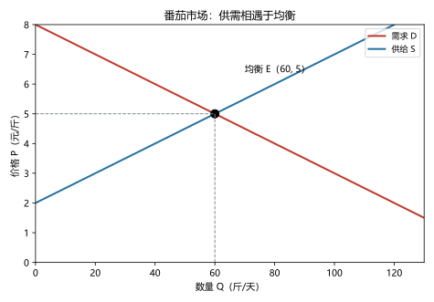
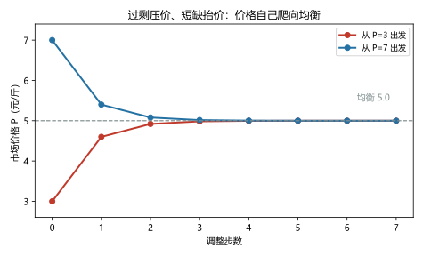
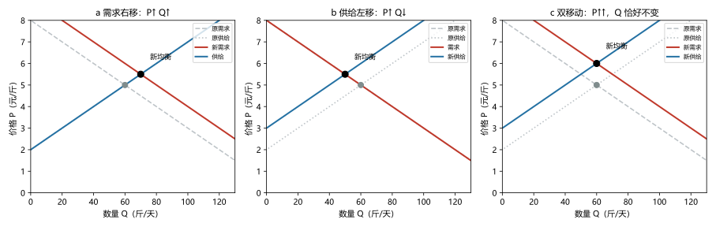

# 第 03 讲：供给与需求的市场力量

> **前置**：第 01–02 讲（机会成本、边际、PPF；贸易中的"价格落在区间里"）。
> **预计时间**：约 2.5 小时（含作业）。
>
> **一句话定位**：这是全课程第一个"正式模型"讲——一台三行就能画出来、却能回答无数问题的机器：**供给与需求**。学完这讲，你拿到的是整个微观经济学最通用的分析动作。
>
> **本讲回答什么**：
> 1. 价格到底是谁定的？
> 2. "价格变化"和"别的因素变化"为什么必须分开处理？
> 3. 没人指挥，均衡凭什么稳定？
> 4. 面对任何"XX 事件发生后价格怎么变"的问题，用哪套固定动作？
>
> **这一讲有真实验证**：番茄市场的均衡求解（脚本 `scripts/lec03-01_verify_supply_demand.py` 实验 1）；三个冲击的比较静态（实验 2）；价格自我修正的动态收敛（实验 3）。配图 3 张。

## 本讲怎么走（脉络图）

```
引子：番茄价格的三个说法（到底谁定的价？）
  │
  ├─ 1. 市场与竞争：一个"价格接受者"的世界
  ├─ 2. 需求：一条向下弯的线（含本讲最重要的一条纪律）
  ├─ 3. 供给：一条向上爬的线
  ├─ 4. 均衡：两只手相遇（引子在这里收尾）
  ├─ 5. 三步法：分析一切冲击的固定动作（含双移动）
  ├─ 6. 模型的纪律与边界
  └─ 常见误区 → 本讲小结 → 掌握度自测 → 作业
```

> 下一站：§引子。先看一个菜市场里最普通、也最深的疑问。

---

## 引子：番茄价格的三个说法

上周菜市场的番茄 4 元一斤，这周 5 元。你随口一问，收获三份解释：

- **摊主**说："进价涨了，我有什么办法。"（成本说）
- **隔壁大爷**说："天冷了，火锅店都在抢货。"（需求说）
- **你妈**说："快年底了，什么不涨？"（季节说）

三份解释听着都有道理。现在把问题问深一层：**4 元和 5 元这两个数字，究竟是谁"定"的？** 是摊主定的？那为什么他不敢直接定 10 元？是顾客定的？那为什么有人嫌贵还是照买？

如果这个疑问在你心里没有现成答案，那很正常——它正是本讲要拆开重装的东西。答案会出乎意料地平常：**没有任何一个人"定"价；价格是一个机制的产物**。这个机制只有两个主角、两条线，却管着从菜市场到机票、从房租到工资的一切价格。它叫**供给（supply）与需求（demand）**。下面从两个主角登台的舞台说起。

---

## 1. 市场与竞争：一个"价格接受者"的世界

### 1.1 "市场"是什么

日常语言里"市场"是个地方；经济学里的**市场（market）** 是一群人加一套规则：

> **市场：买卖某一种物品或服务的一群买者与卖者。**

它不需要砖头：楼下菜场是市场，一个二手群是市场，演唱会门票的抢购页面也是市场。区分"哪个市场"的标准是**物品与参与者**，不是场地。

### 1.2 完全竞争：先学最简单的那类

市场有各种形态，先从最简单的说起：

> **竞争市场（competitive market）：买者和卖者多到"谁都无法单独影响价格"的市场。**
>
> **完全竞争（perfectly competitive）** 的标准版本再加上一条：各家卖的东西**一模一样**（同质）。此时每个买者、卖者都是**价格接受者（price takers）**——只能接受市场价，不能"定价"。

为什么它们不能定价？想一下菜市场：你一个人不买番茄，价格纹丝不动；一个摊主不卖，隔壁 20 家摊子立刻补位。**人多了，任何单个人的意志都被稀释掉了**——这正是引子里"没人能定价"的第一个线索。农产品市场是现实中最接近完全竞争的地方。

### 1.3 其他市场形态（先点名，后展开）

当然，现实不是只有完全竞争：

- **垄断（monopoly）**：一家独大（电力、部分平台）；
- **寡头（oligopoly）**：几家巨头（运营商、航司）；
- **垄断竞争（monopolistic competition）**：很多家，但产品有差异（奶茶街、便利店）。

这四种市场的完整对比在第 14 讲。本讲先把**完全竞争**这台最简单、也最常用的机器学透——它也是后面税收、贸易、政策分析的默认舞台。

> 下一站：主角一号登场。先想清楚一个问题：为什么"越便宜越想买"可以画成一条线。

---

## 2. 需求：一条向下弯的线

### 2.1 需求定理

> **需求量（quantity demanded）：在某个给定价格下，买者愿意且能够购买的数量。**
>
> **需求定理（law of demand）：其他条件不变时，价格越高，需求量越小；价格越低，需求量越大。**

这条"向下"的规律从哪来？两个日常机制（它们的严格版本——替代效应与收入效应——在第 17 讲）：

1. **替代**：番茄贵了，你改买黄瓜——贵东西被便宜东西挤掉；
2. **购买力**：价格涨了，同样的钱能买的总量变少，你会全面收紧。

### 2.2 三种语言：表、曲线、函数

需求可以写成三种互译的"方言"（考试三种都会出现）：

**需求表（demand schedule）**——一张"价格 → 愿意买多少"的清单（番茄市场）：

| 价格（元/斤） | 需求量（斤/天） |
|---|---|
| 3 | 100 |
| 4 | 80 |
| 5 | 60 |
| 6 | 40 |
| 7 | 20 |

**需求曲线（demand curve）**——把表画在"价格竖轴、数量横轴"的坐标里，得到一条向下倾斜的线（见图 1 的红线）。

**需求函数**——同一件事的代数写法。上表的规律可以写成 $Q_d = 160 - 20P$（把 $P=3$ 代入得 $Q_d=100$，与表对得上）。有些考试和教材喜欢用函数给条件，**表、曲线、函数是一件事的三种写法**，见一个要能翻译另外两个。

### 2.3 市场需求的加总

"番茄市场需求"是**所有买者需求量的加总**：同一个价格下，把每个买者的量加起来（横向相加）。一个人一天买 2 斤，50 个人就是 100 斤——就这么朴实。

### 2.4 最重要的一条纪律：沿曲线走 vs 整条搬

下面这个区分，是本讲、也是整门课**最容易被混淆**的地方，请慢读：

- **价格变了** → 需求量变了 → 表现为**沿着同一条需求曲线滑动**；
- **价格以外的因素变了** → 需求变了 → 表现为**整条需求曲线搬家（左移或右移）**。

翻译成术语：**"需求量的变化"**（quantity demanded changes）与**"需求的变化"**（demand changes）是两个词——中文只差一个字，含义完全不同：

| | 触发原因 | 图上表现 | 术语 |
|---|---|---|---|
| 需求量变化 | 价格本身变了 | 沿原曲线滑动 | "需求量变化" |
| 需求变化 | 价格以外的因素 | 整条曲线平移 | "需求变化（移动）" |

关于方向的说法：**需求增加＝曲线右移**（每个价格上都愿意买更多）；**需求减少＝曲线左移**。

一句防错口诀，值得抄在笔记第一页：

> **价格动，沿线走；非价格动，整条搬。**

### 2.5 哪些因素会让需求"整条搬"（五因素清单）

只有价格以外的因素才有资格"搬动"曲线。需求移动的常见因素恰好五类，每类配一个例子：

1. **收入**：一般东西，收入涨、买得多——这类叫**正常品（normal good）**；但有些东西相反，收入涨了反而少买（方便面、快消速食）——这类叫**劣等品（inferior good）**。注意：一个东西是不是"劣等品"不是骂人，只是个分类。
2. **相关物品的价格**：
   - **替代品（substitutes）**：能互相顶班的东西（奶茶与咖啡）。咖啡涨价 → 奶茶需求右移（此消彼长的方向）；
   - **互补品（complements）**：搭配使用的东西（奶茶与珍珠、手机与充电头）。珍珠涨价 → 奶茶需求左移（一荣俱荣、一损俱损的方向）。
3. **偏好**：口味、时尚、健康观念的变化（降温后"想喝热奶茶"的人变多）。
4. **预期**：对未来的看法会改变今天的行动（听说下周牛奶要涨价，今天就多囤两箱 → 今天的牛奶需求右移）。
5. **买者数量**：人口、游客、开通新地铁带来的客流（人多了，需求右移）。

> **纪律重申**：上面的五类里没有"价格"——价格只负责"沿线走"这一件事。把"涨价"说成"需求减少"或"需求增加"，都是把两个词混用；这是概念题的头号雷区。

> 下一站：换到桌子另一边——卖番茄的人。他们的线条不能只向下弯，还得会向上爬。

---

## 3. 供给：一条向上爬的线

### 3.1 供给定理

> **供给量（quantity supplied）：在某个给定价格下，卖者愿意且能够出售的数量。**
>
> **供给定理（law of supply）：其他条件不变时，价格越高，供给量越大；价格越低，供给量越小。**

为什么向上？回忆第 01 讲的**激励**：价格就是卖者收到的信号与奖励。番茄 3 元/斤可能连采摘人工都覆盖不住（不如不摘），5 元就值得起早贪黑，7 元连隔壁县的种植户都愿意运过来——**价格越高，"愿意卖"的人和量就越多**。

### 3.2 三种语言（同款三件套）

番茄市场的供给表与函数（与需求表配套，脚本实测数据）：

| 价格（元/斤） | 供给量（斤/天） |
|---|---|
| 3 | 20 |
| 4 | 40 |
| 5 | 60 |
| 6 | 80 |
| 7 | 100 |

函数形式：$Q_s = 20P - 40$（$P=5$ 代入得 60，对得上）。供给曲线向上倾斜（见图 1 的蓝线）。

### 3.3 哪些因素会让供给"整条搬"（四因素清单）

供给移动的常见因素四类：

1. **投入品价格**：种子、肥料、人工、运费——成本是卖方的底线，成本涨 → 供给左移（每个价格上"愿意卖"的量都变少）；
2. **技术**：大棚、滴灌、新品种——效率上去、成本下来 → 供给右移；
3. **预期**：听说明年收购价要大涨，批发商今天惜售囤货 → 今天的供给左移；
4. **卖者数量**：新种植户入场、老商户退出 → 人多了供给右移。

### 3.4 同一条纪律，照抄一遍

供给这边与需求完全对称：

- **价格变了** → 供给量沿着供给曲线滑动（"供给量变化"）；
- **价格以外的因素变了** → 整条供给曲线搬家（"供给变化"）：**供给增加＝右移、供给减少＝左移**。

回顾引子里摊主的话："进价涨了"——翻译成模型语言：这是**投入品价格上升 → 供给曲线左移**。至于它到底是不是这周番茄涨价的原因，等你学完下一节的三步法，回来当场验证。

> 下一站：两条线各自画好了。让它们在同一张图上遇见——整个课程最著名的交点即将出现。

---

## 4. 均衡：两只手相遇

### 4.1 引子收尾：哪个价格"站得住"

把需求表和供给表并排放在一起（脚本 `lec03-01` 实验 1 实测）：

| 价格（元/斤） | 需求量（斤/天） | 供给量（斤/天） | 差（供给−需求） | 状况 |
|---|---|---|---|---|
| 3 | 100 | 20 | −80 | **短缺**（买家愿加价） |
| 4 | 80 | 40 | −40 | **短缺** |
| **5** | **60** | **60** | **0** | **均衡** |
| 6 | 40 | 80 | +40 | **过剩**（卖家想降价） |
| 7 | 20 | 100 | +80 | **过剩** |

只有 P = 5 那一行，买卖双方"想成交的量"恰好对上。这个价格和数量就是本讲的核心概念：

> **均衡（equilibrium）：市场价格达到"需求量 = 供给量"的状态。** 此时的价格叫**均衡价格（equilibrium price）**，数量叫**均衡数量（equilibrium quantity）**。



> **图 1 怎么读**：红线是需求（向下），蓝线是供给（向上），交点 E（60, 5）就是均衡。两条虚线告诉你它的两个坐标：均衡数量 60 斤/天、均衡价格 5 元/斤。在这张图上，**"均衡"就是唯一一个"买家想买的量恰好等于卖家想卖的量"的价位**。

### 4.2 过剩与短缺：市场自己"找家"

其余两行不是摆设，它们解释了价格为什么会停在 5：

- **价格高于 5（过剩）**：卖家的货压在手里——你标 6 元，只卖得掉 40 斤，剩下 40 斤砸在摊上。想清库存？**降价**。大家都降，价格就朝 5 滑。
- **价格低于 5（短缺）**：想买的人排起队——你标 4 元，80 个人想买、只有 40 斤。没抢到的人**加价**也要买。大家都加，价格就朝 5 涨。

两股力量从两侧把价格"夹"向均衡。这个结论有个正式名字：

> **供求定理（law of supply and demand）：价格会自发调整，直到需求量与供给量相等。**

> **用词提醒**：英文里 surplus 是个多义词——本讲的**过剩**（surplus，指"超额供给"）与第 06 讲要学的**消费者剩余/生产者剩余**（也是 surplus）是两个不同的东西。中文分别译作"过剩"和"剩余"，请按中文叫法记，别在答题时混用。

### 4.3 动态验证：价格"爬"向均衡（实验 3）

上面的机制说起来像那么回事。真的跑一遍呢？用一条最朴素的调整规则模拟市场（脚本 `lec03-01` 实验 3 实测）：

> 规则：**有缺口就调整**——价格每秒向"消除缺口"的方向挪一步（缺口越大挪得越快）：$P \leftarrow P + 0.02 \times (Q_d - Q_s)$。

从两个"错误价格"出发的轨迹：

| 步数 | 从 3 元出发 | 从 7 元出发 |
|---|---|---|
| 0 | 3.0000 | 7.0000 |
| 1 | 4.6000 | 5.4000 |
| 2 | 4.9200 | 5.0800 |
| 3 | 4.9840 | 5.0160 |
| 4 | 4.9968 | 5.0032 |
| 5 | 4.9994 | 5.0006 |
| 6 | 4.9999 | 5.0001 |



> **图 3 怎么读**：横轴是调整步数，纵轴是价格。两条轨迹分别从 3 元和 7 元出发，六步之内都贴上了虚线"均衡 5.0"。**没有任何人在指挥**：每一次调整都只是"过剩就降、短缺就涨"的局部动作，合起来却是向均衡的自动驾驶。

这是第 01 讲"看不见的手"的第一个**完整可运行的实例**。诚实的注脚：这个迭代是"卡通版"动态（真实市场的调整有摩擦、有延迟、甚至可能冲过头），学习它的价值在于看清机制；严格的动态模型（蛛网模型等）属于中级课程。

### 4.4 均衡的"三个气质"（记住这三句）

1. **无人定价**：5 元不是谁"定"的，是调整的结果——引子里的疑问在此结清；
2. **自我修正**：偏了就有力量拉回来（过剩降、短缺涨）；
3. **描述性**：它说"会变成什么"，不说"好不好"（"好不好"是第 06 讲的问题）。

> 下一站：静态的均衡会算了。但世界天天在变——番茄的均衡天天换。§5 给你一套"应对一切变化"的固定动作。

---

## 5. 三步法：分析一切冲击的固定动作

### 5.1 三步法本体

任何"某个事件发生后，某市场的价格和数量怎么变"的问题，都用这三步：

> **① 动哪条线**：事件影响的是"买者"还是"卖者"？（回去查五因素 / 四因素清单）
> **② 往哪边动**：变多（右移）还是变少（左移）？
> **③ 对比新旧均衡**：画出（或算出）新交点，读价格与数量的变化。

一句操作口诀：**先动线，再看点。**

### 5.2 案例一：需求动（"火锅店抢货"）

事件：新地铁开通，进城买菜的客流大增（买者数量上升）。

① 影响买者 → 动需求；② 买者变多 → **需求右移**；③ 新均衡（脚本实验 2a 实测）：**P 从 5 涨到 5.5，Q 从 60 增到 70**。



> **图 2 怎么读**（先看左图 a）：灰色虚线是原来的需求，红色实线是右移后的新需求，灰点、黑点分别是新旧均衡。**需求右移 → 价格↑、数量↑**——这就是"涨价因为抢货"的模型翻译。
> 再提前看中图 b 与右图 c 的差别：（b）供给左移 → **价格↑、数量↓**；（c）两条同时动 → **价格涨得更多、数量恰好不动**。三张图对照着看，"三步法"就算见过了。

把案例一记成一条"肌肉记忆"：**需求右移 → P↑ Q↑**（需求左移则全部反向：P↓ Q↓）。

### 5.3 案例二：供给动（"进价涨了"）

事件：肥料涨价（投入品价格上升）。

① 影响卖者 → 动供给；② 成本涨 → **供给左移**；③ 新均衡（实验 2b）：**P 从 5 涨到 5.5，Q 从 60 降到 50**。

肌肉记忆第二条：**供给左移 → P↑ Q↓**（供给右移则 P↓ Q↑）。注意这与需求右移的差别：**价格都涨，但数量方向相反**——涨价的原因不同，跟随的数量信号也不同。这个差别是下一条技巧的钥匙。

### 5.4 案例三：两条一起动（"快年底了"）

事件：同一天里，火锅客流进来抢货（需求右移），大棚成本上升又压低供应（供给左移）。

① 两条都动；② 需求右移 + 供给左移；③ 画图/解方程（实验 2c）：**P 从 5 涨到 6（涨得比单独冲击都多），Q 恰好停在 60**。

本例的数量不是"没人知道"，而是被给定数字算出来的；但请死死记住这条纪律：

> **两条曲线同时移动时，某个变量"往哪变"常常是"不确定的"，取决于两股力量的相对幅度。** 定性作答时，只写能确定的那个（本例价格必涨），其余的写"取决于相对幅度"——不要硬编一个方向。

到此，引子的三个说法可以全部"翻译"了：

| 引子里的说法 | 模型语言 | 效果 |
|---|---|---|
| 摊主："进价涨了" | 投入品价格↑ → 供给左移 | P↑、Q↓ |
| 大爷："火锅店抢货" | 买者数量↑ → 需求右移 | P↑、Q↑ |
| 你妈："快年底了" | 大概率两条同时在动 | P↑↑、数量看幅度 |

### 5.5 反向技巧：从"价量组合"反推谁动了

考试和实战中更常见的是反过来的问题：**看到价格和数量一起变了，倒推是哪条曲线动了**。对照表：

| 看到的现象 | 更可能的解释 |
|---|---|
| P↑ 且 Q↑ | 需求右移为主（或供给右移？不——供给右移会让 P↓；所以 P↑Q↑ → 需求右移） |
| P↑ 且 Q↓ | 供给左移为主 |
| P↓ 且 Q↑ | 供给右移为主 |
| P↓ 且 Q↓ | 需求左移为主 |

（双移动时四格都可能"混杂"，反推只对"单线移动"可靠——这是这套技巧的边界。）

### 5.6 三步法的"翻车清单"

- **动错线**：把"价格变化"当成"曲线移动"（价格变化只沿线走）——头号错误；
- **方向搞反**：尤其是"劣等品"（收入↑却左移）和"互补品"（一个涨价，另一个左移）；
- **只动一条**：事件明显有两条线受影响，却漏掉一条（双移动不完整）；
- **不问幅度**：双移动时硬给出"不确定项"的方向。

> 下一站：机器会用了，最后交代它的说明书——前提、纪律、和它管不到的地方。

---

## 6. 模型的纪律与边界

### 6.1 三条使用前提（用之前先检查）

1. **其他条件不变（ceteris paribus）纪律**：画一条曲线时，我们把"价格以外的一切"都按住不动；一旦它们动了，就是"曲线移动"而不是"沿线滑动"。这条纪律是全部分析的地基。
2. **价格可以自由调整**：模型假设价格是灵活的。真实的房租、票价、工资可能"粘"住不灵——那正是第 05 讲（价格管制）的戏台。
3. **舞台是完全竞争**：买卖者多、商品同质、人人都是价格接受者。垄断和寡头的世界里，故事要改写——第 13、14 讲。

### 6.2 画图纪律（考试画图题的评分点）

- 两轴标清（P 与 Q 及单位）；曲线标名（D、S）；
- **移动的曲线画在新位置，旧位置留虚线**，箭头标出移动方向；
- 新旧均衡点都点出来，用虚线把新价格/数量引到轴上；
- 文字结论三件套：**价格怎么变、数量怎么变、驱动它的曲线动是哪条**。

### 6.3 边界清单（它管不到的地方）

- **调整的摩擦**：真实价格可能慢半拍（菜单成本、排队、长期合同），模型说的"自发调整"是一个趋势而不是秒表；
- **非竞争市场**：市场势力能让价格长期偏离均衡（13、14 讲）；
- **"好不好"的问题**：供需模型只回答"会怎样"，不回答"结果是否有效率、是否公平"——那是第 06 讲往后的任务；
- **"理性人假设"的宽松版**："每个人都在精确算账"其实不需要——只要竞争过程存在，乱出价的人会被市场淘汰，整体行为"好像"是精算过的（as if）。这条到第 18 讲会再次回来看它的裂缝。

### 6.4 调用方法论（把这讲装进脑子）

以后遇到两类问题，直接调用本讲：

1. **"某事件发生 → 价格和数量怎么变"**：三步法（哪条线、往哪动、对比新旧均衡）；
2. **"价格变了 → 为什么"**：先分"沿曲线滑"还是"曲线移动"，再用 §5.5 的价量组合表反推。

---

## 常见误区（本节零新知识，只破误）

1. **"价格是摊主/买家/政府定的"**（§1、§4.4）。错。均衡价格是分散调整的结果——过剩降价、短缺涨价的自动驾驶。
2. **"番茄涨价说明需求增加了"**（§5）。不严谨。可能是需求右移，也可能是供给左移，或两者同时；单凭"涨价"二字推不出"谁动了"——用 §5.5 的价量组合来反推。
3. **"价格变了就是需求变了"**（§2.4）。错。价格变化只导致"需求量"沿曲线滑动；"需求（曲线）变化"专指价格以外因素的移动。
4. **"过剩就是东西太多、短缺就是需求太大"**（§4.2）。不准确。过剩与短缺是**价格偏离均衡**的表现：过剩=价格高于均衡，短缺=价格低于均衡——它们各自携带着"价格将向哪调"的信号。
5. **"双移动也能把方向说全"**（§5.4）。错。两条线同时动时，至少有一个变量的方向"取决于相对幅度"；只能写能确定的那部分。
6. **"均衡永远不动"**（§4.4）。错。均衡是"曲线不动时的静止点"；曲线一动，均衡立刻换位置——均衡像"水面浮标"，不是"钉死的桩"。

## 本讲小结

一页纸的骨架：

- **市场**=买卖同一种物品的一群人与规则；**完全竞争**=多到人人都是**价格接受者**。其他三种形态（垄断/寡头/垄断竞争）第 14 讲展开。
- **需求定理**：价格↓需求量↑；**供给定理**：价格↑供给量↑。
- 三种语言互译：**表、曲线、函数**（如 $Q_d=160-20P$、$Q_s=20P-40$）。
- **第一纪律**：价格动 → **沿线走**（需求量变化）；非价格因素动 → **整条搬**（需求变化）。需求五因素：收入（正常/劣等品）、相关品价格（替代/互补）、偏好、预期、买者数量；供给四因素：投入品价格、技术、预期、卖者数量。
- **均衡**：需求=供给的交点；**过剩→降价、短缺→涨价**的自我修正（供求定理）；动态实验里价格六步内贴向 5。
- **三步法**：动哪条线 → 往哪动 → 对比新旧均衡。肌肉记忆：需求右移 P↑Q↑；供给左移 P↑Q↓；**双移动必有无辜的"不确定"**。
- **反推技巧**：P↑Q↑→需求右移；P↑Q↓→供给左移；P↓Q↑→供给右移；P↓Q↓→需求左移。
- **边界**：价格粘性（05）、非竞争市场（13/14）、"好不好"另议（06）。

## 掌握度自测

- [ ] 我能说清"完全竞争"的两个特征与"价格接受者"的含义，并举一个现实近似。
- [ ] 我能把一张需求表翻译成曲线和函数（反之亦然），并在图上读出一个价格对应的需求量。
- [ ] 我能一字不差地区分"需求量变化"与"需求变化"，并各举一个例子。
- [ ] 我能背出需求移动五因素、供给移动四因素，并对每个因素举出至少一个例子。
- [ ] 我能解释"过剩为什么降价、短缺为什么涨价"，并复述供求定理。
- [ ] 我能说明"均衡价格不是任何人定的"（用菜市场的例子讲清）。
- [ ] 我能用三步法完整分析：需求右移、供给左移、双移动三类冲击（各含 P、Q 的变化方向）。
- [ ] 我能说出"双移动下某个方向不确定"这条纪律，并说清为什么。
- [ ] 我能用"价量组合表"从观察到的事实反推是哪条曲线移动（并指出它的适用边界）。
- [ ] 我能复跑 `scripts/lec03-01`，解释输出里每一个数字（60、80、+20、5.5、4.9200……）。

## 作业

> 答案只能用**已教概念**（本讲范围：市场与竞争、需求/供给定理与移动、均衡与过剩短缺、供求定理、三步法、价量组合反推）。先独立做，再对答案。

### 基础

**Q1. 判断并说明理由**（都是"沿曲线"与"移动"的判断）：

(a) "番茄从 5 元降到 4 元，买番茄的人多了。"——这是"需求量变化"还是"需求变化"？
(b) "天气预报说下周持续降温，本周奶茶市场的需求右移。" 这句话中的"需求右移"用得对吗？
(c) "番茄贵了，大家少买了——所以番茄需求减少。" 这句话错在哪，怎么改？
(d) "奶茶街新开了三家奶茶店，奶茶的需求右移。" 这句话错在哪，怎么改？

**参考答案**：
(a) **需求量变化**——价格本身变化引起的，表现为沿需求曲线滑动（从 60 斤滑到 80 斤）。
(b) 用的对。降温改变的是**偏好/预期**（价格以外因素），需求曲线整体右移，属于"需求变化"。
(c) 错在把"需求量减少"写成"需求减少"。价格变化导致的量变叫**需求量**变化（沿曲线）；应改成："番茄贵了，大家少买——番茄的需求量减少。"
(d) 错在把供给变化写成需求变化。新店入局是**卖者数量增加 → 供给右移**；与需求无关。

**Q2. 计算·均衡与缺口**：某市场供需表：

| 价格 | 2 | 4 | 6 | 8 | 10 |
|---|---|---|---|---|---|
| 需求量 | 90 | 70 | 50 | 30 | 10 |
| 供给量 | 0 | 20 | 40 | 60 | 80 |

(1) 求均衡价格与均衡数量；
(2) 价格=6 时是什么状态？价格将朝哪边移动？
(3) 价格=10 时是什么状态？价格将朝哪边移动？

**参考答案**：
(1) 需求量=供给量发生在 P=8：Qd=Qs=60。**均衡价格 8、均衡数量 60**。（函数验证：$Q_d=100-5P$，$Q_s=10P-20$，联立解得 P=8、Q=60 ✓）
(2) P=6：Qd=50 > Qs=40，**短缺 10**，买家抬价 → 价格有**上涨**压力（朝 8 走）。
(3) P=10：Qd=10 < Qs=80，**过剩 70**，卖家降价 → 价格有**下降**压力（朝 8 走）。
验算：两小问恰好把"过剩降、短缺涨"两个方向各练一次。

**Q3. 画图描述**（奶茶市场，用文字走完画图三件套）：分别分析三个事件对奶茶市场均衡的影响（画出/描述：动哪条线、往哪动、P 与 Q 怎么变）：
(a) 咖啡大幅降价（替代品）；
(b) 奶茶原料柠檬大幅涨价；
(c) (a)(b) 同时发生。

**参考答案**：
(a) 替代品降价 → 奶茶**需求左移** → **P↓、Q↓**。
(b) 投入品涨价 → **供给左移** → **P↑、Q↓**。
(c) 需求左移（P↓Q↓）+ 供给左移（P↑Q↓）→ **数量必降；价格方向不确定（取决于两股力量的相对幅度）**——只写能确定的：Q↓。
自检要点：有没有标出动的是哪条线；单线情形给了两轴方向；双线情形没有硬编价格方向。

### 提高

**Q4. 计算·函数型三连**：番茄市场的 $Q_d = 240-30P$，$Q_s = 30P-60$。

(1) 求原均衡；
(2) 若需求变化为 $Q_d' = 270-30P$（每个价格上需求量 +30），求新均衡；
(3) 若在(1)基础上改为供给变化为 $Q_s' = 30P-90$（每个价格上供给量 −30），求新均衡；
(4) 若 (2)(3) 同时发生，求新均衡，并解释数量为什么没变。

**参考答案**：
(1) $240-30P = 30P-60 \Rightarrow 300=60P \Rightarrow P^*=5$，$Q^*=90$。
(2) $270-30P=30P-60 \Rightarrow 330=60P \Rightarrow P^*=5.5$，$Q^*=105$。
(3) $240-30P=30P-90 \Rightarrow 330=60P \Rightarrow P^*=5.5$，$Q^*=75$。
(4) $270-30P=30P-90 \Rightarrow 360=60P \Rightarrow P^*=6$，$Q^*=90$。数量不变的原因：需求 +30 与供给 −30 的"数量效果"方向相反、幅度相等，恰好抵消；但价格效果同向叠加，所以价格涨得更多（5→6）。
验算：(4) 的 Q 与 (1) 相同（90）而 P 多涨 1 元——与课文案例三同构。

**Q5. 简答·均衡为什么自动**：请用"过剩"与"短缺"两个词，解释：为什么没人指挥，价格也会停在均衡处？

**参考答案**：
高于均衡时：供给量大于需求量（**过剩**），卖家的货卖不完，降价是各自的理性选择 → 价格被压回。
低于均衡时：需求量大于供给量（**短缺**），买家抢购、愿意加价 → 价格被抬回。
两侧压力把价格"夹"向均衡；不需要任何人知道"均衡在哪"（第 01 讲"看不见的手"的机制版）。

**Q6. 事件归类**（快问快答：各事件让哪条曲线、向哪移动，P/Q 方向）：奶茶市场里——(a) 奶茶街新增 5 家奶茶店；(b) 奶茶原料柠檬涨价；(c) 天气预报"下周寒潮"，人们今天就想囤热饮；(d) 邻市爆火的奶茶短视频带动本地尝鲜潮。

**参考答案**：
(a) 卖者数量↑ → **供给右移** → P↓、Q↑；
(b) 投入品价格↑ → **供给左移** → P↑、Q↓；
(c) 预期（偏好）变化 → **需求右移** → P↑、Q↑；
(d) 偏好/买者数量变化 → **需求右移** → P↑、Q↑。
验算：(a)(b) 在供给侧一右一左，(c)(d) 在需求侧——先把"哪条线"判对，方向自然跟着出来。

### 综合（回扣本讲主任务）

**Q7. 综合·租房市场的两股力量**：某城市租房的 $Q_d = 300-5P$（单位：百元/月；数量单位：百套），$Q_s = 10P-300$。

(1) 求原均衡（租金与成交套数）；
(2) 事件一："外来人口大批流入"使需求量在每个价位 +30，求新均衡；
(3) 事件二："一批新公寓建成"使供给量在每个价位 +45，求新均衡；
(4) 两件事同时发生，求新均衡；
(5) 为什么(4)的租金反而比(2)低？用"相对幅度"解释。

**参考答案**：
(1) $300-5P = 10P-300 \Rightarrow 600=15P \Rightarrow P^*=40$（4000 元/月），$Q^*=100$（百套）。
(2) $330-5P=10P-300 \Rightarrow 630=15P \Rightarrow P^*=42$，$Q^*=120$。
(3) $300-5P=10P-255 \Rightarrow 555=15P \Rightarrow P^*=37$，$Q^*=115$。
(4) $330-5P=10P-255 \Rightarrow 585=15P \Rightarrow P^*=39$，$Q^*=135$。
(5) 两股力量对租金的方向相反：需求右移推租金升、供给右移压租金降。供给的移动幅度（+45）大于需求的移动幅度（+30），净效果是租金比原均衡还略低（39 < 40）；而单独发生(2)时没有供给侧的压制，租金涨到 42。**双移动的净方向由相对幅度决定**——这就是"不确定"纪律的定量版本。
验算：(4) 的成交套数 135 比两个单事件都高，两股力量在"数量"上同向叠加。

**Q8. 简答·反推练习**：某摊主说："这周菜价涨了，说明买菜的人变多了。"请给出至少两种"其他可能"，并说明用什么观察可以区分它们。

**参考答案**：
可能一：**供给左移**（天气、运输、进货成本上升），此时价格涨而成交量（或上市量）往往会**缩**。
可能二：**需求右移与供给左移同时发生**（旺季需求上来、同时供应变紧）——单看价格无法拆开两者。
（还可以指出第三种错误姿势：把"价格变化"本身说成"需求变化"——价格变化只引起沿曲线滑动，它不搬动曲线。）
区分办法：**看数量**。P↑ 且成交/上市量 ↑ → 更像需求右移；P↑ 且数量 ↓ → 更像供给左移（§5.5 的反推表）；再辅以旁证（进货价、客流、产地天气）。反推表的边界：只在"单线移动"时可靠。

---

*下一讲预告：第 04 讲《弹性及其应用》——本讲一直说"涨价则需求量减少"，但从不说"减少多少"。下一讲补上这个"多少"：一把把变化量变成百分比的尺子，以及它如何决定"涨价是增收还是减收"。*