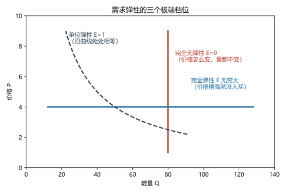
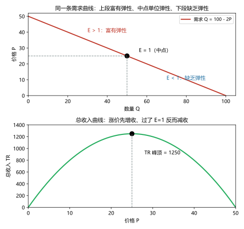
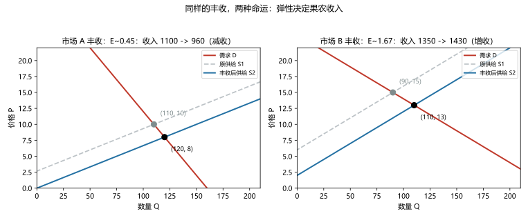

# 第 04 讲：弹性及其应用

> **前置**：第 01–03 讲（供给与需求、均衡与三步法）。
> **预计时间**：约 2.5 小时（含作业）。
>
> **一句话定位**：第 03 讲一直说"涨价则买得少"，但从不说"**少多少**"。本讲补上这把尺子——**弹性（elasticity）**——并回答一个直接关系到钱包的问题：**涨价，到底是增收还是减收？**
>
> **本讲回答什么**：
> 1. 弹性在度量什么？为什么它和"曲线陡不陡"不是一回事？
> 2. "中点法"是什么、它解决了什么问题？
> 3. 为什么有的东西涨价多赚、有的涨价反而少赚？
> 4. 为什么"丰收"反而可能让农民变穷？
>
> **这一讲有真实验证**：中点法与普通百分比法的方向一致性对照（脚本 `scripts/lec04-01_verify_elasticity.py` 实验 1）；点弹性与总收入沿直线需求的扫描（实验 2）；丰收悖论的双市场对照（实验 3）。配图 3 张。

## 本讲怎么走（脉络图）

```
引子：奶茶店老板的涨价账本（涨 20%，为什么反而少赚？）
  │
  ├─ 1. 弹性：一把"百分比对百分比"的尺子
  ├─ 2. 中点法：让"来回"只有一个答案
  ├─ 3. 五个档位：从"雷打不动"到"一碰就碎"
  ├─ 4. 弹性与总收入：引子在这里收尾 + 一条曲线的"性格分区"
  ├─ 5. 供给弹性与弹性家族（收入弹性、交叉弹性）
  ├─ 6. 四大决定因素：弹性从哪来
  ├─ 7. 三个应用：丰收悖论、禁毒、石油冲击
  ├─ 8. 纪律与边界
  └─ 常见误区 → 本讲小结 → 掌握度自测 → 作业
```

> 下一站：§引子。一盘真实的涨价钱，为什么会算出一个让人费解的亏？

---

## 引子：奶茶店老板的涨价账本

奶茶店老板决定试试水：招牌奶茶从 **10 元**涨到 **12 元**（+20%），心里盘算"每杯多赚 2 元，美滋滋"。一周下来，账本给出了残酷答案：

- 日销量从 **100 杯**掉到 **70 杯**；
- 日收入从 100 × 10 = **1000 元**，变成 70 × 12 = **840 元**。

**涨价 20%，收入反而掉了 16%。**

老板很困惑。他隔壁的景区小卖部，矿泉水从 2 元涨到 4 元（+100%），游客该买还是买，收入噌噌涨；自己的奶茶涨一点点就"崩量"。为什么同样叫"涨价"，效果天差地别？他到底"错"在哪一步？

答案不是老板的口才有问题，也不是奶茶不够好喝——而是缺一个数字。这个数字把"顾客会跑掉多少"从感觉变成一个可计算的量，它就是本讲的主角：**弹性**。

---

## 1. 弹性：一把"百分比对百分比"的尺子

### 1.1 定义

> **弹性（elasticity）：一个变量对另一个变量变化的"百分比反应程度"。**

本讲最重要的一条是**需求价格弹性（price elasticity of demand）**：

> **需求价格弹性 = 需求量变化的百分比 ÷ 价格变化的百分比。**

读法：**"价格每变动 1%，需求量大约变动百分之几。"** 比如它算出 1.9，意思就是"价格每涨 1%，需求量大约掉 1.9%"——顾客跑得比涨得快。

### 1.2 为什么用百分比，而不用绝对量

因为绝对量不可比。番茄一天少卖 20 斤、机票一天少卖 20 张——**20 和 20 一样大，但意义完全不同**（前者可能是销量的 1%，后者可能是 100%）。百分比把"量级"约掉了，不同商品、不同市场之间才能比。

### 1.3 为什么不是斜率：先看一个单位陷阱

很多人第一次听说弹性会想："不就是需求曲线的斜率陡不陡吗？"做个实验你就知道不是。

同样一笔销售变化，把数量单位从"支"换成"打"：

| 情形 | 价格 | 数量 | 曲线斜率 |
|---|---|---|---|
| 单位：支 | 2 → 3 元 | 100 支 → 80 支 | −20 支/元 |
| 单位：打 | 2 → 3 元 | ≈8.33 打 → 6.67 打 | ≈−1.67 打/元 |

斜率差了 12 倍——**但"贵了 50%，少买 20%"这件事没有变**：弹性是 0.4，两次完全一样。

> **结论（本讲第一条边界的提醒）**：**斜率有单位、弹性没有**（弹性是两个百分比相除，量纲被约掉了）。"陡不陡"看一眼斜率就知道，但它会骗人——真正决定"涨价后果"的是百分比之比。另外先剧透一句（§4 会亲眼看到）：**同一条直线需求曲线上，每一点的弹性都不一样**——曲线形状更是完全决定不了弹性。

### 1.4 记号与态度

- 记号：$E$ 或 $E_d$。需求弹性在"价升量降"的意义上是负的；**本课程与国内多数考试习惯统一取大小（非负值）来比较**，即 $E>1$ 读"富有弹性"。遇到带负号的写法，认准绝对值即可。
- 态度：定义要**能复述**；名称与档位（下节）要**能背**；计算要**能手算**。

> 下一站：定义有了，但直接拿"百分比"去算，会撞上一个尴尬的技术问题——不急，一个存在感很强的小技巧来解决。

---

## 2. 中点法：让"来回"只有一个答案

### 2.1 一个让人不安的发现

按"变化量 ÷ 原值"的朴素算法，算奶茶那一来一回（脚本 `lec04-01` 实验 1 实测）：

- **去程**（10 元 → 12 元）：价格 +20.00%，数量 −30.00%，弹性 = 30/20 = **1.500**；
- **回程**（12 元 → 10 元）：价格 −16.67%，数量 +42.86%，弹性 = 42.86/16.67 = **2.571**。

同一笔"涨价再降回来"，算出两个弹性（1.5 和 2.6）——因为**分母（"原值"）在去程和回程里不是同一个数**。1% 的基准到底是"涨价前"还是"涨价后"？这不是数学错误，是口径不统一。

### 2.2 中点法（midpoint method）

修法很省事：**分母不用"原值"，用两端的"中点"**：

> $$E = \frac{\Delta Q / \text{中点}_Q}{\Delta P / \text{中点}_P},\qquad \text{中点}_Q = \frac{Q_1+Q_2}{2},\quad \text{中点}_P = \frac{P_1+P_2}{2}$$

对奶茶那笔交易（$P: 10 \to 12$，$Q: 100 \to 70$）：

- 价格变化：$\Delta P = 2$，中点 $\dfrac{10+12}{2} = 11 \Rightarrow \dfrac{2}{11} \approx 18.18\%$；
- 数量变化：$\Delta Q = -30$，中点 $\dfrac{100+70}{2} = 85 \Rightarrow \dfrac{30}{85} \approx 35.29\%$；
- **弹性 $E = 35.29\% / 18.18\% \approx 1.94$。**

**两个方向都得 1.94**（脚本实测 ✓）——中点法把方向依赖消掉了，这就是它存在的全部理由。

### 2.3 态度与使用场合

- **给"两个点"的题，默认用中点法**（国内考试对两点题普遍按中点法给分；有的教材会注明用哪种，遇到注明就按注明来）；
- 给"函数"的题用下一节的**点弹性**（导数式）；给"微小变化"的题两者几乎相同；
- 计算时把两个百分比各保留两位小数、弹性保留一到两位小数即可，避免过早四舍五入。

> 下一站：尺子造好了，先给它刻上"量程"——弹性从 0 到无穷，各是什么模样？

---

## 3. 五个档位：从"雷打不动"到"一碰即变"

弹性的大小落在一条从 0 到 ∞ 的谱上，考试最常问的五个档位：

| 档位 | 数值 | 含义（价格变 1% 时） | 图形样子 | 日常例子（近似） |
|---|---|---|---|---|
| **完全无弹性** | $E = 0$ | 需求量**完全不变** | 竖直线 | 救命的垄断药（极端近似） |
| **缺乏弹性** | $0 < E < 1$ | 需求量变动**小于** 1% | 陡峭 | 食盐、药品、成瘾品 |
| **单位弹性** | $E = 1$ | 需求量变动**恰好** 1% | 特制曲线（见图 1） | 精心设计的定价带 |
| **富有弹性** | $E > 1$ | 需求量变动**大于** 1% | 平缓 | 某品牌饮料、非必需的服务 |
| **完全弹性** | $E \to \infty$ | 价格稍高就**没人买** | 水平线 | 完全竞争里单个卖者面对的需求 |



> **图 1 怎么读**：三条线分别是三个极端的"形状标本"。竖直线（红）：价格怎么涨跌，买的人都一样多——完全无弹性；水平线（蓝）：只要价格比市场价高一丁点，需求立刻归零——完全弹性（回忆第 03 讲：完全竞争市场里，单个卖者面临的需求曲线正是这个样子）；虚线双曲线（深灰）：沿线上处处 $E = 1$——价格涨 1%，销量正好掉 1%，**总收入卡在不变线上**（§4 细讲）。

两个使用提醒：

1. **档位名字要能背、图形要能认**——概念题就问这个；
2. "完全弹性/完全无弹性"是**极限情形**，真实商品大多落在中间三档里；描述时别说"××完全没弹性"（那是 E=0 的极端），说"缺乏弹性"更准确。

> 下一站：尺子有了刻度，现在回答引子的问题——弹性如何决定"涨价的收入后果"？

---

## 4. 弹性与总收入：引子在这里收尾

### 4.1 老板真正关心的数字：总收入

> **总收入（total revenue）：$TR = P \times Q$**——价格乘以销量。

卖东西的人几乎都在盯这个（就是引子里老板的"日收入"）。涨价的诱惑和掉量的恐惧，都作用在它身上。

### 4.2 涨价的两种效应，谁来当裁判

价格一动，TR 里两个因子朝**相反方向**打架：

- **价格效应**：单价涨了 → TR 里的 $P$ 变大（利好）；
- **数量效应**：销量掉了 → TR 里的 $Q$ 变小（利空）。

谁赢谁输，恰好就是弹性说了算——因为弹性是"数量反应 ÷ 价格动作"的比值：

### 4.3 决策规则表（背下来，考试天天用）

| 情况 | $E > 1$（富有弹性） | $E = 1$（单位弹性） | $E < 1$（缺乏弹性） |
|---|---|---|---|
| **价格 ↑** | 收入**减少**（数量效应赢） | 收入不变 | 收入**增加**（价格效应赢） |
| **价格 ↓** | 收入**增加** | 收入不变 | 收入**减少** |

一句话记法：**弹性大，量说话；弹性小，价说话。**

### 4.4 引子收尾：老板错在哪

现在把那杯奶茶算全：中点法弹性 **1.94 > 1**（富有弹性）。价格涨了 18.18%，但顾客跑掉 35.29%——**数量效应压倒价格效应**：收入从 1000 元掉到 840 元（−16%）。老板不是不努力，是没先量弹性就动手。

反过来，景区矿泉水为什么"抗涨"？游客在山上找替代品的成本极高（总不能下山买吧）——极端缺乏弹性，价格效应轻松赢，于是涨价＝增收。

### 4.5 同一条直线上，弹性会"走位"

既然弹性这么关键，那就必须亲眼看看弹性在一条曲线上怎么分布。用 $Q_d = 100 - 2P$，扫一遍（脚本 `lec04-01` 实验 2 实测）：

| $P$ | $Q$ | 点弹性 $E$ | 总收入 $TR$ |
|---|---|---|---|
| 5 | 90 | 0.111 | 450 |
| 10 | 80 | 0.250 | 800 |
| 15 | 70 | 0.429 | 1050 |
| 20 | 60 | 0.667 | 1200 |
| **25** | **50** | **1.000** | **1250 ← 最大** |
| 30 | 40 | 1.500 | 1200 |
| 35 | 30 | 2.333 | 1050 |
| 40 | 20 | 4.000 | 800 |
| 45 | 10 | 9.000 | 450 |

点弹性的算法（**函数题就用它**）：$E = \left|\dfrac{dQ}{dP}\right| \times \dfrac{P}{Q}$（本式中 $|dQ/dP| = 2$，所以 $E = 2P/Q$）。微小变化下它与中点法近似相等——两者是"同一个想法的离散版和连续版"。



> **图 2 怎么读**：上图是同一条需求线，被中点分为两段"性格区"：**上段（价高量少）富有弹性**——这里降价能引爆销量，涨价会崩收入；**中点 $E = 1$**；**下段缺乏弹性**。下图是总收入曲线：一条先升后降的山坡——**涨价先增收、过了 $E = 1$ 反而减收**，山坡的最高点（1250）正对中点的 $E = 1$。

> **微积分视角（一行给透）**：$TR = P \cdot Q(P)$，对 $P$ 求导：$\dfrac{dTR}{dP} = Q + P\dfrac{dQ}{dP} = Q\left(1 - E\right)$（$E$ 取非负口径）。所以：$E > 1$ 时导数为负（涨价减收）、$E < 1$ 时为正、$E = 1$ 时为零——**总收入峰顶恰好落在单位弹性点**。这就是 §4.3 那张表的一行证明。

### 4.6 拿到"涨价/降价"决策的标准流程

1. 估弹性（可用下节四因素做定性判断，或用历史数据估计）；
2. 对号入座查 §4.3 的表；
3. 别忘了长期：弹性会随时间变大（§6）——**今天的"抗涨"商品，明年可能就不抗了**。

> 下一站：需求侧的弹性全通了。桌子另一边的供给弹性是什么脾气？以及两个"偏门"弹性怎么各管一摊。

---

## 5. 供给弹性与弹性家族

### 5.1 供给价格弹性

> **供给价格弹性 = 供给量变化的百分比 ÷ 价格变化的百分比。**

算法完全相同（两点用中点法，函数用导数）。手算一例：水蜜桃价格从 8 元涨到 10 元，果农的供给量从 200 斤增到 260 斤：

- 价格：$\Delta P = 2$，中点 9 → 22.22%；数量：$\Delta Q = 60$，中点 230 → 26.09%；
- $E_s = 26.09\% / 22.22\% \approx 1.17$（富有弹性）。

供给弹性的决定因素，**时间排第一**：

- 某天早上菜价飙了，菜农当天变不出更多菜（供给近乎无弹性）；
- 一年时间里，可以改种、扩棚（弹性上来）；
- 几年时间，新果园都建好了（弹性更大）。

其他因素：**产能余量**（空置的厂房产线随时能开——弹性大）与**要素流动性**（工人技能、土地用途好不好转）。

### 5.2 需求收入弹性

> **需求收入弹性 = 需求量变化的百分比 ÷ 收入变化的百分比。**

它是"收入"这个因素的定量版，符号直接对应第 03 讲的分类：

- **正常品**：收入弹性 $> 0$；其中 $0 < E < 1$ 的偏"必需品"（收入涨 10%，需求涨不到 10%——比如米面），$E > 1$ 的偏"奢侈品"（收入涨 10%，需求涨超过 10%——比如度假）；
- **劣等品**：收入弹性 $< 0$（收入越涨、买得越少——方便面）。

例：收入涨 8%，某商品需求涨 2% → $E = 0.25$：正常品、偏必需品。**用途**：判断一门生意的"顺风程度"——经济向好时，奢侈品行业的收入弹性大，涨得更猛（衰退时也跌得更狠）。

### 5.3 需求交叉价格弹性

> **需求交叉价格弹性 = 商品 A 需求量变化的百分比 ÷ 商品 B 价格变化的百分比。**

符号就是"关系"：

- $> 0$：**替代品**（B 涨价、A 的需求反而涨——可乐涨价，雪碧笑）；
- $< 0$：**互补品**（B 涨价、A 的需求也跌——打印纸涨价，墨盒需求落）；
- $\approx 0$：关系微弱（各不相干的商品）。

例：咖啡价格涨 10%，奶茶需求涨 15% → 交叉弹性 $1.5 > 0$：奶茶与咖啡是替代品（而且替代关系不小）。**用途**：给竞争关系"量体温"——同类产品之间互相是"隐形涨价压力"的来源。

### 5.4 弹性家族一览（放一起记）

| 弹性 | 算式 | 符号/大小含义 | 主要用途 |
|---|---|---|---|
| 需求价格弹性 | 需求量% ÷ 价格% | 大小决定收入效应；五档 | 定价、政策评估 |
| 供给价格弹性 | 供给量% ÷ 价格% | 越大供给越"跟得上价" | 判断涨价后供应反应 |
| 需求收入弹性 | 需求量% ÷ 收入% | 正=正常品（大小分必需/奢侈）；负=劣等品 | 行业景气判断 |
| 需求交叉弹性 | A 需求量% ÷ B 价格% | 正=替代；负=互补 | 竞争/搭配关系 |

> 下一站：弹性算完了，但它从哪来？拿到一个陌生商品，怎么"看一眼"就大概知道它弹性大不大？

---

## 6. 四大决定因素：弹性从哪来

需求价格弹性的大小，主要看四件事（考试问"为什么××更有弹性"就答这四条）：

| 因素 | 机制 | 对比例子 |
|---|---|---|
| **替代品的可得性** | 越容易找到"平替"，顾客越跑得快 | 某品牌奶茶 ≫ 全部奶茶（前者弹性大） |
| **必需品 vs 奢侈品** | 越"离不了"，越不敏感 | 食盐、胰岛素 ≪ 度假、演唱会 |
| **市场定义的宽窄** | 把"市场"划得越窄，替代品越多、弹性越大 | "食品" ≪ "某超市的酸奶" |
| **时间范围** | 时间越长，调整越多（换车型、换路线、换习惯） | 汽油：短期 ≪ 长期 |

使用方式不是一个一个单独套，而是**四个一起过**："这个东西好替代吗？离得了吗？市场划得多窄？给它多久反应？"——四问走完，弹性是大是小基本心里有数（考试里的定性题也是这么判的）。

一个容易忽略的推论：**"时间"这条让弹性成为"动态目标"**——同一种商品，短期和长期可以判若两物。这也解释了为什么厂商"温水煮青蛙"式涨价往往比一步到位更顺——慢慢涨，顾客的长期调整还没积累起来。

> 下一站：所有零件到齐，看三个经典应用上场——第一个就是本讲的"大名字"：丰收悖论。

---

## 7. 三个应用

### 7.1 丰收悖论：越丰收，越穷？

**现象**（也常叫"谷贱伤农"）：风调雨顺、农业大丰收，果农粮农的收入不升反降。看起来违背常识——东西多了怎么会更穷？

**机制**（三步法 + 弹性）：

1. **动哪条线**：丰收 = 供给右移（每个价格上供给量更大）；
2. **看价格**：新均衡价格下跌（供给多了）；
3. **看收入**：价格跌、数量涨，方向相反——**裁判又是弹性**：

脚本实测的两个市场对照（同样的丰收：供给在每个价位 +40）：

| 市场 | 需求弹性 | 丰收前 | 丰收后 | 收入变化 |
|---|---|---|---|---|
| A：小麦（$Q_d = 160-5P$） | $E \approx 0.46$（**缺乏**） | P=10，Q=110，收入 1100 | P=8，Q=120，收入 **960** | **−12.7%** |
| B：对照商品（$Q_d = 240-10P$） | $E \approx 1.67$（**富有**） | P=15，Q=90，收入 1350 | P=13，Q=110，收入 **1430** | **+5.9%** |



> **图 3 怎么读**：左右两图的供给曲线都从灰色虚线右移到蓝色实线（丰收），均衡点从灰点挪到黑点。左图（缺弹性）：价格跌了 20%，数量只顶上来 9.1%，收入净跌 12.7%——**果农越丰收越穷**；右图（富弹性）：价格小跌 13.3%，数量涨 22.2%，收入净涨 5.9%。**同样的丰收，弹性决定了两种命运。**

所以"谷贱伤农"的完整因果链是：**丰收 → 供给右移 → 价格大跌 → 粮食需求缺乏弹性（人吃不了更多）→ 销量的增幅补不上价格的跌幅 → 收入下降**。这也顺带解释了各国农业政策里的"减产、价格支持、补贴"逻辑——它们的靶子正是这条悖论（政策工具与福利分析在第 05、09 讲展开）。

### 7.2 禁毒政策：一个反直觉的推论

打击毒品（查封、严查运输）——这在模型里是**减少供给**：供给左移，价格大涨。

但毒品需求**缺乏弹性**（成瘾）：价格涨上去，数量降幅有限。推论有点刺眼：**吸毒者的花销反而变多**——维持习惯的成本更高，涉毒资金规模、为筹钱犯罪的压力都可能上升。

对照思路：如果改为**减少需求**（教育、戒治），需求左移——价格与数量**同时**下降，涉毒花销与规模一起收缩。这个案例的考点不在"支持谁反对谁"，而在"**先想清楚动了哪条线、弹性多大，再推数量与金额的后果**"。

### 7.3 石油冲击：短期与长期的两幅面孔

20 世纪 70 年代两次石油危机：产油国大幅限供（供给左移）。因为**短期弹性极小**（工厂不能不上班、汽车不能马上换），价格暴涨；但随着时间推移，人们调整（小排量车、公共交通、节能设备、替代能源），**长期弹性大得多**，冲击被慢慢消化。

教训：**评估任何"涨价类冲击"时，都要问"给它多长时间"**——短期结论和长期结论可以方向一样、幅度完全不同。

> 三个应用的共用句式（背成动作）：**先用三步法定位哪条曲线动，再用弹性翻译"金额/收入"层面的后果；时间范围单独作为一层变量。**

---

## 8. 纪律与边界

1. **弹性是"局部"概念**：同一条曲线上各个点弹性不同——报告或引用弹性时，必须说清"在什么价位附近"。说"奶茶的弹性是 1.94"时，脑子里要有"在 10→12 元这一带"的后缀。
2. **弹性是"百分比对百分比"的微小变化概念**：变化很大时，一阶近似会失真，精确计算请直接回到函数或表格（本讲脚本就是这么算的）。考试给微小变化或两三个点的题，按公式走即可。
3. **弹性是估计出来的**：不同研究、不同时期给同一商品算出的弹性可以差不少（这是实证问题，不是公式问题）。因此："方向性结论"（药品比饮料缺乏弹性）通常可靠；"精确数值"要带着出处与时段看。
4. **符号约定**：本课程需求弹性一律讲大小（非负）；看到文献带负号不要慌，那是"价升量降"的符号化写法。

---

## 常见误区（本节零新知识，只破误）

1. **"弹性就是斜率／曲线越陡弹性越小"**（§1.3、§4.5）。错。斜率有单位、随单位变化；弹性无量纲。同一条直线上下段弹性还各不相同——形状决定不了弹性。
2. **"涨价总是增收"**（§4.2–4.3）。错。收入是 $P \times Q$ 的乘积；弹性 > 1 时涨价反而减收（引子的奶茶）。
3. **"弹性是个固定常数"**（§4.5）。错。沿曲线走位；随时间变化（短期 vs 长期）。
4. **"弹性 2 的意思是'2 块钱'或'2 倍销量'"**（§1.2）。错。弹性是无量纲比值：价格动 1%、数量动 2%——读作"两倍的百分比反应"。
5. **"丰收一定能增收"**（§7.1）。不一定。缺弹性的农产品市场里，丰收减收是常态（谷贱伤农）。
6. **"必需品弹性为零"**（§3、§6）。不准确。"缺乏弹性"≠"完全无弹性"；必需品是"反应小"，不是"没反应"。

## 本讲小结

一页纸的骨架：

- **弹性 = 百分比对百分比**；需求价格弹性 = 需求量% ÷ 价格%。斜率和它无关（单位陷阱）。
- **中点法**：分母取两端中点，消掉方向依赖（奶茶例：两向都是 1.94）。两点题默认中点法；函数题用点弹性 $E = |dQ/dP| \cdot P/Q$。
- **五档**：0（完全无弹性）／缺乏（<1）／单位（=1）／富有（>1）／完全弹性（∞）；名字、数值、图形都要认。
- **总收入**：$TR = P \times Q$；涨价时价格效应 vs 数量效应**由弹性裁判**——$E>1$ 涨价减收、$E<1$ 涨价增收、$E=1$ 是收入峰顶（导数一行证明：$dTR/dP = Q(1-E)$）。
- **弹性家族**：供给弹性（时间第一）；收入弹性（正=正常品、负=劣等品）；交叉弹性（正=替代、负=互补）。
- **四大决定因素**：替代可得性、必需/奢侈、市场宽窄、时间范围——四问连走。
- **三大应用**：丰收悖论（缺弹性农产品，丰产减收）、禁毒（打击供给 + 缺乏弹性 → 金额反升）、石油冲击（短期弹性小的放大器）。
- **边界**：局部值、微变化概念、经验估计、符号约定。

## 掌握度自测

- [ ] 我能用一句话说清弹性在度量什么，并解释"为什么不用斜率、不用绝对量"。
- [ ] 我能独立完成中点法计算（给两个点），并解释中点法解决了什么问题。
- [ ] 我能背出五个档位的名称与数值范围，并在图上认出三种极端形状。
- [ ] 我能写出 $TR = P \times Q$ 并解释涨价为什么可能减收（两种效应+裁判）。
- [ ] 我能对任一档位（E>1/E=1/E<1）说出涨价与降价的收入后果（规则表不翻书）。
- [ ] 我能解释"同一条直线需求曲线上弹性为何逐点变化"，并指出 $E=1$ 的位置（中点）。
- [ ] 我能算需求收入弹性与交叉弹性，并分别由符号判断正常/劣等、替代/互补。
- [ ] 我能用四因素定性判断一个陌生商品的需求弹性大小。
- [ ] 我能完整复述丰收悖论的因果链，并解释"什么情况下丰收增收"。
- [ ] 我能复跑 `scripts/lec04-01`，解释输出里每一个数字（1.941、0.455、1100→960、E=1 处的 1250……）。

## 作业

> 答案只能用**已教概念**（本讲范围：弹性定义、中点法、点弹性、五档、总收入规则表、供给/收入/交叉弹性、四因素、三大应用）。先独立做，再对答案。

### 基础

**Q1. 计算·中点法与收入**：某商品价格从 20 元涨到 24 元，需求量从 60 件降到 48 件。

(1) 用中点法算需求价格弹性；
(2) 判断档位；
(3) 涨价后总收入是升是降？用规则表验证。

**参考答案**：
(1) 价格：$\Delta P = 4$，中点 22 → 18.18%；数量：$\Delta Q = -12$，中点 54 → 22.22%；$E = 22.22/18.18 \approx$ **1.22**。
(2) $E > 1$：**富有弹性**。
(3) $TR$：20 × 60 = 1200 → 24 × 48 = **1152**，**下降**。规则表验证：$E>1$ 时涨价 → 收入减少 ✓。
验算：数量效应（−22.22%）大于价格效应（+18.18%），乘积为负 ✓。

**Q2. 比较题·弹性大小**：判断每对中**哪个弹性更大**，各用一句话说依据：

(a) 食盐 vs 某品牌食盐；
(b) 胰岛素 vs 演唱会门票；
(c) 短期汽油 vs 长期汽油；
(d) "咖啡（整个品类）" vs "某家咖啡店"。

**参考答案**：
(a) 某品牌食盐——市场定义越窄，替代品越多；
(b) 演唱会门票——非必需品（奢侈品向）最容易被砍；
(c) 长期汽油——时间越长，替代手段（换车、换通勤）越多；
(d) 某家咖啡店——窄市场替代容易（隔壁就有咖啡店）。
（四对恰好把"四大决定因素"各用一遍。）

**Q3. 计算·点弹性**：$Q_d = 120 - 3P$。

(1) 求 $P = 20$ 与 $P = 30$ 两处的点弹性；
(2) 哪个价格点的总收入更高？为什么？

**参考答案**：
(1) $E = \left|dQ/dP\right| \cdot P/Q = 3P/Q$。$P=20$：$Q=60$，$E = 60/60 =$ **1.0**；$P=30$：$Q=30$，$E = 90/30 =$ **3.0**。
(2) $TR$：$P=20$ 时 20 × 60 = 1200；$P=30$ 时 30 × 30 = 900。**$P=20$ 处更高**——恰好是 $E = 1$ 的单位弹性点（三倍弹性点已越过峰顶，继续涨价减收）。

### 提高

**Q4. 计算·咖啡馆的涨价决策**：某咖啡馆 7 月定价 30 元/杯、卖出 400 杯；8 月调价到 33 元、卖出 320 杯。

(1) 用中点法算需求弹性；
(2) 计算两个月的总收入；
(3) 老板事前说"涨 10% 肯定多赚"——用 (1)(2) 说明他错在哪。

**参考答案**：
(1) 价格：+3，中点 31.5 → 9.52%；数量：−80，中点 360 → 22.22%；$E \approx$ **2.33**（富有弹性）。
(2) $TR$：30 × 400 = 12000 → 33 × 320 = **10560**（少赚 1440 元）。
(3) 他默认了"缺乏弹性"（涨价不掉量）。实测 $E = 2.33 \gg 1$：数量跌掉 22.2%，远超涨价的 9.5%——**富有弹性的商品涨价是减收的**（若他真想多赚，反而该核算降价）。
验算：1440 ≈ 12000 × 9.52% × (1 − 2.33) 的量级 ✓。

**Q5. 计算·供给弹性**：某商品价格从 10 元涨到 12 元，供给量从 150 增到 180。

(1) 用中点法算供给价格弹性；
(2) 它属于哪个档位？"单位供给弹性"在讲什么含义？

**参考答案**：
(1) 价格：+2，中点 11 → 18.18%；数量：+30，中点 165 → 18.18%；$E_s =$ **1.0**。
(2) **单位弹性**（供给量增长的百分比与价格增长的百分比恰好相等）：价格每涨 1%，愿意供应的量正好也多 1%。

**Q6. 计算·收入弹性与交叉弹性**：

(1) 居民收入上涨 8%，某商品需求上涨 2%——求收入弹性，判断商品类型；
(2) 商品 B 价格下跌 10%，商品 A 的需求下跌 15%——求交叉弹性，判断 A 与 B 的关系；
(3) 商品 C 价格上升 20%，商品 D 的需求下降 10%——求交叉弹性，判断 C 与 D 的关系。

**参考答案**：
(1) $2\% / 8\% =$ **0.25** > 0：正常品（且偏必需品——需求涨幅不到收入涨幅）。
(2) 交叉弹性 $= (-15\%) / (-10\%) =$ **+1.5** > 0：**替代品**（B 降价后 A 被抢走生意）。
(3) 交叉弹性 $= (-10\%) / (+20\%) =$ **−0.5** < 0：**互补品**（C 涨价拖累 D 的需求）。
验算：符号规则——正=替代、负=互补、零=无关 ✓。

### 综合（回扣本讲主任务）

**Q7. 综合·果园的丰收账**：李子市场：$Q_d = 180 - 4P$，$Q_s = 16P - 60$。今年大丰收，供给在每个价位 +60（即 $Q_s' = 16P$）。

(1) 求丰收前的均衡与均衡点弹性；
(2) 求丰收后的新均衡；
(3) 计算果农总收入的变化（金额与百分比）；
(4) 用弹性解释"越丰收越穷"，并说出**一种**能让丰收增收的条件。

**参考答案**：
(1) $180-4P = 16P-60 \Rightarrow 240 = 20P \Rightarrow P = 12$，$Q = 132$；点弹性 $E = 4 \times 12/132 \approx$ **0.36**（缺乏弹性）。
(2) $180-4P = 16P \Rightarrow 180 = 20P \Rightarrow P = 9$，$Q = 144$。
(3) 收入：12 × 132 = **1584** → 9 × 144 = **1296**；变化 **−288 元（−18.2%）**。
(4) 价格跌 25%，数量只顶上来 9.1%——需求缺乏弹性时，数量效应补不上价格效应，总收入随价格下跌。增收条件：需求富有弹性（找对销路、做出差异、开辟新市场让"整个市场的需求"更有弹性），或者有储藏/加工/外销渠道来减缓供给冲击的幅度。
验算：价格跌幅（−25%）× (1 − 1/E) 的量级…… 直接用数字核对：1584 → 1296，跌 18.2% ✓（量增 12/132 = 9.1% < 价跌 25%，乘积为负）。

**Q8. 简答·"该不该涨价"的框架**：你接手一家小店，老板问："原材料涨了，我们要不要跟着涨价？"请用本讲的工具给出一套分析框架（分步骤写）。

**参考答案**：
1. **先量自己的需求弹性**：用四大决定因素过一遍（替代品多不多？必需品吗？市场划得窄不窄？顾客调整需要多久）——估计落在富/缺哪边。
2. **对号入座**：若缺乏弹性（$E<1$），适度涨价可保收入（价格效应赢）；若富有弹性（$E>1$），涨价会减收——考虑少涨、内部消化成本，甚至反向核算降价拉量的账。
3. **看时间维度**：短期弹性小（先涨价可能"有效"），但长期弹性变大（顾客慢慢会换、会替代）——把"今天能涨"和"明年还能涨"分开评估。
4. **看对手与互补品**：交叉弹性提醒——对手（替代品）是否也在涨？自家产品的搭配品价格走势如何？（若对手不涨，你的弹性还会被放大。）
5. **决策后验证**：涨完看销量反应，反推实际弹性，修正下一轮判断（弹性从来是估出来的）。
（要点：1 与 2 是必修；3–5 是加分项，全面覆盖即为优秀。）

---

*下一讲预告：第 05 讲《供给、需求与政府政策》——第 01 讲埋的伏笔"摁住价格 ≠ 消灭代价"，下一讲正式开审：价格上限、价格下限、税收楔子，以及"法律规定的纳税人"为什么可能不是你。*