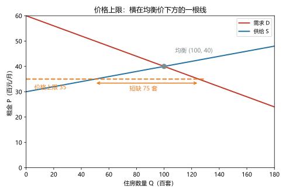
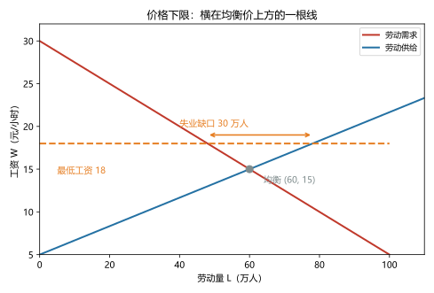
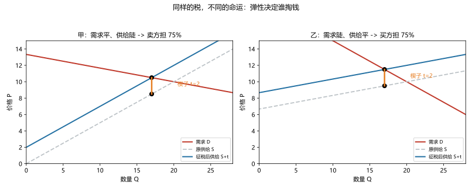

# 第 05 讲：供给、需求与政府政策

> **前置**：第 03–04 讲（供需模型与三步法、弹性）。
> **预计时间**：约 2.5 小时（含作业）。
>
> **一句话定位**：政府动价格的两板斧——**价格管制**与**税收**——的完整审查。核心问题只有一个：**"动了价格之后，收益和代价分别落在谁头上？"**
>
> **本讲回答什么**：
> 1. 价格上限为什么反而让"想保护的人"吃亏？
> 2. 租金管制的短期和长期为什么是两副面孔？
> 3. 最低工资到底帮了谁、可能伤了谁？
> 4. 对买者征税和对卖者征税，结果真的一样吗？
> 5. "税是商家交的"——这句话错在哪？
>
> **这一讲有真实验证**：租金上限的短缺计算（脚本 `scripts/lec05-01_verify_price_controls_tax.py` 实验 1）；最低工资的失业缺口（实验 2）；税收两种征法的等价性（实验 3）；弹性决定归宿的三市场对照（实验 4）。配图 3 张。

## 本讲怎么走（脉络图）

```
引子：听证会上的三句话
  │
  ├─ 1. 价格上限：一根横在均衡价下方的线
  ├─ 2. 深挖：租金管制的短期与长期
  ├─ 3. 价格下限：一根横在均衡价上方的线（最低工资）
  ├─ 4. 税收：插在两口价之间的楔子（等价性）
  ├─ 5. 税负归宿：谁的钱在变（弹性说了算）
  ├─ 6. 工具收拢：三类政策速查表
  ├─ 7. 回到听证会：三句话的复盘
  └─ 常见误区 → 本讲小结 → 掌握度自测 → 作业
```

> 下一站：§引子。三位代表的三句话，本讲逐一审查。

---

## 引子：听证会上的三句话

市里开了一场价格听证会，三位代表依次发言：

- **租客代表**："房租一季度涨了 15%，请政府把租金限在 3000 元/月以下！"
- **工人代表**："最低工资三年没涨了，请提高到 25 元/小时！"
- **小店主代表**："各种税越来越重——全是我们商家在扛！"

三句话的诉求方向不同，结构却一样："请让价格（或账单）对我这一方好一点。"

问题在于：第 03 讲已经证明——**价格不是谁"定"的，是买卖双方"碰"出来的**。政府当然可以"摁"住它；但摁住之后会发生什么？被摁掉的那部分力量，会去哪里？还有第三句话——"全是我们商家在扛"——账单上的事，真的这么算吗？

本讲把这三句话逐一放进供需模型里审。审完之后，你会得到一套判断"任何价格干预政策"的固定打法。

---

## 1. 价格上限：一根横在均衡价下方的线

### 1.1 定义与"约束力"判据

> **价格上限（price ceiling）：法律规定的某种商品的最高价格。**

第一个要养成的动作不是画图，而是先问：**这个上限"管不管用"？**

- **上限高于（或等于）均衡价 → 无约束（not binding）**：市场本来就在更低的价格成交，上限形同虚设；
- **上限低于均衡价 → 有约束（binding）**：法律把价格摁到了市场清算价之下——故事从这里开始。

### 1.2 有约束上限的后果链

上限一"有约束"，供需表立刻裂开一道口子：

- 在这个低价上，**想买的人变多**（沿需求曲线下滑）；
- **想卖的人变少**（沿供给曲线下滑）；
- 于是**需求量 > 供给量：短缺**。

短缺意味着"想买的人里必然有一批买不到"。问题来了：**买不到的人怎么办？用什么规则分配这批稀缺的货？**

价格竞争被法律关掉了，但商品还是稀缺的——竞争不会消失，它只是**换了一个出口**：排队（先到先得，用时间竞争）、抽签（用运气）、找关系（用人情）、黑市和搭售（用更高的隐形成本）、质量缩水（在看不见的地方减料）。经济学把这一族现象叫**非价格竞争**。记住这句话，它是本讲的底层句式：

> **管制把价格摁离均衡，但稀缺没有消失——竞争只是从"价格"这个出口，挤到了别的出口。**

### 1.3 数字验证：租金上限的两副面孔（实验 1）

用一座城市的租房市场算账（$P$ 单位：百元/月；$Q$ 单位：百套；脚本 `lec05-01` 实验 1 实测）：

- **需求**：$Q_d = 300 - 5P$；**供给**：$Q_s = 10P - 300$；
- **原均衡**：$P^* = 40$（即 4000 元/月），$Q^* = 100$（百套）。

现在政府把租金上限设为 **3500 元（$P \le 35$）**——低于均衡价，有约束：

| | 价格 P | 需求量 | 供给量 | 结果 |
|---|---|---|---|---|
| 无约束上限（如 4500 元） | 40 | 100 | 100 | 虚设，市场照旧 |
| **有约束上限（3500 元）** | 35 | **125** | **50** | 成交 50 套，**短缺 75 套** |



> **图 1 怎么读**：红线（需求）与蓝线（供给）的交点是原均衡 (100, 40)。橙色虚线是"3500 元"的价格上限，横在均衡价**下方**——在这个价格上，需求量沿红线滑到 125，供给量沿蓝线缩到 50（橙色双箭头标注的正是这段**短缺 75 套**的缺口）。对照实验：如果上限设在 4500 元（均衡价上方），市场连眼皮都不抬一下——**上限必须"低于均衡"才有故事**。

### 1.4 本节态度

| 内容 | 态度 |
|---|---|
| "约束力"判据 | **焊成条件反射**：见到价格政策先判"高于还是低于均衡" |
| 后果链：上限→短缺→非价格竞争 | **能复述、能画图、能算缺口** |
| 数字计算 | 会算三条量：$Q_d$、$Q_s$、短缺 = $Q_d - Q_s$ |

> 下一站：上限的故事还没完——它在"短期"和"长期"里长得完全不一样。拿最有名的一个案例开刀。

---

## 2. 深挖：租金管制的短期与长期

### 2.1 两个时间尺度，两条弹性

租金管制（rent control）是价格上限的经典案例。为什么经济学家对它的评价常常很一致地负面？关键在**时间**——回顾第 04 讲：**时间越长，弹性越大**。

- **短期**：房子已经建好了，租盘就这么多——**供给几乎无弹性**（供给曲线近乎垂直）。把租金摁低，短缺是"有一点点"：一批人挤不进现房，但总量变化不大。
- **长期**：供给开始有弹性——
  - 开发商**不建新的租赁房**了（同样的地拿去盖写字楼、卖产权）；
  - 一些房东**退出租赁市场**（转售、自住、闲置）；
  - 已有的房子**维护缩水**（既然租金封顶，翻新不划算）；
  - 同时需求侧也在动：更低的租金**吸引更多人想搬进来**（需求右移）。
- 两条腿一起动，**长期短缺被放大成结构性问题**。

### 2.2 短缺的"变形记"：非价格竞争长什么样

被摁住的租金不会凭空消失，它会以这些面孔回来（想想 §1.2 的句式）：

- 房东挑租客（"只租给熟人""不养宠物的优先"）——**配给权归了房东**；
- 变相收费（看房费、加码押金、"家具使用费"）；
- 维修拖延（水管坏了排三个月）——**质量缩水**；
- 转租黑市（第一个租客高价转租，赚差价）。

### 2.3 谁赢、谁输（一份清单）

租金管制的分配账（这个"罗列赢家输家"的动作，第 08 讲会做大做细）：

| 群体 | 得失 |
|---|---|
| **已经租到房的老租客** | 赢——锁定了低租金 |
| **想租房的新人**（年轻人、新市民） | 输——找不到房 or 挤进非价格竞争 |
| **房东** | 输——收入被摁住，维护激励受损 |
| **整体市场** | 效率损失：房子该建的不建、该维护的不维护 |

一句话总结这一节：**租金管制保护的是"抽到签的人"，代价压在"来晚的人"身上**——政策的"保护"和"伤害"从来不是对着同一群人。

> 下一站：把线翻过来——价格下限。它的故事和上限镜像对称，但案例更敏感：工资。

---

## 3. 价格下限：一根横在均衡价上方的线

### 3.1 定义与判据（镜像对称）

> **价格下限（price floor）：法律规定的某种商品的最低价格。**

判据照旧、方向相反：

- **下限低于（或等于）均衡价 → 无约束**：市场价本来就更高，下限没人在意；
- **下限高于均衡价 → 有约束**：法律把价格抬到了清算价之上。

### 3.2 有约束下限的后果链

- 高价上，**想卖的人变多**（沿供给曲线上滑）；
- **想买的人变少**（沿需求曲线下滑）；
- 于是**供给量 > 需求量：过剩（surplus）**。

注意："过剩"在这里的意思是"卡在法律价上、卖不出去的意愿"。价格竞争（卖家互相压价）被法律关掉了，那这批"卖不掉"怎么消化？**又是非价格竞争，方向倒过来**：卖家比拼服务、附加条件、挑挑拣拣；能卖出去的"名额"本身成了要争的东西。

### 3.3 最低工资：数字与图形（实验 2）

劳动市场的价格就是工资。模型设定（$W$ 元/小时；$L$ 万人；脚本 `lec05-01` 实验 2 实测）：

- **劳动需求**：$L_d = 120 - 4W$（企业：工资越高雇得越少）；**劳动供给**：$L_s = 6W - 30$（劳动者：工资越高愿意干的人越多）；
- **原均衡**：$W^* = 15$，$L^* = 60$。

政府把最低工资定为 **18 元**（高于均衡，有约束）：

| | 工资 W | 就业量（需求） | 愿意工作者（供给） | 结果 |
|---|---|---|---|---|
| 无约束最低工资（如 12 元） | 15 | 60 | 60 | 虚设，市场照旧 |
| **有约束最低工资（18 元）** | 18 | **48** | **78** | 就业 48，**失业缺口 30 万人** |



> **图 2 怎么读**：红（劳动需求）蓝（劳动供给）交点 (60, 15) 是原均衡。橙色虚线是 18 元的最低工资，横在均衡**上方**——在这个价位上，就业量**由需求侧决定**（企业只雇 48 万人：点沿红线滑到 48），而 78 万人愿意在此工资下工作——之间的"失业缺口 30 万人"就是橙色双箭头。老规矩：最低工资若定在 12 元（均衡之下），市场毫无反应。

### 3.4 一条必须配上的诚实声明（实证边界）

模型给出的机械链条是"有约束的最低工资 → 就业量下降、失业缺口"。**真实世界里的争论不在机制，而在幅度**：最低工资（尤其是**温和上调**）对就业的影响，实证研究给出的估计差异不小——有的发现负效应明显，有的发现很小甚至测不出；而在**明显高于市场均衡**的情形下，负向就业效应更明确。

所以正确的表态姿势是：

- 考试答卷：按模型链条作答（判据—缺口—方向），这是基本功；
- 现实讨论：承认"幅度有争议"，别把模型结论说成"铁律"，也别因为"争议"就说"模型错了"。

### 3.5 另一条出口：农产品价格支持

价格下限的另一个经典案例是农产品保护价：政府规定最低收购价（高于均衡）→ 供给过剩 → 过剩通常**由政府收购**（再拿去储备、出口或销毁）。这也解释了为什么农业政策总是"价格支持 + 收储"打包出现——它们是同一条链上的两个环节（后面的课程会评估这套政策的福利代价）。

> 下一站：价格管制讲完。换一个完全不同的干预方式——不"摁价"，而是在买价和卖价之间"插一刀"。税收登场。

---

## 4. 税收：插在两口价之间的楔子

### 4.1 从量税的基本设定

> **从量税（per-unit tax）：对每单位商品征收固定金额 $t$ 的税。**

税一进来，市场上就出现了**两个价格**：

- **买者支付的价格 $P_b$**（含税总价）；
- **卖者到手的价格 $P_s$**（税后的净收入）；
- 两者的关系：$P_b - P_s = t$。

### 4.2 两种征法的图操作方法

- **向卖者征**：卖者每卖一单位就要上交 $t$，所以"要价"实际变贵了 → **供给曲线上移 $t$**（也叫左移）；
- **向买者征**：买者每买一单位都要多掏 $t$，所以"愿意支付"实际变便宜了 → **需求曲线下移 $t$**。

### 4.3 等价性：惊人的结论（实验 3）

按直觉，两种征法应该不一样："向商家征，商家肉疼；向消费者征，消费者肉疼"——但模型说：**结果完全相同**。用数字验证（$Q_d = 200-10P$；$Q_s = 10P-100$；$t = 4$；脚本实验 3）：

| | 无税基准 | 向卖者征 | 向买者征 |
|---|---|---|---|
| 买者支付 $P_b$ | 15 | **17** | **17** |
| 卖者到手 $P_s$ | 15 | **13** | **13** |
| 成交量 $Q$ | 50 | **30** | **30** |

两种征法得到**同一组** $(P_b, P_s, Q)$。为什么？因为决定市场行为的从来不是"钱在谁的账户上被划走"，而是**买者面对的价格**和**卖者面对的价格**——两种征法最终在各自身边插了一模一样的"4 元楔子"。法律名义（谁申报、谁划款）在这里**毫无影响**。

> 这也回答了两个流行的争论："对企业加税会转嫁给消费者吗"和"对消费者加税会压垮商家吗"——**两者是同一个问题**（下一节展开）。

### 4.4 计算套路（考试标准动作）

给定线性供需和从量税 $t$，解三步：

1. 写两组价格条件：买者侧用 $P_b$ 代入需求（$Q_d(P_b)$）、卖者侧用 $P_s$ 代入供给（$Q_s(P_s)$）；
2. 写上楔子方程：$P_b - P_s = t$（或 $P_s = P_b - t$）；
3. 令 $Q_d(P_b) = Q_s(P_s)$ 联立求解，再回代得成交量。

> 下一站：税插进去了，但"谁的钱变少"这道最有意思的题还没算——答案会让很多人意外。

---

## 5. 税负归宿：谁的钱在变

### 5.1 名义 vs 经济归宿

> **税负归宿（tax incidence）：税收负担最终落在谁头上的问题——与"法律上由谁缴纳"不是一回事。**

法律说"由商家申报缴纳"，不等于商家的钱变少了；也不等于买家的钱没变。**要看价格怎么调**。

### 5.2 分担的机制与弹性规则

税后，税这笔钱被拆成两段（回忆 §4.3 的表）：

- **买者多付**：$P_b - P_{无税}$（买单变贵了）；
- **卖者少收**：$P_{无税} - P_s$（到手的钱少了）；
- 两段之和 = $t$。

**谁占大头？弹性说话。** 直觉版："**谁更难跑掉，谁承担更多**"——

- **需求缺乏弹性**（买家离不开）：涨价也得买 → 买家多付的那段大；
- **供给缺乏弹性**（卖家退不出）：降收也得卖 → 卖家少收的那段大。

### 5.3 数字验证：同样的税，不同的归宿（实验 4）

两个市场**原均衡完全相同**（都是 (10, 20)），各征 $t = 2$ 的税（脚本实验 4）：

| 市场 | 弹性结构 | 买者多付 | 卖者少收 | 归宿 |
|---|---|---|---|---|
| 甲：$Q_d = 80-6P$；$Q_s = 2P$ | 需求平（有弹性）、**供给陡（缺弹性）** | +0.5 | **−1.5** | **卖方担 75%** |
| 乙：$Q_d = 40-2P$；$Q_s = 6P-40$ | **需求陡（缺弹性）**、供给平（有弹性） | **+1.5** | −0.5 | **买方担 75%** |



> **图 3 怎么读**：两图结构相同——红（需求）、灰虚线（原供给）、蓝实线（征税后的供给，整体上移 $t=2$）；新均衡处竖着一段橙色**楔子**，两端分别是买者支付的价（上）和卖者到手的价（下）。区别在形状：左图（甲）供给陡峭（缺弹性）——楔子里"卖方那段"更长（担 75%）；右图（乙）需求陡峭——"买方那段"更长（担 75%）。**同样的税、同样的起点，只因弹性结构不同，归宿完全颠倒。**

### 5.4 两个极端（一句话各记一个）

- **需求完全无弹性**（垂直需求）：买者承担全部税负（例：短期内没有替代品的刚需品）；
- **供给完全无弹性**（垂直供给）：卖者承担全部税负（例：土地——供给固定，"土地税不扭曲行为"的说法正来源于此）。

### 5.5 应用三两例

- **烟酒税**：成瘾品需求缺乏弹性 → 税主要由消费者承担，且对消费量的抑制有限（这也正是"寓禁于征"的政策算盘与它的限度）；
- **工资税（社保名义上由企业/个人分担）**：归宿要看劳动供需双方的弹性——"名义分摊比例"决定不了谁真正的负担；
- **平台抽成、渠道费**：本质都是"楔子"——谁承担更多，看两边谁更跑不掉。

> 下一站：把三类政策收拾成一张速查表，然后回听证会结案。

---

## 6. 工具收拢：三类政策速查表

| 政策 | 有效（有约束）判据 | 直接后果 | 观测指标 | 计算三件套 |
|---|---|---|---|---|
| **价格上限** | 上限 $<$ 均衡价 | 短缺 | 排队、黑市、质量下降 | $Q_d($上限$)$、$Q_s($上限$)$、短缺 $= Q_d - Q_s$ |
| **价格下限** | 下限 $>$ 均衡价 | 过剩 | 失业、政府采购/销毁 | $Q_s($下限$)$、$Q_d($下限$)$、过剩 $= Q_s - Q_d$ |
| **从量税** | 任何 $t > 0$（税总有影响） | 量减 + 楔子 | 价差 $= t$、双向价格 | 令 $Q_d(P_b) = Q_s(P_b - t)$ 解 $P_b$、$P_s$、$Q$ |

每个政策问题问三句（本讲的总打法）：**① 动了哪条线/哪个价？② 受害受益各是谁？③ 弹性站在哪一边？**

> 下一站：听证会结案陈词。

---

## 7. 回到听证会：三句话的复盘

**租客代表："请把租金限在 3000 元以下！"**

- 模型判定：若 3000 元低于市场租金——有约束 → 短缺 → 非价格竞争（房东挑客、变相收费、维护缩水）；
- 时间尺度：短期"帮到租到房的人"，长期"房子变少、质量变差"；
- 更完整的问法：想帮"付不起房租的人"，限价 vs 住房补贴 vs 增加供给——**"帮谁、由谁埋单、副作用几何"要一起算**（这些工具的细账在收敛与外部性各讲展开）。

**工人代表："最低工资提到 25 元！"**

- 先判约束力：25 元若在市价（如 15 元）之上——有约束 → 就业量缩、失业缺口扩大；若低于市价——什么也没发生；
- 分配账：受益的是"保住岗位的工人"，代价压给"因此挤不进来的求职者"；
- 实证提醒：幅度争议存在，答卷按模型、现实留余地（§3.4）。

**小店主代表："税全是我们商家在扛！"**

- 判定：按 §5 的归宿逻辑——**谁跑不掉谁扛**。若顾客对店里商品需求缺乏弹性（替代少、街坊黏性），多出来的税主要由顾客以"涨价"的形式支付——虽然小票上不会写"含税"；若顾客非常好跑（替代品一条街），那税确实更可能压在店主头上，但这就是**"弹性站在哪边"的问题，而不是"名义由谁缴"的问题**；
- 结论：这句话的正确翻版是——"**这笔税在我们这条街的归宿，取决于我们客人跑得掉的成本**"，而不是"法条上写着我们缴"。

---

## 常见误区（本节零新知识，只破误）

1. **"价格上限保护买家、价格下限保护卖家"**（§1、§3）。不完整。先判"有约束没有"：无约束=没作用；有约束=短缺/过剩 + 非价格竞争，被保护的和被伤害的**往往不是同一群人**。
2. **"限价能消灭涨价问题"**（§1.2）。错。价格被摁住，稀缺会换出口（排队、配给、质量缩水）——**代价转移 ≠ 代价消失**。
3. **"最低工资一涨，低收入者统统受益"**（§3.3–3.4）。不全。有约束时就业量缩、部分求职者被挤出；不同人群得失不同（这也是实证争议的战场）。
4. **"税是商家交的（或消费者交的）"**（§4.3、§5.1）。错。法律名义不影响经济归宿——决定归宿的是弹性（谁更难跑）。
5. **"对买者征税和对卖者征税，效果不一样"**（§4.3）。错。两种征法得到同一组 $(P_b, P_s, Q)$——是同一道楔子。
6. **"税可以百分之百转嫁出去"**（§5.3–5.4）。只在极端弹性（对方完全跑不掉）时成立；一般情况下由双方按弹性比例分摊。

## 本讲小结

一页纸的骨架：

- **判"约束力"口诀**：上限低于均衡才有效（→短缺）；下限高于均衡才有效（→过剩）；税（几乎）总有影响。
- **价格上限**后果链：低价 → $Q_d \uparrow$、$Q_s \downarrow$ → 短缺 → **非价格竞争**（排队/黑市/质量缩水/关系配给）。
- **租金管制**：短期轻、长期重（弹性随时间变大）；赢家是"抽到签的人"，输家是"来晚的人"。
- **价格下限**：最低工资的机械链条 = 就业量由需求侧定 + 失业缺口；农产品支持 = 政府收购过剩。实证幅度有争议，答卷按模型。
- **从量税**：两个价格 $P_b - P_s = t$；**向谁征完全等价**；计算套路：$Q_d(P_b) = Q_s(P_b - t)$。
- **税负归宿**：名义 ≠ 经济归宿；**弹性小（跑不掉）的一方承担更多**；极端情形一方全担。
- **总打法**：动哪条线 → 谁赢谁输 → 弹性站哪边。

## 掌握度自测

- [ ] 我能对任一价格政策先判"有无约束"（上限比均衡、下限比均衡）。
- [ ] 我能画出价格上限图并算出短缺量，复述"非价格竞争"的至少四种形态。
- [ ] 我能解释租金管制的短期与长期差异（弹性时间效应），并列出赢家/输家清单。
- [ ] 我能画出价格下限图，算失业缺口，并说出最低工资实证争议的正确表态姿势。
- [ ] 我能用数字验证"向买者征与向卖者征等价"，并解释为什么。
- [ ] 我能写出从量税计算三件套并独立求解 $P_b$、$P_s$、$Q$。
- [ ] 我能解释"税负归宿看弹性"，并用"谁跑不掉谁扛"分析一个例子（如烟税）。
- [ ] 我能说出两个极端（垂直需求/垂直供给）的归宿结论。
- [ ] 我能把听证会三句话各用一段模型分析复盘（有约束/分配账/弹性）。
- [ ] 我能复跑 `scripts/lec05-01`，解释每一个数字（125、50、75、48、78、30、17、13、±0.5/1.5……）。

## 作业

> 答案只能用**已教概念**（本讲范围：价格上下限与约束力、短缺/过剩、非价格竞争、租金管制、最低工资、从量税、两种征法等价、楔子、税负归宿与弹性规则）。先独立做，再对答案。

### 基础

**Q1. 计算·价格上限**：某商品市场：$Q_d = 90 - 3P$；$Q_s = 2P - 10$。

(1) 求原均衡；
(2) 若价格上限设为 15：计算 $Q_d$、$Q_s$、成交量与短缺量；
(3) 若上限设为 25，结果如何？

**参考答案**：
(1) $90-3P = 2P-10 \Rightarrow 100 = 5P \Rightarrow P^* = 20$，$Q^* = 30$。
(2) 上限 15（低于均衡，有约束）：$Q_d = 90-45 = 45$；$Q_s = 30-10 = 20$。成交量 = 20，**短缺 25**。
(3) 上限 25（高于均衡 20）：**无约束**，市场仍在 (20, 30)。
验算：(2) 的成交量取 $Q_s$（卖家只肯供 20）✓；对照 (3) "上限不低不管用" ✓。

**Q2. 计算·价格下限**：某劳动市场：$L_d = 100 - 2W$；$L_s = 3W - 25$（$W$ 元/小时；$L$ 万人）。

(1) 求原均衡工资与就业量；
(2) 最低工资定为 30：计算就业量、愿意工作人数与失业缺口；
(3) 最低工资定为 20，结果如何？

**参考答案**：
(1) $100-2W = 3W-25 \Rightarrow 125 = 5W \Rightarrow W^* = 25$，$L^* = 50$。
(2) 30 > 25：就业量（需求侧）= $100-60 =$ **40**；愿意工作 = $90-25 =$ **65**；**失业缺口 25 万人**。
(3) 20 < 25：**无约束**，无为而治，仍在 (25, 50)。

**Q3. 计算·税收楔子**：某市场：$Q_d = 100 - 5P$；$Q_s = 5P - 20$。政府征从量税 $t = 2$。

(1) 求无税均衡；
(2) 向卖者征：求 $P_b$、$P_s$、$Q$；
(3) 计算买卖双方各承担多少税；向买者征收会不同吗？

**参考答案**：
(1) $100-5P = 5P-20 \Rightarrow 120 = 10P \Rightarrow P^* = 12$，$Q^* = 40$。
(2) $P_s = P_b - 2$：$100-5P_b = 5(P_b-2)-20 = 5P_b-30 \Rightarrow 130 = 10P_b \Rightarrow P_b =$ **13**，$P_s =$ **11**，$Q = 100-65 =$ **35**。
(3) 买者多付 13−12 = **1**；卖者少收 12−11 = **1**；各担一半（和 = 2 = t ✓）。**向买者征结果完全相同**（同一道楔子、同一组 $(P_b,P_s,Q)$）。
验算：$Q_s(11) = 35 = Q_d(13)$ ✓。

### 提高

**Q4. 计算·两种归宿对照**：两个市场起点相同（均为均衡 (20, 40)），各征 $t = 5$：

- 甲：$Q_d = 200-8P$；$Q_s = 2P$；
- 乙：$Q_d = 80-2P$；$Q_s = 8P-120$。

(1) 甲、乙的原均衡验证；(2) 各求税后 $P_b$、$P_s$、$Q$；(3) 算双方分担比例并解释差异。

**参考答案**：
(1) 甲：$200-8P = 2P \Rightarrow P = 20$，$Q = 40$ ✓；乙：$80-2P = 8P-120 \Rightarrow 200 = 10P \Rightarrow P = 20$，$Q = 40$ ✓。
(2) 甲：$200-8P_b = 2(P_b-5) \Rightarrow 200-8P_b = 2P_b-10 \Rightarrow 210 = 10P_b \Rightarrow P_b =$ **21**，$P_s =$ **16**，$Q = 200-168 =$ **32**；乙：$80-2P_b = 8(P_b-5)-120 \Rightarrow 80-2P_b = 8P_b-160 \Rightarrow 240 = 10P_b \Rightarrow P_b =$ **24**，$P_s =$ **19**，$Q =$ **32**。
(3) 甲：买者 +1、卖者 −4 → **卖方担 80%**（甲的供给陡峭——缺弹性）；乙：买者 +4、卖者 −1 → **买方担 80%**（乙的需求陡峭）。**同样是 5 元的税，归宿因弹性结构而颠倒**——"谁跑不掉谁扛"。
验算：两组楔子均为 5（21−16、24−19）✓；成交量都缩到 32 ✓。

**Q5. 辨析题**：判断对错并简说理由。

(a) "向卖者征税，所以税由卖者承担。"
(b) "价格上限总能保护买方。"
(c) "最低工资只要一提高，低收入者就普遍受益。"
(d) "向买者征税时，买者支付的价格比向卖者征税时更高。"

**参考答案**：
(a) 错。名义缴纳者 ≠ 经济归宿；谁承担由相对弹性决定（§5）。
(b) 错。先判约束力：无约束=无作用；有约束=短缺 + 非价格竞争，买单的往往是"没抢到货的人"（§1）。
(c) 不全对。有约束时就业量缩、"挤不进来的人"受损；且影响幅度有实证争议（§3.3–3.4）。
(d) 错。两种征法得到同一组 $(P_b, P_s, Q)$——完全等价（§4.3）。

**Q6. 画图描述·三张标准图**：用文字分别描述"价格上限、价格下限、从量税"三张图的画法与标注要点（假设都"有约束/有效"）。

**参考答案**：
- **价格上限**：画供需交于均衡 → 在上（下）方画一条横线（上限，低于均衡）→ 在超低价上标 $Q_d$（沿需求右滑）与 $Q_s$（沿供给左滑）→ 双箭头标注"短缺 = $Q_d - Q_s$"。
- **价格下限**：同上镜像——横线画在均衡**上方** → 标注"过剩 = $Q_s - Q_d$"（劳动市场里叫失业缺口，就业量由需求侧决定）。
- **从量税**：将供给曲线整体上移 $t$（或需求下移 $t$）→ 新均衡处画竖"楔子"，顶端 $P_b$、底端 $P_s$ → 分别标注"买者多付"与"卖者少收"两段，和为 $t$。
（评分点：三条线/线名、两轴、交点、缺口或楔子标注——与本讲三张实测图一致。）

### 综合（回扣本讲主任务）

**Q7. 综合·租金管制全案**：某城租房市场：$Q_d = 300-5P$；$Q_s = 10P-300$（$P$ 百元/月；$Q$ 百套）。

(1) 求原均衡；
(2) 上限 3500 元（$P \le 35$）：求 $Q_d$、$Q_s$、成交量、短缺量；
(3) 若短期供给近乎固定（竖直线，$Q = 100$），同一上限的短缺会怎样变？（用供需概念定性说明）
(4) 列出至少两位赢家与两位输家，并各配一句机制说明。

**参考答案**：
(1) $P^* = 40$（4000 元/月），$Q^* = 100$。
(2) $Q_d = 125$；$Q_s = 50$；成交 **50**；**短缺 75 套**。
(3) 供给若垂直固定在 100：上限 35 下需求仍是 125，但供给不缩（100）→ 短缺 = 125−100 = 25——**比长期轻得多**（长期里供给会缩到 50）。这正是"短期轻、长期重"的量化版。
(4) 赢家：① 已租到房的老租客（锁低价）；② 善于排队的"关系户"（非价格竞争的胜出者）。输家：① 想租房的新市民（短缺 + 被挤）；② 房东（收入被压、维护激励降）。
验算：(2) 与脚本实验 1 数字一致；(3) "短期供给更缺弹性 → 短缺更小"与 §2.1 表述自洽。

**Q8. 简答·"税由谁扛"的分析框架**：有评论说："对平台抽成加税/加费，平台利润厚，扛得住，消费者不受影响。" 请给出一套判断框架（提示：不许用"利润厚不厚"当判据）。

**参考答案**：
1. **别用名义与"财力"当判据**——归宿由相对弹性决定（§5）；"利润厚"和"谁来缴"都不是决定因素。
2. **看需求侧弹性**：消费者对平台服务的需求是否缺乏弹性（替代平台少、迁移成本高）？越缺弹性，"楔子"里消费者承担越多（表现为涨价的隐蔽形式：配送费、会员费、服务缩水——"价格"不只写在标价上）。
3. **看供给侧弹性**：平台之间竞争是否激烈、商家是否能多归属（multi-homing，不展开术语也说得清："能不能同时挂几个平台，说走就走"）？越有弹性的一方，越能让楔子落到对方（消费者）头上。
4. **注意长期**：两条边的弹性都会随时间变大（消费者会迁移习惯、竞争会涌入）——今天能转嫁的量，不保证明天还能。
5. **验证方法**：别听声明，看价格（含隐性涨价）与交易量的实际变化——这是对归宿判断的"事后对账"。
（要点：判据归弹性和相对替代性；名义免责声明与"利润厚"均不可作为依据。）

---

*下一讲预告：第 06 讲《消费者、生产者与市场效率》——本讲反复说"代价""收益"，但一直用"短缺""过剩""多付少收"这样的字眼定性描述。下一讲给你一本**统一的账本**：消费者剩余、生产者剩余、总剩余——从此"一项政策亏了多少"可以当场算出来。*