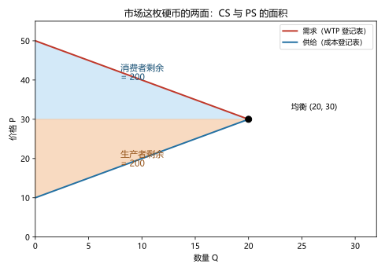
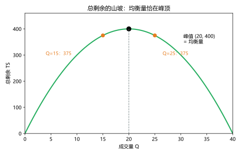
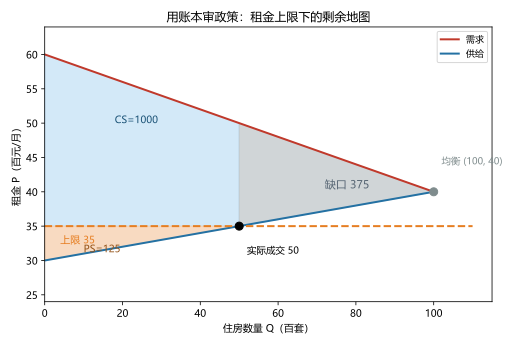

# 第 06 讲：消费者、生产者与市场效率

> **前置**：第 03–05 讲（供需模型、弹性、价格管制的定性分析）。
> **预计时间**：约 2.5 小时（含作业）。
>
> **一句话定位**：前几讲说"买者多付""卖者少收""短缺""过剩"——全是定性词。本讲给市场装一本**可以计算的账**：消费者剩余、生产者剩余、总剩余。从此"一项政策让社会亏了多少"不再靠感觉，而是直接报数。
>
> **本讲回答什么**：
> 1. 怎么给"市场结果好不好"定一把能算的尺子？
> 2. 支付意愿怎么变成曲线下的面积？
> 3. 生产者剩余是卖家的利润吗？
> 4. 为什么均衡量恰好让总剩余最大？多产一点、少产一点会怎样？
>
> **这一讲有真实验证**：引子台阶核对（脚本 `scripts/lec06-01_verify_surplus.py` 实验 1）；连续市场几何（实验 2：CS/PS/TS = 200/200/400）；总剩余扫描（实验 3：峰值恰在均衡量）；05 讲租金上限的账本重算（实验 4：1500 → 1125）。配图 3 张。

## 本讲怎么走（脉络图）

```
引子：夜市奶茶摊的"12 元"
  │
  ├─ 1. 消费者剩余：买家心里的那本账
  ├─ 2. 生产者剩余：卖家心里那本账
  ├─ 3. 总剩余：均衡量恰在"山坡"的峰顶（两实验 + 两图）
  ├─ 4. 效率之外：平等、失灵与账本的边界（含 05 讲政策的账本重算）
  └─ 常见误区 → 本讲小结 → 掌握度自测 → 作业
```

> 下一站：§引子。从一杯奶茶里"凭空"冒出的 12 元说起。

---

## 引子：夜市奶茶摊的"12 元"

夜市上，你以 **6 元**买了一杯奶茶。这笔交易平淡无奇，但请摊开两个人各自的"心理账本"：

- **你**：这杯奶茶我最多愿意出 **10 元**。结果只花了 6 元——相当于"赚"了 4 元。
- **摊主**：做这杯的成本（原料与工夫）是 **2 元**。结果卖了 6 元——相当于"赚"了 4 元。

一杯茶就"生出"了 8 元心理盈余。那天晚上你续了两杯（你对第 2、3 杯的心理价位降为 8 元和 6 元），摊主也接着做（第 2、3 杯的成本升为 4 元和 6 元）——三笔下来，双方合计的"心理盈余"是 **12 元**。

现在问一个值得暂停的问题：**这 12 元是谁给他们的？** 你付的 18 元是"转移"（从你的账户到摊主的账户，总金额一分没变）；12 元却凭空冒了出来。回溯第 01、02 讲你其实见过它两次——"贸易创造价值""消费点走出 PPF"——这次我们要给它装上一个名字和一套算法：

> **买家侧的"赚"叫消费者剩余，卖家侧的"赚"叫生产者剩余，合起来叫总剩余。** 本讲把这笔账放大到整个市场：曲线下的面积、逐单位的加总、还有那个惊人的结论——**市场自己碰出来的均衡，恰好让总剩余最大**。

---

## 1. 消费者剩余：买家心里的那本账

### 1.1 支付意愿

> **支付意愿（willingness to pay，缩写 WTP）：一个买家为得到某件商品最多愿意支付的价格。**

它有两个性质要提前记住：

1. **因人而异**：同一张演唱会门票，铁杆粉丝愿意出 800 元，路人只愿出 300 元；
2. **因量而异**：同一个人，第 1 杯奶茶愿出 10 元，第 2 杯只愿出 8 元——**边际上递减**（第 01 讲"水与钻石"的老朋友）。

### 1.2 算一遍：你的奶茶账

| 第几杯 | 你的 WTP | 价格 6 元时买不买 | 单杯剩余 |
|---|---|---|---|
| 1 | 10 | 买 | 10 − 6 = **4** |
| 2 | 8 | 买 | 8 − 6 = **2** |
| 3 | 6 | 买 | 6 − 6 = **0** |
| 4 | 4 | 不买（4 < 6） | — |

> **消费者剩余（consumer surplus，缩写 CS）：买家的支付意愿减去他实际支付的部分。** 这里 $CS = 4 + 2 + 0 =$ **6 元**（脚本 `lec06-01` 实验 1 实测 ✓）。

一个必须当场钉住的辨析：**CS 不是省下来的现金**——你的账户并没有多出 6 元。它是"**你得到的价值超过你付出**"的度量，是心理账户上的净好处（这正是 willing 一词的原味："我本来愿意掏这么多"）。凡把 CS 说成"真金白银"的地方，都错。

### 1.3 从一个人到一个市场：曲线下的面积

把视角从"你"换成"所有人"：需求曲线上每一个点，对应的都是"某一单位的边际买家，他最多愿意出这个价"。于是——

> **市场消费者剩余 = 需求曲线之下、价格线之上的面积。**

价格越低、这条"地毯"越厚。价格下降时，CS 的增加来自两拨人：**老买家少花钱了**（原面积加厚）+ **新买家进场了**（面积向右扩）。

> **微积分视角（第一次见"面积 = 积分"）**：若把需求写成反函数 $P_d(q)$（第 $q$ 单位买家的 WTP），则 $CS = \int_0^Q \left[P_d(q) - P\right] dq$——"曲线下面积"的严格写法。离散单位就是逐个相加（§1.2 的表）。本课程后面凡出现"剩余面积"，都默认这个口径。

> 下一站：账本翻到卖家那一半——他们心里的"底价"叫什么？

---

## 2. 生产者剩余：卖家心里那本账

### 2.1 成本与"愿意卖"的底价

> **成本（cost）：卖家为提供一单位商品所放弃的一切的价值**（机会成本，第 01 讲的老朋友；它在企业账本里的完整形态是第 11 讲的内容）。

卖家也有一本心理账："低于这个价，我不如不卖。"——这就是每个单位商品的**最低要价**（成本）。和 WTP 一样，它**因卖家而异、因产量而异**：摊主做第 1 杯的成本 2 元、第 2 杯 4 元……（加班、原料告急，越做越贵——边际成本递增）。

### 2.2 算一遍：摊主的账

| 第几杯 | 摊主成本 | 价格 6 元时卖不卖 | 单杯剩余 |
|---|---|---|---|
| 1 | 2 | 卖 | 6 − 2 = **4** |
| 2 | 4 | 卖 | 6 − 4 = **2** |
| 3 | 6 | 卖 | 6 − 6 = **0** |
| 4 | 8 | 不卖（8 > 6） | — |

> **生产者剩余（producer surplus，缩写 PS）：卖家实际收到的价格减去他的成本。** 这里 $PS = 4 + 2 + 0 =$ **6 元**。

### 2.3 从一个人到一个市场 + 两个辨析

> **市场生产者剩余 = 价格线之下、供给曲线之上的面积。**

（供给曲线是"成本登记表"：每个点对应某一单位边际卖家的成本。）价格上升时，PS 也同样变厚：老卖家多赚 + 新卖家入场。

两个辨析，一个防止和上一讲混、一个防止和会计混：

1. **PS ≠ "过剩"**（第 05 讲那层意思）：这里的 surplus 是"剩余"（福利度量），不是"卖不动"（市场状态）。同一个英文词、两码事，中文各归各的叫法。
2. **PS ≠ 会计利润**：PS 比的是"实收价格 − 卖方最低要价"，没考虑固定成本的分摊等一整摊账务细节——两者的精确关系留给第 11 讲（成本讲）。现在只要记住：**PS 衡量的是"这笔交易给卖家带来的净好处"**。

> 下一站：买家账 + 卖家账，合起来就是"社会从市场中得到的净好处"。用它去回答那个大问题：均衡好不好？

---

## 3. 总剩余：均衡量恰在"山坡"的峰顶

### 3.1 定义与思想实验

> **总剩余（total surplus）$= CS + PS$**：市场交易给买家们和卖家们带来的净好处之和。

现在做**整个课程最重要的思想实验之一**：

> **假设有一个"仁慈的社会计划者"**——他全知全能、只关心"总剩余尽量大"，由他来指挥这个市场：每一对交易他都可以批准或不批准。他会怎么判？

答案朴素得惊人：**凡是"买家的 WTP ≥ 卖家的成本"的交易，全部批准；凡是"WTP < 成本"的，一个都不批。** 为什么？因为每一笔批准的交易,都给社会账本加上一笔 $\text{WTP} - \text{cost} \ge 0$ 的剩余；不批就白丢；而 WTP < cost 的交易，每做一笔是往账本上**扣钱**。

### 3.2 惊人结论：市场均衡干的就是这件事

现在回头看第 03 讲的市场：

- 均衡价格之下，**所有"WTP ≥ 价格"的买家**都想买（他们正是 WTP 高于"边际成本线"的人）、**所有"成本 ≤ 价格"的卖家**都想卖；
- 成交量恰好停在第 50 单位那种"两线交叉"的地方。

用两个实验把它坐实（脚本 `lec06-01`）：

**实验 2（几何）**：市场反需求 $P = 50 - Q$、反供给 $P = 10 + Q$，均衡 $(20, 30)$：

| 项目 | 数值（脚本实测） |
|---|---|
| 消费者剩余 CS（需求下、价格上的三角） | **200** |
| 生产者剩余 PS（价格下、供给上的三角） | **200** |
| 总剩余 TS | **400** |



> **图 1 怎么读**：红色需求线下、价格 30 上的浅蓝三角 = 消费者剩余 200；价格 30 下、蓝色供给线上的橙色三角 = 生产者剩余 200。交点 E(20, 30) 把"社会净好处"劈成两半——这个市场里恰好各半（对称之故，一般情形不一定各半）。

**实验 3（扫描）**：让成交量 $Q$ 人为地从 0 拉到 30，逐点算总剩余 $TS(Q) = 40Q - Q^2$：

| 成交量 Q | 0 | 5 | 10 | 15 | **20** | 25 | 30 |
|---|---|---|---|---|---|---|---|
| 总剩余 TS | 0 | 175 | 300 | 375 | **400 ← 峰顶** | 375 | 300 |



> **图 2 怎么读**：总剩余随成交量先升后降，是一条抛物线；**峰顶 (20, 400) 的横坐标正是均衡量 20**。两侧各标了一个橙点：少交易 5 单位（Q=15）与多交易 5 单位（Q=25），总剩余都掉到 375——**少也亏、多也亏，均衡量是唯一的顶点**。（两侧完全对称是线性例子给的巧合；"少也多也亏"这个结构则是一般规律。）

两边的机制各说一句（这是§3.1 思想实验的展开）：

- **成交量太少**（比如 Q=15）：有一批"WTP > cost"的交易被拦下了——每一对被拦下，账本上就少一笔正剩余。**少做的每一单都是白丢。**
- **成交量太多**（比如 Q=25）：多做的那批里，"cost > WTP"的单位开始出现——每做一单，账本倒贴。**多做的每一单都是倒亏。**

> **微积分视角（一行证明"看不见的手"）**：总剩余对成交量的导数是 $\dfrac{dTS}{dQ} = P_d(Q) - P_s(Q)$（下一位买家的 WTP 减去下一位卖家的成本）。均衡量处 $P_d = P_s$，导数为 0——**峰顶**；两侧导数的正负号（左正右负）恰好对应"少做丢、多做亏"。市场各自逐利，合计却是顶点——这就是"看不见的手"的账本版证明。

### 3.3 效率的三种面孔

把结论提炼成三条（考试问"为什么均衡有效率"就从这三条答）：

1. **配置**：商品最终落在 WTP 最高的买家手里（愿意出更多钱的人得到它）；
2. **生产**：由成本最低的卖家提供；
3. **数量**：成交量恰好让所有"值得的交易"都发生、所有"不值得的"都不发生——总剩余最大。

至此，全课程最著名的那句话（第 01 讲埋下、第 03 讲看到动态）终于有了账本版的说法：**"看不见的手"不是玄学，它让"每个交易者各算各账"的总和，恰好落在社会的最大蛋糕点上。**

> 下一站：但"蛋糕最大"不是故事的结尾——比如它管不管"蛋糕怎么分"？还有，这本账有没有它算不了的东西？

---

## 4. 效率之外：平等、失灵与账本的边界

### 4.1 效率 ≠ 平等（老话新说）

总剩余最大的结果，可以是"CS 全归买家、PS 一滴不剩"，也可以是反过来——**分配**问题不在总剩余的口径里。看第 05 讲租金管制的例子：房客与房东之间"谁分到多少"，和"市场总蛋糕多大"，是两笔完全不同的账。**"效率论证"永远不能单独回答"公平吗"。**

### 4.2 账本的三个前提（诚实声明）

这本账好用，但它建立在三条简化上，边界要钉在墙上：

1. **只算买卖双方**：交易对"第三方"的影响（污染、拥堵）不进账——那是**外部性**的盲区（第 09 讲）；
2. **"支付意愿 = 价值"**：把老王的 10 元和你的 10 元直接相加，隐含"人际可比"的假设——这是经济学分析的标准简化，哲学上有讨论，本课程标注为边界而非结论（更细的讨论在第 16、18 讲出场）；
3. **价格接受者假设**：买卖双方都撼动不了价格——一旦有**市场势力**（第 13 讲），成交会被刻意压小，账本会在"错误的地方"被算。

### 4.3 市场失灵：账本失灵的地方（概览）

对应上面三条，经济学认证的"市场失灵（market failure）"家族（本课程逐一展开）：

- **市场势力**：有人能操纵价格 → 成交量被压 → 总剩余凭空少一块（13 讲算给大家看）；
- **外部性**：交易波及第三方而账本不管 → 该多做的少做、该少做的多做（9 讲）；
- **公共品**：根本没法"买卖"的东西（国防）→ 市场无从谈起（10 讲）。

**"均衡 = 总剩余最大"只在"完全竞争、无外部性、账本只算交易双方"的设定内成立**——背下这个结论的同时，也要背下它的水印。

### 4.4 工具演练：把第 05 讲的租金上限拖出来审一遍（实验 4）

还记得 05 讲那场"租金上限"吗？当时我们只能说"短缺 75 套"。现在有账本了，把它算到数字（脚本实验 4 实测）：

| | 均衡（无管制） | 上限 3500 元（成交 50 套） |
|---|---|---|
| 消费者剩余 CS | 1000 | **1000** |
| 生产者剩余 PS | 500 | **125** |
| 总剩余 TS | **1500** | **1125（少了 375）** |



> **图 3 怎么读**：蓝区=消费者剩余（价格 35 以上、需求线以下、只到成交的 50 套）；橙区=生产者剩余（从均衡时的 500 缩到 125）；灰色三角=**"消失的 375"**——成交量从 100 缩到 50，被挤掉的那 50 套里"本来 WTP > cost"的联合剩余，全部蒸发。它没有被任何人拿走——既不在房客手里、也不在房东手里。

"等等——**CS 怎么没跌？**"这是本图最值得盯的细节。它源自一个假设：**成交的 50 套，假设落在 WTP 最高的 50 户手里**（"有效配给"）。在这个最有利于管制的假设下，幸运房客以更低价格租到房，消费者剩余保住了。但现实里的配给是第 05 讲那套**非价格竞争**（排队、关系、看房费）——**实际 CS 只会更低，不会更高**。所以 375 是"最好的情况下"的代价下限；同时，别忘另一种损失无法进账：**被挤出市场的 50 户需求**（他们想租却无房可租）——剩余只统计"成交者"，缺口里的众生不在表格上，但他们是真实存在的。这也是第 05 讲"保护抽到签的人、代价压在后来者"的账本版说法。

那个"消失的 375"值得一个正式的名字——它将在**下一讲**登场（剧透：三个字，以"无谓"开头）。

### 4.5 账本使用说明（三句随身）

1. 先画供需、标出实际成交量（管制的短缺/过剩会改它）；
2. CS = 需求线与成交区间的价格线之间；PS = 价格线与供给线之间；**管制的"消失部分"=被挤掉的 Q 区间里两线之间的面积**；
3. 报数的时候分行写：谁多拿了、谁少拿了（分配），合计少了不少（效率）——两笔账分开念。

---

## 常见误区（本节零新知识，只破误）

1. **"消费者剩余是省下来的钱，会进账户"**（§1.2）。错。它是心理账本上的价值度量（"愿意出 10、只花 6"），不是现金流。
2. **"生产者剩余就是利润"**（§2.3）。不是。PS = 实收价 − 最低要价；与会计利润的精确换算涉及固定成本等，第 11 讲交代。
3. **"总剩余最大 = 结果最公平"**（§4.1）。错。效率与平等是两个问题；总剩余只谈蛋糕大小、不谈切法。
4. **"价格本身改变总剩余"**（§3.2、第 05 讲实验 3 的阴影答案）。错。同一批成交下，价格只是把 CS 和 PS 之间来回搬（TS 的定义里没有价格这一项）；**改变总剩余的是"哪些交易发生了"**。
5. **"均衡 = 总剩余最大"在任何市场都成立**（§4.2–4.3）。错。它有水印：完全竞争、无外部性、只算交易双方——失灵情形下账本要重算（9/10/13 讲逐一验收）。

## 本讲小结

一页纸的骨架：

- **WTP（支付意愿）** → **CS = WTP − 实付** = 需求线下、价格上的面积；
- **成本（最低要价）** → **PS = 实收 − 成本** = 价格下、供给线上的面积；
- **TS = CS + PS**；"仁慈计划者"会批准一切 WTP ≥ cost 的交易——**市场均衡恰好自动干了这件事**；
- 实验实锤：CS/PS/TS = 200/200/400；扫描下 TS 峰顶 (20, 400) 正对均衡量；两侧（15 与 25）都掉到 375；微积分一行：$dTS/dQ = P_d - P_s = 0$；
- **效率三面孔**：配置给 WTP 最高者、生产由成本最低者、成交量覆盖一切"值得的交易"；
- **边界**：效率 ≠ 平等；账本三前提（只算双方 / WTP 可加总 / 价格接受者）；失灵三兄弟（势力 13 / 外部性 9 / 公共品 10）；
- **账本演练**：租金上限把 TS 从 1500 压到 1125（少 375）——这个"消失的部分"下一讲正式命名。

## 掌握度自测

- [ ] 我能给 WTP 下定义，并用"你自己的奶茶台阶"算出 CS（含"愿付总额 − 实付总额"的验算）。
- [ ] 我能说清 CS 为什么不是"省下来的现金"，并在图上指认 CS 面积。
- [ ] 我能用"摊主的台阶"算 PS，并区分 PS 与"过剩（超额供给）"、PS 与会计利润。
- [ ] 我能写出 TS = CS + PS，并复述"仁慈计划者"的批准规则。
- [ ] 我能从两侧（少交易/多交易）各用一句话解释"为什么偏离均衡都损失剩余"。
- [ ] 我能复述"效率三面孔"，并说出 $dTS/dQ = P_d - P_s$ 的含义。
- [ ] 我能对租金上限这张"剩余地图"报数（1000/125/1125/少 375），并解释 CS "没跌"背后的假设与真实配给的差距。
- [ ] 我能说出账本的三个前提与对应的三种市场失灵（及各自哪一讲展开）。
- [ ] 我能解释"同一批成交下价格只是 CS↔PS 的搬运工"。
- [ ] 我能复跑 `scripts/lec06-01`，解释输出里每一个数字（6、12、200、400、375、1125……）。

## 作业

> 答案只能用**已教概念**（本讲范围：WTP/CS、成本/PS、TS、效率三面孔、账本边界；可复用供需、面积）。先独立做，再对答案。

### 基础

**Q1. 计算·台阶**：某买家对四件商品的支付意愿分别为 25、20、15、10 元。

(1) 价格为 15 元时买几件？CS 是多少？
(2) 价格降为 10 元后，CS 变成多少？增量来自哪两部分？

**参考答案**：
(1) WTP ≥ 15 的有三件：CS = (25−15)+(20−15)+(15−15) = **15 元**。
(2) 价格 10：四件都买（10 ≥ 10）：CS = 15+10+5+0 = **30 元**。增量 15 元 = **老买家每件多"赚"**（前三件各 +5）+ **新买家入场**（第四件 +0……嗯，其单件剩余为 0）。
   等等——第四件的剩余是 10−10 = 0。那增量全来自前三位每件 +5：15 元 ✓。好，答案改成："增量 15 元全部来自'老买家少花钱'（前三件各多赚 5 元）；第四件恰好平价入场，贡献 0——'新买家效应'在这个边界例子里为空。"
   数值核对：30−15 = 15 ✓。

**Q2. 计算·几何**：市场反需求 $P = 60 - Q$；反供给 $P = 20 + Q$。

(1) 求均衡量与均衡价；
(2) 求 CS、PS、TS（用三角形面积公式）；
(3) 用"梯形面积"复核 CS。

**参考答案**：
(1) $60-Q = 20+Q \Rightarrow Q^* = 20$，$P^* = 40$。
(2) CS = ½ × 20 × (60−40) = **200**；PS = ½ × 20 × (40−20) = **200**；TS = **400**。
(3) 梯形复核：需求线下、价格上的区域从 Q=0（高 20）到 Q=20（高 0）：面积 = (20+0)/2 × 20 = 200 ✓。

**Q3. 计算·TS 与均衡**：市场反需求 $P = 60 - 2Q$；反供给 $P = 2Q$。

(1) 求均衡；
(2) 写出总剩余函数 $TS(Q)$（提示：$TS = \int_0^Q [(60-2q) - 2q]\,dq$）；
(3) 列表验证 $TS$ 在均衡量处最大（取 Q = 10、15、20）。

**参考答案**：
(1) $60-2Q = 2Q \Rightarrow Q^* = 15$，$P^* = 30$。
(2) $TS(Q) = 60Q - 2Q^2$。
(3) $TS(10) = 400$；$TS(15) = 450$；$TS(20) = 400$——峰顶恰在 Q=15 ✓（与均衡量一致，正是 §3 的结论）。

### 提高

**Q4. 计算·需求右移的账本**：市场原为反需求 $50-Q$、反供给 $10+Q$（均衡 (20, 30)，CS/PS 各 200）。现在需求右移为反需求 $70-Q$（供给不变）。

(1) 求新均衡；
(2) 求新的 CS、PS、TS，并与原值比较；
(3) 一句话：为什么这次"涨价"没有伤到消费者剩余？

**参考答案**：
(1) $70-Q = 10+Q \Rightarrow Q^* = 30$，$P^* = 40$。
(2) CS = ½ × 30 × (70−40) = **450**（原 200 ↑）；PS = ½ × 30 × (40−10) = **450**（原 200 ↑）；TS = **900**（原 400 ↑）。
(3) 需求右移是"买家阵营变强"（愿意出更高价），不是"成本推着涨价"：成交量从 20 扩到 30，更多"值得的交易"发生——涨价的同时蛋糕在做大（CS 与 PS 都涨）。对照：若涨价来自供给左移，CS 方向就不同了（见 Q6）。
   嗯，Q6 没有供给左移……改 (3) 表述："因为涨价的驱动是需求增强本身——它扩大了成交量；消费者虽然单价付得更多，但更多交易与更高 WTP 支撑了更高的总剩余，CS 净增。"好。

**Q5. 辨析题**：判断对错并简说理由。

(a) "消费者剩余是消费者省下来的钱，会体现在账户余额上。"
(b) "生产者剩余就是卖家的利润。"
(c) "总剩余最大的结果一定是最公平的。"
(d) "同一个市场里，价格从 30 提到 32（成交结构不变），总剩余会被推高。"

**参考答案**：
(a) 错。CS 是"愿意支付与实际支付之差"的福利度量，不是现金流（§1.2）。
(b) 不是。PS = 实收价 − 最低要价；与会计利润的口径差异（固定成本分摊等）见第 11 讲（§2.3）。
(c) 错。总剩余只说蛋糕大小；怎么分（公平）是另一个问题（§4.1）。
(d) 错。成交单位相同时，价格变化只是 CS 与 PS 之间的再分配；TS 的定义（WTP − cost 的加总）里没有价格项（§3.2、误区 4）。

**Q6. 简答·两侧论证**：为什么说"成交量小于均衡"和"大于均衡"都在损失总剩余？各用一句话点出机制。

**参考答案**：
小于均衡：漏掉了一批"WTP > cost"的交易——每漏一对，就白丢 $WTP - cost$ 的正剩余；
大于均衡：多做了一批"cost > WTP"的交易——每多一对，账本倒贴 $cost - WTP$。
（配套事实：均衡量处 $dTS/dQ = P_d - P_s = 0$，两侧的导数符号一正一负。）

### 综合（回扣本讲主任务）

**Q7. 综合·政策账本**：某市场 $Q_d = 100 - 2P$；$Q_s = 2P - 20$。政府设定价格上限 25 元。

(1) 求原均衡的 CS、PS、TS；
(2) 上限下成交量是多少（先算 $Q_d(25)$、$Q_s(25)$）？在"有效配给"假设下，求实际 CS、PS、TS；
(3) 总剩余少了多少？
(4) "CS 比原均衡还大，所以消费者整体受益了"——这句话对在哪、又漏了什么？

**参考答案**：
(1) 反需求 $P = 50 - Q/2$；反供给 $P = 10 + Q/2$。均衡：$Q^* = 40$，$P^* = 30$。CS = ½×40×20 = **400**；PS = **400**；TS = **800**。
(2) $Q_d(25) = 50$，$Q_s(25) = 30$ → 成交 **30**、短缺 20。实际 CS = 梯形：(50−25 与 35−25 之间、宽 30) = (25+10)/2×30 = **525**；PS = ½×15×30 = **225**；TS = **750**。
(3) 少 **50**（800 → 750）。
(4) 对的部分：在"有效配给"（幸运者=WTP 最高者）+ 低价假设下，成交的那 30 单位买家确实占了便宜；漏掉的部分：① 现实配给靠排队/关系时 CS 会更低（05 讲非价格竞争）；② **被挤出的需求**（短缺 20 单位）不在 CS 表格里——他们想买而无货，是真实的受损方；"消费者整体"的账必须把他们算进去。所以正确说法是："部分消费者受益、部分被市场挤出的消费者受损、账本总蛋糕变小 50。"
验算：(3) 的 50 与"挤出段的面积"一致——Q 从 30 到 40 区间、两线之间的距离从 10 降到 0：½×10×10 = 50 ✓。

**Q8. 简答·开放：回应"剩余是虚构数字"**：有人说："CS 和 PS 都是算出来的想象数字，现实中没人真的收到这笔钱，所以别拿它当回事。" 请回应（至少三点，含"它有什么用"与"它有什么边界"）。

**参考答案**：
1. **它不是现金，但它是可比较的福利度量**——就像物理学里的"势能"也不是现钞，但没它就无法比较两个方案的能量差。剩余用统一的尺子（WTP 与成本）把"哪个结果更好"变成可算的比较。
2. **它有实打实的用途**：判断政策的净损失（本讲 375、Q7 的 50）、比较市场结构（竞争 vs 垄断，13 讲）、评估贸易（08 讲）——没有这本账，只能停留在"感觉亏了"。
3. **它的边界也要认账**：只算交易双方（外部性不进账）、WTP 的人际加总是一种简化、依赖"价格接受者"等假设（§4.2）。所以正确的态度是"有边界的工具"，而不是"虚构数字"或"万能真理"。
（评分要点：承认"非现金流"，但论证"可比较、可操作"；边界至少说出一条。）

---

*下一讲预告：第 07 讲《赋税的代价》——本讲最后那个"消失的 375"要正式领名字了：无谓损失（deadweight loss）。而且我们会把第 05 讲的税收楔子重新放回账本上：一笔税，到底让社会亏了多少？为什么税率翻倍、损失大约是四倍？税收到什么程度，收的钱反而变少？*