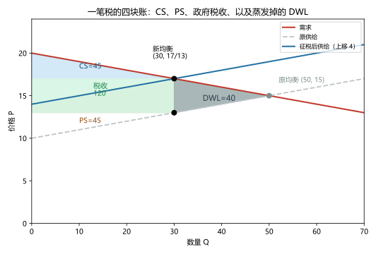
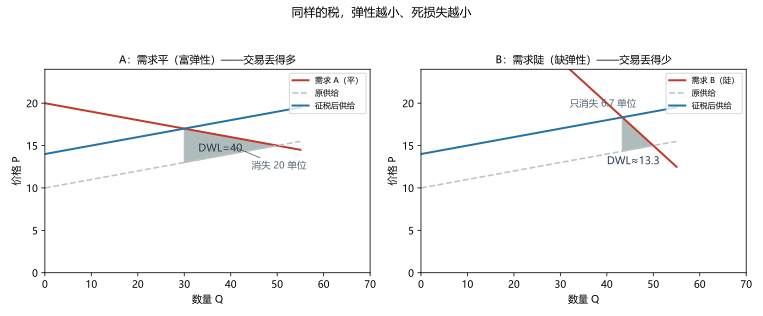
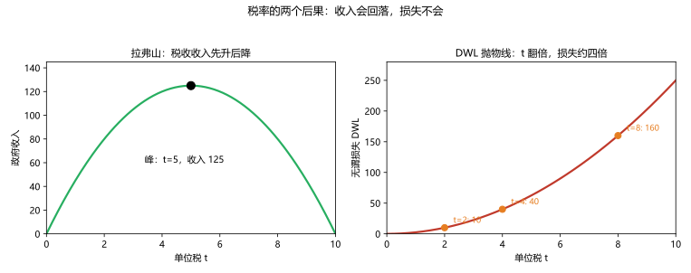

# 第 07 讲：赋税的代价

> **前置**：第 05 讲（税收楔子与税负归宿）、第 06 讲（CS/PS/总剩余账本）。
> **预计时间**：约 2.5 小时（含作业）。
>
> **一句话定位**：本讲是 05 讲的"下半场"——05 讲算清了"**谁掏钱**"，本讲算清"**社会亏多少**"：给蒸发掉的那部分正式命名（**无谓损失**），并搞清它随税率怎么生长（**平方律**），以及为什么"税率越高、收的税不一定越多"（**拉弗曲线**）。
>
> **本讲回答什么**：
> 1. 税收"从左手到右手"，凭什么说还额外亏一块？那块钱去哪了？
> 2. 四块账（CS、PS、税收、蒸发）怎么在一张图上看清？
> 3. 为什么税率翻倍、损失大约翻四倍？
> 4. 税率越高，税收收入一定越多吗？
>
> **这一讲有真实验证**：四方账本与损失拆解（脚本 `scripts/lec07-01_verify_tax_dwl.py` 实验 1–2）；税率扫描的平方律与拉弗峰值（实验 3）；弹性对 DWL 的对照（实验 4）。配图 3 张。

## 本讲怎么走（脉络图）

```
引子：接上 05 讲的那笔税——账还差一块
  │
  ├─ 1. 消失的交易：无谓损失登场
  ├─ 2. 一张图看清四块账（图 1）
  ├─ 3. 什么决定损失大小：弹性与"平方律"（图 3 + 扫描表）
  ├─ 4. 拉弗曲线：税率与税收收入（图 2）
  ├─ 5. 纪律与边界
  └─ 常见误区 → 本讲小结 → 掌握度自测 → 作业
```

> 下一站：§引子。把 05 讲那笔税拿回来，补上最后一块账。

---

## 引子：接上 05 讲的那笔税——账还差一块

第 05 讲，我们向一个市场收过一笔税：需求 $Q_d = 200-10P$、供给 $Q_s = 10P-100$，政府征 **$t = 4$** 的从量税。当时把"谁掏钱"算得明明白白：

- 无税均衡 $(50, 15)$；征税后：买者支付 $P_b = 17$、卖者到手 $P_s = 13$、**成交量从 50 缩到 30**；
- 买卖双方各扛 2 元的税（对称弹性，对半分）；
- 向谁征都一样（等价性）。

但有一笔账当时**被按下**了。请盯着这个细节：**成交量为什么从 50 缩到 30？** 那 20 笔"本来会发生的交易"，去哪了？

它们不在买家的口袋里，不在卖家的账上，也不在政府的收税单里——三方账本翻遍都找不到它们。**它们从社会账本上蒸发了。** 本讲的任务：把这块蒸发的账挖出来、量清楚、起名字，再看它随税率怎么长大。

---

## 1. 消失的交易：无谓损失登场

### 1.1 三方账本，一起演算（实验 1–2 实测）

用第 06 讲的账本口径把这个市场算全（脚本 `lec07-01` 实测）：

| 账户 | 无税时 | 征 $t=4$ 后 | 变化 |
|---|---|---|---|
| 消费者剩余 CS | 125 | 45 | **−80** |
| 生产者剩余 PS | 125 | 45 | **−80** |
| 政府税收收入 | 0 | **120** | +120 |
| **合计** | **250** | **210** | **−40** |

买卖双方各损失 80，政府收到 120——**两边加起来少了 40**。这 40 就是"蒸发"的那部分。它是怎么从"各损 80"里冒出来的？做个拆解（实验 2）：

| 每方的 80 损失 | 去向 | 金额 |
|---|---|---|
| 买家少掉的 CS | 税分摊：多付 2 元 × 30 单位 | **60（转给政府）** |
| | 被吓退的交易里损失掉的剩余 | **20（蒸发）** |
| 卖家少掉的 PS | 税分摊：少收 2 元 × 30 单位 | **60（转给政府）** |
| | 被吓退的交易里损失掉的剩余 | **20（蒸发）** |

**60 + 60 = 120 是"转移"**（从买卖双方口袋进政府口袋，社会总钱数没变）；**20 + 20 = 40 是"蒸发"**——对应那 20 笔被吓退的交易：它们每一笔的"买家 WTP 与卖家成本之差"本来是正的（平均 2 元/笔），税一插，这些差距不再够付税（$t = 4$），交易做不成了。**这些本可产生的价值，谁也没拿到——不是被谁拿走了，而是压根没有被创造出来。**

> **无谓损失（deadweight loss，缩写 DWL）：被税收"吓退"的交易本可产生的总剩余。** 有的书译作"福利净损失"，同一个概念。

三个"不是"钉一下：

- **不是"政府浪费"**：政府收的那 120 是清清楚楚的转移；DWL 是在政府收入**之外**、没人收到的那块；
- **不是"谁拿走了"**：它不在任何人的口袋里——它是"没被生产出来的价值"；
- **不是凭空玄学**：它精确等于消失区间的面积（下一节看图）。

顺便和 06 讲接个头：租金上限案里"消失的 375"和这里的 40 是**同一个族**——被政策（管制/征税）拦下的交易价值，学名都叫无谓损失。

### 1.2 考试口径的公式

线性供需下，DWL 恰好是一个三角形——**底 = 被吓退的数量 $\Delta Q$，高 = 单位税 $t$**：

$$DWL = \tfrac{1}{2} \times t \times \Delta Q$$

本讲主场景：$DWL = \tfrac12 \times 4 \times 20 = 40$ ✓（和账本演算对上了——两条路互为验算：账本减法 250−210 = 40，几何公式 ½×4×20 = 40）。

> 下一站：把那 40 块钱在图上"看"出来——四块账，四种颜色。

---

## 2. 一张图看清四块账（图 1）



> **图 1 怎么读**（四块颜色的对号入座）：
> - **浅蓝三角 = CS 45**：需求线下、买者支付价 $P_b = 17$ 之上；
> - **橙色三角 = PS 45**：卖者到手价 $P_s = 13$ 之下、供给线上；
> - **绿色矩形 = 政府税收 120**：宽度 = 成交的 30 单位、高度 = 楔子 $t = 4$（单价税）——**"楔子"就是这块矩形的高度**；
> - **灰色三角 = DWL 40**：夹在"需求线、原供给线、新均衡竖线（30 处）"之间——从成交量 30 到原来的 50，这 20 单位里"本可发生但被税拦下"的价值。
> 再对照两个关键点：新均衡处竖着一段 13→17 的黑线（楔子本体）；灰色三角的右顶点恰好落在**原均衡 (50, 15)** 上——被放弃的交易，最远延伸到市场原来停下的位置。

**看图报账三步**（之后做任何税收政策题都这么走）：

1. 找出**实际成交量**（税后的 Q）与两条价格 $P_b$、$P_s$；
2. 四块区域对号入座：CS（需求下、$P_b$ 上）、PS（$P_s$ 下、供给上）、税收（$t \times Q$ 矩形）、DWL（消失区间三角形）；
3. 报数并检验：**CS + PS + 税收 = 原 TS − DWL**（本场景：45 + 45 + 120 = 250 − 40 = 210 ✓）。

> 下一站：40 这个数不是固定的——税重一点、或市场脾气不同，它都会变。它到底被什么控制？

---

## 3. 什么决定损失大小：弹性与"平方律"

### 3.1 弹性：市场越"皮实"，损失越小（实验 4）

DWL 的本质是"被吓退的交易"——那么第一直觉就该是：**市场的供需越不容易被价格变化吓动，能吓退的就越少**。验证：在同一税率（$t=4$）下，把需求从"平缓"换成"陡峭"（脚本实验 4）：

| 市场 | 需求线形状 | 被吓退的量 $\Delta Q$ | DWL |
|---|---|---|---|
| A（原场景 $Q_d = 200-10P$） | 平缓（富弹性） | 20 | **40** |
| B（$Q_d = 80-2P$，同起点） | 陡峭（缺弹性） | 6.67 | **≈13.3** |



> **图 3 怎么读**：两个市场从同一个均衡点出发、被同样 $t=4$ 的税"插一刀"。左图（需求平）的灰色 DWL 三角明显更胖——税吓退了 20 单位交易；右图（需求陡）只有 6.7 单位被吓退，DWL 小得多。**税只对"边际上犹豫"的交易起作用：供需越缺乏弹性，犹豫的交易越少，能蒸发的就越少。**

两个极端情形（边界要认识）：

- **需求（或供给）完全无弹性（垂直线）**：$\Delta Q = 0$ → **DWL = 0**。税只发生"转移"（全落在跑不掉的那一方），一笔交易都不消失。（例：极端刚需品——这也是"对土地征税不扭曲行为"那类说法的底层逻辑。）
- **需求（或供给）完全弹性**：$\Delta Q$ 最大，DWL 最大。

注意和 05 讲的"归宿"拼在一起记：**缺乏弹性的一方，既承担更多的税（归宿），又让社会亏得更少（DWL）**——两句话是同一个"跑不掉"的两面。

### 3.2 平方律：税率翻倍，损失约四倍（实验 3）

现在固定市场（原场景），只动税率，扫描一遍（脚本实验 3 实测）：

| 单位税 t | 成交量 Q | 政府收入 | **DWL** |
|---|---|---|---|
| 2 | 40 | 80 | **10** |
| 4 | 30 | 120 | **40** |
| 6 | 20 | 120 | **90** |
| 8 | 10 | 80 | **160** |
| 10 | 0 | 0 | **250** |

盯着 DWL 那一列：$10 \to 40 \to 90 \to 160 \to 250$——它按 **$2.5t^2$** 生长。两个验证点：**$t$ 从 2 翻到 4，DWL 从 10 翻到 40（×4）；$t$ 从 4 翻到 8，DWL 从 40 翻到 160（还是 ×4）。**

> **平方律：税率翻倍，无谓损失约翻四倍。**（一般规律：$t$ 变为 $k$ 倍，DWL 约变为 $k^2$ 倍。）

为什么是平方？因为 $DWL = \tfrac12 t \cdot \Delta Q$ 里**两个因子都在随税长大**：

1. 楔子越高，**能吓退的交易越多**：$\Delta Q$ 本身与 $t$ 成正比（本场景 $\Delta Q = 5t$）；
2. 每少一笔交易，**被蒸发掉的剩余也越大**（税越高，被它拦下的交易里"WTP−成本"的差额常常越大）。

两个"与 $t$ 成正比"相乘 → 出现 **$t^2$**。这就是税这种政策工具的"脾气"：**温和时如温水，翻倍时重量级**。算术直觉：$t$ 涨 10%，DWL 约涨 $1.1^2 - 1 \approx 21\%$；$t$ 涨 10 倍，DWL 约涨 100 倍。

> 下一站：DWL 一路加速、没有回头路——但政府收入不这样。它有自己的山顶。

---

## 4. 拉弗曲线：税率与税收收入（图 2）

### 4.1 收入的两股力量

税率上调，政府的"每单抽成"变大，但"抽成的基数"（成交量）变小——政府的收入 $= t \times Q$，也是两个因子的拔河：

- 税还轻时：$t$ 涨得快、$Q$ 跌得慢 → **收入上升**；
- 越过某个点后：Q 摔得太快 → **收入反而下降**；
- 极端情形（本场景 $t=10$）：市场直接关停（$Q=0$）→ **收入归零**。

扫描数据（同一张表的"政府收入"列）：$80 \to 120 \to (峰) \to 120 \to 80 \to 0$——连续情形下峰值在 $t = 5$、收入 125。



> **图 2 怎么读**：左图是**拉弗曲线（Laffer curve）**——税收收入随税率先升后降的一座山：峰在 $t=5$（收入 125），两侧对称（拉弗山的两坡：两侧税率各收 120）。右图是 DWL 抛物线——它**没有山顶**，一路加速上升：$t=2$ 时 10、$t=4$ 时 40、$t=8$ 时 160。两图并排放在一起就是本讲最重要的一组对比：**收入会回头，损失不回头。**

### 4.2 一条必须配上的诚实声明

"税率过高时，降税反而能增加收入"（在峰的右侧）——这个**定性结论**是共识；但**现实经济此刻趴在峰的哪一侧、减税能不能真的增收**，是几十年真刀真枪的政策辩论（对"峰的位置"的估计依赖大量实证假设）。

所以正确的使用姿势：
- 考试/分析题：会用"收入 = t × Q、两股力量、山形/归零"这套机制作答；
- 现实讨论：把它当"往峰的两侧都要警惕"的分析框架，而不是"减税一定增收"的口号。

### 4.3 一个由平方律直接推出的政策常识

既然 DWL 按 $t^2$ 生长，那么"筹同样的钱"就有不同的代价：**把一个窄税基的高税率，换成一个宽税基的低税率**（同样是收 100 亿，税基扩大一倍、税率减半），DWL 大约只需原来的**四分之一**（税率因子 $(\tfrac12)^2$）。这就是财政学那句朴素共识的由来：**"宽税基、低税率"通常优于"窄税基、高税率"**。

> 下一站：本章收尾——给这本"税收账"标上使用说明书。

---

## 5. 纪律与边界

1. **DWL 只是税收代价的一部分**：除了"蒸发"，还有**行政负担**（征税与合规本身要烧钱）——那部分在第 10 讲（税制设计）细说。
2. **"市场本来就有效"是前提**：如果被征税的东西本身有**负外部性**（烟、碳、拥堵），税在"纠正扭曲、让消费减少"——这时本讲的 DWL 论证要**打折甚至反号**（课内说法：纠正性的税有"红利"）——第 09 讲专门处理。
3. **DWL 不回答"谁亏了"**：它是加总概念；"具体哪群人扛了多少"是 05 讲的归宿问题。两句配套用。
4. **语言纪律**：DWL 是"没有被创造出来的价值"，不是"被浪费掉的钱"、不是"政府的开支问题"。

---

## 常见误区（本节零新知识，只破误）

1. **"税的钱都被政府拿走了"**（§1.1）。错。政府只拿走"转移"部分（120）；另有 40 蒸发（CS、PS 各被蒸发 20、转移 60、原各 125）。
2. **"无谓损失是政府浪费造成的"**（§1.1、§5）。不是。它发生在税收收入之外，与政府怎么花这笔钱无关。
3. **"税率翻倍，损失也翻倍"**（§3.2）。错。约翻**四倍**（平方律）：10→40→160。
4. **"税定得越高，政府收入越多"**（§4）。错。收入是拉弗山：过峰回落、极端归零（本场景峰 $t=5$，$t=10$ 时收入 0）。
5. **"越缺弹性的商品，征税越是浪费"**（§3.1）。正好相反：缺弹性 → 被吓退的交易少 → **DWL 小**（但税更多落在跑不掉的一方身上——两件事别混）。
6. **"所有税收都必然有 DWL"**（§3.1、§5）。垂直供需的极端情形 DWL = 0；有负外部性的商品，税的"纠正红利"要单独算（第 09 讲）。

## 本讲小结

一页纸的骨架：

- **四方账**：征税后 CS↓、PS↓、政府↑，四者加起来比原来少一块——**少掉的这块 = DWL**（被吓退的交易价值，谁也没拿到）。
- **拆解公式**：每方损失 = 转移（税分摊 × 成交量）+ 蒸发；**$DWL = \tfrac12 \times t \times \Delta Q$**（线性、三角形）。
- **看图报账三步**：先定成交量与两价 → 四块区域对号 → 验证 CS+PS+税收 = 原 TS − DWL。
- **两个决定因素**：弹性（越缺弹性 DWL 越小；垂直时归零）与税率（**平方律**：翻倍 → 约 ×4）。
- **拉弗曲线**：收入 = $t \times Q$ 先升后降、极端归零；定性共识 vs 峰位辩论；**"宽税基、低税率"**的政策常识。
- **边界**：行政负担另计；负外部性商品另行处理（09 讲）；"谁亏"看 05 讲的归宿。

## 掌握度自测

- [ ] 我能复述四方账本的数字（125/125→45/45、税收 120、合计少 40），并解释"转移"与"蒸发"的区别。
- [ ] 我能把"每方 80 的损失"拆成"60 转移 + 20 蒸发"。
- [ ] 我能默写 $DWL = \tfrac12 t \Delta Q$ 并用它复核账本减法（40 = ½×4×20）。
- [ ] 我能在四区图上指认 CS、PS、税收、DWL 四块，并说出"楔子 = 税收矩形的高"。
- [ ] 我能用"边际上犹豫的交易"解释弹性与 DWL 的关系（含两个极端情形）。
- [ ] 我能复述平方律与它的双因子机制（ΔQ 与单项损失都随 t 增长）。
- [ ] 我能画出/描述拉弗曲线的形状与三个特征点（峰、双侧、归零），并给出"峰位辩论"的正确表态。
- [ ] 我能用平方律论证"宽税基、低税率"为什么通常更优。
- [ ] 我能说出 DWL 论证的两个前提边界（市场本来有效、排除行政负担）。
- [ ] 我能复跑 `scripts/lec07-01`，解释输出里每一个数字（40、60、120、10→40→160、t=5 峰……）。

## 作业

> 答案只能用**已教概念**（本讲范围：四方账、DWL 定义与公式、弹性影响、平方律、拉弗曲线；可复用 CS/PS/面积、税收楔子）。先独立做，再对答案。

### 基础

**Q1. 计算·一篇完整的税账**：某市场 $Q_d = 240-10P$；$Q_s = 10P-100$。

(1) 求无税均衡；
(2) 政府征 $t=4$ 的从量税：求 $P_b$、$P_s$、成交量；
(3) 计算无税时的 CS、PS；征税后的 CS、PS、政府收入；验证 DWL = 40。

**参考答案**：
(1) $240-10P = 10P-100 \Rightarrow 340 = 20P \Rightarrow P^* = 17$，$Q^* = 70$。
(2) 对称弹性：$\Delta P_b = t/2 = 2 \Rightarrow P_b = 19$；$P_s = 15$；$Q = 240-190 = 50$。
(3) 无税：CS = ½×70×(24−17) = **245**；PS = ½×70×(17−10) = **245**（反需求 $P = 24 - Q/10$）。
征税后：CS = ½×50×(24−19) = **125**；PS = ½×50×(15−10) = **125**；政府收入 = 4×50 = **200**。
DWL 复核：原 TS 490 −（125+125+200 = 450）= **40**；几何式 ½×4×ΔQ，$\Delta Q = 20$ → ½×4×20 = **40** ✓。

**Q2. 计算·平方律**：接 Q1，把税率翻倍到 $t = 8$。

(1) 求新的 $P_b$、$P_s$、成交量与 $\Delta Q$；
(2) 算新的 DWL 与政府收入；
(3) 与 $t=4$ 对比：DWL 是几倍？收入涨了还是跌了？

**参考答案**：
(1) $\Delta P_b = 4 \Rightarrow P_b = 21$、$P_s = 13$；$Q = 240-210 = 30$；$\Delta Q = 40$。
(2) DWL = ½×8×40 = **160**；收入 = 8×30 = **240**。
(3) DWL：40 → 160，**4 倍**（平方律：税率翻倍 → 损失约四倍）；收入：200 → 240——**只多了 20%**，且已逼近（未过）峰值区。（对照叙述：损失翻两番、收入小涨——"税翻倍"的账极不对称。）

**Q3. 图形判读·四区与楔子**：用文字描述"税收四区图"的画法与各区块含义（假设已知 $t$、$P_b$、$P_s$、$Q_税$、原均衡 $Q^*$）。

**参考答案**：
- 画需求线、原供给线、税后供给线（上移 $t$），标新均衡与两价：$P_b$（需求交点）、$P_s$（原供给线上）——两点之间竖"楔子"；
- CS = 需求线下、$P_b$ 上的三角（宽到头是 $Q_税$）；
- PS = $P_s$ 下、供给线上的三角；
- 税收 = 宽 $Q_税$ × 高 $t$ 的矩形（正处楔子下方）；
- DWL = 从 $Q_税$ 到 $Q^*$ 区间、夹在需求线与原供给线之间的三角（右顶点落在原均衡）；
- 验证：CS+PS+税收 = 原 TS − DWL。

### 提高

**Q4. 计算·弹性对照**：两个市场同起点 $(50, 15)$、供给同为 $Q_s = 10P-100$：A 的需求 $Q_d = 200-10P$（平）；B 的需求 $Q_d = 80-2P$（陡）。均征 $t = 4$。

(1) 分别求两市场的 $\Delta Q$ 与 DWL（B 允许写分数/近似）；
(2) 解释为什么 B 的 DWL 更小；
(3) 两个市场的"税负分摊比例"哪个更偏买方？（用 05 讲直觉口头判断，不必算）

**参考答案**：
(1) A：$\Delta Q = 20$，DWL = ½×4×20 = **40**。B：需求陡（系数 2）而供给（系数 10）相对平：$\Delta P_b = t \times 10/12 = 10/3$，$P_b = 55/3$；$Q = 80 - 2 \times 55/3 = 130/3$；$\Delta Q = 50 - 130/3 = 20/3 \approx 6.67$；DWL = ½×4×20/3 = **40/3 ≈ 13.33**。
(2) 税只"吓退边际上犹豫的交易"。B 的需求陡（缺弹性）——买家对价格不敏感，退税那点价格变化挪不动多少人，能够被吓退的交易更少 → DWL 更小。
(3) B 更偏买方：B 里买家的需求更缺弹性（跑不掉），按"谁跑不掉谁扛"的大头归买家。
验算：(1) 的 A 结果与主场景一致（40）；B 的 DWL 恰是 A 的 1/3。

**Q5. 辨析题**：判断对错并简说理由。

(a) "税收的钱最后都被政府拿走了，社会没损失。"
(b) "无谓损失是政府铺张浪费造成的。"
(c) "税率翻倍，无谓损失也翻倍。"
(d) "对完全缺乏弹性的商品征税不会损失交易，所以是'完美的税'。"（提示：只从 DWL 一个角度评）

**参考答案**：
(a) 错。政府拿走的只是"转移"部分；另有 DWL 蒸发（本讲主场景 40）。
(b) 错。DWL 发生在收入之外，与政府开支的用途无关（§1.1、§5）。
(c) 错。约翻四倍（平方律；§3.2）。
(d) 不完全对。垂直需求（极端缺乏弹性）下 DWL = 0 是真的；但"完美"要看评价标准：税负全部由买家承担（归宿问题）、且现实中几乎不存在"完全垂直"的需求。作为"DWL 口径"的评价它没问题，作为"完美税"的结论则超出这个口径。

**Q6. 简答**：请解释"为什么 DWL 随税率呈平方量级增长"（要求说清两个乘数）。

**参考答案**：
$DWL = \tfrac12 t \times \Delta Q$：
① 税率越高，楔子越高，被吓退的交易量 $\Delta Q$ 越大——$\Delta Q$ 与 $t$ 近似成正比（本场景 $\Delta Q = 5t$）；
② 同时，每少掉一笔交易，被蒸发的"WTP − cost"也越大（高税率才拦得住的交易，恰恰是价值差较大的那类，单个损失随 $t$ 增大）。
两个"与 $t$ 成正比"的因子相乘 → DWL 按 $t^2$ 增长；故 $t$ 翻倍、损失约 ×4。

### 综合（回扣本讲主任务）

**Q7. 综合·减税的两档交换比**：用 Q1 的市场（$Q_d = 240-10P$；$Q_s = 10P-100$），它有如下数据（可复用）：

| 税率 t | DWL | 政府收入 |
|---|---|---|
| 8 | 160 | 240 |
| 4 | 40 | 200 |
| 2 | 10 | 120 |

(1) 把税率从 8 降到 4：DWL 省多少？收入少多少？"每让出 1 元财政收入，换回多少元剩余（CS+PS）增加"？
(2) 再从 4 降到 2：同样的两个问题（交换比用近似值）；
(3) 一句话：为什么两次减税的"交换比"差这么多？（提示：峰在哪、平方律）

**参考答案**：
(1) DWL：160 → 40，**省 120**；收入：240 → 200，**让出 40**；CS+PS 增加 = 120 + 40 = **160**（净福利 +120 = DWL 减少量）。交换比 = 160/40 = **4 元剩余 / 1 元财政**。
(2) DWL：40 → 10，**省 30**；收入：200 → 120，**让出 80**；CS+PS 增加 = 30 + 80 = **110**。交换比 = 110/80 ≈ **1.375 元 / 1 元**。
(3) 先算本市场的拉弗峰：$Q(t) = 70-5t$，收入 $R(t) = t(70-5t) = 70t-5t^2$，峰在 $t = 7$（收入 245）。第一次减税（8→4）从**峰的右侧**跨回接近峰区：收入只让出 40，而高税区的 DWL 削减很大（160→40）——交换比 4:1。第二次减税（4→2）已深入**峰的左侧**：继续降税主要是"让财政流血"（让出 80），DWL 的削减已经很薄（40→10，只有 30），交换比掉到约 1.4:1。一句话：减税的"性价比"，取决你站在峰的哪一侧、税率还剩多高。
验算：(1)(2) 的"CS+PS 增加 = 省下的 DWL + 让出的收入"恒等式成立（160 = 120+40；110 = 30+80）。

**Q8. 简答·开放：宽税基、低税率**：政府计划筹集 100 亿元，两个方案：A——对少数几类商品征高税率；B——把税基扩大到几乎所有商品、每样征很低的小税率。用本讲工具说明 B 通常更优的理由（至少两条），并指出"通常更优"依赖什么前提。

**参考答案**：
1. **平方律的算术**：收同样的钱、税率减半而税基翻倍，DWL 大约变为原来的四分之一（$(\tfrac12)^2$）——总 DWL 是把各税基的损失相加，集中高税把平方惩罚集中在少数市场上，代价更大。
2. **边际交易更少被吓退**：低税率下，被推过"临界点"的边际交易少；窄税基的高税率往往逼迫人们绕过特定商品（替代、走私动机等行为扭曲更集中）。
3. 前提与保留：①"两方案收同样多钱"的对照框架；②公平维度不在本口径内（谁扛税、税制公平是第 10、16 讲的议题）；③若某些商品有负外部性，"给它们单独高税"可能反而是纠偏（第 09 讲）——所以"通常"二字要保留弹性。

---

*下一讲预告：第 08 讲《国际贸易》——本讲到今天为止的账本与工具，一直在一个"封闭市场"里打转。下一讲把大门打开：当"世界价格"进来，谁受益、谁受损、谁的声音最大？关税的两块无谓损失长什么样？"保护就业"的说法哪里对、哪里错？*