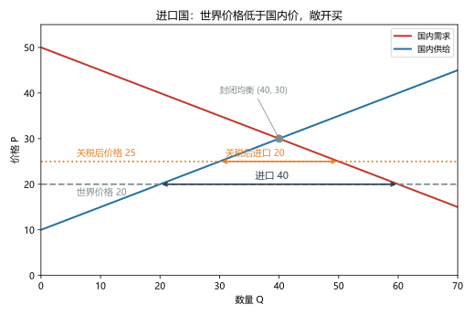
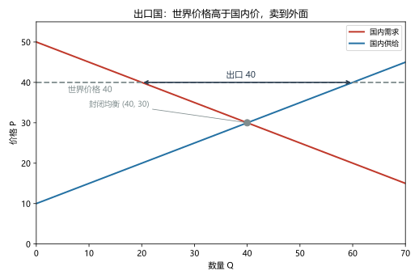
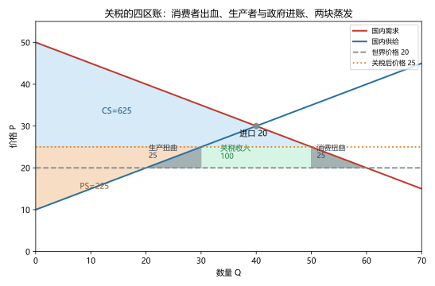

# 第 08 讲：国际贸易

> **前置**：第 02 讲（比较优势）、第 05–07 讲（税收、账本、无谓损失）。
> **预计时间**：约 2.5 小时（含作业）。
>
> **一句话定位**：第 07 讲留下一句"拿这杆秤去国际贸易上量关税"——本讲兑现它。这也是全课程把**赢家与输家**算得最细的一讲：自由贸易的总账、关税的四区账、以及"保护"这个词背后每一块钱的来龙去脉。
>
> **本讲回答什么**：
> 1. 一个国家什么时候是出口国、什么时候是进口国？
> 2. 为什么贸易让"总账"变好、却一定有人受伤？
> 3. 关税的福利怎么分解？它和 05/07 讲的税是什么关系？
> 4. "保护就业""国家安全""幼稚产业"……这些说法哪里对、哪里要打折扣？
>
> **这一讲有真实验证**：进口国三级账（脚本 `scripts/lec08-01_verify_intl_trade.py` 实验 1）；出口国镜像账（实验 2）；关税扫描（实验 3：收入峰与平方律复现）。配图 3 张。

## 本讲怎么走（脉络图）

```
引子：糖的门，开还是关？
  │
  ├─ 1. 世界价格与角色判定：进口国还是出口国
  ├─ 2. 自由贸易的账：蛋糕大了，但赢家输家分明（图 1、图 2）
  ├─ 3. 关税：把 05/07 的税工具搬到国门上（图 3）
  ├─ 4. 六种"保护"论点：逐个点评
  ├─ 5. 纪律与边界
  └─ 常见误区 → 本讲小结 → 掌握度自测 → 作业
```

> 下一站：§引子。"开门"这两个字，为什么让一拨人欢呼、另一拨人上街？

---

## 引子：糖的门，开还是关？

设想一个国家的糖市场：在没有贸易的年代（封闭市场），国内糖价稳定在 **30**（单位随意，机制为真）。而国门之外，世界市场上的糖价只有 **20**。

现在问题来了：**打开国门**（允许自由贸易）之后，会发生什么？

- 国内的**食品厂**（买糖的人）第一个反应过来："外面 20 就有，谁还买国内 30 的？"
- 国内的**糖农**（卖糖的人）第一个炸锅："我们的成本就要 20 多，被人 20 的糖一冲，全完了！"

门一开，国内糖价被"拽"向世界价 20。欢呼与哀嚎各占一半——**"保护"的呼声也随之而来**。本讲要做的，就是把这两拨人的输赢一笔一笔算清楚，然后回答那个每年都在新闻里反复出现的问题：政府出手"保护"，保护费是谁付的、值不值？

（说明：为了算得干净，接下来的数字用"线性供需"的构造例子——机制是真的，数字是简化的。糖只是个方便的名字。）

---

## 1. 世界价格与角色判定：进口国还是出口国

### 1.1 世界价格与小国假设

> **世界价格（world price）：一种商品在国际市场上的通行价格。**

一个**小国**（本国的买卖量不足以影响国际行情）面对世界价格的态度，和第 03 讲里"完全竞争市场的单个卖者"一样：**接受者**——它只能"照价参与"，影响不了世界价。

### 1.2 一条判定规则

把**世界价格**和**封闭均衡价**（没有贸易时国内自己碰出来的价格）放在一起比：

- **世界价 < 封闭价** → 外面更便宜 → 国门一开，便宜货涌进来 → 这个国家是**进口国**；
- **世界价 > 封闭价** → 外面更贵 → 国门一开，国内货往外卖 → 这个国家是**出口国**；
- 两者相等 → 开不开门一个样（没有贸易量）。

道理不需要背：**价差就是指挥棒**。外面便宜，买者就指向外面；外面贵，卖者就指向外面。本讲主场景（脚本设定）：国内 $Q_d = 100-2P$、$Q_s = 2P-20$，封闭均衡 $(40, 30)$：

- 世界价 **20**（< 30）→ 进口国（实验 1 的主角）；
- 世界价 **40**（> 30）→ 出口国（实验 2 的镜像）；
- 世界价恰为 30 → 无事发生。

---

## 2. 自由贸易的账：蛋糕大了，但赢家输家分明

### 2.1 进口国的三级账（实验 1）

先看"开门但还没动手保护"的纯自由贸易（世界价 20）。把它和封闭状态放在一起（脚本实验 1 实测）：

| | 国内价 | 成交量/贸易量 | CS | PS | TS |
|---|---|---|---|---|---|
| **封闭**（无贸易） | 30 | Q = 40 | 400 | 400 | 800 |
| **自由贸易**（世界价 20） | 20 | Qd = 60，Qs = 20，**进口 40** | **900** | **100** | **1000** |



> **图 1 怎么读**：国内供需交点 (40, 30) 是封闭均衡。灰色虚线是世界价格 20——它低于均衡价，于是：国内消费者沿着需求线滑到 Qd = 60、国内生产者沿着供给线缩到 Qs = 20，**中间那 40 单位的缺口就是"进口 40"**。价格从 30 掉到 20，谁赚谁亏一目了然：消费者剩余从 400 涨到 **900**（+500），生产者剩余从 400 跌到 **100**（−300），**总账 800 → 1000（+200）**。

### 2.2 出口国的镜像（实验 2）

把世界价换成 40（> 30），一切对称翻转：

| | 国内价 | 成交量/贸易量 | CS | PS | TS |
|---|---|---|---|---|---|
| **封闭** | 30 | Q = 40 | 400 | 400 | 800 |
| **自由贸易**（世界价 40） | 40 | Qd = 20，Qs = 60，**出口 40** | **100** | **900** | **1000** |



> **图 2 怎么读**：世界价格 40 高于封闭价 30，国内价被"抬"到 40：买者缩到 Qd = 20、卖者扩到 Qs = 60，**多出来的 40 单位就是"出口 40"**。这次是生产者大赚（PS 400 → 900）、消费者小亏（CS 400 → 100），总账同样 **+200**。

### 2.3 把两国的教训压成三句话

1. **自由贸易的总账必然为正**（本例 +200）：进口国的消费者赚到的大于生产者亏掉的；出口国反之——**但没有任何一种情形是"人人都赚"**；
2. **输赢的金额都很大**：+500/−300 这种量级说明了为什么贸易政治永远吵得凶——**受益者多而分散（每个消费者省一点）、受损者少而集中（一个行业饭碗全砸）**，后者的嗓门天然更大；
3. **它像技术进步**：总蛋糕变大 + 一些人的旧饭碗被打碎——社会的问题从来不是"要不要蛋糕"，而是"**怎么对待被砸掉饭碗的人**"（后文 §4、§5 反复回到这条）。

### 2.4 账本之外的四个好处（一句话各记一条）

总剩余只算了"同一批商品的价量账"，开放贸易还有账本外的红利：

- **品种更全**：小国不必只造"能造的那几种"；
- **规模经济**：面向世界市场，单个工厂可以造得更大更便宜；
- **竞争更强**：进口货是悬在本国垄断者头上的鞭子（第 13 讲会再算）；
- **思想与技术的流动**：贸易是知识传播的免费管道。

> 下一站：门开到一半的政策——关税。它是税、是墙、也是一台可计算的机器。

---

## 3. 关税：把 05/07 的税工具搬到国门上

### 3.1 机制：关税就是"对进口征的从量税"

> **关税（tariff）：对进口商品征收的税。**

在**小国假设**下（本国影响不了世界价），关税的机制干净得可以一句话说完：**国内价 = 世界价 + 关税 $t$**。世界价仍是 20，加 5 元关税 → 国内价被撑到 25——进口变得"没那么便宜"了。

### 3.2 三级账：把关税插进 §2.1 的表里（实验 1 实测）

| | 国内价 | 进口量 | CS | PS | 关税收入 | TS |
|---|---|---|---|---|---|---|
| **自由贸易** | 20 | 40 | 900 | 100 | 0 | **1000** |
| **关税 $t=5$** | 25 | **20** | **625** | **225** | **100** | **950** |

变化账：消费者 **−275**（900→625）；生产者 **+125**（100→225）；政府 **+100**；**总账 1000 → 950，净亏 50。**



> **图 3 怎么读**：世界价 20（灰虚线）被关税抬到国内价 25（橙点线）。四块颜色分别对应：**浅蓝 CS = 625**（消费者大出血）、**橙色 PS = 225**（国内生产者被"保护"着多卖了：供给从 20 扩到 30）、**绿色矩形 = 关税收入 100**（宽 20 的进口量 × 高 5 的税）、以及两块**灰色三角**——它们就是第 07 讲的**无谓损失**，在这里各有一个专用名字：
> - **生产扭曲 25**（左边那块）：国内那些"成本其实高于世界价"的生产者，被关税保护着硬是多生产了 10 单位——每一单位都在烧掉本可以省下的钱；
> - **消费扭曲 25**（右边那块）：消费者被高价吓退的那 10 单位——本来能以便宜的世界价消费，现在没了。
> 两块加起来 50——正是 §3.2 表里"净亏 50"。

### 3.3 "消费者那 275 去哪了"——一笔完整的分解

这是关税政治里最值得背下来的一笔账：

| 消费者损失的 275 | 去向 |
|---|---|
| **125** | 转移给国内生产者（多卖的 10 单位 × 5 元 + 原有 20 单位每单位多卖 5 元？——精确说：PS 从 100 增到 225 的全部增量） |
| **100** | 转移给政府（关税收入） |
| **50** | **蒸发**（两块无谓损失：生产扭曲 + 消费扭曲） |

一句话：**消费者每多花 1 元，真正"落到国内生产者手里"的只有大约 45 分；最阔的"中间商"是两个扭曲和一个税单。**

### 3.4 关税扫描：05/07 的工具原样复现（实验 3）

关税既然是从量税，那 05 讲的"归宿"、07 讲的"拉弗山与平方律"应当一字不差地重现。扫描一遍（脚本实验 3 实测）：

| 关税 t | 国内价 | 进口量 | 关税收入 | DWL |
|---|---|---|---|---|
| 0 | 20 | 40 | 0 | 0 |
| 2.5 | 22.5 | 30 | 75 | 12.5 |
| **5** | 25 | 20 | **100 ← 峰** | 50 |
| 7.5 | 27.5 | 10 | 75 | 112.5 |
| 10 | **30（=封闭价）** | **0** | 0 | **200** |

三个记号记下来：

1. **收入峰**在 $t=5$（收入 100）——拉弗山换了名字，形状没变；
2. **DWL $= 2t^2$**：$t$ 从 2.5 翻倍到 5，DWL 从 12.5 翻到 50（×4）；再翻倍到 10，50 翻到 200（×4）——**平方律原样复现**；
3. **$t=10$ 时进口归零**：关税把国家"打回自给自足"——保护效果的极限，代价就是**全部贸易收益（200）蒸发**（总账从 1000 跌回封闭的 800）。

### 3.5 一个边界：配额（知道有这回事）

**进口配额（import quota）**：不征税，直接限制进口数量。它的效果和等量关税**很像**（国内价同样被抬起来、进口同样变少），但有一个关键差别：**被抬价"截下来的那部分收益，归配额许可证的持有者，而不是政府**（谁拿到许可证谁收租）。所以同样的保护力度下，配额少了一份"政府收入"、多了一层"许可证怎么分"的寻租问题。本课程不展开配额计算，考试层一般也以关税为主。

> 下一站：账算完了，但"保护"从来不只是账本问题。六种论点逐个上场。

---

## 4. 六种"保护"论点：逐个点评

支持贸易保护的常见理由不止一种，值得逐一开药方——**每种论点都有它"对"的部分**（所以才能流行），关键是看清"对到哪里为止"：

| 论点 | 合理成分（对的部分） | 要打折扣的部分 |
|---|---|---|
| **1. 保护就业** | 被保护行业的岗位确实保住了 | 其他行业（出口、下游）岗位会丢、消费者买单（§3.3）；对方报复则多输；**净就业并不增加**——你是把岗位"转移"了，不是"创造"了 |
| **2. 国家安全** | 关键物资（能源、芯片、粮食）依赖潜在对手，是真实风险 | "关键"的标准极易被滥用——按此逻辑，什么都"关键"；且可用的替代方案（储备、多元化）常优于关税 |
| **3. 幼稚产业** | 理论上成立：若存在市场失灵（学习外部性、融资难），新兴产业确实可能"起步即夭折" | 现实里"谁算幼稚""保护到哪天"极难判定——**保护的孩子们常常长不大、断不了奶**；且工具上补贴往往优于关税 |
| **4. 不公平竞争**（对方倾销/补贴） | 对方若真在补贴，短期看是"对方的纳税人在给你发补贴"——你买到便宜货是**收礼** | 所谓"掠夺性定价（先低价挤垮你、再抬价）"在现实中极少成功——想抬价时，市场早已有无数新玩家等着进场；真正要防的是"以保护之名行常规保护之实" |
| **5. 谈判筹码** | 作为一种策略有现实空间：用"威胁保护"换对方开放市场 | 成王败寇；作为长期国策站不住（你认定它坏，却拿它当宝贝用）；且伤害是自伤式的 |
| **6. 保护文化的多样性/传统生活方式** | 情感与认同确有其价值 | 这是价值判断而非效率论证（第 06 讲的口径：规范 vs 实证）；若要维护，说清"谁来付、付多少"更诚实 |

**账本之外必补的一条**：自由贸易的"总账为正"**没有自动安置受损者**。受损行业的工人与老板是真实的人——"贸易调整援助"（补贴转岗、再培训、过渡救济）这类政策就是为了补这个缺口。教科书的标准立场因此是两句话：**不要关上门（总账会变小）；但要给被门撞到的人撑伞（分配问题不自动解决）。**

> 下一站：最后一节纪律。几个一出口就露怯的说法，先在这里拦下。

---

## 5. 纪律与边界

1. **"贸易赤字 = 吃亏"**——错。**贸易赤字（进口额 > 出口额）** 是宏观经济的记账结果（对应资本净流入的另一面），与"贸易是不是好事"用的根本不是一把尺子。一个人花钱多不等于亏——国家同理。赤字是宏观课的议题，本课程只需认得这个误区。
2. **小国假设的边界**：如果本国大到能影响世界价（大国），关税会**压低世界价**（外部世界也分担一部分）——理论上因此存在"最优关税"的讨论空间。但那是对着全球做"损人利己"的算盘，且引来报复、伤及长期合作——本课程不作展开，只标注它存在（中级国际经济学的领地）。
3. **"总账为正"与"人人受益"永远不是一个意思**：第 02、05、07 讲一路强调到今天——自由贸易的正确答案是"净收益 > 0 且分布不均"，两个半句都必不可少。

---

## 常见误区（本节零新知识，只破误）

1. **"进口多了，钱都流到国外，我们亏了"**（§2.1）。错。钱换回了货；从账本看，进口国消费者的所得（+500）大于生产者的所失（−300），总账为正。
2. **"关税是净赚的：保护了生产者又收税"**（§3.2–3.3）。错。漏掉了消费者的大头损失与两块 DWL——本讲主场景净亏 50（"每 275 元的消费者损失，只落地 125 元到生产者"）。
3. **"贸易赤字说明贸易吃亏"**（§5.1）。错。赤字是宏观记账概念，与贸易收益无关。
4. **"自由贸易对两国都好，所以人人受益"**（§2.3）。错。总账为正 ≠ 分布平均（本讲反复钉死）。
5. **"对方补贴，我们必须反击报复"**（§4-4）。至少要承认：对方的补贴在短期是给你送便宜的"礼物"；把"礼物"当炮弹反击，伤的是自己消费者。真正需要因应的往往是"本国受损行业怎么安置"。
6. **"关税越高，保护越彻底越好"**（§3.4）。错。DWL 按 $2t^2$ 爆炸；$t$ 顶到封闭价时，保护效果=自给自足，代价=全部贸易收益蒸发（本场景 200）。

## 本讲小结

一页纸的骨架：

- **判定**：世界价 < 封闭价 → 进口国；> → 出口国；= → 无贸易。
- **自由贸易三级账**（主场景）：进口国 CS 400→900、PS 400→100、TS 800→1000（+200）；出口国镜像（CS 100、PS 900）。**总账必正、输赢分明、受损集中。**
- **关税 = 对进口的从量税**：国内价 = 世界价 + $t$；三级账：消费者 −275、生产者 +125、政府 +100、**净 −50**；两块 DWL 命名：**生产扭曲** + **消费扭曲**。
- **消费者损失的分解**：125 到生产者、100 到政府、50 蒸发（约 45% 传递率）。
- **关税扫描**：收入峰 $t=5$（拉弗山）、DWL $= 2t^2$（平方律）、$t$ 顶到封闭价时贸易归零、全部贸易收益蒸发（200）。
- **配额**：效果类似关税，但"差价收益"归许可证持有者（寻租问题）——知道有这回事。
- **六论点点评**：就业（转移非创造）、安全（真实但易滥用）、幼稚产业（理论成立条件苛刻）、不公平竞争（补贴是礼物、掠夺定价罕见）、谈判筹码（策略能用、国策不行）、文化（价值判断，讲清谁付钱）。
- **边界**：赤字 ≠ 吃亏；大国假设另有故事（不展开）；总账为正 ≠ 人人受益——**关门不是答案，撑伞才是**。

## 掌握度自测

- [ ] 我能用"世界价 vs 封闭价"一眼判定进口国/出口国，并说出"价差就是指挥棒"。
- [ ] 我能复述主场景的三级数字（封闭 400/400/800；自贸 900/100/1000；关税 625/225/100/950），并解释 +200 与 −50。
- [ ] 我能在两张图上分别指出"进口 40"和"出口 40"是哪段距离，并说明 CS/PS 的变化方向。
- [ ] 我能写出关税下的两块 DWL（生产扭曲 + 消费扭曲）各自的机制，并算出主场景各 25。
- [ ] 我能完成"消费者 275 元损失"的三去向分解（125/100/50），并解释"传递率约 45%"的含义。
- [ ] 我能复述关税扫描的三个记号（收入峰、$2t^2$、归零=全部贸易收益蒸发 200）。
- [ ] 我能说出配额与关税的一个关键差别（差价归谁、寻租）。
- [ ] 我能对六个保护论点各说出一句"对在哪里、让步在哪里"。
- [ ] 我能解释"贸易赤字 ≠ 吃亏"为什么不是文字游戏。
- [ ] 我能复跑 `scripts/lec08-01`，解释输出里的每一个数字（40、900、100、625、225、100、50、12.5、200……）。

## 作业

> 答案只能用**已教概念**（本讲范围：世界价格与判定、自由贸易的三级账、关税机制与四区分解、两块 DWL、配额边界、六论点；可复用 CS/PS/DWL/账本）。先独立做，再对答案。

### 基础

**Q1. 计算·一篇完整的国际贸易账**：某国市场 $Q_d = 120-4P$；$Q_s = 4P-40$。

(1) 求封闭均衡与封闭时的 CS、PS、TS；
(2) 世界价为 15：判定角色；求自由贸易下的 Qd、Qs、进口量与 CS、PS、TS；
(3) 政府征收 $t=2$ 的关税（国内价 17）：求进口量与 CS、PS、关税收入、TS 及 DWL。

**参考答案**：
(1) $120-4P = 4P-40 \Rightarrow 160 = 8P \Rightarrow P^* = 20$，$Q^* = 40$。反需求 $P = 30-Q/4$、反供给 $P = 10+Q/4$：CS = ½×40×(30−20) = **200**；PS = **200**；TS = **400**。
(2) 15 < 20 → **进口国**。Qd(15) = 60；Qs(15) = 20；**进口 40**。CS = ½×60×(30−15) = **450**；PS = ½×20×(15−10) = **50**；TS = **500（+100）**。
(3) 国内价 17：Qd = 52；Qs = 28；**进口 24**。CS = ½×52×(30−17) = **338**；PS = ½×28×(17−10) = **98**；收入 = 24×2 = **48**；TS = **484**；DWL = 500−484 = **16**。
验算：DWL 两块各 8（½×8×2），合计 16 ✓。

**Q2. 计算·DWL 拆解**：接 Q1(3)：把 16 的无谓损失拆成"生产扭曲 + 消费扭曲"，并各用一句话说明"扭曲"的是什么。

**参考答案**：
- **生产扭曲 = 8**：国内产量从 20 被保护着扩到 28（多 8 单位），每单位的成本高于世界价——这部分"硬造出来"的生产在烧钱：½×8×2 = 8；
- **消费扭曲 = 8**：消费量从 60 被高价压到 52（少 8 单位）——本来能以便宜世界价消费的部分没了：½×8×2 = 8。
合计 16 ✓（= 关税 TS 损失）。

**Q3. 判定练习**：某国封闭均衡价为 20。分别判断世界价为 (a) 15、(b) 24、(c) 20 时的情形。

**参考答案**：
(a) 15 < 20 → **进口国**（外面便宜、进口）；
(b) 24 > 20 → **出口国**（外面贵、出口）；
(c) 20 = 20 → **无贸易量**：开不开门一个样（"门白开"）。

### 提高

**Q4. 计算·出口国镜像**：接 Q1 的市场（封闭 (20, 40)），若世界价为 24。

(1) 判定角色；求 Qd、Qs 与贸易量；
(2) 求自由贸易下的 CS、PS、TS，并与封闭对比；
(3) 一句话：这次"消费者"的角色与 Q1 里有什么不同？

**参考答案**：
(1) 24 > 20 → **出口国**。Qd(24) = 120−96 = 24；Qs(24) = 96−40 = 56；**出口 32**。
(2) CS = ½×24×(30−24) = **72**（原 200）；PS = ½×56×(24−10) = **392**（原 200）；TS = **464**（原 400，**+64**）。
(3) 出口国的消费者"输了"（CS 200→72）：在进口国（Q1）消费者是最大赢家——同一批人，站在世界价的哪一边，命运完全相反。
验算：(2) 的 CS 亦可用积分：∫₀²⁴(30−Q/4−24) = 144−72 = 72 ✓。

**Q5. 辨析题**：判断对错并简说理由。

(a) "进口让我们把钱拱手送给外国，是净损失。"
(b) "关税保护了国内生产者、政府又收了税，所以对国家是净赚。"
(c) "贸易赤字说明这个国家的贸易政策失败了。"
(d) "自由贸易让两国总账都变好，可见两国里的每个人都受益。"

**参考答案**：
(a) 错。钱换回了货；福利按账本算：进口国总账为正（主场景 +200）（§2.1）。
(b) 错。漏了消费者损失与 DWL：主场景净亏 50（消费者 −275 vs 生产者 +125、政府 +100）（§3.2）。
(c) 错。赤字是宏观记账概念（进口额>出口额），与"贸易是不是好事"无关（§5.1）。
(d) 错。总账为正 ≠ 人人受益（输赢分明：进口国生产者受损、出口国消费者受损）（§2.3）。

**Q6. 简答·两块扭曲**：用你自己的话，分别解释"生产扭曲"与"消费扭曲"为什么是无谓损失（提示：**它们都不在任何人手里**）。

**参考答案**：
- 生产扭曲：关税让国内价高于世界价，国内一些"成本高于世界价"的生产被硬撑起来（多生产的那部分）。这些生产的成本 > 世界能买到的价格——**多花掉的钱没有变成任何人的福利**，是真实烧掉的资源。
- 消费扭曲：关税把国内价抬高，一部分消费者（本来愿意以世界价购买）退出了——**这些没发生的交易里"WTP − 成本"的结余谁也没拿到**。
两者都符合 DWL 的定义：**被吓退（或被硬拉起来）的交易价值，不落在任何人的口袋里**。

### 综合（回扣本讲主任务）

**Q7. 综合·糖农的游说案**：回到本讲主场景（国内 $Q_d = 100-2P$、$Q_s = 2P-20$，封闭均衡 $(40, 30)$；世界价 20）。糖农协会游说政府征收 $t=5$ 的关税。

(1) 列出该关税的完整输赢清单（CS、PS、政府、TS 的变化金额）；
(2) "消费者每损失 1 元，有多少真正到了国内生产者手里？"（用全套分解回答）；
(3) 若关税加到 $t=10$（保护到"进口归零"）：列出新的金额账（对自贸基准），并说明"保护效果拉满"的代价是什么；
(4) 写两句"给政策制定者"的总结：一句效率视角、一句分配视角。

**参考答案**：
(1) CS：900 → **625（−275）**；PS：100 → **225（+125）**；政府：**+100**；TS：1000 → **950（−50）**。
(2) 消费者损失的 275 中：**125 转移给生产者、100 变成政府关税、50 蒸发**。落到生产者手里的传递率 = 125/275 ≈ **45%**；"每 1 元消费者支出，只有约 4 毛 5 真正变成糖农收益"。
(3) $t=10$：国内价 30 = 封闭价 → **进口归零**。CS = **400（−500）**；PS = **400（+300）**；政府 = **0**；TS = **800（−200）**。代价：**全部贸易收益蒸发**——国家被打回自给自足，且这次连关税收入都没了（进口量为 0）。
(4) 效率视角：关税把总账从 1000 压到 950（或 800）——不是"免费的保护"，而是**全体消费者给少数生产者凑钱、途中还要交一笔"蒸发费"**；分配视角："糖农是真的受损、不该被嘲笑——但正确的问题是**怎么补偿与转岗**（把 200 的贸易收益拿出一部分来兜底），而不是用一把效率为负的关税来解决分配问题。"
验算：(1)(3) 的所有数字与脚本实验数据同源；传递率与两块 DWL（25+25）自洽。

**Q8. 简答·开放：保护论点的判断框架**：请写一个"两问"框架，用来快速评估任何一条"应该保护 XX 产业"的主张。

**参考答案**：
**第一问：这里有没有真实的市场失灵？**（保护要成立，得先有"市场自己做不到"的理由）
- 是"关键安全依赖"且没有替代方案吗？（国家安全论的有效版）
- 是"学习外部性/融资约束导致新兴产业无法起步"吗？（幼稚产业论的有效版）
- 还是仅仅"我们暂时竞争不过"？（**竞争不过不是失灵**——比较优势原理下，这恰恰是专业化该发生的地方。）
**第二问：保护是应对这个失灵的最好工具吗？**（就算失灵存在，也要比较工具）
- 储备/多元化采购 vs 关税？（安全）
- 直接补贴研发/融资 vs 关税？（幼稚产业——补贴的 DWL 通常更小、更透明）
- 转岗援助 vs 关税？（就业——损失的是岗位，直接补偿比保价到"长不大"更对症）
两问都过，才值得考虑有限、限期、有退出机制的干预；任何一问不过，"保护"就该被打回原形——它不是解决分配失灵的万能药，也不是效率问题的免费午餐。

---

*下一讲预告：第 09 讲《外部性》——从这一讲起，账本要面对自己的盲区：有些交易的热闹与代价，会溅到"没上桌的人"身上（污染、噪音、疫苗、教育）。市场自己算不对的账，谁来记？庇古税、科斯谈判、可交易许可证——三种工具逐一亮相。*