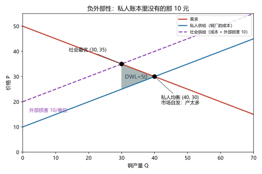
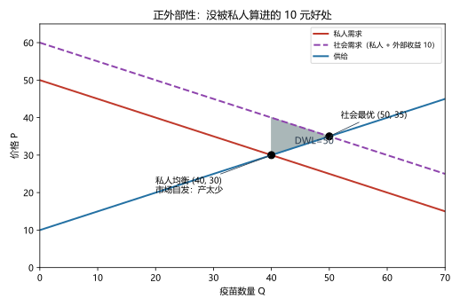
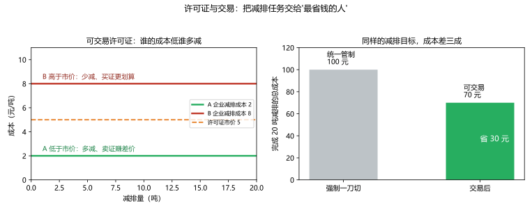

# 第 09 讲：外部性

> **前置**：第 05–08 讲（税收、账本、无谓损失、贸易账）。
> **预计时间**：约 2.5 小时（含作业）。
>
> **一句话定位**：前八讲的市场账本有一个隐藏前提——"交易只关买卖双方的事"。本讲把这个前提掀开：有些交易的成本和好处会**溅到没上桌的人身上**。账本怎么补记？补账的三种工具（税、谈判、许可证）各管哪一片天？
>
> **本讲回答什么**：
> 1. 外部性到底让账本"漏"了什么？
> 2. 漏账让市场差了多少——能算出来吗？
> 3. 庇古税凭什么"刚刚好"？税率怎么定？
> 4. 科斯说"不用政府也能解决"——对到什么程度？许可证又解决什么？
>
> **这一讲有真实验证**：私人均衡 vs 社会最优的完整账（脚本 `scripts/lec09-01_verify_externality.py` 实验 1）；庇古税矫正（实验 2）；正外部性补贴（实验 3）；许可证交易的成本对照（实验 4）。配图 3 张。

## 本讲怎么走（脉络图）

```
引子：钢厂与渔村——账本外面的那本账
  │
  ├─ 1. 外部性与"漏记的账"
  ├─ 2. 距离有多远：私人均衡 vs 社会最优（图 1）
  ├─ 3. 工具一：庇古税与补贴——把漏账塞回决策者面前（图 2）
  ├─ 4. 工具二：私人解决与科斯定理
  ├─ 5. 工具三：可交易许可证与三工具选型（图 3）
  ├─ 6. 纪律与边界
  └─ 常见误区 → 本讲小结 → 掌握度自测 → 作业
```

> 下一站：§引子。一条河边的两家人，和一吨钢的"暗账"。

---

## 引子：钢厂与渔村——账本外面的那本账

一条河边住着两家人：**钢厂**和**渔村**。

钢厂每生产一吨钢，烟尘就落进河里，鱼少三成——折算下来，**每吨钢给渔村造成 10 元的损失**。而钢厂的成本单上写着：矿石、电费、人工——**没有"渔村"这一项**。烟尘不进钢厂的账。

于是市场按"钢厂的账"照常运转：钢的供需碰出了均衡，每天产 **40 吨**。但如果把渔村拉进账本、按"社会的真账"重算一遍——最合适的产量是 **30 吨**。也就是说：**市场自发多产了 10 吨**。

这多出来的 10 吨是怎么"错"的？谁来纠正、用什么工具纠正？本讲给出后两个问题的三件工具：**税**、**谈判**、**许可证**。先看第一个问题：账本到底漏在哪。

---

## 1. 外部性与"漏记的账"

### 1.1 定义与分类

> **外部性（externality）：一个人的行为对旁观者福利的影响，而且这种影响不通过价格机制传导。**

定义里有两个要件，缺一不可（第 6 节还会用它拦下滥用）：

1. **真实的福利影响**（不是"我看不惯"）；
2. **不走价格**：受影响的第三方没有"买"也没有"卖"——没有交易、没有发票、没人问过他愿不愿意。

外部性分四格（考试让你分类，照这张表打勾）：

| | **负外部性**（成本溅出去） | **正外部性**（好处溅出去） |
|---|---|---|
| **生产** | 工厂排污、夜间施工噪音 | 养蜂场（顺路给邻家果园授粉）、研发溢出 |
| **消费** | 二手烟、深夜摩托"炸街" | 疫苗接种、教育、收拾自家院子 |

### 1.2 漏账的两本"社会账"

把"漏记的第三本账"补上，得到两个新概念：

> **社会成本 = 私人成本 + 外部成本**（负外部性）；**社会价值 = 私人价值 + 外部收益**（正外部性）。

用它翻译两类错误：

- **负外部性**：决策者只面对私人成本 → 他眼中的"便宜"是社会的"贵" → **产量过多**（钢厂只算矿石电费，没算渔村）；
- **正外部性**：决策者只面对私人价值 → 他眼中的"不值"是社会的"值" → **产量过少**（你打疫苗只考虑自己防病，没算替邻居挡了传染）。

治疗的方向也就顺理成章——**内部化（internalize）**：

> **让决策者面对"社会"的那本账**——多出来的成本要他出，溅出去的好处给他补。

下面的三节，就是这个思路的三条实现路径。

---

## 2. 距离有多远：私人均衡 vs 社会最优（图 1）

### 2.1 主场景的数字账（实验 1）

钢市场（脚本设定）：需求 $P = 50 - Q/2$；钢厂的私人供给 $P = 10 + Q/2$；外部损害 10 元/吨（即社会供给 $P = 20 + Q/2$）。把两种账本并排算（脚本实验 1 实测）：

| | 成交量 | 价格 | 渔村的外部损害 | **社会净福利** |
|---|---|---|---|---|
| **市场自发**（按私人账） | 40 吨 | 30 | 400 | **400** |
| **社会最优**（按完整账） | 30 吨 | 35 | 300 | **450** |

**账算错的代价：450 − 400 = 50**——这就是外部性造成的无谓损失（DWL）。



> **图 1 怎么读**：红线（需求）与蓝线（私人供给）交于 (40, 30)——这是市场自发的产量。紫色虚线是**社会供给**（私人成本 +10 元的每条供给线整体上移）。它与需求的交点 (30, 35) 就是社会最优。灰色三角 = **DWL 50**：从 30 吨到 40 吨的"多出来的产量"里，每一吨的**外部损害（10 元）超过了它创造的净价值**（电厂的边际赚头从 10 元一路降到 0）——求和正好是 ½×10×10 = 50。

### 2.2 一个必须先钉死的辨析：外部损害 ≠ 无谓损失

盯着表里两个数别混：

- **渔村的外部损害是"400"**（市场自发时）——这不是 DWL；
- **DWL 是"50"**——两份账本社会净的**差额**。

为什么？因为钢本身有价值：社会最优里也保留 30 吨钢、渔村照样受害 300——**这 300 是"有价值的产出在为自己的成本付账"**，不是浪费。真正错账的代价，只是"多产那 10 吨"里超出价值的部分（50）。

> 考试提醒：题问"外部性造成的无谓损失"→ 答差额（本例 50）；问"外部损害/外部成本"→ 答总量（400 或 300，看问哪个状态）。两个口径写混，是本章最高频的失分点。

> 下一站：把"那 10 元"塞回钢厂面前的工具，第一件——庇古税。

---

## 3. 工具一：庇古税与补贴——把漏账塞回决策者面前

### 3.1 庇古税

> **庇古税（Pigouvian tax）：针对产生负外部性的活动征收的税，税率等于边际外部成本。**

听起来和第 05 讲的"从量税"是同一台机器——是的，机制完全一样，**只是目的不同**：普通税是为"筹钱"，庇古税是为"纠偏"；它的靶心不是收入，而是**改变行为**。

回到主场景：边际外部成本 = 10 元/吨，那就**征 10 元/吨**。税一落，钢厂的每吨成本从"私人成本"变成"私人成本 + 10"——正好等于社会成本。市场会发生什么（脚本实验 2 实测）？

- 税后供给曲线恰好与**社会供给曲线重合**；
- 新均衡自动落到 **(30, 35)**——正是社会最优点；
- 买者支付 35、卖者到手 25（税 10）；
- 税后账：CS 225、PS 225、政府税收 300、渔村损害 300 → **社会净 450**，完全回到最优。

> **"刚刚好"的原理一句话**：税让决策者面对的私人账 + 税 = 社会账——他自利地最优，恰好就是社会最优。这正是"看不见的手"被漏账卡住后，用税把它接回去。

**税率的现实难点（诚实声明）**：理论一句"税率=边际外部成本"，现实里"边际外部损害值多少"极难估——比如碳的"社会成本"到底每吨多少，学界给出的范围宽得惊人（这直接决定了碳税该定多高，也解释了为什么碳税政策全球步调不一）。**考试按"税率=边际外部成本"作答；现实讨论时，记得给这个数字留一个误差范围。**

### 3.2 正外部性对称：补贴

正外部性（溅出去的是好处）方向相反：**边际外部收益 = 10 → 每单位补贴 10**（或者等价地说，让买家实际少付 10、让社会价值进入他的账）。看疫苗场景（脚本实验 3 实测）：

- 私人均衡：$Q = 40$（私人需求与供给的交点）；
- 社会最优：社会需求（私人 + 10）与供给的交点 $Q = 50$；
- 补贴 10 后：市场落到 50——买家实付 25、卖家收到 35；
- 社会净：**1200 → 1250**（+50）。



> **图 2 怎么读**：红线（私人需求）与供给交于 (40, 30)——市场自发产量。紫色虚线是**社会需求**（私人价值 +10 元好处），它与供给交于 (50, 35)——社会最优。灰色三角 = **DWL 50**：从 40 到 50 的"没发生的交易"里，每一单位的**社会价值超过成本**，白白错过。补贴 10 后，市场从 40 挪到 50——**把没发生的交易请回来**。

（现实的补贴例子：疫苗、基础研究、义务教育、旧楼加装电梯——逻辑都是"你做的事社会沾光，全社会帮你分担一点成本"。）

> 下一站：政府不是唯一解——两家自己坐下谈谈，行不行？

---

## 4. 工具二：私人解决与科斯定理

### 4.1 私人解决的四种形态

在政府出手之前，外部性常被"私了"：

1. **道德规范与慈善**：公共场合不喧哗、给开源项目捐款；
2. **合并**：把两家人变成一家人——**钢厂直接买下渔村**（或者两家并成一个集团）——外部性"吃进"同一张账本，自动内部化；
3. **合约**：双方签一份把外部性价格化的协议（本节的谈判）；
4. **产权界定**：把"看不见的权利"变成可交易的资产（第 5 节许可证的近亲）。

### 4.2 科斯定理：一个反直觉的结论

> **科斯定理（Coase theorem）：如果交易成本为零、产权清晰，那么相关各方可以自己谈判解决外部性——而且（从效率上看）结果与产权归谁无关；产权只决定"好处怎么分"。**

用主场景谈判演示：需要钢厂从 40 吨减产到 30 吨（减 10 吨）：

- **渔民的收益**：损害减少 10 吨 × 10 元 = **100 元**；
- **钢厂的代价**：减产 10 吨放弃的净赚头（边际赚头从 0 到 10 递减）合计 = **50 元**；
- 社会的净好处：100 − 50 = **50** ✓（正好是 DWL 被消除）。

于是双方有得谈，**支付区间是 [50, 100]**——任何落在这个区间的数目，都让双方比"不谈"更好：

- **产权归渔民**（享有"清水权"）：钢厂要么自己减产，要么**付钱买"污染许可"**——它最多愿付 100（否则不如自己减），渔民至少收 50（否则不如不让步）——成交价落在 [50, 100]；
- **产权归钢厂**（享有"排放权"）：渔民凑钱"收买"钢厂减产——渔民最多出 100、钢厂至少收 50——同样的区间。

**两个版本的结果：产量都到 30（效率相同）、但钱的方向和金额不同（分配不同）。** 这就是科斯定理的两个半句，考试问"科斯定理说了什么"要答全。

### 4.3 交易成本：科斯定理的"保质期"

科斯定理有一个大前提：**交易成本为零**。现实中谈判有成本——人一多，搭便车、扯皮、律师费全来了：一条河的渔民有几千户，"凑钱收买钢厂"根本组织不起来（谁来牵头？搭便车怎么破？）。所以：

- **科斯定理是"基准"，不是"政策"**：它说明"政府不是唯一解、产权安排本身就是工具"；
- 从而得到选工具的**第一条经验法则**：**参与者少、产权可界定 → 私人谈判可行；参与者成千上万（大气、公海）→ 谈判没戏，需要税/许可证这类"不用谈判"的工具**。

> 下一站：第三件工具——把"总量"和"谁减"拆开处理的那件。

---

## 5. 工具三：可交易许可证与三工具选型

### 5.1 可交易许可证

> **可交易许可证（cap and trade）：政府先给污染/排放**定一个总量上限**（cap），再把许可证发给企业，并**允许它们互相买卖**（trade）。

它解决一个税解决不了的难题：**各家企业减排的"本钱"不一样**。看两家的例子（脚本实验 4 实测）：

- 企业 A：减排成本 **2 元/吨**（设备早就老化，顺手就减）；
- 企业 B：减排成本 **8 元/吨**（工艺难改，减一吨肉疼）；
- 政府的目标：总量上减 **20 吨**。

**方案一（一刀切管制）**：各减 10 吨——成本 $2×10 + 8×10 =$ **100 元**。
**方案二（许可证交易）**：许可证市价落在 5 元（2 < 5 < 8）：

- **A 发现**："我多减一吨只花 2 元，把省下的许可证按 5 元卖掉——净赚 3 元" → A 加码减排 15 吨、卖证；
- **B 发现**："我自己减一吨要 8 元，买一张证才 5 元——买证更划算" → B 只减 5 吨、买证；
- **总减排量不变（15 + 5 = 20 吨）**，总成本 = $2×15 + 8×5 =$ **70 元**——**省 30 元（30%）**。



> **图 3 怎么读**：左图是两家的减排成本（两条水平线）与许可证市价（虚线）。**谁的成本低于市价，谁就多减、卖证；谁的成本高于市价，谁就买证**——市场的自我筛选把减排份额自动分给了"最省钱的人"。右图是总成本对比：同样的 20 吨目标，一刀切 100 元 vs 交易后 70 元。

### 5.2 三件工具的对照表（本章总收拢）

| 工具 | 政府定什么 | 市场定什么 | 关键信息要求 | 经典适用 |
|---|---|---|---|---|
| **管制**（一刀切） | 每家企业怎么做 | 没什么市场可言 | 政府要懂各家的技术与成本 | 危险物质、简单可控小场景 |
| **庇古税** | **价格**（税率 = 边际外部成本） | **数量**（市场自己减到哪） | 要估准边际外部损害 | 面广、分散的排放（碳税） |
| **许可证** | **数量**（总量 cap） | **价格**（证价由供需碰出） | 要定准总量 | 点数有限、成本差异大的行业 |

一句考试最爱考的对照：**税是"定价格、市场定数量"；许可证是"定数量、市场定价格"。**

两个补充（知道有这回事）：

- **效率与分配分离**：三种工具（只要总量等价）**效率上可以到达同一个量**；差的是"钱怎么分"——许可证**免费发给谁**、税收**由谁缴**，全是分配问题（呼应 05 讲的归宿——工具的"名义"不决定"实际"）。
- **现实混搭**：碳税与碳交易的世界里两派并存，不同国家不同选择——因为"总量看得见"（许可证讨喜）与"价格看得见"（税的确定性讨喜）各有政治与技术偏好。

> 下一站：本章收尾——几条边界与一记防滥用警告。

---

## 6. 纪律与边界

1. **"外部性"不是万能筐**：回到定义的两个要件——**真实的福利影响 + 不走价格**。"我不喜欢你穿的衣服""你发财了我不高兴"都不是外部性。滥用这个词会让"矫正式政策"变成"一切看不惯都可以征税"。
2. **政府也会失灵**：政府出工具不等于问题解决——信息（税率准不准、总量怎么定）、能力、被利益集团俘获（"管制俘获"）都是真实风险。"市场失灵"只是"政府出手的必要条件"，不是"充分条件"。
3. **科斯定理的适用区**：参与者少、产权可界定、交易成本低——千万人级别的问题（大气、公海）几乎不可能靠谈判，这正是税与许可证的领地。
4. **与 05/07 讲的合龙**：现在可以回头把那两句"边界"说圆了——第 05 讲说"负外部性商品的税另有逻辑"，第 07 讲说"DWL 论证要打折甚至反号"。本章给出完整说法：**在本来有效的市场上收税 → 制造 DWL（05/07 讲）；对负外部性的活动收税 → 矫正 DWL——税在"纠偏"时，收益方正是被它拉回来的那些交易。**

---

## 常见误区（本节零新知识，只破误）

1. **"外部损害就是无谓损失"**（§2.2）。错。损害可能是几百（总量），DWL 只是两份账本社会净的**差额**（本例 50）——外部损害不是"浪费"，其中大部分是"有价值产出在为自己的成本付账"。
2. **"有外部性 → 必须政府出手"**（§4）。不必然。参与者少、产权可界定、交易成本低时，私人谈判（科斯）能解决；政府工具是大规模场景的主场。
3. **"科斯定理说政府永远不用管"**（§4.3）。错。它的大前提是"交易成本为零"，现实常常不满足；它的正确用法是提醒"产权安排本身就是工具"。
4. **"庇古税就是为了收钱"**（§3.1）。错。它为了**纠偏行为**，收入只是副产品；税率锚在"边际外部成本"，不是"财政需要"。
5. **"许可证制度就是'把污染权卖了'"**（§5）：不准确。环境结果由 **cap（总量）** 决定——总量封顶才叫治理；**trade** 的作用只是把减排份额配置给"最省钱的人"。把两件事混为一谈，既误读治理力度，也误判成本。
6. **"我不喜欢的行为都算外部性"**（§6.1）。错。必须满足"真实福利影响 + 不走价格"两个要件。

## 本讲小结

一页纸的骨架：

- **外部性 = 不通过价格传导的第三方福利影响**；四格分类（负/正 × 生产/消费）。
- **漏账的修正**：社会成本 = 私人 + 外部；负外部性 → 市场**过多**；正外部性 → 市场**过少**；目标是**内部化**。
- **距离的量**（主场景）：私人 (40, 30) 社会净 400 vs 社会最优 (30, 35) 净 450——**DWL = 50 = ½×10×10**；**外部损害（400/300）≠ DWL（50）**。
- **工具一（庇古税/补贴）**：税率 = 边际外部成本（本例 10）→ 市场自发落到社会最优；税后账 225/225/300/300、净 450 ✓；正外部性用等额补贴（1200 → 1250）。
- **工具二（科斯）**：交易成本为零 + 产权清晰 → 私人谈判达有效结果；**效率与产权归属无关、分配有关**；谈判区间 [50, 100]；交易成本一上来，适用范围收缩到"人少、权清"。
- **工具三（许可证）**：cap 定环境结果、trade 配成本；20 吨目标的成本 100 → 70；**税定价格、许可证定数量**；效率与分配分离。
- **边界**：外部性两要件；政府也会失灵；科斯的适用区；与 05/07 的"纠偏税 vs 敛财税"合龙。

## 掌握度自测

- [ ] 我能背出外部性定义的两个要件，并给四格分类各举一例。
- [ ] 我能写出"社会成本 = 私人 + 外部"，并解释负/正外部性下市场产量的偏差方向。
- [ ] 我能复述主场景两份账（400 vs 450）与 DWL 50 的几何算法（½×10×10）。
- [ ] 我能清晰地区分"外部损害"与"无谓损失"两个口径（含各自数字 400/300 与 50）。
- [ ] 我能说清庇古税"税率=边际外部成本"为什么让市场自发落到社会最优，并算税后四方账（225/225/300/300）。
- [ ] 我能把正外部性的补贴逻辑对称地讲一遍（40 → 50、1200 → 1250）。
- [ ] 我能完整复述科斯定理（两个半句），并用 [50, 100] 谈判区间分别演算两种产权归属。
- [ ] 我能说出交易成本如何收缩科斯的适用范围（人少权清 vs 大气公海）。
- [ ] 我能解释 cap 与 trade 各管什么，并复算 100 → 70 的成本节约。
- [ ] 我能复跑 `scripts/lec09-01`，解释输出里每一个数字（400、450、50、225、300、1200、1250、100、70……）。

## 作业

> 答案只能用**已教概念**（本讲范围：外部性定义与分类、私人/社会账、DWL、庇古税/补贴、科斯定理与交易成本、许可证与三工具对照；可复用账本/税工具）。先独立做，再对答案。

### 基础

**Q1. 计算·一篇完整的外部性账**：某工厂市场 $Q_d = 120-2P$；$Q_s = 2P-40$；每单位生产造成外部损害 6 元。

(1) 求市场自发均衡（私人账）；
(2) 求社会最优（社会供给 = 私人 + 6）；
(3) 计算外部性造成的 DWL；
(4) 庇古税应定为多少？税后市场落点在哪里？
(5) 对账：私人均衡与社会最优的社会净福利各是多少？

**参考答案**：
(1) $120-2P = 2P-40 \Rightarrow P^* = 40$，$Q^* = 40$（私人均衡）。
(2) 反需求 $P = 60-Q/2$；社会供给 $P = 26+Q/2$（私人 $20+Q/2$ 上移 6）：$60-Q/2 = 26+Q/2 \Rightarrow Q = 34$，$P = 43$。
(3) DWL = ½×6×6 = **18**（超额产量 40−34 = 6，外部成本 6）。
(4) 庇古税 = 边际外部成本 = **6 元**；税后市场自发落到 **(34, 43)**。
(5) 私人均衡：CS = ½×40×(60−40) = 400；PS = ½×40×(40−20) = 400；外部损害 = 240 → 社会净 = **560**。
社会最优（税后口径）：CS = ½×34×(60−43) = 289；PS（到手 37）= ∫₀³⁴(37−20−q/2) = 289；税 = 6×34 = 204；外部 = 204 → 社会净 = 289+289+204−204 = **578**。
差额 578 − 560 = 18 ✓（与 (3) 互相验证）。

**Q2. 辨析·两个口径**：接 Q1：(a) 私人均衡下的"外部损害 240"是不是无谓损失？(b) 那"18"是什么？(c) 社会最优下外部损害还有多少，说明什么？

**参考答案**：
(a) 不是。240 是总量口径的外部损害；其中大部分是"有价值的生产在为自己的成本付账"。
(b) 18 是**两份账本社会净的差额**——外部性造成的无谓损失（账算错的代价）。
(c) 社会最优下外部损害仍有 204（6×34）——说明矫正的目标不是"消灭损害"，而是"把损害控制在'价值高于成本'的产量上"。

**Q3. 分类**：判断四种情形是"负/正 × 生产/消费"中的哪一格：(a) 工厂排污；(b) 二手烟；(c) 养蜂场给邻家果园授粉；(d) 疫苗接种。

**参考答案**：(a) 负·生产；(b) 负·消费；(c) 正·生产；(d) 正·消费。

### 提高

**Q4. 计算·正外部性**：某市场 $Q_d = 100-2P$；$Q_s = 2P-20$；每单位消费带来外部收益 10 元。

(1) 求私人均衡；
(2) 求社会最优（社会需求 = 私人 + 10）；
(3) 补贴应定为多少？补贴后买家实付、卖家实收各是多少？
(4) 社会净福利从多少提高到多少？

**参考答案**：
(1) $100-2P = 2P-20 \Rightarrow P^* = 30$，$Q^* = 40$。
(2) 反需求 $P = 50-Q/2$，社会需求 $P = 60-Q/2$；$60-Q/2 = 10+Q/2 \Rightarrow Q = 50$，$P = 35$。
(3) 补贴 = 边际外部收益 = **10 元**；落点 50 单位：**卖家实收 35、买家实付 25**。
(4) 私人均衡：CS 400 + PS 400 + 外部收益 400 = **1200**；最优：CS 625 + PS 625 + 外部收益 500 − 补贴支出 500 = **1250**（+50）。

**Q5. 简答·科斯谈判**：用主场景（减产 10 吨：渔民收益 100、钢厂代价 50）回答：

(1) 两种产权归属下，谈判的"支付方向"和"支付区间"各是什么？
(2) 两种归属下，最终产量相同吗？谁分到的好处不同吗？
(3) 列举一个会让这场谈判破裂的现实因素。

**参考答案**：
(1) 产权归渔民：钢厂向渔民**买**"污染许可"，价格落在 **[50, 100]**；产权归钢厂：渔民**凑钱收买**钢厂减产，价格同样落在 **[50, 100]**。
(2) 产量都到 30 吨（效率结果与产权无关）；但"谁掏钱、掏多少"不同（分配结果与产权有关）——这正是科斯定理的两个半句。
(3) 交易成本：渔民有几千户时，组织、搭便车、律师费会让谈判破裂（→ 转向政府工具）。

**Q6. 计算·许可证**：两家企业：A 减排成本 3 元/吨、B 为 9 元/吨；目标减排 20 吨。

(1) 一刀切（各减 10）的总成本；(2) 许可证可交易（市价 6）时，A、B 各减多少？总成本多少？
(3) 与 (1) 相比省了多少？为什么 6 元的证价能让双方都满意？

**参考答案**：
(1) $3×10 + 9×10 =$ **120 元**。
(2) 市价 6 落在两家成本之间：A 多减（15 吨）、B 少减（5 吨）；总成本 $3×15 + 9×5 =$ **90 元**。
(3) 省 **30 元（25%）**。A 减一吨只花 3 元、卖证得 6 元（净赚 3）；B 买证花 6 元、自减要 9 元（净省 3）——**所有成本低于证价的想卖、高于的想买，交易自动把减排分给最省钱的人**。

### 综合（回扣本讲主任务）

**Q7. 综合·工具选型**：为三个场景各选一件最合适的工具并说明理由：

(a) 几百家电厂的碳排放（各家减排成本差异很大）；
(b) 千万居民的生活污水（每户量小、户数极多）；
(c) 两个相邻企业：一家排烟、一家靠山谷景观做旅游。

**参考答案**：
(a) **许可证（cap and trade）或庇古税**——点数有限、成本差异大，交易能把份额分给最省钱的企业（本讲 100→70 的机制）；若政策目标优先"总量确定性"，选许可证。
(b) **税/收费（或管制）**——户数千万，科斯谈判不可能；庇古税式收费简单可执行（"污染者付费"）。
(c) **科斯式私人谈判**——两家、产权可界定（采光/空气权）、交易成本低：谈"减产换补偿"或直接签协议/合并，政府最多做产权界定与执行后盾。

**Q8. 简答·开放："有外部性就该征税？"**：有人说："既然市场失灵，政府就应一律用税来矫正。"请给至少两点反驳，并给一点"限定"（什么情况下政府工具确实是主解）。

**参考答案**：
反驳一：**私人解决也能内部化**——参与者少、产权清晰、交易成本低时，科斯式谈判与合并就能解决，税不是必需（还可能多余）。
反驳二：**政府也会失灵**——税率要估"边际外部损害"（极难）、总量要定准、还有信息不足与被俘获的风险；"市场失灵"是出手的必要条件而非充分条件。
反驳三（工具不止一种）：许可证（定总量）、产权界定、直接管制、补贴——按场景选型，别把"税"当唯一锤子。
限定：当外部性**面广、分散、参与者成千上万**（大气、水体、碳）时，谈判不可行、直接管制成本高——税或许可证确实是现实中的主解，且两者常常可以混搭使用。
（评分要点：两点反驳成立 + 限定不缺席。）

---

*下一讲预告：第 10 讲《公共物品、公共资源与税制设计》——外部性的近亲还有两位：一类东西"谁都想用、没人想造"（公共物品），一类东西"谁都能用、多一个人就少一份"（公共资源）。排他性与竞用性的四格棋盘、搭便车、公地悲剧——以及：如果要收税，什么样的税制才算"好"？*