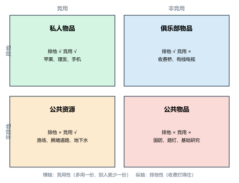
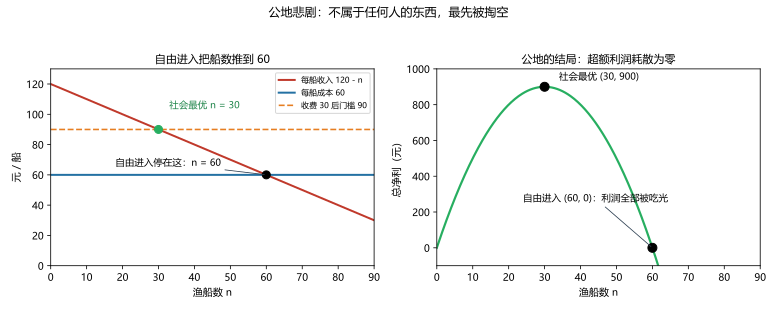
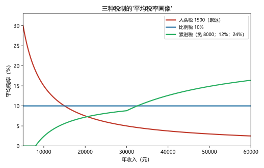

# 第 10 讲：公共物品、公共资源与税制设计

> **前置**：第 09 讲（外部性）、第 05–07 讲（税收与账本）。
> **预计时间**：约 2.5 小时（含作业）。
>
> **一句话定位**：市场失灵三兄弟的第二、三位（公共物品、公共资源）在本讲与"税制设计"合并收官——这是**前半场（市场与政策）的最后一讲**。学完它，你会拿到一张"什么该交给市场、什么该交给集体"的分类棋盘，以及评价"税好不好"的两把尺子。
>
> **本讲回答什么**：
> 1. 怎么给物品分类？哪些该市场给、哪些该政府给？
> 2. 搭便车为什么导致公共物品供给不足？
> 3. 公地悲剧的机制到底是什么？"私有化"能包治吗？
> 4. 什么叫"好税"？"累进税更公平"和"定额税更高效"的争吵有没有答案？
>
> **这一讲有真实验证**：三人路灯的公共物品账（脚本 `scripts/lec10-01_verify_public_goods_tax.py` 实验 1）；渔场公地的自由进入 vs 社会最优（实验 2）；三种税制的税率结构对照（实验 3）。配图 3 张。

## 本讲怎么走（脉络图）

```
引子：业主大会的三个议程（路灯、小河、物业费）
  │
  ├─ 1. 物品的四格棋盘：排他性 × 竞用性（图 1）
  ├─ 2. 公共物品：搭便车的世界
  ├─ 3. 公共资源：公地悲剧（图 2）
  ├─ 4. 税制设计：什么叫"好税"（图 3）
  ├─ 5. 边界与纪律
  └─ 常见误区 → 本讲小结 → 掌握度自测 → 作业
```

> 下一站：§引子。一场业主大会，正好把本讲的四件事全碰齐了。

---

## 引子：业主大会的三个议程

某小区开业主大会，议程表上有三件事：

1. **装一批路灯**（门口那条黑巷子）：大家都说该装。可真到凑钱——"我少走那条巷子""装好了反正大家都能用"——每个人都等着别人掏钱；
2. **小区旁的小河"鱼快被钓光了"**：河不属于谁家，谁都能钓；"我少钓两条，明天也被别人钓走"——于是人人都"趁还有的时候多钓点"；
3. **物业费怎么收**：按人头？按面积？按收入？第一种，穷住户负担最重；第三种，高收入者最疼。吵了一晚上没有结论。

三件事的共同点：**它们都发生在"没有价格的地方"**——路灯没法单独卖给你、河水没法按杯收费、物业费的"公平"根本没有统一标尺。本讲把这三件事一一拆开：先给"没有价格的东西"分类（§1）、再看两场著名的失灵怎么发生（§2 搭便车、§3 公地悲剧）、最后研究那笔"收上来的钱"该怎么设计才叫好（§4）。

---

## 1. 物品的四格棋盘：排他性 × 竞用性

### 1.1 两个判据

给物品分类，不用看它"重不重要"，只看它带哪两条属性：

- **排他性（excludability）**：**付费才能用**——能不能把不付钱的人挡在外面？（一块地能围起来，一首空气挡不住）；
- **竞用性（rivalry）**：**一个人用了，别人的份额就少一点**。（你吃掉的苹果别人吃不到；防空警报响了，全城都在听，谁也不妨碍谁。）

两条属性一交叉，就是本讲的**四格棋盘**：

| | **竞用**（多一份就少一份） | **非竞用**（多人共用不打架） |
|---|---|---|
| **排他**（收得了费） | **私人物品**（苹果、理发） | **俱乐部物品**（收费桥、有线电视） |
| **非排他**（拦不住人） | **公共资源**（渔场、拥堵道路） | **公共物品**（国防、路灯） |



> **图 1 怎么读**：横轴是竞用性（左：竞用；右：非竞用），纵轴是排他性（上：排他；下：非排他）。**私人物品**格：市场运转最顺（两个条件都齐）；**俱乐部物品**格：市场能收费提供（但可能长成"自然垄断"，第 13 讲回访）；**公共资源**格：拦不住人、又会用光——公地悲剧的温床（§3）；**公共物品**格：拦不住人、又人人想要——搭便车的温床（§2）。

**一个边界先声明**：四格是"光谱的四个极点"，不是铁笼子——现实物品的落点可以"搬家"：办个围墙收票，公园就从公共资源挪向俱乐部；加密技术一上来，电视信号从"公共物品"变成"俱乐部物品"。**分类是为了选对工具，不是给物品钉终身标签。**

---

## 2. 公共物品：搭便车的世界

### 2.1 定义与"零边际成本"

> **公共物品（public goods）：既非排他、又非竞用的物品。** 两个特征各有一个直接推论：
>
> - **非排他 → 收不了费**（拦不住没付钱的人）→ 私人企业没有生意可做；
> - **非竞用 → 多服务一个人的边际成本为零**（多一盏路灯照亮一条新路过的行人，成本不增加）→ 从效率看，应该让所有人免费享用。

### 2.2 搭便车：为什么"人人想要、无人愿买"

> **搭便车者（free rider）：享受了物品的好处，却没有为之付费的人。**

不是什么人品问题——是**激励结构**的直接结果：既然"拦不住我没付钱"，那么"等别人买单，我白用"对每个人都是理性的。看一个三人小社区的路灯账（脚本 `lec10-01` 实验 1 实测）：

- 装一盏路灯成本 **300 元**；三人各自的支付意愿：甲 150、乙 120、丙 80——**合计 350**；
- **社会判断**：350 > 300，净益 **+50**——该装；
- **各自独担**：每人的意愿都低于 300——**没有人愿意自己全掏**；
- 结果：**路灯不装**——尽管三个人合起来明明想要它。

如果强制平摊呢（每家 100 元）：甲净赚 50、乙净赚 20、丙**净亏 20**——总盈余还是 +50，但**丙会被"多数"按着头买单**。这两个坑（供给不足 + 少数被强制）就是公共物品供给的两难：**"市场给不够，强制供给又绕不开'凭什么'"**。

### 2.3 政府的角色与"成本-收益分析"的难题

公共物品的主流解法是**政府用税收提供**（国防、路灯、基础研究、公共卫生）：税收解决"搭便车"（不缴也得缴），强制解决"收不齐钱"。但两个提醒别丢：

1. **政府提供 ≠ 政府生产**：路灯可以政府出钱、企业安装——"谁出钱"和"谁来干"是两码事（第 12–14 讲的企业世界照样适用）；
2. **"该提供多少"极难估**：私人市场至少有价格信号；公共物品没有价格，只能靠**成本-收益分析**去估"全社会值多少"——而问卷里说"我愿意出 500"的人可能只是想让政府掏钱（策略性回答）——估值是公共物品经济学里公认的老大难。

> 下一站：棋盘左下角——拦不住人、又会用光的那一格。

---

## 3. 公共资源：公地悲剧

### 3.1 定义与机制

> **公共资源（common resources）：非排他、但竞用的物品**——谁都能来用（不收门票），但多一个人用，别人的那份就薄一分。

"公地悲剧（tragedy of the commons）"这个名字来自一个古老的寓言：一片人人可用的公共牧场，每个牧人都想"多放一头牛"——多放的那头牛的收入归自己，草场退化的代价却摊给所有人。**结果：人人加牛，直到草场废掉。**

把第 09 讲的语言搬出来，机制一句话就清楚：**你多放一头牛，对"其他所有牧人"施加了一份负外部性**（挤占草场）——而这份外部成本不经价格、也不进你的账。于是：

- 每个人的私人账里，"多放一头"只看**自己的**收入 vs **自己的**成本；
- 每个人的最优选择都是"能放就放"；
- 合起来：**资源被用到"每头牛的收入等于成本"为止——超额利润被吃干净**。

### 3.2 数字验证：渔场（实验 2）

村里一片渔场（不属于任何人）：每艘船的收入 = **120 − n**（n 是总船数——船越多，每人捕得越少），每艘船的私人成本 = **60**。看自由进入会发生什么（脚本 `lec10-01` 实验 2 实测）：

- **自由进入**：只要有赚头就有人进——直到 $120 - n = 60$，即 **n = 60 艘**。此时每船净收益为 0，**全村的捕鱼总净利 = 0**；
- **社会最优**：最大化"每船净收益 × 船数"：$\max\; 60n - n^2 \Rightarrow n = 30$ 艘，总净利 **900**。

| 船数 n | 30（社会最优） | 40 | 50 | 60（自由进入） |
|---|---|---|---|---|
| 全渔场总净利 | **900** | 800 | 500 | **0** |



> **图 2 怎么读**：左图从"单船视角"看自由进入的逻辑——收入线（120 − n）随船数下降，降到与成本线 60 相交处（n = 60），"赚头"消失，船就停了。绿点是社会最优 n = 30（多出的船其实在互相挤瘦腰包）。右图是"全村视角"：总净利曲线是一条先升后降的山坡，峰在 30（900）；自由进入的终点在 60——**坡底，利润全部被吃光（0）**。上一讲的"外部性"在这里换了个数字，机制一模一样：个体不算对别人的挤占，一步到位地"各扫门前雪"，合起来就开到了坡底。

### 3.3 例子一串

牧场（原版）、渔场、**拥堵的道路**（你上路，让别人更堵——"拥堵费"就是为它设计的庇古税）、地下水层（抽水竞赛）、公海、"空中的垃圾场"（大气）。共同特征：**便宜甚至免费进入 + 竞用**。

### 3.4 解法四件套（重点：没有哪一件包治百病）

| 工具 | 做法 | 逻辑 | 局限 |
|---|---|---|---|
| **管制** | 限量（船数、天数、限号） | 直接掐住总量 | 一杆子定数，不知道谁更值得用；执行成本 |
| **税/收费** | 每船收 30 → 进入门槛抬到 90 → n 回到 30 | 把"挤占的外部成本"塞回个体账（庇古税同胞） | 税率要估准；对穷使用者可能过重 |
| **可交易配额** | 发 30 张捕捞证、允许互卖 | 总量封顶 + 让"留在场上的人"是最有效率的 30 个 | 初始分配（免费发给谁？）的公平争议 |
| **私有化/规则自治** | 渔场承包给一户/社区自订轮捕规则 | 让"所有者"把挤占内化（他会自己算总账） | **不是万能**：公海、大气划不了界；划给谁本身就是分配问题；监管成本高 |

四件套和上一讲的三工具是同一批工具的"限量版"再组合——**核心动作永远是同一个：让使用者面对的账，等于社会的账。**

> 下一站：三个议程办完了两个。最后那个"吵不完"的——物业费到底怎么收才对？这要在税制设计里找答案。

---

## 4. 税制设计：什么叫"好税"

### 4.1 先回收两笔旧账

到这一讲，"税"已经见过三个身份：筹资工具（05 讲楔子）、抑价工具（07 讲 DWL 与拉弗）、纠偏工具（09 讲庇古税）。本节处理**第一个身份的验收**：作为"收钱的机器"，什么样的设计才算好？先记住两个要点：

- 评价税制有**两个轴**：**效率**与**公平**——两个轴都要过，缺一个都不叫"好税"；
- 两个轴的性质不同：**效率有可算的口径（DWL、行政成本），公平则是"采用哪条原则"的分歧**——这一点决定了下一节那个著名争吵有没有答案。

### 4.2 效率轴：少扭曲、少麻烦

- **少扭曲**：所有筹资税都可能制造 DWL（05/07 讲），设计口诀就一句——**宽税基、低税率**（07 讲平方律的直接推论）：与其对少数东西征重税，不如把税摊薄到更宽的税基上；
- **少麻烦**：**行政负担**——征税机关的征收成本 + 纳税人的遵从成本（记账、申报、请会计）。一项税即使理论 DWL 很小，如果征收起来鸡飞狗跳，同样不及格（"简单"是效率轴的一部分）。

### 4.3 公平轴：两条原则、两个维度

> **受益原则（benefit principle）：谁受益谁付钱。**（"燃油税修路"——开车多的人修路受益多，多付。）
>
> **支付能力原则（ability-to-pay principle）：能力强的人多付钱。**（收入高的人多缴税——税收作为再分配工具。）

再加两个维度：

- **横向公平**：境况相同的人，缴一样的税；
- **纵向公平**：境况不同的人，缴不同的税（**"怎么个不同法"就是上面两条原则的分叉口**）。

### 4.4 平均税率 vs 边际税率：两个问题、两个答案

- **平均税率** = 总税额 ÷ 总收入——它回答"**账单有多重**"；
- **边际税率** = 收入再增加一元，要多缴几毛——它回答"**下一个小时/下一笔生意，划不划算**"（行为在它手里）。

看三人社区（收入 10000 / 20000 / 50000）在三套税制下的画像（脚本 `lec10-01` 实验 3 实测）：

| 税制 | 税额（甲/乙/丙） | **平均税率** | **边际税率** |
|---|---|---|---|
| **人头税**（每人 1500） | 1500 / 1500 / 1500 | 15.0% / 7.5% / 3.0%（**累退**） | **0%** |
| **比例税**（10%） | 1000 / 2000 / 5000 | 10% / 10% / 10% | 10% |
| **累进税**（免 8000；12%；24%） | 240 / 1440 / **7440** | 2.4% / 7.2% / **14.9%**（递增） | 12% / 12% / 24% |



> **图 3 怎么读**：横轴收入、纵轴平均税率。红线（人头税）**随收入下降**——累退；蓝线（比例税）水平；绿线（累进税）**随收入上升**。（"累退"不等于"税额减少"——是"负担占比随收入变轻"。）三线在图中相交、纠缠——这就是"税制结构"的样子。

### 4.5 定额税的极端：效率天花板、公平地板

**定额税（lump-sum tax）**：不论收入高低，每人一个固定数（人头税就是它的粗版）。它的理论地位很特殊：

- **效率侧几乎完美**：边际税率为 0——你多赚的钱**分文不会被多征**，"下一个小时干不干"完全不受它影响 → 它是"不扭曲行为"的天花板；
- **公平侧极为粗糙**：它对低收入者最重（平均税率随收入下降的极端累退）→ 是"公平"的地板。

用一个加班决策看清楚"边际税率为什么是行为的朋友或敌人"（实验 3 下半，工资 100/小时、休闲的边际价值 75）：

| 边际税率 | 加班到手的净收入 | vs 休闲价值 75 | 决定 |
|---|---|---|---|
| 0% | 100 | 高于 | **加班** |
| 25% | 75 | 持平 | 无所谓 |
| 40% | 60 | 低于 | **不加班（回家）** |

一句话记住分工：**边际税率决定"行为"，平均税率决定"账单"**。

### 4.6 那个著名争吵有没有答案

"累进税最公平！""定额税最高效！"——两句话其实各说了一个轴，**没有唯一答案，但有清晰的分歧地图**：

- **效率侧有客观口径**：定额税 > 比例税 > 高累进（DWL 可算），这是事实层；
- **公平侧是规范分歧**：**按"支付能力原则"看，累进税更公平（能力强的多担）；按"受益原则"看，累进未必公平（公园里富人穷人用同样多，为什么富人要多付？）**——两条原则都站得住，选哪条是价值观。
- 所以考试的正解是：**"要看采用哪条公平原则；效率上定额税占优、公平上取决于原则立场"**——而不是抢答"累进一定好/一定坏"。

（现实税制的素描：现代税制普遍是**混合体**——增值税/消费税类偏"宽税基"（效率思路），个人所得税偏累进（支付能力思路），社保偏专项受益——再叠加 05 讲的"名义归宿不等于实际归宿"警报，没有一个国家的税制是教科书单件工具。）

> 下一站：本讲的边界清单——也是前半场（市场与政策）的收尾提醒。

---

## 5. 边界与纪律

1. **四格是光谱**：物品可以随技术、制度"搬家"（围墙、加密）；分类是为了选工具，不是贴终身标签。
2. **政府提供 ≠ 政府生产**：公共物品可以"政府出钱、市场干活"——别把"谁买单"和"谁干活"混为一谈。
3. **公共物品的估值难题**：成本-收益分析里，支付意愿没有市场价格来校准——分析结论要带"误差声明"。
4. **公地治理没有万能药**：市场（私有化）、政府（税/管制）、社区（自订规则）各有适用区——大型公共资源（公海、大气）通常只能靠政府间协议与上述工具组合。
5. **税制评价的两个轴不能互相代言**：效率问题用效率工具答（DWL、行政成本），公平问题要先亮明"采用哪条原则"——这是全课程"实证 vs 规范"（01 讲）在税收话题上的最大应用场。

---

## 常见误区（本节零新知识，只破误）

1. **"公共物品 = 政府生产的东西"**（§2.1–2.3）。错。公共物品由**非排他 + 非竞用**两条属性定义；政府生产的东西可以是私人物品，公共物品也完全可以由私人生产、政府买单。
2. **"免费的东西都是公共物品"**（§1）。错。要看属性不看价格：免费公园只要围得起来、挤得动，就是公共资源；收费的数字电视（加密）反倒是俱乐部物品。
3. **"搭便车是人品问题"**（§2.2）。不是。它是"拦不住不付费者"的激励结构产物——换个制度（比如封闭小区内部集资），同一个人可能立刻变得"慷慨"。
4. **"公地悲剧是因为人太多"**（§3.1）。错。是**产权与激励结构**问题：人再多，把地划给谁、让谁自己算总账，悲剧也能停（私有草场不悲剧）；人再少，没有归属的资源照样被吃光。
5. **"私有化能治好一切公地"**（§3.4）。不一定。公海、大气无法划界；划给谁的公平问题、监管与执行成本都要另算——私有化是四件套之一，不是万能钥匙。
6. **"定额税零 DWL，所以应该全面推广"**（§4.5–4.6）。不成立。定额税在**效率轴**上确实近乎满分，但在**公平轴**上是极端累退——"好税"要两轴都过；单轴最优方案不等于综合最优方案。

## 本讲小结

一页纸的骨架：

- **四格棋盘**（排他性 × 竞用性）：私人物品（市场顺畅）、俱乐部物品（可收费）、**公共资源**（公地悲剧）、**公共物品**（搭便车）。四格是光谱、可搬家。
- **公共物品**：非排他 → 收不了费；非竞用 → 边际成本为零。**搭便车** → 私人供给不足（三人路灯：合计 350 > 成本 300，却无人独担）；政府以税收提供，但"提供 ≠ 生产"，且估值难。
- **公共资源**：非排他 + 竞用 → 每个使用者对他人施加负外部性 → **用到利润耗尽**（n = 60、净利 0 vs 最优 n = 30、净利 900）。解法四件套：管制、收费/税（30）、可交易配额、私有化/社区规则——各有边界。
- **税制设计**：两个轴——效率（宽税基低税率、行政负担小）与公平（受益原则 vs 支付能力原则；横向/纵向公平）。
- **平均税率管账单、边际税率管行为**；三种结构：累退（人头税）、比例、累进（三曲线、三张画像）。
- **定额税**：效率天花板、公平地板；**"累进 vs 定额"之争没有唯一答案——效率有口径、公平是原则分歧**。
- **收尾**：市场失灵三兄弟（市场势力 13 讲 / 外部性 09 讲 / 公共品与公地 10 讲）已到齐两位半；前半场收官，下半场走进企业（11 讲起）。

## 掌握度自测

- [ ] 我能用"排他性 × 竞用性"给任意物品定位，并写出四格各自的两个例子。
- [ ] 我能解释"非排他 → 收不了费""非竞用 → 边际成本为零"两个推论。
- [ ] 我能复述三人路灯的全部数字（350/300、独担无人、平摊 +50/+20/−20），并说清"两难"的两个侧面。
- [ ] 我能解释公地悲剧的机制（负外部性 + 私人账），并复算渔场 n=60 vs n=30 的净利（0 vs 900）。
- [ ] 我能说出公地解法四件套，并指出私有化的至少两条边界。
- [ ] 我能写出税制评价的两个轴，并分别举出构成要素（DWL/行政负担；受益/支付能力、横向/纵向）。
- [ ] 我能区分平均税率与边际税率，并解释"边际税率管行为"的加班演示。
- [ ] 我能对三种税制结构（累退/比例/累进）各举一例并画出平均税率的大致走势。
- [ ] 我能说清"累进 vs 定额"之争的分歧地图（效率有口径、公平是原则），并按此组织答案。
- [ ] 我能复跑 `scripts/lec10-01`，解释输出里每一个数字（350、60、900、1500、7440、0%/25%/40%……）。

## 作业

> 答案只能用**已教概念**（本讲范围：四格分类、公共物品与搭便车、公共资源与公地悲剧、四件套解法、税制两轴、平均/边际税率、三种结构、定额税；可复用外部性与税工具）。先独立做，再对答案。

### 基础

**Q1. 分类题**：把下列八项放进四格棋盘：国防、公海渔业、苹果、收费高速公路、无线广播、拥堵的市中心道路、有线电视、演唱会门票。

**参考答案**：
- 私人物品：**苹果**、**演唱会门票**（排他 + 竞用）；
- 俱乐部物品：**收费高速公路**、**有线电视**（排他 + 非竞用）；
- 公共资源：**公海渔业**、**拥堵的市中心道路**（非排他 + 竞用）；
- 公共物品：**国防**、**无线广播**（非排他 + 非竞用）。

**Q2. 计算·公共物品**：四人社区考虑装一台净水设备：成本 1000 元；四人支付意愿分别为 400、300、200、150。

(1) 社会意义上该不该装？
(2) 若要求任何一个人单独出资，会怎样？
(3) 若平摊（每人 250），谁愿意、谁反对？
(4) 用一句话概括这个结局揭示的难题。

**参考答案**：
(1) 合计意愿 1050 > 成本 1000——**该装**（净益 +50）。
(2) 每人的意愿都低于 1000——**无人愿独担**（搭便车：等别人出钱）。
(3) 平摊 250：甲（+150）、乙（+50）愿意；丙（−50）、丁（−100）**反对**。
(4) 公共物品的两难：市场（自愿）供给不足；强制供给能成事，但要面对"少数反对者凭什么买单"的问题。

**Q3. 计算·公地**：某渔场：每船收入 = 100 − n（n 为总船数）；每船成本 40。

(1) 自由进入的船数是多少？总净利多少？
(2) 社会最优船数是多少？总净利多少？
(3) 若要收费矫正到社会最优，每船应收多少？

**参考答案**：
(1) 只要 $100-n > 40$ 就有人进：均衡在 $100-n = 40 \Rightarrow$ **n = 60**；总净利 60×60 − 60² = **0**。
(2) $\max\; (100n - n^2) - 40n = 60n - n^2 \Rightarrow$ **n = 30**；总净利 60×30 − 900 = **900**。
(3) 进入门槛抬到 $40 + t$：$100-n = 40+t$ 且 n = 30 → $t =$ **30**。
（对照本讲实验：结构相同、数字平移——机制是"把外部挤占成本塞回个体账"。）

### 提高

**Q4. 计算·税率结构**：某地个税：免征额 6000；6000–25000 部分税率为 10%；25000–50000 部分 20%；50000 以上部分 30%。计算四位纳税人（收入 5000、15000、40000、80000）的：应纳税额、平均税率、边际税率。

**参考答案**：

| 收入 | 应纳税额 | 平均税率 | 边际税率 |
|---|---|---|---|
| 5000 | **0** | 0% | 0% |
| 15000 | (15000−6000)×10% = **900** | 6% | 10% |
| 40000 | 19000×10% + 15000×20% = **4900** | **12.25%** | 20% |
| 80000 | 1900 + 25000×20% + 30000×30% = **15900** | **19.875%** | 30% |

验算：40000 的税额 = 1900 + 3000 = 4900 ✓；80000 = 1900 + 5000 + 9000 = 15900 ✓。

**Q5. 辨析题**：判断对错并简说理由。

(a) "公共物品就是政府生产的东西。"
(b) "搭便车是人的道德问题。"
(c) "定额税没有无谓损失，所以应该全面推广。"
(d) "累进税一定比比例税更公平。"

**参考答案**：
(a) 错。定义看两特征（非排他 + 非竞用）；政府生产 ≠ 政府提供，反之亦然（§2.1–2.3）。
(b) 错。它是"拦不住不付费者"的激励结构产物；制度一变，行为会变（§2.2、误区 3）。
(c) 不成立。定额税在效率轴近乎满分，但公平轴极端累退——两轴都要过（§4.5–4.6）。
(d) 不一定。按支付能力原则，累进更公平；按受益原则，累进未必公平——这是规范分歧，没有唯一答案（§4.6）。

**Q6. 简答·公地机制与解法**：用"负外部性"的语言解释公地悲剧的机制（要求出现"私人成本 vs 社会成本"），并列出两种解法及其一句话逻辑。

**参考答案**：
机制：每个使用者多用一个单位资源，其**私人成本**只包含自己付出的部分，而**社会成本**还要加上"对他人份额的挤占"——这份差额（负外部性）不被个体考虑，于是每个人"能多用就多用"，总量一路冲到"平均收益 = 私人成本"处，超额利润被吃光。
解法（任选两种）：
① 收费/税（如每船 30）：把外部挤占成本塞回个体账，进入门槛抬到社会最优；
② 可交易配额（如 30 张证）：总量封顶，让留在场上的使用者最有效率；
（③ 私有化/社区自订规则：让"所有者"自己算总账——但有划界与公平的边界。）

### 综合（回扣本讲主任务）

**Q7. 综合·业主大会收官**：回到引子，三件事各给一个"裁决"：

(1) **路灯**：这一批成本 900 元；三户的意愿：甲 400、乙 300、丙 250。该不该装？若平摊（每户 300），谁支持谁反对？净益账各是多少？
(2) **小河**：定性分析"鱼被钓光"的机制，并给一个"既治标又有逻辑"的方案（任选一件工具）。
(3) **物业费**：三个候选方案——按人头、按建筑面积、按收入——各对应哪条公平原则（受益 / 支付能力）？为什么"吵不完"？

**参考答案**：
(1) 合计意愿 950 > 900——**该装**。平摊 300：甲净益 +100、乙 0、丙 **−50**——甲、乙支持、**丙反对**（与 §2.2 三人路灯同构）。
(2) 机制：小河无人拥有 → 每个垂钓者"我少钓也被别人钓走" → 多钓的私人账里不含对他人机会的挤占（负外部性）→ 过度捕捞。方案示例：办理付费垂钓证（把外部成本塞回个体账）；或把河段承包给一户/合作社管护（私有化/自治，划清权属与责任）。
(3) 按建筑面积≈**受益原则**（房子大多用公共设施、多担）；按收入≈**支付能力原则**（能力强的多担）；按人头≈近似定额（简洁但累退）。"吵不完"因为……**公平时两条原则的选择是规范分歧**，没有效率口径那样的客观裁判——只能通过业主大会这种集体选择机制来定规则（这也正是"公共选择"的现实版）。
验证：(1) 与实验 1 结构一致；(3) 与 §4.6 的"分歧地图"一致。

**Q8. 简答·开放：公共物品该由谁提供？**：政府、市场、社区——三方各能在什么条件下提供公共物品/管理公共资源？请各给一个例子或原理，并指出各自的软肋。

**参考答案**：
- **政府**：以税收强制筹资，解决搭便车（国防、路灯、基础研究）；软肋：估值难（成本-收益分析）、可能低效或被俘获。
- **市场**：多数公共物品无法直接收费，但市场有"绕道"供给的巧法——用广告/数据/增值服务间接变现（免费电视、搜索、开源软件的商业支持），或纯慈善捐赠；软肋：只覆盖"能连带变现"的部分，无法保证该供给的都供给。
- **社区（自治）**：小规模、长期互动、可自订并执行规则（村社轮牧、小区共治——奥斯特罗姆式的"第三条道路"）；软肋：规模一大、陌生人一多，"自订规则"就难以自我执行。
结论：公共物品与公共资源的治理是**多元混合**——按规模、技术、社群条件"拼装"政府、市场、社区三种机制，这正是本讲四件套与三轨工具站在一起的原因。

---

*下一讲预告：第 11 讲《生产成本》——前半场（市场与政策）收官，后半场（企业与产业）开工。第一站是企业的"底账"：成本到底是什么（机会成本 vs 会计成本）、经济利润为什么总和会计利润打架、从生产函数到整套成本曲线、以及那条"边际成本必然穿过平均总成本最低点"的铁律。*