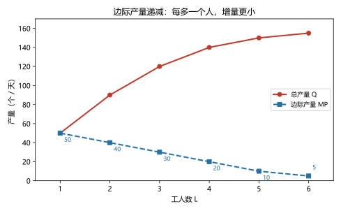
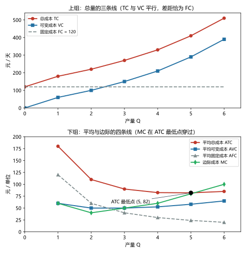
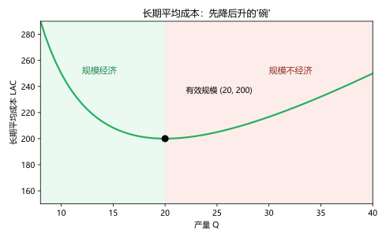

# 第 11 讲：生产成本

> **前置**：第 01 讲（机会成本）、第 06–10 讲（账本与失灵）。
> **预计时间**：约 2.5 小时（含作业）。
>
> **一句话定位**：下半场（企业与产业）的第一站，也是全课程第 01 讲埋下的"成本=放弃的价值"最重的一次兑现：**企业家的账本为什么要算两本**、从生产车间到整套成本曲线怎么推出来、以及那条"边际成本必然穿过平均总成本最低点"的铁律为什么不是巧合。
>
> **本讲回答什么**：
> 1. 机会成本为什么也算企业的成本？老板给自己打工不领工资，成本算不算？
> 2. 经济利润和会计利润差在哪？"经济利润为 0"到底是好是坏？
> 3. 边际产量递减为什么是"迟早且必然"的？
> 4. MC 为什么一定穿过 ATC 最低点？ATC 为什么是 U 形？
> 5. 短期和长期为什么是两套账？"规模经济"是什么？
>
> **这一讲有真实验证**：面包房两本账（脚本 `scripts/lec11-01_verify_cost.py` 实验 1）；生产函数与边际产量（实验 2）；短期成本全表与两条验证（实验 3）；长期成本与有效规模（实验 4）。配图 3 张。

## 本讲怎么走（脉络图）

```
引子：面包房的两本账（账本说赚 10 万，经济账说亏 3.8 万）
  │
  ├─ 1. 显性成本、隐性成本与两个"利润"
  ├─ 2. 生产函数与边际产量递减（图 2）
  ├─ 3. 短期成本七件套：FC/VC/TC/ATC/AVC/AFC/MC（图 1）
  ├─ 4. 曲线的形状与关系：U 形之谜与"边际穿平均"（含一行证明）
  ├─ 5. 短期与长期、规模经济（图 3）
  ├─ 6. 边界与纪律
  └─ 常见误区 → 本讲小结 → 掌握度自测 → 作业
```

> 下一站：§引子。同一家店、同一年，两个账本，两个数字。

---

## 引子：面包房的两本账

老周开了家面包房。年底，会计交来一份"体检报告"：

- 全年收入 **50 万**；
- 显性成本（有发票的）：原料 20 万、房租 8 万、雇工 12 万——合计 40 万；
- **会计利润：10 万**。会计拍拍他肩膀："小店经营得不错。"

老周的儿子在读经济学，凑过来补了两笔"没有发票的账"：

- **自有资金的机会成本**：店里压着 30 万积蓄，如果拿去买稳健理财，一年能稳拿 **1.8 万**——这 1.8 万，是开店"默默放弃"的；
- **老板劳动的机会成本**：老周全年无休站灶台，如果去给别人当店长，年薪 **12 万**——这也是开店"默默放弃"的。

把两笔补上：

$$经济利润 = 50 - 40 - 1.8 - 12 = \mathbf{-3.8\ 万}$$

**同一家店、同一年：会计说赚 10 万，经济账说亏 3.8 万。谁错了？** 谁都没错——他们在算**两本不同的账**。哪本账说了算？为什么"亏钱"老周还在开店？这两个问题就是本讲的第一课。

---

## 1. 显性成本、隐性成本与两个"利润"

### 1.1 两类成本

> **显性成本（explicit costs）：企业掏出真金白银、有据可查的支出**——原料、工资、房租。
>
> **隐性成本（implicit costs）：企业没有掏钱，但**放弃了价值**的投入**——自有资金、老板自己的劳动、自家的铺面。它们就是第 01 讲的**机会成本**在企业里的正式登场。

判隐性成本有一个**置换法**（现场就能用）：假设这份资源"不放在这里"，还能挣多少？——能挣到的那个数，就是它的隐性成本。

### 1.2 两个"利润"（一条恒等式）

> **会计利润 = 总收入 − 显性成本**（会计口径：给税务、股东看）；
> **经济利润 = 总收入 − 显性成本 − 隐性成本 = 会计利润 − 隐性成本**（经济学口径：给"这事值不值得干"的决策看）。

由此得到一条**恒成立的比较**：

> **只要存在隐性成本，经济利润就一定小于会计利润**（本讲引子：10 − 13.8 = −3.8）。

### 1.3 "经济利润为零"意味着什么（预习第 12 讲的钥匙）

这是全课程最重要的辨析之一，先说透：

- **经济利润为零 ≠ 白干**：它意味着**所有投入（包括老板自己的时间和资金）都拿到了"在别处也能拿到的回报"**——工资、利息一分不少，只是没有"超额赚头"；
- 零经济利润时，老板"换个地方干也差不多"——所以它是**"继续干与退出之间无所谓"的临界线**；
- 经济利润为正：**超额回报**——这门生意比把资源投在别处更值；
- 经济利润为负：资源被"困"在了更差的用途里——理性上该考虑退出，**除非**有非货币的回报（老周可能就爱做面包）或对未来有特殊预期。

（第 12 讲会看到：竞争市场的长期均衡恰好会把经济利润"逼"到零——那时你会明白"零利润"为什么是市场健康的常态而不是坏事。）

> 下一站：两本账讲清了"钱"的一侧。现在走进车间，看"产量"是怎么来的。

---

## 2. 生产函数与边际产量递减

### 2.1 生产函数

> **生产函数（production function）：投入与产出之间的数量关系。**

面包房的一天：固定投入是"一间店面 + 一台烤炉"，可变投入是工人。实测的产量表（脚本 `lec11-01` 实验 2）：

| 工人数 L | 日产量 Q（个） | 边际产量 MP（个/人） |
|---|---|---|
| 1 | 50 | 50 |
| 2 | 90 | 40 |
| 3 | 120 | 30 |
| 4 | 140 | 20 |
| 5 | 150 | 10 |
| 6 | 155 | 5 |

> **边际产量（marginal product）：多雇一个单位的投入，多产出多少**——$MP = \Delta Q / \Delta L$。

### 2.2 边际产量递减：迟早，且必然

盯着 MP 那一列：50 → 40 → 30 → 20 → 10 → 5——**一路递减**。

> **边际产量递减（diminishing marginal product）：其他投入不变时，追加一种投入的边际产量迟早递减。**

为什么是"必然"？机制朴素得很：**固定投入是瓶颈**——烤炉就一台、店面就这么大。第 1 个工人用满烤炉的高效时段；第 2 个工人来，得排一会儿队；到第 6 个，大部分时间在"等炉子"。人越多，单位新增人手的产出越小——**这不是工人的错，是"炉子没变"**。



> **图 2 怎么读**：红线是总产量 Q——**仍在上升**；蓝虚线是边际产量 MP——**持续下降**。两者别混：**递减的是"边际"，不是"总量"**——第 6 个工人挤出的那 5 个面包，仍是正的贡献（买不买账另说，那要等成本登场）。

**预告一个连接**：MP 递减，意味着"后面每多生产一个面包，要花的投入越来越多"——这正是下一节 **MC 上升**的来源。边际产量与边际成本，是同一枚硬币的两面。

> 下一站：把"产量表"翻译成"成本表"——企业的七件套成本。

---

## 3. 短期成本七件套：FC/VC/TC/ATC/AVC/AFC/MC

### 3.1 短期：至少有一项投入"动不了"

> **短期（short run）：至少有一种投入量固定的时期**——烤炉、店面、签好的年租都动不了；
> **长期（long run）：一切投入都可以调整的时期**（作业会考这个区分，先说一句：它**不是日历时间**，见 §6）。

短期的"动不了"带来了第一组成本：

- **固定成本（FC）**：不随产量变化的成本——房租、设备保养。本讲设定：**每天雷打不动 120 元**；
- **可变成本（VC）**：随产量变化的成本——原料、计时工；
- **总成本（TC）= FC + VC**。

### 3.2 七个积木的完整拼装（实验 3 实测）

| 产量 Q | VC | TC | ATC | AVC | AFC | MC |
|---|---|---|---|---|---|---|
| 1 | 60 | 180 | 180.0 | 60.0 | 120.0 | 60 |
| 2 | 100 | 220 | 110.0 | 50.0 | 60.0 | 40 |
| 3 | 150 | 270 | 90.0 | 50.0 | 40.0 | 50 |
| 4 | 210 | 330 | 82.5 | 52.5 | 30.0 | 60 |
| 5 | 290 | 410 | **82.0 ← 最低** | 58.0 | 24.0 | 80 |
| 6 | 390 | 510 | 85.0 | 65.0 | 20.0 | 100 |

公式一览（七个积木的定义，全部要背）：

- **平均总成本 $ATC = TC / Q$**；**平均可变成本 $AVC = VC / Q$**；**平均固定成本 $AFC = FC / Q$**；
- 于是恒等式：**$ATC = AVC + AFC$**（验证：Q=5 处 58 + 24 = 82 ✓ 每行都成立）；
- **边际成本 $MC = \Delta TC / \Delta Q$**（因为 FC 不变，$\Delta TC = \Delta VC$——**MC 只看"变动的那部分"**）。本表的 MC：60 → 40 → 50 → 60 → 80 → 100——**先降后升**。



> **图 1 怎么读**：上组是三种"总量"：TC 与 VC 两条平行线（差距恒为 FC = 120 的横线）；下组是四种"平均/边际"：ATC（红）、AVC（蓝）、AFC（灰虚线）、MC（绿）。四个读数眼熟一下：**AFC 一路下滑**（固定成本被摊到越来越多的产量上）；**AVC 先平后升**；**ATC 先降后升（U 形）**；**MC 先降后升**，且注意 Q=5 的黑点——ATC 的最低点，MC 恰从那里穿过（下一节展开）。
>
> 另有一个位置关系也要认：**MC 的谷底（Q=2 处 40）比 ATC 的谷底（Q=5 处 82）更早到来**——边际先掉头，平均后掉头。

> 下一站：为什么 ATC 是 U 形、MC 又为什么非要从它的最低点穿过——两个"为什么"一起解决。

---

## 4. 曲线的形状与关系：U 形之谜与"边际穿平均"

### 4.1 ATC 为什么是 U 形：两股力量的拔河

ATC 里住着两个"性格相反"的房客：

- **AFC 一路下跌**（120 ÷ Q：浇给更多面包，摊得越薄）——这股**摊薄的力量**把 ATC 往下按；
- **AVC 后期上升**（边际产量递减的账单：越往后每个面包越费工）——这股**递减的力量**把 ATC 往上拽。

前半程摊薄赢（ATC 降）、后半程递减赢（ATC 升）——**一枚 U 形就此诞生**。

顺手把两个容易混淆的概念钉死（这正是思维链条里那道"防错"题）：

| | 固定成本摊薄 | 边际产量递减 |
|---|---|---|
| 是什么 | **算术**：FC 除以更大的 Q | **技术规律**：固定投入成瓶颈，新增人手的增量产出变小 |
| 方向 | 压低 ATC（好事） | 抬高 MC 与 AVC（坏事） |
| 关键 | 不涉及"效率"变化 | 涉及"效率"变化 |

**它们不是一回事——是 U 形两侧各站一股的力量。**

### 4.2 MC 为什么必然穿过 ATC 最低点

先用"成绩单"直觉（这个直觉映射的是真实结构，值得记一辈子）：你的平均分是 80。新考一门——考了 **90**（高于平均）→ 平均分被**拉高**；考了 **70**（低于平均）→ 平均分被**拉低**。

> 把"新一门成绩"换成"MC"、把"平均分"换成"ATC"：**MC < ATC 时，ATC 降；MC > ATC 时，ATC 升**——于是 ATC 的最低点，必然发生在两者相交处；MC 的轨迹从下往上"穿过"这个点。

回到实验表验证（离散版）：

- Q=4 → 5：MC = 80 < ATC = 82.5 → ATC 降（82.5 → 82 ✓）；
- Q=5 → 6：MC = 100 > ATC = 82 → ATC 升（82 → 85 ✓）。

> **微积分视角（一行证明"边际穿平均"）**：
> $$ATC(Q) = \frac{TC(Q)}{Q} \Rightarrow \frac{d\,ATC}{dQ} = \frac{TC'(Q)\cdot Q - TC(Q)}{Q^2} = \frac{MC - ATC}{Q}$$
> 看最后那个分子：**MC < ATC 时导数为负（ATC 降）；MC > ATC 时导数为正（ATC 升）；ATC 的内部最低点处导数为零 ⟺ MC = ATC**。位移一句："边际把平均往下压、往上拽、恰在最低处持平"——一行得证，无需剧情。
>
> （同理：**MC 也穿过 AVC 的最低点**——分母换成 VC 的同一套推导。）

> 下一站：把镜头从"这段时间"拉到"规划一座厂"——长期的世界。

---

## 5. 短期与长期、规模经济

### 5.1 两套账的对照

| | 短期 | 长期 |
|---|---|---|
| 投入 | 至少一项固定（烤炉、店面） | 全部可调（连厂房都能重盖） |
| 曲线 | ATC/AVC/AFC/MC（上节的七件套） | **长期平均成本 LAC**（没有 FC，就没有 AFC） |
| 决策 | 今晚加烤几盘 | 要不要开第二家店、换更大的炉子 |

### 5.2 长期平均成本：先降后升的"碗"

把长期里"每个产量对应的最优单位成本"连起来，得到 **长期平均成本（LAC）**。它的形状（脚本实验 4 实测，LAC = 2000/Q + 5Q）：

| 产量 Q | 8 | 12 | 16 | **20** | 24 | 28 | 32 |
|---|---|---|---|---|---|---|---|
| LAC | 290 | 227 | 205 | **200 ←最低** | 203 | 211 | 222 |



> **图 3 怎么读**：曲线先降后升，像个碗。**左半个碗：规模经济**——产量越大、单位成本越低；**右半个碗：规模不经济**——太大反而笨重、单位成本回升；**碗底 (20, 200)：有效规模**——恰好把成本压到最低的产量档位。

两侧的机制各记几条（考试问"来源"就答这些）：

- **规模经济（economies of scale）**：专业化分工（人多了才能"专岗"）、设备不可分（买了大烤炉，不装满就亏）、批量采购的议价力、融资与广告的成本摊薄；
- **规模不经济（diseconomies of scale）**：管理层级变多（决策慢）、协调与沟通成本、信息在传递中失真、激励稀释（"人多了，谁的责任都不清楚"）。

一句现实版：**小作坊拼不过大厂**（规模经济在左半个碗），**巨头也会翻车**（右半个碗）——两个现象是同一只碗的两边。

> 下一站：本讲的边界清单——先把几条最容易踩的线划出来。

---

## 6. 边界与纪律

1. **"短期/长期"不是日历时间**：判断标准是"**有没有投入还动不了**"。一家签了十年租约的店，十年内都在"短期"里挣扎；一个摆摊的（桌椅随时能换）可能随时处于"长期"。
2. **表格与曲线**：本讲用离散表格数据作图和计算（教学与考试的主流）；现实中曲线是平滑的——考试画图用平滑曲线、算数用表格，两者别打架。
3. **要素价格变了，曲线会"搬家"**：本讲的成本曲线都假设"工资、原料价不变"。一旦要素涨价，整族曲线整体上移——**沿曲线滑动 vs 曲线移动**（第 03 讲的老纪律）在成本图上的再现。
4. **成本曲线的用途**：它们是第 12 讲（竞争企业怎么定产量）、第 13 讲（垄断）的"底座"——下一讲开始，所有企业的决策都建立在今天这七条线上。

---

## 常见误区（本节零新知识，只破误）

1. **"会计利润比经济利润高，一定是会计做假账"**（§1.2）。错。两个口径的差就是隐性成本——会计没算、不是算错。
2. **"经济利润为零的生意没人干"**（§1.3）。错。零经济利润 = 所有投入都拿到了"别处也能拿到"的回报——不亏，只是没有超额；它还是"干与不干都行"的临界线。
3. **"边际产量递减意味着总产量在下降"**（§2.2）。错。总量仍在上升，只是**增速**变小（图 2 的红线一直在涨）。
4. **"MC 在 ATC 的最低点才'最低'"**（§3.2、§4.2）。错。MC 自己的谷底来得更早（Q=2 处 40）；它只是**穿过** ATC 的最低点（Q=5 处 82）——"穿越点"与"MC 自己的最低点"是两码事。
5. **"固定成本摊薄与边际产量递减是一回事"**（§4.1）。不是。一个是"除以更大的数"（算术），一个是"新增人手产出变小"（技术）；U 形正是两者拔河的结果。
6. **"长期就是'时间很长的短期'"**（§6.1）。错。区别在"有没有投入动不了"，不在日历长短。

## 本讲小结

一页纸的骨架：

- **两本账**：显性成本（有发票）+ 隐性成本（没发票的放弃价值，用"置换法"估）；**会计利润 = 收入 − 显性**；**经济利润 = 收入 − 显性 − 隐性 = 会计利润 − 隐性**；经济利润（常）小于会计利润。
- **零经济利润 ≠ 白干**：全部资源拿到"别处也行"的回报——"退出与否无所谓"的临界线（12 讲长期均衡的钥匙）。
- **生产函数**：L → Q；**MP = ΔQ/ΔL**；**边际产量递减**（固定投入是瓶颈，"迟早且必然"）——递减的是边际、不是总量。
- **短期七件套**：FC、VC、TC = FC + VC；ATC、AVC、AFC（ATC = AVC + AFC）；MC = ΔTC/ΔQ（只看变动部分）。MC 先降后升、AFC 一路降、AVC 先平后升、ATC 是 U 形。
- **两个"为什么"**：U 形 = 摊薄（压）与递减（拽）的拔河；**MC 穿 ATC 最低点** = "新成绩拉动平均分"的必然——且一行导数证明 $\dfrac{d\,ATC}{dQ} = \dfrac{MC - ATC}{Q}$。
- **短期 vs 长期**：有没有投入动不了；**LAC 是碗形**（左：规模经济；右：规模不经济；碗底：有效规模）。

## 掌握度自测

- [ ] 我能区分显性与隐性成本，并用"置换法"给三个例子估隐性成本。
- [ ] 我能写出两个利润的公式与恒等式（经济利润 = 会计利润 − 隐性成本），并算出引子面包房的 10 万与 −3.8 万。
- [ ] 我能解释"零经济利润 ≠ 白干"，并说出它在"继续/退出"决策中的临界含义。
- [ ] 我能计算 MP 序列并解释边际产量递减的"瓶颈"机制（含"递减的是边际不是总量"）。
- [ ] 我能默写七件套的定义与恒等式 ATC = AVC + AFC，并给一张表补全 TC/ATC/AVC/AFC/MC。
- [ ] 我能用"成绩单直觉"解释 MC < ATC → ATC 降、MC > ATC → ATC 升，并复述那行导数证明。
- [ ] 我能说清 ATC 的 U 形由"摊薄"与"递减"两股力量构成，并区分摊薄与边际递减。
- [ ] 我能说出"短期/长期"的正确判据（有没有投入可调，而非日历时间）。
- [ ] 我能画出/描述 LAC 的碗形，标出规模经济、规模不经济、有效规模，并各说两个来源。
- [ ] 我能复跑 `scripts/lec11-01`，解释输出里每一个数字（10、−3.8、50→5、180/110/82.5/82、120→20、200……）。

## 作业

> 答案只能用**已教概念**（本讲范围：显性/隐性成本、两个利润、MP 与递减、七件套成本、MC 穿 ATC、短长期与规模经济；可复用机会成本直觉）。先独立做，再对答案。

### 基础

**Q1. 计算·两本账**：某小店：年收入 80 万；显性成本 55 万；隐性成本：自有铺面本可出租 6 万/年、老板劳动本可打工 10 万/年。

(1) 会计利润？(2) 经济利润？(3) "经济利润 9 万"对老板意味着什么？

**参考答案**：
(1) 80 − 55 = **25 万**。
(2) 隐性成本合计 16 万；经济利润 = 25 − 16 = **9 万**。
(3) 意味着**高于"别处也能拿"的回报 9 万**——这笔资源（资金+劳动+铺面）放在这里比放别处更值，**值得继续干**（且是竞争者会眼红想涌入的信号）。

**Q2. 计算·边际产量**：某车间：工人数 1–5 时的日产量为 20、35、45、50、52。

(1) 算 MP 序列；(2) 是否递减？(3) 总产量在升还是在降？

**参考答案**：
(1) MP = 20、15、10、5、2。
(2) 递减 ✓（20 → 2 一路变少）。
(3) **在升**——但升得越来越慢（52 > 50 > 45……）。"边际递减"≠"总量下降"。

**Q3. 计算·补全成本表**：FC = 150；Q = 1–5 的 VC 为 80、120、180、260、360。补全 TC、ATC、AVC、AFC、MC，并判断"若再增产一单位，ATC 会升还是降"。

**参考答案**：

| Q | VC | TC | ATC | AVC | AFC | MC |
|---|---|---|---|---|---|---|
| 1 | 80 | 230 | 230 | 80 | 150 | 80 |
| 2 | 120 | 270 | 135 | 60 | 75 | 40 |
| 3 | 180 | 330 | 110 | 60 | 50 | 60 |
| 4 | 260 | 410 | 102.5 | 65 | 37.5 | 80 |
| 5 | 360 | 510 | 102 | 72 | 30 | 100 |

判断：目前 MC = 100 **<** ATC = 102 → 再增产，ATC **还会降**（直到两者相交）。
验算：每行 ATC = AVC + AFC（如 Q=4：65 + 37.5 = 102.5 ✓）。

### 提高

**Q4. 计算·零利润的含义**：某店：收入 60 万；显性成本 48 万；隐性成本合计 12 万。

(1) 会计利润与经济利润各是多少？
(2) 老板在"白干"吗？用一句话说清"经济利润为零"的准确含义。
(3) 如果明年情况不变、老板又有一份 15 万的新机会（高于原来的 12 万），经济利润变成多少？他该考虑什么？

**参考答案**：
(1) 会计利润 = 12 万；经济利润 = 12 − 12 = **0**。
(2) **不是白干**：全部资源（含老板劳动与资金）刚好拿到"别处也能拿到"的回报；零经济利润 = "继续干与退出差不多"的临界线。
(3) 隐性成本升到 15 万 → 经济利润 = 12 − 15 = **−3 万**；该考虑**接受新机会/退出**（除非有非货币回报或更好的未来预期）。

**Q5. 辨析题**：判断对错并简说理由。

(a) "会计利润比经济利润高，说明会计做假账。"
(b) "经济利润为零的业务一定没人干。"
(c) "边际产量递减说明总产量在下降。"
(d) "MC 恰好穿过 ATC 最低点只是数字巧合。"

**参考答案**：
(a) 错。差异来自"隐性成本"这一口径差，会计并没有算错（§1.2）。
(b) 错。零经济利润 = 正常回报全覆盖，仍可能有可观的会计利润；它是临界线不是"无人区"（§1.3）。
(c) 错。总量仍在上升，只是增速变小（§2.2）。
(d) 错。是"新成绩拉动平均分"的必然——$d\,ATC/dQ = (MC-ATC)/Q$，导数为零处即两者相交（§4.2）。

**Q6. 简答·MC 与 ATC 的关系**：用"平均分与新成绩"的直觉解释"MC < ATC 时 ATC 下降、MC > ATC 时 ATC 上升"，并指出 ATC 最低点的条件。

**参考答案**：
平均分被"高于平均"的新成绩拉高、被"低于平均"的新成绩拉低。把新成绩换成 MC：**MC 低于 ATC（边际比平均便宜）→ 平均被拉低；MC 高于 ATC → 平均被拉起**。所以 ATC 的最低点必然满足 **MC = ATC**（MC 在此从下方穿过）——这就是"边际穿平均"的定律（AVC 同理）。

### 综合（回扣本讲主任务）

**Q7. 综合·一家打印店的成本分类与规划**：某打印店的成本项目：

① 店面年租（签了三年合同）；② 打印纸与墨粉；③ 设备保养与折旧；④ 按小时雇的兼职店员；⑤ 老板自己的时间。

(1) 把 ①–④ 分为固定成本 / 可变成本（在"本年度"的短期视角下）；⑤ 属于什么？
(2) 解释你判断 ① 是固定的、④ 是可变的理由。
(3) 给出"短期"与"长期"在这家店里的具体含义（各举一个"能调/不能调"的例子）。
(4) 若这家店开成连锁（十家店），可能从哪获得规模经济？又可能从哪陷入规模不经济？（各两条）

**参考答案**：
(1) FC：① ③；VC：② ④。⑤ 是**隐性成本**（不进 FC/VC 的分类——它属于"两本账"的维度，不是"变不变"的维度）。
(2) ① 三年合同已签，年内无论打印多少张都要付 → 固定；④ 按小时雇佣，随时增减 → 可变。
(3) 短期：店面、大设备都动不了（这些是瓶颈）；长期：可以搬店、换设备、扩租（一切可调）。
(4) 规模经济：集中采购纸张墨粉的议价力、统一的品牌与广告摊薄、中央调度提高设备利用率；规模不经济：管理层级增加、各店协调与监督成本、信息传递失真（决策慢半拍）。

**Q8. 简答·开放：两个数字的对话**：一家公司的会计报告"去年赚了 200 万"；一位经济学家估算其经济利润为 150 万。请解释这 50 万差异的来源（举两类例子），并说明"哪个数字错了"——或为什么都没错。

**参考答案**：
差异来源：**隐性成本约 50 万**——例如：① 创始团队多年未领取市场水平的薪酬（少拿的部分）、② 自有物业与自有资金若出租/理财可获得的市场回报。
都没错：**会计利润**面向对外报告（税务、股东、债权人需要"可验证的现金口径"）；**经济利润**面向资源配置决策（"这些资源放在这里是否比放别处更值"）。两个口径服务两个目的——把"口径差"当成"错误"，才是真的错。

---

*下一讲预告：第 12 讲《竞争市场上的企业》——今天这七条成本曲线即将全部上阵：一家竞争企业面对一条水平的需求线，怎么决定"生产多少、什么时候停产、什么时候退出"？那个人人为之奋斗的"利润最大化"，在图上其实是两条线的交点——而长期里，竞争的大浪还会把经济利润逼到零。*