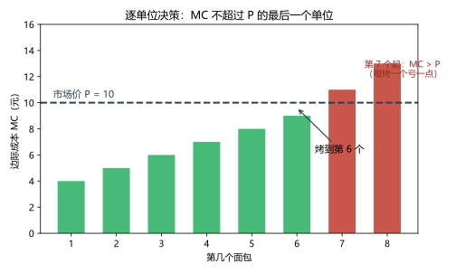
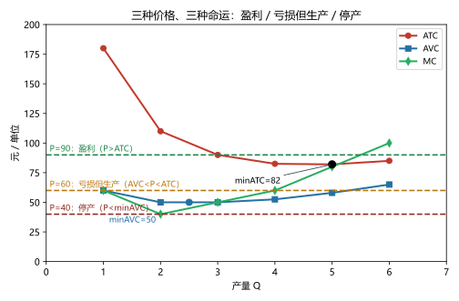
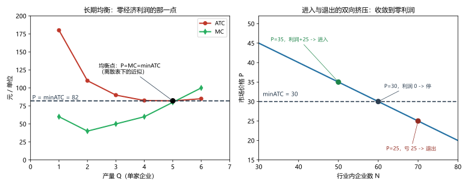

# 第 12 讲：竞争市场上的企业

> **前置**：第 11 讲（成本曲线七件套）、第 03 讲（竞争市场与价格接受者）、第 01 讲（沉没成本）。
> **预计时间**：约 2.5 小时（含作业）。
>
> **一句话定位**：全课程"企业决策"的第一讲——把 11 讲的七条成本曲线全部推上阵，回答竞争企业的三个生死问题：**生产多少、什么时候停产、长期还留不留**。顺便收获一条全课程通用的规则：**MR = MC**（它在第 13 讲垄断那里还会原样出现）。
>
> **本讲回答什么**：
> 1. 企业到底怎么决定产量？"多生产多赚"错在哪？
> 2. MR = MC 凭什么是利润最大点？
> 3. 亏损了为什么不马上关门？停产到底该看哪条线？沉没成本为什么不算数？
> 4. 长期均衡"零利润"，老板图什么？
> 5. 竞争企业的供给曲线，究竟是哪一段？
>
> **这一讲有真实验证**：逐单位决策（脚本 `scripts/lec12-01_verify_competitive_firm.py` 实验 1：烤到第 6 个、+21）；用 11 讲七件套表验证 P=MC 与停产线（实验 2）；长期进入-退出收敛（实验 3：N*=60、P*=30）。配图 3 张。

## 本讲怎么走（脉络图）

```
引子：烤到第几个？（多烤多赚吗）
  │
  ├─ 1. 竞争市场与"水平的需求线"：MR = P
  ├─ 2. 产量决策：做到 MR = MC（三视角 + 一行证明）（图 1）
  ├─ 3. 停产、沉没成本与退出：三情景图（图 2）
  ├─ 4. 长期均衡：进入与退出的双向挤压（图 3）
  ├─ 5. 供给曲线：MC 的"上半段"
  ├─ 6. 边界与纪律
  └─ 常见误区 → 本讲小结 → 掌握度自测 → 作业
```

> 下一站：§引子。面包房的老周回来了，这次他要回答一个每天都要问的问题：今天烤多少？

---

## 引子：烤到第几个？

老周的面包房开在一个"完全竞争"的街区：同一条街上有二十家面包房，面包长得几乎一样，谁也左右不了市场价。今天，**市场价是 10 元一个**（老周只能接受）。

老周的一天要烤若干个面包，每个面包的边际成本（第 k 个的成本）排出来是这样的：

| 第 k 个 | 1 | 2 | 3 | 4 | 5 | 6 | 7 | 8 |
|---|---|---|---|---|---|---|---|---|
| MC | 4 | 5 | 6 | 7 | 8 | 9 | **11** | 13 |
| 单件净得（10 − MC） | +6 | +5 | +4 | +3 | +2 | +1 | **−1** | −3 |
| 累计净得 | 6 | 11 | 15 | 18 | 20 | **21 ←最大** | 20 | 17 |

看图规律：**只要"下一个面包的成本"低于"卖价"，这一个就值得烤**；到第 7 个，成本（11）超过了卖价（10）——每烤一个净亏 1 元。所以：

> **今天烤 6 个**（累计净得 +21，全场最大）。



> **图 1 怎么读**：横轴是"第几个面包"，每根柱 = 那个面包的边际成本 MC；虚线是市场价 10 元。**绿柱（MC ≤ 10）值得烤；红柱（MC > 10）每烤一个就亏一点**——最优产量就停在"最后一个还是绿的"那里：第 6 个。

"多烤多赚""薄利多销"在这里当场阵亡——**多烤的那个，如果是倒贴的，就是多烤多亏**。这个"烤到 MC 不超过 P 为止"的动作，就是本章第一把钥匙；它的名字（MR = MC）下一节正式挂上。

---

## 1. 竞争市场与"水平的需求线"

### 1.1 回顾四条特征（第 03 讲的正式版）

竞争市场（本讲用它的完整标准版）：

1. **卖者很多**；
2. **产品同质**（买家不挑）;
3. 每个卖者都是**价格接受者**（谁也无法单独影响市价）；
4. **自由进出**——企业可以自由进入或退出这个行业（长期分析的关键，第 4 节的对手）。

### 1.2 一条水平的需求线 = MR = P

因为老周的商品由市场统一标价，**他眼中的需求线是一条水平线**：价格 10 元——他卖一个 10 元、卖一万个也是 10 元（他的产量对市场九牛一毛）。

由此得到竞争企业的"三收益合一"：

- **总收益 $TR = P \times Q$**；
- **平均收益 $AR = TR/Q = P$**；
- **边际收益 $MR = \Delta TR/\Delta Q = P$**——每多卖一个，收入增加恰好一个价格。

> **竞争企业的独有简化：$MR = P$**。垄断（13 讲）的世界里，这条会碎掉——那时"多卖"必须"降价"，MR 会低于 P，好戏才开始。本讲先用这个最简版把规则练熟。

> 下一站：产量规则的正式版——MR = MC。

---

## 2. 产量决策：做到 MR = MC

### 2.1 规则的表白

引子的结论换个写法就是本讲的中心规则：

> **利润最大化规则：在 $MR = MC$ 的地方停止。** 对竞争企业（$MR = P$），就是 **$P = MC$**。

说人话：**继续生产，直到"再做一个的额外收入"（MR）刚好赶上"再做一个的额外成本"（MC）；在那之前，每一单位都还赚着；在那之后，每一单位都开始倒亏。**

### 2.2 三种视角看同一条规则

**视角一：逐单位**（引子的表）——"MC ≤ P 的最后一个单位"。最直观，考试给表就用它。

**视角二：图形**——把 MC 曲线与价格水平线画在一起：它们的交点就是产量。但要小心一个细节：**U 形 MC 与水平线可能有两个交点**（下降段一个、上升段一个）。取哪一个？**上升段那个**。理由放在视角三里（它顺手做一个漂亮活）。

**视角三：微积分（一行定位"取上升段"）**：

$$\pi(Q) = P \cdot Q - C(Q) \Rightarrow \pi'(Q) = P - MC(Q) = 0 \text{ 给出 } P = MC;\qquad \pi''(Q) = -MC'(Q)$$

利润最大需要 $\pi'' < 0$，即 $MC'(Q) > 0$——**MC 必须在上升**。所以两个交点里，上升段的那一个才是利润最大点，下降段的那一个是"越做越亏的入口"。（这就是第 11 讲"边际穿平均"同款思路的又一次上阵——边际条件配二阶条件，一套动作打通。）

### 2.3 利润的"矩形表达"

找到产量 Q 之后，利润怎么算？两种等价写法：

$$\pi = TR - TC = (P - ATC) \times Q$$

第二种写法可以在图上"看"：**宽 = Q、高 = (P − ATC) 的矩形面积**。P 高于 ATC——矩形在横轴上方（盈利）；P 低于 ATC——矩形落在下方（亏损）。这个"矩形"是下一节三情景讨论的眼睛。

### 2.4 "薄利多销"的清算

把规则对齐说一遍，以后遇"多做点总没错吧"先问：

- 增量单位只要 $MR \ge MC$（竞争里即 $P \ge MC$）——做，利润增加；
- 增量单位 $P < MC$——**每做一单在倒亏**，勤快反而亏得多。

> 下一站：价格跌了、亏钱了——关不关门？这是本讲最有反直觉味道的一节。

---

## 3. 停产、沉没成本与退出

### 3.1 短期停产：亏损了为什么可能还该继续烤

市场的面包价开始波动。用第 11 讲老周的成本表（FC = 120/天；min AVC = 50；min ATC = 82）把四种价格算一遍（脚本 `lec12-01` 实验 2 实测）：

| 市场价 P | 按 P = MC 选产量 | 生产时的利润 | 停产时的利润 | 决断 |
|---|---|---|---|---|
| 90 | Q = 5 | **+40** | −120 | 生产（盈利） |
| 80 | Q = 5 | **−10** | −120 | **生产**（亏得少） |
| 60 | Q = 4 | **−90** | −120 | **生产**（亏得少） |
| 40 | —（P < minAVC） | 会更糟 | −120 | **停产** |

盯着第 2、3 行——它们才是本节的主角：**市场价明明低于成本（亏损），老周却应该继续开门**。为什么？把两个方案摆平了算：

- **生产方案**：利润 = $Q \times (P - AVC) - FC$；
- **停产方案**：利润 = $-FC$（不烤面包，但房租设备照付）。

两式对比，$-FC$ 在**两边同时出现**——它不参与决策（这就是**沉没成本**：钱已经花了、停产也收不回；第 01、11 讲一路埋的伏笔在此结账）。约掉之后：

> **生产优于停产 ⟺ $P > AVC$。**

而"最不该生产"的处境发生在 AVC 最小的时候，所以规则用最低点表述：

> **短期停产规则：价格跌破 $AVC$ 的最低点（min AVC）→ 停产；否则——哪怕亏损——继续生产，亏得比关门少。**

### 3.2 三情景图：一条价格线定生死



> **图 2 怎么读**（用 11 讲成本表的真数据画的三条线：ATC 红、AVC 蓝、MC 绿，外加三条价格水平线）：
> - **P = 90（高于 min ATC = 82）**：盈利区——(P − ATC) 的矩形在横轴上方；
> - **P = 60（夹在 min AVC = 50 与 min ATC = 82 之间）**：**亏损但生产区**——矩形在下方（亏），但比停产亏得少；图里 AVC 仍在 60 之下，"每卖一个还能收回一部分固定成本"；
> - **P = 40（低于 min AVC = 50）**：停产区——连"每卖一个的可变成本"都收不回，多卖多亏，索性关门。
> 三个点的分界：**min AVC 与 min ATC——两条平均线的谷底，管着三区的边界。**

### 3.3 长期退出：换一条线做判断

短期里"房租设备甩不掉"，长期里**一切都甩得掉**（租约到期、设备变卖）。于是长期退出决策的成本里不再有"必须付的 FC"：

> **长期退出规则：价格低于 $ATC$ 的最低点（min ATC）→ 退出这个行业**（这里比的是**长期**的盈亏，不是短期的现金流）。

两条规则放一起（考试最爱考的对照）：

| | 比哪条线 | 含义 |
|---|---|---|
| **短期停产** | min AVC | 暂停生产（FC 照付，人还在市场里） |
| **长期退出** | min ATC | 离开市场（一切都能甩掉） |

> **停产 ≠ 退出**：停产是"这段时间不烤"（固定成本还背着）；退出是"不干了"（把摊子盘出去）。一家停产的企业，看到价格回暖可以随时复工；一家退出的企业，要回来得重新置办全部家当。

> 下一站：所有企业都这么"进进出出"，行业会停在哪儿？

---

## 4. 长期均衡：进入与退出的双向挤压

### 4.1 一台"进入-退出机器"（实验 3）

设行业里每家企业都一样：**min ATC = 30、有效规模 = 5 个**；市场需求 $Q_d = 600 - 10P$。如果行业里有 N 家，总供给 = 5N，市场价格由 $5N = 600 - 10P$ 定出：$P = 60 - 0.5N$。看三个不同的 N（脚本实验 3 实测）：

| 行业家数 N | 市场价 P | 每家的利润 | 信号 |
|---|---|---|---|
| 50 | 35 | **(35 − 30) × 5 = +25** | **进入**——有超额赚头，外面的企业眼红 |
| 60 | 30 | **0** | **停留**——零经济利润，进入退出都无利可图 |
| 70 | 25 | **−25** | **退出**——亏钱的企业陆续离场 |

**双向挤压**的机制读成一个循环：

- 只要经济利润 > 0 → 新企业进入 → 供给右移 → 价格被压低 → 利润变薄；
- 只要经济利润 < 0 → 企业退出 → 供给左移 → 价格回升 → 亏损收窄；
- 两头夹击的结果：**停在经济利润 = 0 的地方**——即 $P = \min ATC$。



> **图 3 怎么读**：左图是单家企业的"终点"：价格线恰好压在 ATC 的最低点上（离散表下是近似，连续曲线里严格相切）——**P = MC = minATC，三点合一**。右图是行业层面的收敛机器：P 随 N 增加而下降（蓝线），高于 30 的区间利润为正（进入箭头）、低于 30 的区间利润为负（退出箭头）——N* = 60、P* = 30，双向箭头收敛到零利润。

### 4.2 长期均衡的三个含义（金句包）

市场收敛到的这个点，一句话能读出三层信息：

1. **$P = \min ATC$**：经济利润为零——所有资源都拿到"别处也能拿"的回报；
2. **每家都在"有效规模"上生产**：成本被压到最低档——**消费者拿到"最低可能的价格"**；
3. **$P = MC$**：产量的边际价值 = 边际成本——配置效率的"竞争之美"（第 06 讲账本的味道）。

### 4.3 "零利润，老板图什么？"（回引子、回 11 讲）

三个纠正：

- **零经济利润 ≠ 没收入**：工资、利息、正常回报全拿到，亏的只是"超额"；
- **零利润是"均衡态"不是"每时每刻"**：现实里行业总是在"波动中趋近"——先行的超额利润正是吸引大伙入场的胡萝卜，赶晚集的亏损是劝退的大棒；
- **对消费者**：这恰是最好的消息——**超额利润被"进入"抹平，全部好处落进了价格里**。

> 下一站：最后一节——这门课看来最"技术"的一个问题：企业的供给曲线是哪一段？

---

## 5. 供给曲线：MC 的"上半段"

把前三节的东西反向读一遍——**价格在变，企业会供多少？**

- P < minAVC：供 0（停产）；
- P > minAVC：按 P = MC 供（P 变 → 沿着 MC 的上升段移动）。

把"价格→产量"的对应关系连起来，得到的正是：

> **竞争企业的短期供给曲线 = MC 曲线在 min AVC 以上的那个上升段。**（低于 minAVC 的部分"折叠"成产量 0。）

三个常考细节：

1. **不是整条 MC**：minAVC 以下的下降段不进入供给曲线（那些价格下企业关门）；
2. **为什么必须"上升段"**：由 2.2 的二阶条件背书（利润最大点在 MC 上升处）；
3. **市场供给曲线**：把各企业的供给（横向）加总（第 03 讲"加总"的回收）；**长期里还要算上"进入/退出"——企业数会变，所以长期供给比短期更富弹性**（价格稍高就涌入新供给、稍低就退出）。

> 下一站：本讲的边界清单，之后是作业。

---

## 6. 边界与纪律

1. **"利润最大化"是一个工作假设**：现实企业有多元目标（市场份额、声誉、老板的偏好）。它作为基准模型已经被验证过"相当好用"——更细的检查留给第 18 讲（行为经济学）再访。
2. **完全竞争是基准，不是全部现实**：近似的行业（农产品、标准化制造）适用；一旦有"对手消失"（垄断）或"产品分化"（垄断竞争、寡头），本讲的简化（MR = P）就要松绑——后两讲的主线。
3. **长期均衡的"观察难点"**：市场上看到的"会计利润没归零"不矛盾——**主导调整的是经济利润**（要算隐性成本）；且真实行业永远在向均衡靠近的路上，而不是停在均衡点上。
4. **两条线的分工要背准**：停产看 **AVC**、退出看 **ATC**——每年考试都有人把这两条记反（本讲核心句再抄一遍）。

---

## 常见误区（本节零新知识，只破误）

1. **"多生产多赚（薄利多销）"**（引子、§2.4）。错。只有 $P \ge MC$ 的增量才增利；MC > P 的单位是"多做多亏"。
2. **"亏损就应该马上关门"**（§3.1）。错。只要 $P > \min AVC$，短期继续生产亏得比停产少——沉没的 FC 不参与决策。
3. **"沉没成本也要算进停产决策"**（§3.1）。错。$-\mathrm{FC}$ 在生产/停产两个方案里同时出现，自动抵消（01/11 讲一路的伏笔）。
4. **"停产 = 退出"**（§3.3）。错。停产是短期（FC 照付、随时复工）；退出是长期（甩掉一切、重新回来成本大）。
5. **"长期零利润 = 没收入 / 白忙活"**（§4.3）。错。零的是**超额**；正常回报（工资、利息）全部到位——这正是"健康的竞争"该有的样子。
6. **"竞争企业的供给曲线是整条 MC（或要跟 ATC 比）"**（§5）。错。供给曲线是 **MC 在 minAVC 以上的上升段**；跟 ATC 比的是"退出"不是"供给"。

## 本讲小结

一页纸的骨架：

- **竞争市场四特征 + 水平需求线**：$MR = P$（本讲的独有简化）。
- **产量规则**：做到 $MR = MC$——竞争版 $P = MC$；取 **MC 上升段**（二阶条件背书）；利润 = $(P - ATC) \times Q$ 的"矩形"。
- **短期停产**：比 **minAVC**——$P < \min AVC$ 停产，否则"亏损但继续"（沉没成本稀释）；**长期退出**：比 **minATC**。停产≠退出。
- **长期均衡**（进入/退出的双向挤压）：收敛到 **P = MC = minATC**——零经济利润 + 有效规模 + 配置效率"三点合一"；零利润是"正常回报"，不是白干。
- **企业供给曲线** = **MC 在 minAVC 以上的上升段**；市场供给 = 加总；长期供给更富弹性（家企业数可变）。
- **下一站预告**：MR = MC 这条规则马上要接受"对手消失"的考验——13 讲垄断。

## 掌握度自测

- [ ] 我能复述竞争市场四特征，并解释为什么竞争企业的 MR = P（水平需求线）。
- [ ] 我能用逐单位表找出"MC ≤ P 的最后一个单位"，并算出累计净得峰值。
- [ ] 我能写出 $\pi = (P-ATC)\times Q$ 的"矩形表达"，并说明二阶条件为什么要取 MC 上升段。
- [ ] 我能完整推导"生产 vs 停产"的两方案对照，并指出沉没成本如何被"稀释掉"。
- [ ] 我能背出"停产看 minAVC、退出看 minATC"两条规则，并各配一个数值判断。
- [ ] 我能复述进入-退出双向挤压的三步循环，并算 N=50/60/70 的利润信号（+25/0/−25）。
- [ ] 我能说出长期均衡的"三点合一"（P = MC = minATC）与各自的含义。
- [ ] 我能用一段话向朋友解释"长期零利润，老板图什么"（含"正常回报"）。
- [ ] 我能指出企业供给曲线是"MC 的 minAVC 以上上升段"，并说明另外两个"不是"（不是整条 MC、不是与 ATC 比较）。
- [ ] 我能复跑 `scripts/lec12-01`，解释输出里每一个数字（+21、+40、−10、−90、−120、N=50/60/70……）。

## 作业

> 答案只能用**已教概念**（本讲范围：MR=P、P=MC 规则、利润矩形、停产/退出两规则、沉没成本、长期零利润、供给曲线；可复用 11 讲成本表）。先独立做，再对答案。

### 基础

**Q1. 计算·逐单位决策**：某企业的边际成本（第 k 个单位）：3、4、6、8、10、13、16；市场价 P = 10。

(1) 生产到第几个单位？累计净得多少？
(2) 若市场价跌到 7：生产到第几个？

**参考答案**：
(1) MC ≤ 10 的最后一个单位是**第 5 个**（MC = 10）；Q = 5。累计净得 = 7 + 6 + 4 + 2 + 0 = **19**。
(2) MC ≤ 7 的最后一个：第 3 个（MC = 6；第 4 个 MC = 8 > 7）→ Q = 3。

**Q2. 计算·利润矩形**：某企业产量 Q = 8；市场价 P = 25；ATC = 22。

(1) 利润是多少？用"矩形"描述。
(2) 若 ATC = 27、AVC = 20：(a) 短期该生产还是停产？(b) 长期呢？

**参考答案**：
(1) $\pi = (25-22)\times 8 = $ **24**；图形上 = 宽 8、高 3 的矩形（在横轴上方）。
(2) (a) AVC = 20 < P = 25 → **短期继续生产**（亏损 (25−27)×8 = −16，好于停产）；(b) P = 25 < ATC = 27 → **长期退出**。

**Q3. 计算·停产判断**：三个情景（P / AVC / ATC）：(a) 18 / 15 / 20；(b) 12 / 14 / 18；(c) 16 / 16 / 19。

(1) 各判断短期该不该生产？
(2) 各判断长期该不该退出？

**参考答案**：
(1) (a) AVC 15 < 18 → **生产**（虽亏）；(b) 12 < 14 → **停产**；(c) 16 = 16 → 边界：生产与停产亏损相同（无所谓）。
(2) 三者 P 都 < ATC → (a)(c) **长期退出**；(b) 已停产，长期同样**退出/不进入**。

### 提高

**Q4. 计算·长期均衡推演**：某行业每家 min ATC = 25、有效规模 q = 4；市场需求 $Q_d = 260 - 4P$。

(1) 长期均衡价格是多少？行业总产量？家数 N*？
(2) 若现在有 30 家：市场价多少？每家赚多少？该进入还是退出？
(3) 若现在有 50 家：同上各问。

**参考答案**：
(1) P* = min ATC = **25**；Q = 260 − 100 = **160**；N* = 160/4 = **40 家**。
(2) N = 30：Q = 4×30 = 120 → P = (260−120)/4 = **35**；利润/家 = (35−25)×4 = **+40** → **进入**。
(3) N = 50：Q = 200 → P = (260−200)/4 = **15**；利润 = (15−25)×4 = **−40** → **退出**。
（收敛方向：向 N* = 40、P* = 25 双向挤压。）

**Q5. 辨析题**：判断对错并简说理由。

(a) "亏损时立刻停产总是最优。"
(b) "沉没成本应该纳入停产决策，毕竟钱真花了。"
(c) "长期零利润意味着这些企业迟早会倒闭。"
(d) "竞争企业的供给曲线就是它整条 MC 曲线。"

**参考答案**：
(a) 错。只要 $P > \min AVC$，停产亏得更多（§3.1）。
(b) 错。FC 在两个方案里同时出现、自动抵消——它不参与决策（§3.1）。
(c) 错。零经济利润 = 全部资源拿到正常回报；企业"继续干与退出无所谓"，且会计利润往往为正（§4.3）。
(d) 错。是 **MC 在 minAVC 以上的上升段**（下面那段折叠为 0）；另外它不与 ATC 挂钩（§5）。

**Q6. 简答·停产线**：请用"生产 vs 停产"两个方案的利润表达式，推导"P > minAVC 就生产"的结论（要写出约掉 FC 的那一步）。

**参考答案**：
生产：$\pi_{生} = Q(P - AVC) - FC$；停产：$\pi_{停} = 0 - FC = -FC$。
比较：$\pi_{生} > \pi_{停} \iff Q(P - AVC) > 0 \iff P > AVC$。
（$-FC$ 两边同在、自动约掉——沉没成本不参与决策；当 P 落到"最不划算的处境"即 minAVC 之下时停产。）

### 综合（回扣本讲主任务）

**Q7. 综合·面包房的三档价格**：接 11 讲的老周（FC = 120；min AVC = 50、min ATC = 82；MC 表：60、40、50、60、80、100）。

(1) 市场价 P = 85：产量？利润？
(2) 市场价跌到 P = 55：产量？利润？该生产还是停产？
(3) 市场价跌到 P = 45：该生产还是停产？亏多少？
(4) 若价格长期停在 55：老周该考虑什么？（用哪条线、什么方向）

**参考答案**：
(1) MC ≤ 85 → Q = 5（MC(5) = 80 ≤ 85；MC(6) = 100 > 85）；利润 = (85 − 82)×5 = **+15**。
(2) MC ≤ 55 → Q = 3（MC(3) = 50；MC(4) = 60 > 55）；利润 = 55×3 − 270 = **−105**；停产 = −120 → **生产**（AVC(3) = 50 < 55 ✓）。
(3) 45 < minAVC = 50 → **停产**；亏 **−120**（=−FC）。
(4) P = 55 < minATC = 82 → 长期看是**退出信号**（短期先撑着，长期考虑离场）。

**Q8. 简答·开放："零利润了，大家图什么？"**：向一位朋友解释：既然长期均衡经济利润为零，为什么还有企业进入竞争行业、竞争为什么值得被赞美？

**参考答案**：
要点 1：**零利润 ≠ 白干**——工资、资金利息等"正常回报"全部拿到；零掉的只是"超额"。企业进出是因为**动态中存在暂时超额**（先进入者赚到的那段）；等到大家挤满，超额被"进入"抹平——这正是胡萝卜与大棒交替工作的过程。
要点 2：**竞争的好处落在消费者口袋里**：超额利润被竞争"磨掉"，价格被压到"最低成本"（P = minATC）、每家都在有效规模生产（P = MC 配置效率）——这就是"看不见的手"在行业内的一部完整运行实录（与第 06 讲的账本结论首尾呼应）。
（评分要点：正常回报 + 动态/暂时性 + 消费者受益三点中至少答出前两点。）

---

*下一讲预告：第 13 讲《垄断》——把竞争对手全部赶走，只剩一家，会发生什么？那条水平的需求线突然变成整条向下倾斜的市场需求——"多卖"从此必须"降价"，一条新规则（MR < P）登场；而 MR = MC 这条老规则，将带着全新的面貌再来一次。*