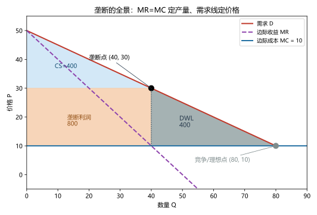
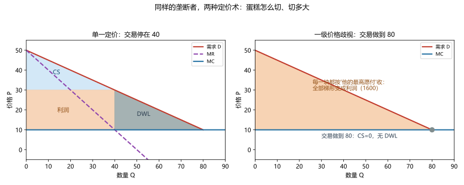
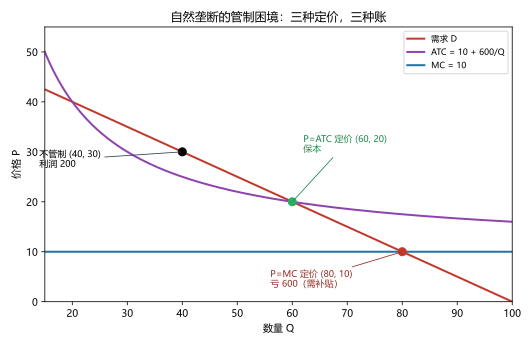

# 第 13 讲：垄断

> **前置**：第 12 讲（MR = MC 规则与竞争基准）、第 06 讲（账本与 DWL）、第 04 讲（总收入峰）。
> **预计时间**：约 2.5 小时（含作业）。
>
> **一句话定位**：把竞争对手全部赶走，只剩一家——会发生什么？那条水平的需求线突然变回整条向下倾斜的市场需求，"多卖必须降价"（**MR < P**）登场；而第 12 讲的老规则 MR = MC 会带着**全新的面貌**再来一次。本讲顺便回答三个经典问题：垄断者为什么不能"想收多贵收多贵"、垄断的代价到底有多大、价格歧视为什么"未必是坏事"。
>
> **本讲回答什么**：
> 1. 垄断者为什么不能想收多贵收多贵？
> 2. MR < P 是为什么？"多卖一件"亏不亏？
> 3. 垄断利润怎么算？和竞争差多少？代价（DWL）怎么算出来？
> 4. 价格歧视——同样东西卖不同价，为什么说它未必是坏事？
> 5. 政府管制垄断价格为什么不是"一句话的事"？
>
> **这一讲有真实验证**：收入-边际收益表（脚本 `scripts/lec13-01_verify_monopoly.py` 实验 1）；"多卖一个"的价格效应拆账（实验 2）；垄断/竞争/价格歧视三方福利对比（实验 3）；自然垄断的管制三选（实验 4）。配图 3 张。

## 本讲怎么走（脉络图）

```
引子：山顶唯一的缆车（"想收多贵收多贵"的第一次破产）
  │
  ├─ 1. 垄断的定义与四种成因
  ├─ 2. 垄断者的收益法则：MR < P（图 1 的原料）
  ├─ 3. 定价：MR = MC 定产量、需求线定价格（图 1）
  ├─ 4. 福利代价：DWL 与"利润≠损失"的辨析
  ├─ 5. 价格歧视：更少的死损、更多的转移（图 2）
  ├─ 6. 公共政策：管制的三种定价与各自的坑（图 3）
  ├─ 7. 边界与纪律
  └─ 常见误区 → 本讲小结 → 掌握度自测 → 作业
```

> 下一站：§引子。一座没有竞争对手的山。

---

## 引子：山顶唯一的缆车

某景区只有一条上山缆车（另一条路要爬四小时——算不上替代品）。运营方盘算："独此一家，我说了算！"

市场部送来做过的问卷——**不同票价下每天的乘客数**：

| 票价（元） | 10 | 20 | **30** | 40 | 50 |
|---|---|---|---|---|---|
| 乘客（人/天） | 1000 | 800 | 600 | 400 | 200 |
| 日收入（元） | 10000 | 16000 | **18000** | 16000 | 10000 |

看最后一行的形状：**先升后降，峰在 30 元**。"想收多贵收多贵"第一次破产：

- 定 50：每天只剩 200 个真·土豪，收入腰斩；
- 定 10：人山人海，但每人只掏一点点。

**垄断者的"定价自由"，被自己面对的需求线锁得死死的**——他只有"沿需求线选一个点"的自由，没有"跳出需求线"的自由。这正是本讲的第一个主题。而选点的算法（不能只看收入，还要看成本）背后，藏着一条与竞争截然不同的收益法则——**MR < P**——它是本节和下节的主角。

---

## 1. 垄断的定义与四种成因

### 1.1 定义

> **垄断（monopoly）：市场上唯一的卖者，且它的商品没有接近的替代品。** 这种"能影响价格"的能力，叫**市场势力（market power）**。

关键图景切换（相对第 12 讲）：竞争企业面对的是**一条水平线**（市场价，个体撼不动）；垄断者面对的是**整条向下倾斜的市场需求**——他想多卖，市场的反应是"那得便宜点"。

### 1.2 四种成因（考试分类题的四格）

| 成因 | 机制 | 例子 |
|---|---|---|
| **资源独占** | 关键资源归一家 | 某种特殊矿泉的水源（历史经典案例） |
| **政府特许** | 牌照、许可、专利 | 专利药；专营牌照 |
| **自然垄断** | 规模经济强到"一家供全市场成本最低"（ATC 一路下降） | 自来水管网、电网、地铁 |
| **竞争胜出/网络效应** | 技术或标准之争"赢家通吃" | 某种成了事实标准的平台（第 18 讲再访） |

四个成因对政策的含义完全不同（§6 展开）：**自然垄断**禁不了也不该禁（两家铺管网纯浪费），而**人为垄断**（合谋、排他）是反垄断法的靶子。

---

## 2. 垄断者的收益法则：MR < P

### 2.1 需求、收入与边际收益（实验 1 实测）

本讲主场景：反需求 **$P = 50 - Q/2$**（市场需求的正常形态），边际成本 **$MC = 10$**（简化：一条水平线）。先把收益的账摊开（脚本实验 1）：

| Q | 0 | 10 | 20 | 30 | 40 | 50 | 60 | 70 | 80 |
|---|---|---|---|---|---|---|---|---|---|
| P | 50 | 45 | 40 | 35 | **30** | 25 | 20 | 15 | 10 |
| TR = P×Q | 0 | 450 | 800 | 1050 | 1200 | **1250（峰）** | 1200 | 1050 | 800 |
| **MR = ΔTR/ΔQ**（每 10 单位一格的段平均） | — | **45** | 35 | 25 | **15** | 5 | −5 | −15 | −25 |

两个要点：TR 先升后降（第 04 讲"总收入峰"的老相识：峰在 Q=50，正对应单位弹性）；而 MR 对比价格——表中的 MR 是每格"平均增量"的近似值，真正的点值公式是 **MR(Q) = 50 − Q**：**在任意 Q 上都低于 P(Q) = 50 − Q/2，且越往后落差越大**（Q=40 处：P=30、MR=10；而 Q=70 处：P=15、MR=−20）。

### 2.2 MR < P 的机制：多卖一个的"两笔账"

为什么 MR 会低于价格？做一次"多卖一个"的拆账（脚本实验 2）——当前卖 40 个、单价 30，想多卖 1 个：

- **数量效应（进账）**：多卖的那 1 个，新价格 29.5——收 **+29.5**；
- **价格效应（倒账）**：要让**全体**顾客都按新价买（不然老顾客凭什么多掏），原来的 40 个单位每单位降 0.5——亏 **−20**；
- **净增 = 29.5 − 20 = 9.5** ≈ MR(40) = 10（离散近似的误差）。

> **竞争企业的 MR = P：因为它多卖一个不需要降价**（价格是市场白给的）。**垄断者的 MR < P：每一单增量都必须先给所有老顾客"发红包"**（降价）。这就是垄断收益法则的物理内容——不是心黑，是"多卖必须降价"的数学。

### 2.3 线性需求下的 MR（一行公式）

> **微积分视角（两行，与第 04 讲的总收入同源）**：若需求 $P = a - bQ$，则 $TR = aQ - bQ^2$，于是 $MR = a - 2bQ$——**MR 的截距和需求一样，斜率是它的两倍**（每个 Q 上，MR 都比 P 低 $bQ$：卖得越多、红包发得越狠）。本讲主场景：$P = 50 - Q/2 \Rightarrow MR = 50 - Q$——下一节就用它。

> 下一站：拿着 MR 和 MC 两根曲线，去解垄断者的定价题。

---

## 3. 定价：MR = MC 定产量、需求线定价格

### 3.1 两步口诀

第 12 讲的通用规则原样搬来：利润最大化在 **MR = MC**。垄断版只是多了一步"读价格"：

> **第一步：解 MR = MC，定产量。** 本场景：$50 - Q = 10 \Rightarrow Q = 40$；
> **第二步：拿这个产量去需求线上找价格。** $P = 50 - 40/2 = 30$。

**垄断者"定的是价格、卖的是量"**：产量由边际条件决定，价格则永远落在需求线上——他不可能"既要 40 的量、又要 50 的价"（那是需求线之外的点，无人应答）。

### 3.2 全景图



> **图 1 怎么读**（本讲的总地图，四块颜色一个交点）：
> - **紫色虚线 MR** 与 **蓝色 MC = 10** 相交处向下引垂线 → 产量 **Q = 40**；
> - 垂线向上碰到**红色需求线** → 价格 **P = 30**（"两步口诀"的图形版）；
> - **橙色矩形 = 垄断利润**：$\pi = (P - ATC)\times Q$——本场景简化里没有固定成本，ATC = MC = 10，于是 $\pi = (30-10)\times 40 =$ **800**；
> - **浅蓝三角 = 消费者剩余 400**；**灰色三角 = DWL 400**；
> - 最右侧灰点是"如果这个市场是竞争的"：$P = MC = 10 \Rightarrow Q = 80$——**产量减半、价格三倍**，一句话概括垄断与竞争的差距。

### 3.3 利润的算法与一般情形

利润还是老公式 $\pi = (P - ATC) \times Q$——**先"两步口诀"拿到 P 和 Q，再查 ATC 代入**（本讲简化场景 ATC = 10；一般情形按 11 讲的方法算）。考试出题的模式基本就这两种：给函数解两步；或给表查点。

> 下一站：赚了 800 就完事了吗？社会层面的账还要算——那才是垄断"贵"的真正所在。

---

## 4. 福利代价：DWL 与"利润 ≠ 损失"

### 4.1 三方福利对照（实验 3 实测）

把垄断、竞争（同样的需求与成本）、完美价格歧视放在一张表里（后两者马上讲）：

| 场景 | 产量 Q | 价格 P | 消费者剩余 | 生产者利润 | 总剩余 |
|---|---|---|---|---|---|
| **垄断定价** | 40 | 30 | 400 | **800** | **1200** |
| **竞争（P = MC）** | 80 | 10 | **1600** | 0 | **1600** |
| （完美价格歧视） | 80 | 因人而异 | 0 | 1600 | 1600 |

垄断让总剩余从 1600 掉到 1200——**DWL = 400**，正是灰色三角：$40 \to 80$ 之间那些"WTP 高于 MC"的交易被拦下了（第 07 讲"被政策吓退的交易"在这里换成了"被垄断压小的产量"）。

### 4.2 一个必须当场钉死的辨析：垄断利润 ≠ 损失

回头看数字：垄断利润 800——**它是不是"社会的损失"？不是。** 它是**转移**：从消费者的 CS 里搬过来的（消费者多掏的钱）。社会真正的净损失只有 400（蒸发的那块）：**利润有主，DWL 无主**——这是第 07 讲"转移 vs 蒸发"辨析的第三次返场（05、07、13，已成家族传统）。

> 所以对垄断的标准批评，不能说"它赚太多"（赚多赚少是分配问题），而要说：**"它把交易做得太少"**——$40 \to 80$ 之间的买卖被硬生生拦在外面（配置问题）。这一区分是考试辨析题的命根子。

> 下一站：有没有一种定价术，既让垄断者多赚、又让交易做多？有——但它有自己的脾气。

---

## 5. 价格歧视：更少的死损、更多的转移

### 5.1 定义与逻辑

> **价格歧视（price discrimination）：对同一商品，向不同顾客收取不同的价格。**

动机一句话：**总有些人心里的价码低于统一价**——把他们放进来就是钱；但不能让"全价客"发现自己在补贴别人（或转手倒卖），否则生意崩盘。所以价格歧视有两个**实现条件**：

1. **市场可分割**（能把顾客分开：学生证、提前购票、地区）；
2. **防转售**（买便宜的没法倒卖给买贵的——理发好防、大米难防）。

### 5.2 三张面孔（教材分类）

- **一级（完美）歧视**：对每个人、每个单位，按"他的最高愿付"定价——把 CS 一网打尽；
- **二级（按量）**：买得多价更低（批发价、第二杯半价）；
- **三级（按群）**：分成几个群体、各给各价（学生票、老年票、分时电价）。

### 5.3 数字：完美歧视的"一面两刀"（实验 3）

同一垄断者改用**一级歧视**（对 80 个单位逐一按愿付定价）：

| | 产量 | 消费者剩余 | 利润 | 总剩余 | DWL |
|---|---|---|---|---|---|
| 单一定价 | 40 | 400 | 800 | 1200 | 400 |
| **完美歧视** | **80** | **0** | **1600** | **1600** | **0** |

读出来两刀：

- **效率那把（切蛋糕）**：产量回到 80——**DWL 归零**，社会蛋糕恢复 1600（"完美歧视的厂商，像个把每笔交易都撮合成功的拍卖人"）；
- **分配那把（分蛋糕）**：消费者的 400 全部搬进厂商口袋（CS = 0）——**效率改善，分配恶化**。



> **图 2 怎么读**：左图（单一定价）三块颜色：CS 蓝、利润橙、DWL 灰——交易停在 40。右图（完美歧视）：整个"需求线下方、MC 上方"的梯形全变成利润（橙），交易做到 80，**没有灰色**——没有死损，也没有消费者剩余。

### 5.4 "未必是坏事"的完整回答（链条问题收官）

- **效率上**：歧视往往扩大产量、减少 DWL（那些"只肯少出钱"的人被拉进市场）；
- **分配上**：它把剩余从消费者搬向厂商（老顾客没了 CS）——**不是慈善**；
- **所以"好/坏"取决于你关切哪个轴**——又回到"效率 vs 平等"的基础框架（06 讲）。
- 现实版只言片语：机票的提前购折扣、学生票、超市优惠券——都是三级的日常实现；"大数据杀熟"的争议，则是"分割过头（按人定价）+ 消费者不知情"引发的新战场（第 18 讲语境下再想它）。

> 下一站：政府看不下去了——管制垄断价格，为什么这么难？

---

## 6. 公共政策：管制的三种定价与各自的坑

### 6.1 四种武器

对付垄断，政策家族的四个成员：**① 反垄断法**（拆分、禁止合谋——打"人为垄断"）；**② 价格管制**（管"自然垄断"）；**③ 公有制**（政府自己办）；**④ 什么都不做**（有时"政府失灵"比"市场失灵"更贵——权衡论）。本课程把镜头对准②，因为它的坑最深。

### 6.2 为什么"管个价"这么难（实验 4）

换一家**典型自然垄断企业**的数字（固定成本巨大：ATC = 10 + 600/Q，一路下降；MC = 10 水平），三个定价方案（脚本实验 4 实测）：

| 方案 | 价格 | 产量 | 账目 |
|---|---|---|---|
| 不管制（MR = MC） | 30 | 40 | 利润 **200** |
| **P = MC 定价**（"效率价"） | 10 | 80 | **亏 600**——固定成本一分收不回，得靠补贴活着 |
| **P = ATC 定价**（"保本价"） | 20 | 60 | 利润 **0**（保本），但**没有降本激励**（成本反正都能转嫁） |



> **图 3 怎么读**：紫色 ATC 一路上降（自然垄断的标志），与需求线交于 (60, 20)——这是 P = ATC 保本点；MC = 10 线在 ATC 下方，P = MC 落在 (80, 10)——产量最足、但企业在亏钱（信息不对称之下，"补贴多少"又是一场扯皮）；黑点 (40, 30) 是不管制的现状。**效率、保本、激励——三样凑不齐**，这就是管制不是"一句话的事"的完整理由。

### 6.3 政策的逻辑分类（一句话各记）

- **自然垄断**（管网、轨道）：拆分反而浪费 → 管制或公有为主；
- **人为垄断**（排他、合谋）：反垄断法为主；
- 所有工具都绕不开根问题：**管制者不知道真实的成本曲线**（信息不对称——18 讲的主题之一在这里先打了个照面）。

> 下一站：本讲边界清单。

---

## 7. 边界与纪律

1. **静态账与动态账**：垄断的 DWL 是**静态**代价；但某些垄断（专利）是**为创新发的奖金**——"用暂时的垄断换长期的技术进步"，是否划算是一门制度设计的手艺（作业 Q8 展开）。别只会算静态账。
2. **自然垄断会"被技术瓦解"**：规模经济的优势随技术变迁（发电、通信的历史都演过这出）——"自然"二字是有时代条件的。
3. **市场界定是争议源头**："没有接近的替代品"里的"接近"，判起来主观性很大——反垄断执法的第一道技术关就在这。
4. **垄断≠大**：大企业未必是垄断（要看替代品与市场势力）；小而唯一（小镇唯一理发店）也可能是。

---

## 常见误区（本节零新知识，只破误）

1. **"垄断者想收多贵收多贵"**（引子、§3.1）。错。他被需求线锁死，只能"沿需求线选点"；选点的解由 MR = MC 唯一确定。
2. **"垄断者一定赚大钱"**（§3.3）。不必然。需求太弱或成本太高时，垄断者也会亏损（利润取决于 P 与 ATC 的比较）。
3. **"MR < P 是因为垄断者心黑"**（§2.2）。错。是"多卖必须给全体老顾客降价"的物理事实（价格效应），和道德无关。
4. **"垄断利润就是社会的净损失"**（§4.2）。错。利润是**转移**（从消费者到厂商）；净损失只有 DWL（本例 400）——"利润有主、DWL 无主"。
5. **"价格歧视纯粹是坏事"**（§5.4）。不全面。它常常扩大交易、减少 DWL（效率面改善），同时转移 CS（分配面恶化）——两轴分开说。
6. **"管制就是政府定一个价"**（§6.2）。错。P = MC 会亏（需补贴）、P = ATC 无激励、信息不对称根本存在——"定个价"底下是三重困境。

## 本讲小结

一页纸的骨架：

- **垄断**=唯一卖者+无近似替代；成因四格（资源/特许/自然/胜出）；面对**整条市场**需求线。
- **收益法则**：$MR < P$——数量效应 vs 价格效应（"多卖一个要给全体发红包"）；线性需求 $P = a-bQ \Rightarrow MR = a-2bQ$（斜率两倍）。
- **定价两步**：MR = MC 定产量（40）、需求线定价格（30）；利润 = (P−ATC)×Q（本例 800）。
- **福利代价**：DWL = 400（被压小的 40→80 段交易）；**利润 800 是转移、DWL 400 才是净损**——"它把交易做得太少"。
- **价格歧视**：条件（可分割+防转售）、三张面孔；完美歧视把产量做回 80（DWL=0）、把 CS 清零——**效率改善、分配恶化**。
- **政策**：反垄断/管制/公有/不管；管制三选各有坑（MC 价亏损、ATC 价无激励、信息不对称）。
- **静态 vs 动态、市场界定、"自然"有时效**——边界三条。

## 掌握度自测

- [ ] 我能说出垄断的四种成因，并区分自然垄断与人为垄断的政策含义。
- [ ] 我能用"数量效应 + 价格效应"讲清 $MR < P$，并复算 29.5 − 20 = 9.5 的拆账。
- [ ] 我能写出 $P = a - bQ$ 的 MR 公式（斜率两倍）并快速转换。
- [ ] 我能完成"两步口诀"：解 MR=MC 定 Q、上需求线定 P，并算出利润 (P−ATC)×Q。
- [ ] 我能画出/描述垄断全景图（需求、MR、MC、垄断点、竞争点、利润矩形、DWL 三角）。
- [ ] 我能算出垄断的 DWL（本例 400）并解释它对应哪些被拦下的交易。
- [ ] 我能用数字论证"垄断利润（800）≠ DWL（400）"（转移 vs 蒸发）。
- [ ] 我能说出价格歧视的两个条件、三种类型，并用"两把刀"复述完美歧视的效率与分配效果。
- [ ] 我能复述管制三选与各自的坑（MC 亏损/ATC 无激励/信息不对称）。
- [ ] 我能复跑 `scripts/lec13-01`，解释输出里每一个数字（1200、1250、9.5、400、800、1600、600、200……）。

## 作业

> 答案只能用**已教概念**（本讲范围：垄断成因、MR<P、两步口诀、利润矩形、DWL、转移 vs 蒸发、价格歧视、管制三选；可复用 CS/TS 账本）。先独立做，再对答案。

### 基础

**Q1. 计算·MR 与定价**：某垄断者的需求表：Q = 1、2、3、4、5 时 P = 20、18、16、14、12。

(1) 补全 TR 与各段 MR（ΔTR/ΔQ）；
(2) 写出连续版本"P = 22 − 2Q"的 MR 公式，并验证 Q = 3 处 MR < P；
(3) 若 MC = 8（常数）：最优产量与价格（按表格离散判断；注明连续口径的答案）。

**参考答案**：
(1) TR：20、36、48、56、60；各段 MR：—、16、12、8、4。
(2) MR = 22 − 4Q；Q = 3：P = 16、MR = 10 < 16 ✓（斜率两倍的口诀）。
(3) 离散表：最后一个"段 MR ≥ MC"的是 Q = 4（ΔTR/ΔQ = 8）→ **Q = 4、P = 14**。（连续口径：MR = 8 → Q = 3.5、P = 15——两种口径都写出来更稳。）

**Q2. 计算·垄断的一篇账**：某垄断：$P = 60 - Q$；$MC = 20$（无固定成本）。

(1) 求 MR 公式；解 MR = MC 得产量；上需求线得价格；
(2) 求垄断利润；求消费者剩余；
(3) 若竞争（P = MC）：产量、价格各多少？竞争下的 CS？
(4) 求 DWL。

**参考答案**：
(1) MR = 60 − 2Q；60 − 2Q = 20 → **Q = 20**；P = **40**。
(2) 利润 = (40 − 20)×20 = **400**；CS = ½×20×(60−40) = **200**。
(3) 竞争：Q = 40、P = 20；CS = ½×40×(60−20) = **800**。
(4) DWL = ½×(40−20)×(40−20) = **200**。验算：竞争 TS = 800；垄断 TS = 200 + 400 = 600；差 = 200 ✓（与三角公式互证）。

**Q3. 辨析题**：判断对错并简说理由。

(a) "垄断者可以随意定价。"
(b) "垄断的全部危害就是消费者多付的钱。"
(c) "MR 低于 P，说明垄断者效率低。"
(d) "价格歧视一定是坏事。"

**参考答案**：
(a) 错。需求线约束：定价必须落在需求线上；最优点由 MR = MC 唯一给出（§3.1）。
(b) 错。多付的钱是转移（到厂商利润）；真正的净损失是 DWL——被拦下的交易（§4.2）。
(c) 错。MR < P 是"多卖必须降价的"价格效应的数学结果，与"效率"是两码事（§2.2）。
(d) 错。效率面上它常减少 DWL（把低价敏感的用户也拉进来）；分配面才把 CS 转移走——两把刀分开（§5.4）。

### 提高

**Q4. 计算·价格歧视对比**：某垄断：$P = 30 - Q$；$MC = 6$。

(1) 单一定价：产量、价格、利润、CS？
(2) 完全竞争基准（P = MC）：产量、价格、竞争 CS？
(3) 一级价格歧视：产量、利润、CS、DWL？
(4) 一句话比较三种情形的效率与分配。

**参考答案**：
(1) MR = 30 − 2Q = 6 → **Q = 12**、P = **18**；利润 = (18−6)×12 = **144**；CS = ½×12×12 = **72**。
(2) Q = 24、P = 6；CS = ½×24×24 = **288**。
(3) Q = **24**（做到 P = MC）；利润 = 梯形 −成本 = ∫₀²⁴(30−Q)dQ − 6×24 = 432 − 144 = **288**；CS = **0**；DWL = **0**。
(4) 效率面：歧视更好——DWL 从 72 降为 0（交易做满 24）；分配面：CS 从 72 降为 0、厂商利润从 144 升到 288——**蛋糕做大、切法改写**。

**Q5. 简答·"利润 ≠ 损失"**：用 Q2 的数字说明："垄断者赚了 400，社会是不是亏了 400？"（要出现"转移""蒸发"两个词）

**参考答案**：
不是。垄断利润 400 是**转移**：从消费者的 CS 里搬过来的（消费者多付、厂商多收，总账不少）；社会真正的**蒸发**（净损失）是 DWL = 200——那 20→40 段被拦下的交易本可产生的剩余，谁也不得到。所以准确说法：**"赚 400"是分配问题；"蒸发了 200"才是效率问题。**

**Q6. 简答·管制三选**：政府给自然垄断定价，三个选项各自的问题是什么？（各一句话）

**参考答案**：
- **P = MC（效率价）**：价格在 ATC 之下 → 企业亏损（固定成本收不回），需要财政补贴，且"补多少"依赖看不见的成本信息；
- **P = ATC（保本价）**：不亏不赚，但企业没有降低成本的压力（成本能全额转嫁），还可能虚报成本抬高"保本线"；
- **不管制**：DWL 存在（本例产量 40 vs 60+）；——三选都不完美，根子在**信息不对称**。

### 综合（回扣本讲主任务）

**Q7. 综合·一篇完整的垄断账**：某垄断：$P = 100 - 2Q$；$MC = 20$。

(1) 求 MR；用两步口诀求 Q、P；
(2) 利润、垄断 CS；
(3) 竞争基准（P = MC）：Q、P、CS；
(4) DWL；
(5) 若它改用一级歧视——哪个数字归零、哪个数字变成多少（只需定性说出 CS 与 DWL 的走向）。

**参考答案**：
(1) MR = 100 − 4Q；= 20 → **Q = 20**；P = 100 − 40 = **60**。
(2) 利润 = (60−20)×20 = **800**；CS = ½×20×(100−60) = **400**。
(3) 竞争：P = 20 → Q = 40；CS = ½×40×80 = **1600**。
(4) DWL = ½×(40−20)×(60−20) = **400**（核对：竞争 TS 1600；垄断 TS 800+400 = 1200；差 400 ✓）。
(5) 一级歧视：产量做到 40；**CS → 0**、**DWL → 0**（效率恢复、剩余全转移给厂商）。

**Q8. 简答·开放：专利该不该存在？**：专利=政府特许的合法垄断。用本讲工具写一个两段式回答：(1) 静态账——专利的代价是什么；(2) 动态账——它的理由是什么，以及设计时要注意什么。

**参考答案**：
(1) 静态账：专利期内定价如垄断——产量被压小（Q < 竞争量）、DWL 存在、消费者多付；本例的 400/200 一类 DWL 就是这类"静态代价"的模样。
(2) 动态账：专利是**给创新的悬赏**——没有独占期的预期利润，新药/新技术的研发激励会被大幅削弱；用"暂时的垄断"换"长期的技术进步"，在动态账上可能大幅为正。
设计要点：**期限与范围是旋钮**——太短/太窄激励不足，太长/太宽拖延竞争与后续创新（现实中：专利期、强制许可、竞品加速审批等制度都在调这个旋钮）。结论句式：不能只拿静态 DWL 判"该不该"，也不能只说"创新重要"就无视代价——**两本账一起算，然后在旋钮上找平衡**。

---

*下一讲预告：第 14 讲《垄断竞争与寡头》——现实里"一家"和"很多家"都少见，最常见的是中间态：一群卖着"相似但不一样"东西的竞争者（奶茶街），和几个互相盯着对方出牌的巨头（运营商）。博弈论第一次正式登场：支付矩阵、纳什均衡、囚徒困境——"你猜我怎么出，我猜你怎么猜"。*