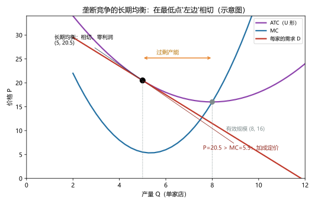
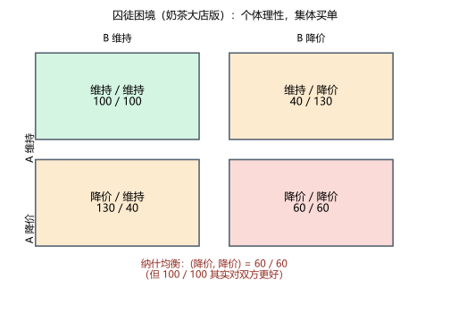
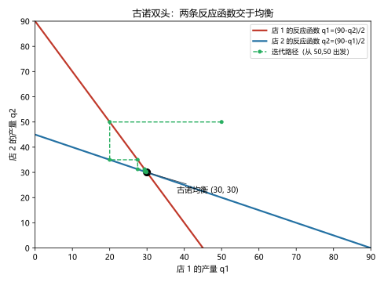

# 第 14 讲：垄断竞争与寡头

> **前置**：第 12 讲（竞争基准）、第 13 讲（垄断与 MR<P）、第 10 讲（公地悲剧）。
> **预计时间**：约 2.5 小时（含作业）。
>
> **一句话定位**：市场结构谱系的最后两块拼图——"每家都不一样"的街（垄断竞争）和"只剩几家、互相盯着出牌"的局（寡头）。后半程换一套新工具：**博弈论**（支付矩阵、纳什均衡、囚徒困境、古诺），专门处理那类"我的最优取决于你的动作"的问题。
>
> **本讲回答什么**：
> 1. 小吃街这种"每家味道不一样"的市场，凭什么既不算完全竞争也不算垄断？
> 2. 寡头为什么叫"策略互动"？纳什均衡到底是什么？
> 3. 囚徒困境里，两个人怎么都选了坑自己的那招？
> 4. 古诺模型怎么算？为什么"自利"会把行业推离合作？
> 5. 重复博弈为什么可能维持合作？
>
> **这一讲有真实验证**：垄断竞争长期均衡的相切（脚本 `scripts/lec14-01_verify_monopolistic_oligopoly.py` 实验 1）；囚徒困境矩阵的占优策略验证（实验 2）；古诺反应函数的迭代收敛（实验 3：双起点都收敛到 (30,30)）；古诺/合谋/竞争三方对照（实验 4）。配图 3 张。

## 本讲怎么走（脉络图）

```
引子：奶茶街的怪圈 + 街口两家的棋局（两幕）
  │
  ├─ 1. 垄断竞争：相切在最低点"左边"的长期均衡（图 1）
  ├─ 2. 寡头：什么叫"策略互动"
  ├─ 3. 博弈论工具箱：支付矩阵、占优策略、纳什均衡、囚徒困境（图 2）
  ├─ 4. 寡头的两条路：合谋的诱惑与古诺的收敛（图 3）
  ├─ 5. 四谱系总表：把市场结构一次收拢
  ├─ 6. 边界与纪律
  └─ 常见误区 → 本讲小结 → 掌握度自测 → 作业
```

> 下一站：§引子。一条街的怪圈，和两个人的棋局。

---

## 引子：奶茶街的怪圈 + 街口两家的棋局

**第一幕——怪圈。** 城东奶茶街：五年里，先后开过 8 家奶茶店，其中 3 家倒闭转手，新店又补上来。奇的是：现在满街的店主都在叹气"不赚钱"，却**一个都没走**；而每当有新店开张，老店们立刻感到"客人被分走了"。为什么这条街总在"涌入—挣扎—维持"的循环里？（§1 揭晓）

**第二幕——棋局。** 街口那两家连锁巨头是另一个谜：五年里从没见它们公开打过价格战，但一家涨 1 元、另一家一周内必跟；一家搞"会员日"，另一家马上出"周三券"。记者去问，两家的回答一模一样："**要看对方怎么出。**"——它们不像在和顾客做生意，倒像在下棋。（§3–§4 揭晓）

两幕的谜底，就是市场谱系里最后两格：**垄断竞争**与**寡头**。而第二幕会强迫我们换掉一路用到今天的曲线工具——因为"依赖对方"的问题，需要一门新语言。

---

## 1. 垄断竞争：相切在最低点"左边"的长期均衡

### 1.1 三特征与"短期像小垄断"

> **垄断竞争（monopolistic competition）：很多卖者 + 产品有差异 + 自由进出。**

奶茶街完美符合：店很多（不是垄断）、但每家味道/位置/风格都不同（不是完全竞争）、新店随时能开、老店随时能关（自由进出）。

**短期里，每家店像一个"小垄断"**：面对向下倾斜的自家需求线（有差异就有定价空间）、MR < P、按 MR = MC 定价——第 13 讲的整套工具直接拿来用。

### 1.2 长期均衡：三特征（考试必答）

进入退出机制启动后（实验 1 实测）：

- 先有超额利润：某家店需求暂时旺（比如反需求 $P = 34 - Q$、MC = 10）：MR = MC 得 Q = 12、P = 22，而 ATC = 18.33——**利润 44 > 0**；
- 赚钱的信号引来新店 → 客源被分流 → **老店的需求线被挤短**（左移）；
- 一路挤到"**需求线与 ATC 相切**"为止：主场景反需求 $P = 30 - Q$、$ATC = 10 + 100/Q$：MR = MC 得 Q = 10，P = 20，而 ATC(10) = 20——**P = ATC，零经济利润，相切成立**。

长期均衡的三个特征（每一条都对一半的谱系邻居）：

| 特征 | 内容 | "像"谁 |
|---|---|---|
| ① **零经济利润** | P = ATC（进入退出挤压的终点） | 像竞争 |
| ② **加成定价** | P > MC（本例 20 > 10）——价格仍高于边际成本 | 像垄断 |
| ③ **产能过剩** | 相切点在 ATC 最低点**左侧**——每家都没把成本压到最低档 | 垄断竞争的"特产" |



> **图 1 怎么读**（本图是形状示意图，机制为真）：紫色 ATC 是 U 形，最低点 (8, 16) 叫**有效规模**；红色需求线在 **(5, 20.5) 与 ATC 相切**——切点竖线与最低点竖线之间那段（5 → 8）就是"**过剩产能**"：每家的实际产量比"成本最低的产量"小一截。为什么切点必在左侧？**几何必然**：需求线相切于 ATC 时，切点只能在 ATC 的下降段上（右侧上升段无法与向下倾斜的需求线相切）；而下降段位于最低点左边。另外注意切点处 **P = 20.5 > MC = 5.5**——零利润和加成定价可以同时成立（"不赚钱"指的是经济利润为零，不是价格压到了边际成本）。

### 1.3 差异化的武器：广告与品牌（一段说清）

产品差异要靠钱堆出来——广告与品牌是垄断竞争市场最显眼的"军备"：

- **广告的两种解读**：批评者说它操纵偏好、抬高进入成本；辩护者说它**传递信息**（存在广告本身说明商家准备长期经营，坏产品烧不起广告费——信号逻辑）；
- **品牌**：本质上是**质量的抵押品**——品牌值钱的企业不敢砸自己的牌子（一次失信，多年广告打水漂）。
- 结论不必站队：广告与品牌既有信息功能也有说服成本——**两本账都要看**（效率视角 vs 操纵视角），考试答"两面"即可。

---

## 2. 寡头：什么叫"策略互动"

> **寡头（oligopoly）：少数几家卖者主导的市场**——卖者的最优决策**依赖**于其他卖者的决策。

第 12、13 讲的两套工具在这里**第一次卡壳**：

- 竞争企业：不用管别人（"价格是市场给的"）；
- 垄断者：不用管别人（"对手不存在"）；
- **寡头：每一步都要猜对方**——"我降价"的最优性取决于"它降不降"；"它降不降"又取决于"我降不降"……循环依赖。**曲线画不出来了，需要新语言。**

三个典型的"互相盯"场景：**定价**（跟不跟跌）、**产量**（扩不扩产）、**进入**（拦不拦新玩家）。给这门新语言一个名字：**博弈论（game theory）**——研究"策略互动"中理性人如何出招的数学。下一节开门。

> 下一站：支付矩阵与纳什均衡——本讲的核心工具。

---

## 3. 博弈论工具箱：矩阵、占优、纳什、囚徒困境

### 3.1 四件套要素

一场"博弈"由四样东西构成：

1. **参与人（players）**：谁在出招（本讲主要两方）；
2. **策略（strategies）**：每人有哪些可选动作；
3. **支付（payoffs）**：每种"策略组合"下每人得到什么（利润、收益——先给数字）；
4. **均衡**：大家会停在哪种组合——这就是中间的"纳什均衡"要回答的。

两方两策略的情形，用一张 **2×2 支付矩阵（payoff matrix）** 就能装下（每格"左数 / 右数"）。

### 3.2 囚徒困境：经典结构登场（实验 2）

两家奶茶大店（A、B）各自选择"维持高价"或"降价"，支付矩阵如下（万元利润，脚本实验 2 实测）：

| | **B 维持** | **B 降价** |
|---|---|---|
| **A 维持** | 100 / 100 | 40 / **130** |
| **A 降价** | **130** / 40 | 60 / 60 |

先找每个玩家的"铁律"：

> **占优策略（dominant strategy）：不管对方怎么选，本人都能拿到最好结果的策略。**

- 对 A：B 若维持，A 降价拿 130 > 维持的 100；B 若降价，A 降价拿 60 > 维持的 40——**降价是 A 的占优策略**（两列都赢）；
- 对 B：对称地，**降价也是占优策略**。

双方都按铁律走 → 落在**（降价，降价）= 60 / 60**。检查它是不是"稳定点"：**任何一方单方面改成"维持"，都会从 60 掉到 40**——谁都不愿单独偏离：

> **纳什均衡（Nash equilibrium）：一组策略组合，在**给定对方选择**的前提下，没有任何一方能靠"单方面改变"让自己变得更好。**

但戏剧性的是：（维持，维持）= **100 / 100** 对双方**都更好**。个体理性（各自的铁律）把两人带进了对谁都更差的格子——这就是**囚徒困境（prisoner's dilemma）**：

> **囚徒困境：每个参与者都有占优策略，但占优策略组合的结果，对所有人都不如"合作"的结果。**



> **图 2 怎么读**：四格装完所有可能。绿色格（维持/维持）是"大家都想要"的格子；而两行两列的箭头指引（每列中"降价"都更优）把双方都推向红色格（降价/降价）——**该格满足纳什均衡（没人愿单独偏离），却比绿色格差**。谜底不在谁贪心：把矩阵数字换一换（比如"偷跑"的诱惑变小），行为会自动改变——**是结构，不是人品。**

### 3.3 两个防错重锤（链条同款）

1. **纳什均衡 ≠ "对大家好"**：它表达的只是"**稳定**"（没人愿单方面偏离）。稳定的均衡可能是"坏"的（本例 60/60）；经济学的任务之一，就是找出**改变结构**的办法（合同、重复关系、监管、惩罚机制），把"坏均衡"挪成"好均衡"。
2. **囚徒困境不是道德故事**：公地悲剧（第 10 讲）本质就是它的 N 人版——每个牧民"多放一头"的偷跑诱惑、每人单独偏离的理性、合起来的毁灭。用"人品"解释它，就会错过真正的药方（改变支付结构）。
3. （顺带认识）**均衡可以有多个**：另一类博弈（如两家都想'用同一个技术标准'：同 A 或同 B 都好，但偏好互斥）存在两个纳什均衡——"协调博弈"。均衡多的时候，历史、默契、政策会影响大家倒向哪一个。

> 下一站：把矩阵换成"产量"，看寡头最著名的算术模型。

---

## 4. 寡头的两条路：合谋的诱惑与古诺的收敛

### 4.1 路线一：合谋（卡特尔）——甜但脆弱

如果两家能签一份"都维持高价、瓜分市场"的协议，就是**卡特尔（cartel，合谋）**：像一家垄断公司那样行动，谋求**联合利润最大化**。在古诺场景（下面立刻引入）里，合谋的联合利润是全场最高——**但它天生脆弱**：

- 每家都有"偷偷降价/扩产"的诱惑（对方守约时，偷跑者独吞大头）——一字不差就是囚徒困境的"降价诱惑"；
- 历史剧本：石油输出国组织的减产协议被成员国偷跑、行业价格联盟散伙——**"守纪律"的联盟总是被自己人的理性慢慢蛀空**；
- 顺带一条边界的常识：在现代反垄断法下，价格合谋本身通常违法（法律也算一种"改变结构"的工具）。

### 4.2 路线二：古诺模型——各自为战的收敛

**古诺模型（Cournot model）**：两家**同时**决定产量（不是价格），市场价格由两家总产量决定。设定：反需求 $P = 100 - Q$（$Q = q_1 + q_2$）、每家 $MC = 10$。

**第一步：写出一家的利润，求"最佳反应"。** 店 1 的利润：

$$\pi_1 = (100 - q_1 - q_2)\,q_1 - 10\,q_1$$

对 $q_1$ 求最大（第 11–12 讲的边际思想：**对方产量已定时，我多产一单位的好处 = 价格 − 我的边际成本**，令导数为零）：

$$\frac{\partial \pi_1}{\partial q_1} = 100 - 2q_1 - q_2 - 10 = 0 \quad\Rightarrow\quad q_1 = \frac{90 - q_2}{2}$$

这就是**反应函数（reaction function）**——"对方产 $q_2$，我的最优回应是这么多"。店 2 对称：$q_2 = (90 - q_1)/2$。

**第二步：解出相互一致的点。** 双方都让对方猜对自己的产量：对称解 $q_1 = q_2 = \mathbf{30}$（验证：$(90-30)/2 = 30$，双方都满意）——**古诺均衡**：$Q = 60$、$P = 40$、每家利润 $(40-10)\times 30 = \mathbf{900}$。

**第三步（实验 3）：让它自己"跑"过去。** 把"我来猜你、你来猜我"的调整过程反复代入（$q_1 \leftarrow (90-q_2)/2$、$q_2 \leftarrow (90-q_1)/2$）：从 (10,10) 与 (50,50) 两个起点出发，都在四五轮内贴近 **(30, 30)**——**这个均衡还是"稳定吸引子"**。



> **图 3 怎么读**：两条反应函数交叉于 (30, 30)——双方"猜对彼此"的那一点。绿色阶梯从 (50, 50) 出发，在两条线之间来回弹跳、迅速收敛到交点。这个"阶梯逼近"就是第 03 讲价格收敛实验的"产量版"：**没有指挥者，反复的最佳反应自己会走向均衡。**

### 4.3 三方对照：一张"谱系表"（实验 4）

同样的需求与成本下，三种"产业行为"的账（脚本实验 4 实测）：

| 情形 | 总产量 | 价格 | 行业利润 | 每个玩家 |
|---|---|---|---|---|
| **合谋**（像一家垄断） | 45 | 55 | **2025** | 合分 1012.5/家 |
| **古诺双头** | 60 | 40 | 1800 | 900/家 |
| **竞争**（P = MC） | 90 | 10 | 0 | 0 |

一句话读出全讲的位置感：**合谋的产量最少、价格最高；古诺居中；竞争最猛**。寡头"自利"的结果（60/40）**比合作差、比竞争好**——这就是"少数几家"在市场谱系里的天然位置。

### 4.4 重复博弈：从"一次性"到"长期关系"（链条收官）

囚徒困境的"坏"，建立在一个隐含前提上：**这是一次性的**（今天偷跑，明天江湖不见）。把对局变成**长期重复**，局面会变：

- 双方的策略里多了一个新选项：**"你这次偷跑，我下期报复"**（最著名的版本叫"以牙还牙"：对方上次怎么对我，我这次就怎么对他）；
- 只要**未来惩罚的现值**超过**一次偷跑的好处**，维持合作就是理性的——合作从"道德愿望"变成了"自我利益"；
- 合作的资产是**耐心与关系的长度**：关系越长久（对手就那几家、跑不掉）、惩罚来得越快，合作越稳；反之（顾客流动大、对手随时换）就脆弱。这就是"街口两家从不打价格战"的谜底——**重复与可观察性，把囚徒困境驯化成了默契。**

（现实注脚：默契的边界在法律上很微妙——价格合谋违法，而"你涨我也涨"的平行行为若没有协议很难入罪——那是法律与经济学交界处的战场，本课程点到即止。）

---

## 5. 四谱系总表：把市场结构一次收拢

到这里，第 03、12、13、14 讲的市场结构四格全部集齐——一张表收拢（考试"比较题"的标准弹药）：

| 特征 | **完全竞争** | **垄断竞争** | **寡头** | **垄断** |
|---|---|---|---|---|
| 卖者数量 | 很多 | 很多 | **少数几家** | 一家 |
| 产品 | 同质 | 有差异 | 同质或有差异 | 唯一（无近似替代） |
| 定价能力 | 无（P = MC） | 一点（P > MC 加成） | 取决于互动 | 大（受需求线约束） |
| 长期利润 | 零 | 零 | **可能持续为正** | 可能持续为正 |
| 效率对照 | 最优（P=MC、最低点） | 有 DWL + 产能过剩 | 介于竞争与垄断之间 | DWL 最大 |
| 分析工具 | 供求曲线 | 供求 + MR=MC | **博弈论（本讲）** | 需求 + MR=MC（13 讲） |
| 例子 | 农产品 | 奶茶街、餐厅 | 航空、通信、网约车 | 自来水管网 |

**使用口诀**：拿到一个市场，先定位谱系（几家？产品同质吗？进出自由吗？），再选工具（曲线 or 矩阵）。

> 下一站：边界清单，然后作业。

---

## 6. 边界与纪律

1. **博弈论假设"完全理性 + 共同知识"**：人真的这么会算吗？"共同知识"（我知道你知道我知道……）在现实中常常打折——第 18 讲会带着"行为经济学"回来查账。
2. **多重均衡意味着"预测变弱"**：均衡不止一个时，理论说不了"会落哪个"——历史、惯例、政策与"照亮的焦点"参与决定。这是博弈论的诚实局限。
3. **本讲全是"同时出招"的静态博弈**：现实更多是**先后手与承诺**的舞台（先宣布价格、投入沉没成本做威慑、签长期合同）。那套工具（序贯博弈、威慑可信性）在本课程只登记存在。
4. **"合谋违法"是法律事实**：经济学能算清"合谋对谁有利"，但合法与非法的边界由竞争法画——两条轨道别混。

---

## 常见误区（本节零新知识，只破误）

1. **"产品有差异 = 垄断"**（§1.1）。错。有差异只说明"不是完全竞争"；卖者多 + 自由进出 → 垄断竞争。垄断要求"唯一卖者 + 无近似替代"。
2. **"垄断竞争长期零利润 = 和完全竞争一样"**（§1.2）。错。它同时带着**加成定价（P > MC）**与**产能过剩**——只是"利润"归零，配置效率并不归零（有 DWL）。
3. **"纳什均衡 = 对大家好"**（§3.3）。错。均值=稳定：它只说"没人愿单方面偏离"；囚徒困境的均衡对所有人都更差——**均衡可以是坏的**。
4. **"囚徒困境是贪心/人品问题"**（§3.3）。错。是支付**结构**问题：同样的两个人换一组数字就会合作；药方是改结构（重复、惩罚、合约、监管），不是道德说教。
5. **"卡特尔靠成员'讲信用'维持"**（§4.1）。不确切。它靠**惩罚机制与重复关系**；只靠自觉的联盟会被内部的偷跑诱惑蛀空——那是结构使然。
6. **"寡头之间总倾向合谋"**（§4.1–4.3）。不必然。合谋有诱惑也有诱惑下的崩溃（囚徒困境）；现实中"合谋瓦解—价格战—再默契"是循环剧，且合谋多数法域违法。

## 本讲小结

一页纸的骨架：

- **垄断竞争**（很多+差异+自由进出）：短期像小垄断（MR=MC）；长期"**相切**"（P=ATC 零利润）+ 加成定价（P>MC）+ **产能过剩**（切点在 minATC 左侧——几何必然）；广告与品牌是差异化的军备（信息/说服两面看）。
- **寡头**：策略互动——我的最优取决于你的动作；曲线工具卡壳 → 博弈论。
- **博弈论四件套**：参与人、策略、支付矩阵、均衡；**占优策略**（不管对方怎么选都最好）；**纳什均衡**（没人愿单方面偏离）；**囚徒困境**（都有占优策略、但结果对大家更差——结构问题，非人品问题）；公地悲剧是其 N 人版；均衡可以多个。
- **寡头两条路**：**合谋**（联合利润最高、但内部偷跑诱惑让它天生脆弱、且多半违法）；**古诺**（反应函数 $q_1 = (90-q_2)/2$ → 均衡 (30,30)；迭代收敛是"稳定吸引子"）；三方对照：合谋 45/55/2025 > 古诺 60/40/1800 > 竞争 90/10/0。
- **重复博弈**：未来惩罚的现值 > 一次偷跑的诱惑 → 合作可自持（"以牙还牙"）；关系长、惩罚快、对手少 = 合作的资产。
- **四谱系总表**收拢全部分析工具（口诀：先定位谱系、再选工具）。

## 掌握度自测

- [ ] 我能说出垄断竞争三特征，并解释"短期像小垄断、长期相切零利润"。
- [ ] 我能默写长期均衡三特征（零利润/加成定价/产能过剩），并解释"切点必在 minATC 左侧"的几何必然。
- [ ] 我能各用一句说清广告与品牌的"信息面"与"说服面"。
- [ ] 我能解释"策略互动"并举例（定价/产量/进入），说明为什么曲线工具在此卡壳。
- [ ] 我能读支付矩阵、验证占优策略、检查某格是否为纳什均衡（"单方面偏离会不会更好"）。
- [ ] 我能复述囚徒困境的定义与"结构非人品"的结论，并举出两个现实同构（价格战、公地悲剧）。
- [ ] 我能推导古诺反应函数 $q_1 = (90-q_2)/2$ 并解出对称均衡 (30, 30)。
- [ ] 我能复述"合谋 > 古诺 > 竞争"的产量-价格-利润三方对照（45/60/90 与 2025/1800/0）。
- [ ] 我能说清重复博弈维持合作的条件（惩罚现值 vs 偷跑收益；关系长、惩罚快）。
- [ ] 我能复跑 `scripts/lec14-01`，解释输出里每一个数字（44、20/10、130/40/60、30/30、2025/1800、45/60/90……）。

## 作业

> 答案只能用**已教概念**（本讲范围：垄断竞争长期均衡、策略互动、支付矩阵、占优策略、纳什均衡、囚徒困境、合谋、古诺、重复博弈；可复用 MR=MC、DWL 账本）。先独立做，再对答案。

### 基础

**Q1. 计算·垄断竞争的短期与长期**：某小店的短期反需求 $P = 40 - 2Q$、$MC = 8$（常数）；当前 $ATC(8) = 18$。

(1) 按 MR = MC 求短期产量与价格；
(2) 求短期利润；
(3) 长期会发生什么？最终停在哪里（用"相切"这个词）？

**参考答案**：
(1) MR = 40 − 4Q = 8 → **Q = 8**；P = 40 − 16 = **24**。
(2) 利润 = (24 − 18) × 8 = **48 > 0**。
(3) 正利润吸引新店进入 → 需求线被挤短（左移）→ 一路挤到**需求线与 ATC 相切**：P = ATC、零经济利润——此时仍有 **P > MC 的加成定价**。

**Q2. 博弈论·找均衡**：两家公司各选"高价"或"低价"，支付矩阵（万元）：

| | **乙 高价** | **乙 低价** |
|---|---|---|
| **甲 高价** | 50 / 50 | 10 / 70 |
| **甲 低价** | 70 / 10 | 30 / 30 |

(1) 验证"低价"是双方的占优策略；
(2) 找出纳什均衡并验证"没人愿单方面偏离"；
(3) 这是不是囚徒困境？

**参考答案**：
(1) 甲：乙高价时低价更优（70 > 50）；乙低价时低价更优（30 > 10）→ 低价占优；乙对称 ✓。
(2) 纳什均衡 = **（低价，低价）= 30 / 30**：任一方单改"高价"都掉到 10——不愿偏离 ✓。
(3) 是。双方都想去（高价，高价）= 50 / 50，却都被占优策略推向更差的（30，30）——标准囚徒困境。

**Q3. 辨析题**：判断对错并简说理由。

(a) "垄断竞争长期零利润，所以和完全竞争市场没有区别。"
(b) "纳什均衡一定是对所有参与者最好的结果。"
(c) "卡特尔瓦解是因为成员不讲信用（道德差）。"
(d) "古诺均衡的总产量比垄断（合谋）多、比完全竞争少。"

**参考答案**：
(a) 错。它同时有加成定价（P > MC）与产能过剩；配置效率低于完全竞争（§1.2）。
(b) 错。纳什只是"稳定"；囚徒困境的均衡对所有人都更差（§3.3）。
(c) 不确切。是偷跑诱惑的结构使然——同样的"讲信用"的人放在一次性矩阵里也会背叛（§4.1）。
(d) 对。60 夹在 45 与 90 之间（§4.3）。

### 提高

**Q4. 计算·古诺模型**：某双头市场：$P = 130 - Q$（$Q = q_1 + q_2$）、每家 $MC = 10$。

(1) 推导店 1 的反应函数；
(2) 求古诺均衡（各自产量、总产量、价格、每家利润）；
(3) 若两家合谋（像垄断一样）：总产量、价格、行业利润各多少？
(4) 若竞争（P = MC）：总产量与价格？

**参考答案**：
(1) $\pi_1 = (130 - q_1 - q_2)q_1 - 10q_1$；$\partial \pi_1/\partial q_1 = 120 - 2q_1 - q_2 = 0$ → $q_1 = (120 - q_2)/2$。
(2) 对称解 $q_1 = q_2 =$ **40**；Q = **80**；P = 130 − 80 = **50**；每家利润 = (50−10)×40 = **1600**。
(3) 合谋：总 MR = 130 − 2Q = 10 → Q = **60**、P = **70**；行业利润 = (70−10)×60 = **3600**。
(4) 竞争：P = 10 → Q = **120**。
验算：40 = 120/3 ✓（对称解三分之一）；产量谱系 60 < 80 < 120 ✓。

**Q5. 简答·重复博弈**：为什么"一次性"囚徒困境里背叛是理性的，而"长期重复"里合作却可能自持（说清"惩罚"与"现值"两个词）。

**参考答案**：
一次性：没有"下一次"，对方无法报复——偷跑的收益当场落袋，没有未来成本 → 背叛占优。
长期重复：偷跑会换来对方下期起的报复（如"以牙还牙"），把未来各期的合作收益打掉——只要**未来惩罚的现值**超过**一次偷跑的好处**，不偷跑就是自利的；关系越长久、惩罚来得越快，合作越稳。

**Q6. 计算·一步迭代**：接 Q4 的（$q_1 = (120-q_2)/2$）。从 $(q_1, q_2) = (20, 20)$ 出发，按"轮流刷新最佳反应"迭代三步，看它走向哪里。

**参考答案**：
第 1 步：$q_1 = (120-20)/2 = $ **50**（q2 仍 20）；第 2 步：$q_2 = (120-50)/2 = $ **35**；第 3 步：$q_1 = (120-35)/2 = $ **42.5**——一路振荡逼近 **(40, 40)**（每步误差约缩至 1/4）。

### 综合（回扣本讲主任务）

**Q7. 谱系定位**：给下列市场定位（完全竞争 / 垄断竞争 / 寡头 / 垄断），各给一句理由：

(a) 某地小麦收购市场；(b) 商圈里的奶茶店群；(c) 某航线的两家运营公司；(d) 城市燃气管网；(e) 全国的通信运营商（三家）；(f) 街头理发店。

**参考答案**：
(a) **完全竞争**（卖者极多、小麦同质）；
(b) **垄断竞争**（很多家、口味风格有差异、进出自由）；
(c) **寡头**（两家、互相盯）；
(d) **垄断**（一家管网、无近似替代——自然垄断）；
(e) **寡头**（少数几家、互动明显）；
(f) **垄断竞争**（多、有差异、进出自由）。

**Q8. 简答·开放："价格战该不该打？"** 用囚徒困境框架回答：(1) 为什么"都维持高价"对双方更好、价格战却还会打起来？(2) 想避免两败俱伤的价格战，企业与行业有什么"改变结构"的办法（至少三条）？

**参考答案**：
(1) （维持，维持）是联合最优格，但每家都把"对方守约时我偷跑"视为可趁机独占的机会（对己是占优选择）→ 双方都偷跑 → 价格战爆发——**个体理性、集体买单**（矩阵里的箭头把大家推进红格）。
(2) 改变结构的思路（任三条）：
① **差异化**：让产品不再同质，"降价"不再是直接替代（垄断竞争化——把支付矩阵改掉）；
② **重复与声誉**：长期关系 + 快速可见的惩罚（"以牙还牙"），让偷跑的现值账划不来；
③ **承诺与合同**：长期合约、会员锁定（提高背叛成本）；
④ 法律底线内的"透明沟通渠道/行业协会规范"（**注意**：真正意义上的价格合谋违法——合法工具是差异化、合约、忠诚计划等）；
⑤ 监管/政策：竞争法维持竞争秩序（对合法性的边界要清醒）。

---

*下一讲预告：第 15 讲《生产要素市场》——企业这半边讲完，镜头转向"卖劳动的人"：工资到底由什么决定？"劳动需求"为什么是"派生"的（它来自你生产的商品价值）？VMPL 是什么、为什么它就是劳动需求曲线？以及土地和资本的"租金"之谜。*