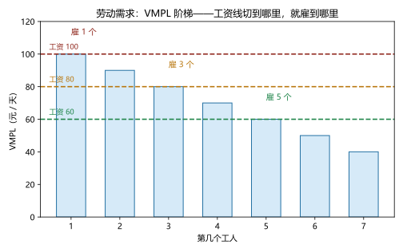
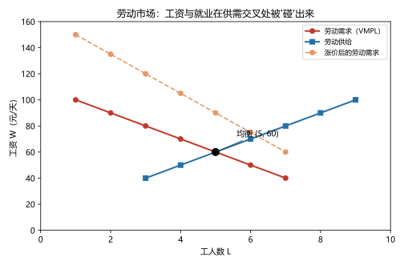
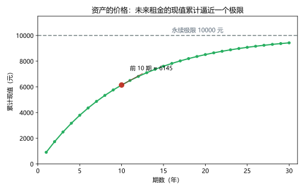

# 第 15 讲：生产要素市场

> **前置**：第 11–12 讲（边际产量、利润最大化）、第 03–05 讲（供求与均衡）。
> **预计时间**：约 2.5 小时（含作业）。
>
> **一句话定位**：企业这半边讲完，镜头转向"卖劳动的人"——工资到底由什么决定？本讲给出全课程最漂亮的一次"复用"：**劳动需求曲线，就是 VMPL 曲线**（多雇一个人的边际产值）；再配上劳动供给，工资被"碰"出来；最后把土地与资本的定价一并收编（含"现值"这件新工具）。
>
> **本讲回答什么**：
> 1. 工资到底由什么决定？老板凭什么开这个数？
> 2. 为什么"劳动需求"是**派生**的？VMPL 是什么？
> 3. "工资 = 劳动的价值"哪里错了？
> 4. 劳动供给从哪来（工作还是闲暇）？
> 5. 土地和资本怎么定价？租金和买价什么关系？
>
> **这一讲有真实验证**：VMPL 雇工决策（脚本 `scripts/lec15-01_verify_factor_markets.py` 实验 1）；劳动市场均衡（实验 2：(60, 5)）；产品涨价的移位（实验 3）；现值收敛与地租（实验 4）。配图 3 张。

## 本讲怎么走（脉络图）

```
引子：果园招工——老板心里的那张表
  │
  ├─ 1. 派生需求与 VMPL：劳动需求曲线的真身（图 1）
  ├─ 2. 劳动供给：工作还是闲暇
  ├─ 3. 劳动市场均衡：工资被"碰"出来（图 2）
  ├─ 4. 土地与资本：租金、地租与现值（图 3）
  ├─ 5. 边界与纪律
  └─ 常见误区 → 本讲小结 → 掌握度自测 → 作业
```

> 下一站：§引子。先看果园老板招人时，脑子里到底在算什么。

---

## 引子：果园招工——老板心里的那张表

镇上有个果园。苹果 **2 元一斤**。老板要招采果工，他先算了一张"工人值多少钱"的表：

| 第几个工人 | 1 | 2 | 3 | 4 | 5 | 6 | 7 |
|---|---|---|---|---|---|---|---|
| 日采果量（斤） | 50 | 45 | 40 | 35 | 30 | 25 | 20 |
| **每天创造的收入（元）** | **100** | **90** | **80** | **70** | **60** | **50** | **40** |

（采果量递减——果园的树就那么多，人多了互相挡路，**边际产量递减**；第 11 讲的老朋友。）

现在问：**日薪开到多少、就雇几个？** 老板的算法朴素得像买菜：

- 日薪 **100**：第 2 个工人只带来 90 元的收入——雇第 2 个就亏 10 元 → **只雇 1 个**；
- 日薪 **80**：第 1–3 个工人都值（100、90、80），第 4 个只值 70 → **雇 3 个**；
- 日薪 **60**：前 5 个都值 → **雇 5 个**。

"老板凭感觉定工资"是个误会——他算的是"**多雇一个人带来的收入，够不够付这个人的工资**"。这张表有个正式名字（VMPL），而故事还有反转：**工资最终也不是老板"定"的**——镇上还有别的活计，工人们也有选择（§3 揭晓）。先从那句"多雇一个人的收入"说起。

---

## 1. 派生需求与 VMPL：劳动需求曲线的真身

### 1.1 要素市场与"派生需求"

> **生产要素（factors of production）**：生产所需的投入——**劳动、土地、资本**（第 01 讲循环流量图的"要素市场"在此正式开门）。

要素市场与商品市场有一个根本区别：**对要素的需求是派生需求（derived demand）**——

> **派生需求：对一种生产要素的需求，来自（"派生"自）用它所生产的产品在市场上值多少钱。**

果园雇工旺不旺，不由"老板心善"或"工人可怜"决定，而由**苹果的行情**决定：苹果涨价、销路变好，雇工需求就旺；苹果滞销，老板第一个动作就是裁人。

### 1.2 VMPL：一个工人的"身价"

> **劳动的边际产值（value of the marginal product of labor，VMPL）$= MP \times P$**：多雇一个工人**产出**的增量（MP），乘以**产品价格**（P）——即这一个工人每天为老板创造的收入。

引子表最后一行的 100、90、80……就是 VMPL。雇佣规则一句话：

> **做到"VMPL ≥ 工资"的最后一个工人为止。**（第 12 讲 MR = MC 的"要素市场版"：多雇一个人的边际收入 ≥ 边际成本。）



> **图 1 怎么读**：每根柱是"第几个工人"的 VMPL（随人数递减）。三条虚线是三个候选工资；**工资线"切"到哪里，就雇到哪里**：切在 100 → 雇 1 个；切在 80 → 雇 3 个；切在 60 → 雇 5 个。把"每个工资对应的雇佣数"连起来——**这条下行的阶梯就是劳动需求曲线**。为什么向下？两张嘴同时在拉：边际产量递减（人多互相挡路）+ 想要多卖就得降价（离散表里先忽略，连续情形里 P 也随产量走）——至少第一条已经足够让需求向下。

### 1.3 劳动需求的移位因素（三条）

整条劳动需求（VMPL 曲线）的搬家因素：

1. **产品价格 P**：苹果涨价 → 每个 VMPL 都变大 → **右移**（§3 实验 3 见分晓）；
2. **技术变迁**：更省力的工具/更好的培训 → MP 提高 → **右移**（技术也可能替代劳动 → 左移——方向取决于它是"帮手"还是"对手"）；
3. **其他要素的供给**：果园多买了梯子和三轮车（资本增加）→ 工人采果效率上升 → MP 提高 → **右移**。

### 1.4 防错：**"工资 = 劳动的价值"错在哪**

这是要素市场最经典的辨析（链条压轴）：

- 工资对标的是**边际**产出价值（VMPL）——**最后一个**工人的贡献，不是总产出、不是平均贡献；
- **"企业没把全部产出发给工人"不是现成的剥削故事**：总产出里还有别的主人——设备损耗要补偿、原料要回款、资本要回报。最后一个工人与"全部工人"的差额是天然存在的结构。

一句话记忆：**工资付给"边上的那一个"**——边际，不是平均值，更不是总量。

---

## 2. 劳动供给：工作还是闲暇

### 2.1 你在"卖"什么

劳动供给与其他供给的画风不同：家里"卖"给市场的是**时间**，而时间的另一种用途是**闲暇（leisure）**。所以劳动供给的决策就是——

> **在"工作"与"闲暇"之间做时间分配**；工资就是**闲暇的机会成本**（休息一小时＝放弃一小时工资）。

### 2.2 工资上涨的两股力量（个人曲线的"可能后弯"）

工资从 50 涨到 60，你会多干还是少干？两股力量拔河：

- **替代效应（substitution effect）**：闲暇变贵了（放弃一小时的代价更高）→ **多工作**；
- **收入效应（income effect）**：更有钱了，而"休息"是好东西 → **想多休息**。

- 工资还低时，替代通常赢（涨薪→多干）；工资很高时，收入可能反超（涨薪反而少干）——**个人劳动供给曲线可能"后弯"（backward-bending）**。这个形状**知道有这回事**即可（考试一般只要求讲清两个效应的名字与方向）。
- **市场**层面的劳动供给通常向上：个体后弯的"少干"，往往被"原本不工作的人开始进入"稀释掉——简化为一条向上倾斜的供给线（本讲就用这个简化版）。

### 2.3 劳动供给的移位因素（一句各记）

社会观念与参与率变化（更多家庭成员进入就业）、人口与移民、**其他市场的机会**（隔壁工厂涨薪，果园的供给就左移）。

> 下一站：把 VMPL 与劳动供给摆上同一张图——工资诞生。

---

## 3. 劳动市场均衡：工资被"碰"出来

### 3.1 供需对照找均衡（实验 2）

镇上的劳动力供给：工资越高、愿意来果园的人越多（40 元 → 3 人、50 → 4 人、60 → 5 人、70 → 6 人、80 → 7 人、90 → 8 人、100 → 9 人）。与 VMPL 需求逐档对照（脚本实验 2 实测）：

| 日薪 W | 需求（VMPL ≥ W 的人数） | 供给（愿干人数） | 差 |
|---|---|---|---|
| 40 | 7 | 3 | +4（供不应求） |
| 50 | 6 | 4 | +2 |
| **60** | **5** | **5** | **0 ← 均衡** |
| 70 | 4 | 6 | −2（供过于求） |
| 80 | 3 | 7 | −4 |
| 90 | 2 | 8 | −6 |
| 100 | 1 | 9 | −8 |

**均衡：工资 60 元/天、就业 5 人。** 两边偏离时的调整逻辑与商品市场完全一致（第 03 讲）：工资高于 60 → 想干的人多于岗位 → 工资被压下去；低于 60 → 岗位抢人 → 工资被抬上来。



> **图 2 怎么读**：红色折线是劳动需求（VMPL 阶梯），蓝色折线是劳动供给，交于 **(5, 60)**——均衡工资与就业。橙色虚线是"苹果涨价后"的新需求（下一小节揭晓）。这张图同时回答了两个老问题：**工人说"我的工资凭什么这么低？"——看红线的形状（你能创造多少边际产值）；工人说"老板凭什么开这个数？"——看蓝线的位置（和你一样能干活的人有多少）。**

### 3.2 均衡的两句"翻译"

- **对工人**：均衡工资 = 你这一档劳动力的**边际产值**（VMPL）在市场上的定价——"你值多少"由"你创造的边际收入"与"和你类似的人有多少"共同决定；
- **对老板**：在最优点上 W = VMPL——他**没有动机**多雇或少雇。

### 3.3 移位演示：苹果涨价（实验 3）

产品市场一动，劳动市场跟着动（这就是"派生"的全部含义）。苹果从 2 元涨到 3 元，每个 VMPL 乘 1.5（100→150、90→135、…）：

- **同一个工资 60 元下**：愿干的还是 5 人，但老板想雇的人从 5 涨到 **7**——岗位比人多，工资被抬起来；
- 新均衡约在 **(70, 6)**：工资 60 → 70、就业 5 → 6（图 2 中橙虚线与蓝线的交点附近）。

**双向都成立的推论**：产品涨价 → 劳动需求右移 → **工资与就业同升**；产品滞销降价 → 左移 → 工资与就业同降。**"产品行情"与"打工人的工资"之间，隔着的就是 VMPL 这一层传动。**

> 下一站：劳动讲完了，土地和资本用什么逻辑定价？

---

## 4. 土地与资本：租金、地租与现值

### 4.1 三个要素，一个套路

土地、资本的需求与劳动**完全同源**——都是**派生需求**，都等于各自要素的边际产值。差别只在供给侧：

| 要素 | 需求来自 | 供给特点 | 价格的名字 |
|---|---|---|---|
| **劳动** | VMPL（派生） | 家庭的时间配置；市场供给通常向上 | **工资** |
| **土地** | 边际产值（派生） | **固定**（一块地的面积就那么多——垂直线） | **地租** |
| **资本** | 边际产值（派生） | 可以积累（由储蓄形成） | 租金率（租用）/ 价格（购买） |

### 4.2 土地：供给固定，地租由需求单方面决定

土地供给垂直（固定）时，均衡"地租"完全由**需求**（边际产值）定出来：

- 数字例：某地可租土地固定 100 亩；需求 $W = 2000 - 10A$（A 为亩数）→ 地租 $= 2000 - 10 \times 100 =$ **1000 元/亩**；
- 需求涨（比如附近建了产业园）→ 地租涨——**"地租贵"的根子在"地能产出的东西值钱"，不在土地本身神圣**；
- 顺带兑现第 05 讲的伏笔：**对"纯地租"征税不改变配置**（供给垂直 → 税全由地主承担、交易量不变、没有扭曲）——"土地税不扭曲经济"的说法，源头就在这里。

### 4.3 资本：租金与买价之间隔着"现值"

资本有两层市场：**租用**（付年租金/租金率）与**买卖**（付一个买价）。两者的换算需要本讲的第二件新工具：

> **现值（present value）：一笔未来的钱，折算到今天值多少。** 直觉从一句话开始：**明年的 100 元 ≠ 今天的 100 元**（今天的 100 存一年能变多）。年利率 $r$ 下，明年的 100 元今天只值 $100/(1+r)$。

一台设备每年能收租金 $R$、可以一直收下去，它的**买价**就是把未来每一期租金贴现回来再加总：

$$买价 = \frac{R}{1+r} + \frac{R}{(1+r)^2} + \frac{R}{(1+r)^3} + \cdots$$

数字例（实验 4 实测，年租 1000、利率 10%）：第 1 期现值 909.09、第 2 期 826.45、第 3 期 751.31……前 10 期累计 6145；一直接下去，**总现值收敛到 10000**——恰好是 $R / r = 1000 / 0.1$。利率升到 20%，极限腰斩为 5000：**利率越高，未来租金越"不值钱"，资产越便宜。**



> **图 3 怎么读**：横轴是贴现的期数，纵轴是累计现值。每加一期，累计值往上爬一点、但越来越慢，向虚线"永续极限 10000"收敛——**资产的价格不是在数"钢筋水泥"，是在数"它这辈子能收的租金折成今天值多少"**。

> **微积分视角（等比级数一行闭式）**：记 $q = \dfrac{1}{1+r}$，则买价 $= R \cdot q \cdot (1 + q + q^2 + \cdots)$。等比级数求和公式 $1 + q + q^2 + \cdots = \dfrac{1}{1-q}$（$|q| < 1$）代入：$\dfrac{1}{1-q} = \dfrac{1+r}{r}$，于是 $买价 = R \cdot \dfrac{1}{1+r} \cdot \dfrac{1+r}{r} = \boldsymbol{\dfrac{R}{r}}$——"租金除以利率"不是巧合，是级数的闭式解。

> 下一站：边界清单。

---

## 5. 边界与纪律

1. **VMPL 理论的前提**：竞争性市场 + 要素的边际贡献**可测**。现实中"团队生产"让"谁的贡献"常常分不清（一句：企业内部激励设计的难题，属于人事经济学的地盘）。
2. **现实工资会偏离竞争均衡**：最低工资（05 讲）、工会谈判、企业主动付高薪换忠诚……VMPL 给出的是"市场推着去的方向"，不是每一份劳动合同的逐字来源。
3. **现值工具的边界**：利率选哪一个（无风险还是含风险）、未来不确定、以及"永续"假设——都是简化。考试套公式，现实留余地。
4. **与 05 讲的合龙**：土地税的"不扭曲"结论是"供给垂直"特例的应用——现在可以完整复述这条链：供给越垂直 → 税越由供给方承担且 DWL 越小。

---

## 常见误区（本节零新知识，只破误）

1. **"工资是老板说了算的数"**（引子、§3）。错。工资是劳动供需的均衡结果；老板的"算盘"（VMPL）只是需求一侧。
2. **"劳动需求来自劳动者需要工作和生活"**（§1.1）。错。它是**派生需求**——来自"用劳动生产的东西在市场上值多少钱"。产品行情是上游。
3. **"工资 = 工人创造的全部价值"**（§1.4）。错。工资对标的是**边际**产值（VMPL）；总产出还要补偿其他要素与资本回报。
4. **"产品涨价与打工人无关"**（§3.3）。错。产品涨价 → VMPL 右移 → 工资与就业同升——这对雇工是好消息（反过来也成立）。
5. **"工资越高，人一定干得越多"**（§2.2）。不一定。替代效应推着多干、收入效应拉着休息；个人供给可能后弯。
6. **"地租高是因为土地本身宝贵"**（§4.2）。不准确。地租由"土地能产出的东西值多少钱"（需求）派生；供给固定时它完全由需求单方面决定。

## 本讲小结

一页纸的骨架：

- **要素市场**：劳动、土地、资本；需求一律是**派生需求**（来自产品价值）。
- **VMPL $= MP \times P$**；雇佣规则"做到 VMPL ≥ 工资的最后一个工人"；**劳动需求曲线 = VMPL 曲线**；三条移位因素（产品价格 / 技术 / 其他要素供给）。
- **防错**：工资付给"边上的那一个"（边际，不是总量）。
- **劳动供给**：工作 vs 闲暇；工资 = 闲暇的机会成本；替代效应 vs 收入效应（个人可能后弯；市场通常向上）；移位因素（观念/人口/其他机会）。
- **均衡**（实验主场景）：(W\*, L\*) = (60, 5)；产品涨价 → 需求右移 → 工资就业同升（60→70、5→6）。
- **土地**：供给垂直 → 地租由需求单方面定（1000 元/亩）；"纯地租税不扭曲"在此落地。
- **资本**：租金 vs 买价，中间隔着**现值**——$PV = R/(1+r) + R/(1+r)^2 + \cdots = R/r$（数字：1000/10% → 10000；利率升 → 资产跌）。**几何级数求和**进 AA 工具库。

## 掌握度自测

- [ ] 我能复述"派生需求"的定义，并用果园例子说明"产品行情决定雇工需求"。
- [ ] 我能写出 VMPL = MP × P 并在一张产量表上算出 VMPL、找出不同工资下的雇佣量。
- [ ] 我能讲清"工资付给边上的那一个"（边际 vs 总量）这条防错辨析。
- [ ] 我能说出劳动需求的三个移位因素及方向（含"技术是帮手还是对手"的双面性）。
- [ ] 我能用替代效应与收入效应解释"个人劳动供给可能后弯"，并说明市场供给为何通常仍向上。
- [ ] 我能复算主场景均衡 (60, 5)（逐档供需对照），并完成"苹果涨价"的移位推演（(70, 6)）。
- [ ] 我能解释"土地供给固定 → 地租由需求单方面决定"，并复述"纯地租税不扭曲"的推理链。
- [ ] 我能背出现值公式并算出前 3 期的数字（909.09/826.45/751.31）与永续极限 R/r。
- [ ] 我能复述"利率升、资产跌"的方向并解释原因。
- [ ] 我能复跑 `scripts/lec15-01`，解释输出里每一个数字（100/90/80、1/3/5、+4/0/−8、6145、10000、5000……）。

## 作业

> 答案只能用**已教概念**（本讲范围：派生需求、VMPL 与雇工规则、劳动供给两效应、劳动均衡与移位、地租、现值与 R/r；可复用边际/供求框架）。先独立做，再对答案。

### 基础

**Q1. 计算·VMPL 雇工**：某企业产品价格 P = 5；工人边际产量 MP：20、16、12、8、4。

(1) 写出 VMPL 表；
(2) 日工资 70 时雇几个？50 时呢？
(3) 产品价格跌到 2.5（VMPL 减半）：工资 50 时雇几个？

**参考答案**：
(1) VMPL = 20×5=100、16×5=80、12×5=60、8×5=40、4×5=20。
(2) W=70：VMPL ≥ 70 的共 2 个（100、80）→ 雇 **2** 个；W=50：共 3 个（100、80、60）→ 雇 **3** 个。
(3) 新 VMPL：50、40、30、20、10；W=50：≥ 50 的只有 1 个 → 雇 **1** 个（价格下跌裁人）。

**Q2. 计算·均衡与移位**：某劳动市场：需求 W = 100 − 5L、供给 W = 20 + 5L。

(1) 求均衡工资与就业；
(2) 若产品涨价使需求变为 W = 120 − 5L：新均衡？
(3) 一句话：工资与就业的变动方向说明了什么？

**参考答案**：
(1) 100 − 5L = 20 + 5L → L = **8**、W = **60**。
(2) 120 − 5L = 20 + 5L → L = **10**、W = **70**。
(3) 产品涨价 → 劳动需求右移 → **工资与就业同升**（派生需求的传动）。

**Q3. 辨析题**：判断对错并简说理由。

(a) "工资是老板单方面开的价。" 
(b) "劳动需求来自劳动者要吃饭。"
(c) "工资等于工人创造的全部价值。"
(d) "地租高是因为土地本身很宝贵。"

**参考答案**：
(a) 错。市场均衡结果；老板的 VMPL 只是需求侧的一半（§3）。
(b) 错。派生需求——来自产品的市场价值（§1.1）。
(c) 错。对标的是**边际**产值；总产出还要补偿其他要素与资本（§1.4）。
(d) 不准确。地租由土地产出的价值（需求）派生；供给固定时需求单方面决定（§4.2）。

### 提高

**Q4. 计算·现值**：某设备年租金 1000 元，市场利率 10%。

(1) 前 3 年的现值各是多少？合计？
(2) 如果这台设备可以永远租下去，买价的理论极限是多少（用 R/r）？
(3) 利率升至 20% 时极限是多少？这说明"利率"在资产定价里扮演什么角色？

**参考答案**：
(1) 909.09 + 826.45 + 751.31 = **2486.85**。
(2) 1000 / 0.10 = **10000**（与级数求和一致）。
(3) 1000 / 0.20 = **5000**——利率越高、未来租金越不值钱，资产价格越低（系统性反向关系）。

**Q5. 简答·劳动供给**：工资上涨时，替代效应与收入效应各说什么？为什么个人供给曲线可能"后弯"，而市场供给通常仍向上？

**参考答案**：
替代效应：闲暇变贵 → 多工作（涨薪的"激励"面）；收入效应：收入提高想多休息 → 少工作（涨薪的"变富"面）。个人在工资很高时收入效应可能反超 → 供给"后弯"；但市场层面，涨薪还吸引**原本不工作的人**进入（外延效应），通常盖过个体的后弯 → 市场供给向上。

**Q6. 简答·移位三因素**：列出三种让劳动需求整条移动的因素，并说明方向。

**参考答案**：
① 产品价格：P↑ → VMPL 整体抬高 → 右移；
② 技术：提升 MP 的（帮手型）→ 右移；替代劳动的 → 左移；
③ 其他要素供给：资本/设备增加 → MP 提高 → 右移。

### 综合（回扣本讲主任务）

**Q7. 综合·果园全案收官**：主场景（VMPL：100/90/80/70/60/50/40；供给：40→3、50→4、60→5、70→6、80→7）。

(1) 均衡工资与就业各是多少？
(2) 苹果价格从 2 元涨到 3 元后：同工资 60 时需求是多少？用"供不应求"解释工资为什么会涨到约 70；
(3) 新均衡下就业是多少？"产品涨价对雇工是好事吗？"

**参考答案**：
(1) (W\*, L\*) = **(60, 5)**。
(2) VMPL 全部 ×1.5；同工资 60：需求 = VMPL ≥ 60 的人数 = **7**（150~60 全达标）；供给仍 5——**岗位 7 个、人手 5 个**，供不应求 → 工资上抬；抬到 70 时：需求 6、供给 6，停住。
(3) 新均衡 (70, 6)：工资从 60 涨到 70、就业从 5 增到 6——**产品涨价对打工人是好消息**（派生需求的正向传动）。

**Q8. 简答·开放："机器换人会压低工资吗？"** 用 VMPL 框架给出两面分析，并说清"为什么最终答案是个实证问题"。

**参考答案**：
- **"对手"的一面**：机器直接替代某类劳动 → 该类劳动的 MP 下降 → VMPL 左移 → 工资承压（"机器换人"的担忧所指）；
- **"帮手"的一面**：机器提高与之配合的劳动的 MP（一个人开着机器采果顶过去五个人）→ VMPL 右移 → 工资上升；新产业还创造新岗位（新的劳动需求）；
- 哪股力量占上风**依赖具体技术、行业与时间尺度**——理论与历史都给出过两个方向的案例，所以"最终答案"要靠数据来判（实证问题），而不是靠立场站队预判。

---

*下一讲预告：第 16 讲《收入与歧视、收入不平等与贫困》——同一条街上，为什么有人月入五千、有人月入五万？工资差别的四种解释（人力资本、补偿性差别、能力信号、效率工资）、歧视经济学（为什么竞争可能"惩罚"歧视者）、不平等怎么度量（洛伦兹曲线与基尼系数）、以及减贫政策的取舍结构。*