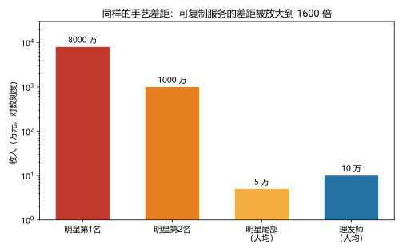
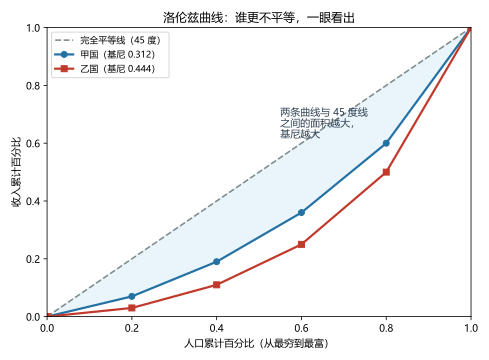
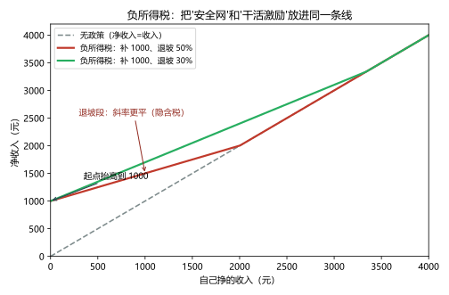

# 第 16 讲：收入与歧视、收入不平等与贫困

> **前置**：第 15 讲（VMPL、现值）、第 05 讲（最低工资）、第 10 讲（税制公平两轴）。
> **预计时间**：约 2.5 小时（含作业）。
>
> **一句话定位**：上一讲把工资"定"了出来，这一讲追问三件事：**同样的劳动，为什么价差几倍**（工资差别的零件）；**歧视为什么没被竞争淘汰**（歧视经济学）；**不平等与贫困怎么度量、政策怎么取舍**（洛伦兹曲线、基尼系数、负所得税）。本讲是全课程最"有情绪"的话题——经济学的工作不是替人感慨，而是把差距拆成零件、把政策代价摆上桌。
>
> **本讲回答什么**：
> 1. 同样上班，为什么收入差几倍？经济学怎么"解释"而不只是"感叹"？
> 2. 补偿性工资差别是什么？超级明星现象为什么只在某些行业炸裂？
> 3. 歧视在竞争市场里不该被淘汰吗？为什么还在？
> 4. 基尼系数怎么算、怎么读？贫困率这种度量公平吗、坑在哪？
> 5. 减贫政策有没有代价？代价是谁的？
>
> **这一讲有真实验证**：洛伦兹曲线与基尼系数（脚本 `scripts/lec16-01_verify_inequality.py` 实验 1：甲 0.312 vs 乙 0.444）；超级明星算术（实验 2）；歧视的竞争演化（实验 3：54.7% vs 26.7% 两方向）；负所得税与隐含税率（实验 4）。配图 3 张。

## 本讲怎么走（脉络图）

```
引子：同一条街上的五张工资单
  │
  ├─ 1. 工资差别的零件：资本、补偿、能力运气、信号、明星（图 2）
  ├─ 2. 歧视经济学：竞争什么时候"清洗"歧视（含慢变量实验）
  ├─ 3. 不平等的度量：洛伦兹曲线与基尼系数（图 1）+ 四个陷阱
  ├─ 4. 贫困与政策：负所得税的旋钮（图 3）
  ├─ 5. 边界与纪律
  └─ 常见误区 → 本讲小结 → 掌握度自测 → 作业
```

> 下一站：§引子。先看五张真实的、扎心的工资单。

---

## 引子：同一条街上的五张工资单

同一条街上，五个人的月薪：

| 人 | 职业 | 月薪 |
|---|---|---|
| 小张 | 软件工程师 | 20000 |
| 老李 | 高空擦窗工 | 12000 |
| 王姐 | 小学教师 | 7000 |
| 小陈 | 带货主播 | 60000 |
| 老赵 | 餐厅后厨 | 4500 |

三个当场冒出来的问题：

1. 老李干的活"又危险又不体面"，凭什么比坐办公室的高一截？（第 1 节：**补偿性差别**）；
2. 顶尖主播月入 600 万、小主播月入几百——**唱功差 10%，收入差一万倍**？为什么这种畸形差距只在少数行业出现？（第 1 节：**超级明星现象**）；
3. 如果某个行业的老板就是"不想招某类人"——**竞争会把他淘汰吗**？经济学对歧视的答案反直觉得刚好。（第 2 节。）

至于"差距大不大、要不要管"——先把尺子造出来再说（第 3 节：洛伦兹曲线与基尼系数；第 4 节：政策）。

---

## 1. 工资差别的零件：资本、补偿、能力运气、信号、明星

把"工资差"拆成零件，是经济学对"为什么他赚那么多"的标准回答方式。五个零件：

### 1.1 人力资本：技能是投资堆出来的

> **人力资本（human capital）**：人身上"能提高生产率"的积累——教育、培训、经验、健康。

它与第 15 讲无缝衔接：**技能提高 MP → VMPL 右移 → 工资上抬**。"读书"因此不是消费，是**投资**——一笔"先花钱、后收租"的账：

- 粗略账（不贴现）：读大学付学费 4 万、四年少挣 12 万（机会成本），毕业后每年多赚 1.5 万、干 30 年多赚 45 万 → 净 **+29 万**；
- 精确账要**贴现**（第 15 讲的现值）：把"未来多赚的钱"换算成今天的价值再和成本比——40 年后的一块钱今天不值一块钱。（考试一般考"机会成本+收益"的定性账——把上面两行写清楚就够。）

### 1.2 补偿性工资差别：难受的部分也要发工资

> **补偿性工资差别（compensating differential）**：为了补偿工作里"令人不快的属性"而多付的那部分工资。

不快属性清单一页：**危险**（高空、深井）、**辛苦**（重体力、倒班）、**枯燥/声誉差**、**不稳定**（随时待命、季节工）。老李那"多出来的一块"，本质上是**"害怕"的价格**——如果危险不额外加钱，没人来干。反过来，轻松体面、求职者挤破头的工作（知名出版社小编？），工资被压得低于"同技能的平均"——**补偿可以是负的**。

### 1.3 能力、努力与运气

天赋、拼劲、机遇——"简历写不出来的部分"。经济学承认它存在、在原子上不可约（它们真实地改变 MP），但**作为"零件"它最难被政策触及**：教育能补充技能，但补不了天赋与风口的时差。诚实写在账上，不用它去解释全部。

### 1.4 信号：文凭的另一半身份

> **信号（signal）**：能"告诉别人你是什么样的料"的可观察特征；文凭是最常用的信号。

雇主招人时看不清你，但看得到文凭。文凭的一部分价值是**真的学了东西**（人力资本），另一部分只是"**能进得去、读得下来**"的证明——脑子、毅力、合规性（信号）。两派争论（"教育在筛选还是在生产"）不需要你现在站队；**考试记住双重身份**即可。

### 1.5 超级明星现象：为什么差距只在某些行业炸裂

小陈的问题经典得可以进教科书——**超级明星现象（superstar phenomenon）**，它需要**两个条件同时成立**：

1. **每位顾客都想要"最好的那一个"**（质量排序清楚、比较成本低："听最好的歌手"）；
2. **服务可以被复制**（多服务一个观众的成本≈0：录音、直播、转播）。

两个条件一凑：**第一名拿走整个市场**，第二名几乎归零——**完全没有进前十的"中等歌手"市场**。对照剃头师傅：手艺再好，一天也只能剪二十来个头（**不可复制**）——所以理发行业**不存在**明星化，大家工资挤在附近。



> **图 2 怎么读**（对数刻度，注意每一格是十倍）：**同样的总市场钱数（1 亿）**下，可复制服务（左两柱）：第 1 名 8000 万、第 2 名 1000 万、尾部同行人均 5 万——**头尾差 1600 倍**；不可复制服务（最右柱）：1000 名理发师人均 10 万——**几乎完全均等**。手艺真实差距可能就差 10%——被"可复制性"放大成了天壤之别。**推论一句**：互联网与直播正在把越来越多行业"可复制化"——"工资分布会不会越来越像演艺圈"，是本讲留给你自己想的问题。

### 1.6 顺带登记：效率工资

> **效率工资（efficiency wage）**：企业**主动**付高于市场均衡的工资——换忠诚、减少偷懒、降低流失与招聘成本。

它解释"同样岗位为什么有的公司给得多"的一部分——**"高于市场"本身可以是有利可图的策略**（知道有这回事即可）。

---

## 2. 歧视经济学：竞争什么时候"清洗"歧视

### 2.1 定义：先刨掉能解释的，嫌疑才叫歧视

> **歧视：对"生产率相同"的劳动者，因**群体特征**（性别、种族、年龄、口音、外貌……）而给出不同待遇或不同价格。**

关键纪律：**先刨掉可解释的差异**（人力资本不同？工作偏好不同？补偿差别不同？）——剩下的、**僵在群体特征上的**部分才是歧视的嫌疑。工资差 ≠ 歧视，这不是"和稀泥"，是判决前的取证纪律。

歧视可能发生在**三个位置**：雇主（招谁不招谁）、**顾客**（"我不愿意由某种人服务"）、**同事/雇员**（"不想和某种人共事"）。

### 2.2 竞争会"清洗"歧视吗？（本讲最精彩的分析）

先看纯雇主歧视的机制：假设某些老板"就是不愿招 X 群体"（明明同样能干，却要压低/回避）：

- X 群体的工资被压低 → **不搞歧视的老板发现：能用更低工资雇到同样能干的人** → 成本更低 → 利润更高 → 扩张；
- 歧视企业成本更高 → 收缩。**长期看，竞争把歧视的企业"挤出"**——这是"竞争惩罚歧视"的机制。

数字见分晓（脚本实验 3）——不歧视企业的份额从 40% 出发迭代：

- **顾客不歧视**（不歧视企业有成本优势，相对竞争力 2%/期）：30 期后份额 **40% → 54.7%**；
- **顾客也歧视**（"我就不想被某种人服务"→ 不歧视的店反而丢客人，相对竞争力 0.98）：30 期后份额 **40% → 26.7%**——**市场反而在奖励歧视**。

> **两条结论，缺一不可**：① 竞争对歧视的"清洗"是**慢变量**（几十年量级，不是"立刻淘汰"）；② 清洗的机制**需要前提**——顾客不歧视、规则不歧视。**市场不是道德机器，它只忠实放大它的参与者偏好**。

### 2.3 那为什么歧视还长期存在？（三个抓手）

- **顾客偏好**（2.2 的第二种情形：歧视的顾客在"惩罚不歧视的商家"——市场信号全部失灵）；
- **测量困难**：能力差异与歧视嫌疑难以彻底分离（统计上"剩下的部分"到底怎么归因——实证的技术前沿）；
- **历史与网络惯性**：职业分隔、人际网络（"谁介绍谁"）——昨天的歧视塑造今天的起点，起点再塑造明天的差距（自我延续的环）。

政策面一句：当"顾客/规则"环节失灵、市场自己算不出账时，**反歧视法规的介入补的就是这个缺口**——"市场能清洗的让它清洗，清洗不了的交给规则"（法规的具体范围与效果评估，属实证课题）。

> 下一站：把差距放到尺子上——洛伦兹曲线与基尼系数。

---

## 3. 不平等的度量：洛伦兹曲线与基尼系数

### 3.1 洛伦兹曲线：把"分配形状"画成一条线

造尺子的第一步是**排序**：把全体人口从最穷排到最富。然后画一张图——

> **洛伦兹曲线（Lorenz curve）**：横轴 = "最穷的百分之多少人口"，纵轴 = "他们占有百分之多少的收入"。

- 最穷的 20% 占 7% 的收入 → 曲线从原点出发时就**趴在下面**；
- 如果收入完全平均：最穷的 20% 恰好占 20%、40% 占 40%——曲线就是那条**45 度线**（"完全平等线"）；
- **实际曲线越弯（离 45 度线越远），越不平等。**



> **图 1 怎么读**（两国均为五等分收入份额）：甲国份额 7/12/17/24/40（累计点 0.07 → 0.19 → 0.36 → 0.60 → 1）——蓝线；乙国 3/8/14/25/50——红线。乙国**每一个横坐标上都更穷**，红线弯得更狠。阴影区就是两国差距的形状——**"谁更不平等"不用吵，看谁趴得更低。**

### 3.2 基尼系数：把"弯的程度"打成一个分

> **基尼系数（Gini coefficient）$= \dfrac{45 \text{ 度线与洛伦兹曲线之间的面积}}{45 \text{ 度线下的总面积}}$。**

- 完全平等（曲线贴着 45 度线）：分子 0 → 基尼 **0**；
- 一人独占全部收入（曲线贴着横轴走到底再垂直跳上）：基尼趋近 **1**。

五等分份额的算法（本课程的标准手算版，脚本用梯形法）：洛伦兹曲线下的面积 $S$（五个梯形相加），则 $基尼 = \dfrac{0.5 - S}{0.5}$。两国实测：

| | 份额（贫→富） | 曲线下面积 | **基尼** |
|---|---|---|---|
| 甲国 | 7/12/17/24/40 | 0.344 | **0.312** |
| 乙国 | 3/8/14/25/50 | 0.278 | **0.444** |

**量级感**（帮你读新闻）：世界上多数国家的基尼落在 **0.25–0.60** 之间；习惯上 **低于 0.3 算比较平、超过 0.5 算相当不平**。（具体国家的数字年年变，考试一般考"算+对比+趋势方向"。）

### 3.3 四个度量陷阱（链条问题的主菜）

把基尼当"公平分"直接下结论，会踩四个坑：

1. **实物转移不算进"收入"**：医保、公立学校、住房补贴是实打实的受益，却常常不进收入统计——**基尼会高估**不平等（转移越多的地方，高估越多）；
2. **生命周期**：20 岁的低薪、50 岁的高薪、退休后的低薪——**快照会骗人**（一个全是年轻人的社区"看起来很不平等"，其实只是同一批人不同年纪）；
3. **暂时收入 vs 持久收入**：一年歉收的农民与长期赤贫者是两个物种——**波动 ≠ 不平等**（消费数据常常比收入数据稳，这就是原因之一）；
4. **流动性（mobility）**：洛伦兹曲线是**一张快照**——"底部的 20% 是谁"下一年会不会换人？**不平等（差距有多大）与固化（差距锁不锁死）是两回事**——快照分不出这两个。

顺带一句新闻素养：**财富的不平等远高于收入**（财富是存量、收入是流量，且财富会自我增值）——"基尼"看数字前先看它量的是哪个。

> 下一站：尺子有了——穷的那头怎么扶，代价是谁的？

---

## 4. 贫困与政策：负所得税的旋钮

### 4.1 贫困线与贫困率

> **贫困率（poverty rate）：收入低于"贫困线"的人口占比。** 贫困线通常按"基本食品支出 × 倍数"一类的口径划定（各国、各时期标准不同——**线的画法本身就是政策**）。

度量就近复用 §3 的坑：实物转移不计 → 贫困率**虚高**；用税前还是税后、用年收入还是消费——**换个口径就换个数**；叠加流动性——"今年在线上的人，明年还在吗"。所以"贫困率降了"的新闻，先问三个口径问题再庆祝。

### 4.2 三件工具的代价账（链条压轴）

| 工具 | 帮谁 | 代价落在谁头上 |
|---|---|---|
| **最低工资** | 有工作的低收入者（工资垫高） | 可能：找工作更难的人（企业减少雇佣——05 讲的分析） |
| **负所得税** | 所有低收入者（含没工作的） | 纳税人；且"退坡"造成**隐含税率**（见下） |
| **实物转移**（食品券、医保、住房） | 特定消费被托底的人 | 纳税人；行政成本；"指定用途"不如现金灵活 |

**负所得税细看**（本讲第二个数值主角）：规则 = "收入低就补钱，收入越高补贴越少"。设"补 1000、每多挣 1 元补贴减 0.5"（脚本实验 4 实测）：

| 自己挣的 | 0 | 500 | 1000 | 2000 | 3000 |
|---|---|---|---|---|---|
| 收入+补贴 | **1000** | 1250 | 1500 | 2000 | 3000 |

读表的关键在**两段斜率**：挣 0→2000 之间，**每多挣一元、兜里只多五毛**——那少掉的五毛进了"补贴退坡"，等于一根 **50% 的隐含边际税率**；2000 以后补贴退完，斜率回到全额（隐含税率 0）。退坡放慢一半（每元减 0.3）：隐含税率 30%，但补贴总额要多发、税负更重——**一根旋钮，两头牵着**。



> **图 3 怎么读**：灰虚线是无政策的 45 度线（挣多少净得多少）。两条政策线都从 **1000 元**的"底线"出发（没收入也有 1000——**安全网**）；随后斜率变平（**退坡段**：挣一元净得不足一元——**隐含税**）；补贴退完后重新与 45 度线平行。**红线（退坡 50%）退得快、绿线（退坡 30%）退得慢**：绿线让工作穷人多得（同收入下净收入更高），代价是补贴总量更大、隐含税率年限更长。设计一个"负所得税"，本质就是**在"穷人的底线"与"劳动的激励"之间调这根退坡旋钮**——没有免费的安全网。

### 4.3 政策之争的"桌面"：三种立场一句话

同一个政策清单，三种经典立场通常各挑各的工具——**功利主义**（看"总福利"的大小）、**自由主义式公平**（盯着"最差的人过得怎样"）、**程序自由观**（先问"这笔钱是'拿'的还是'收'的"）。经济学不替你选立场，但负责把**每一种选择的代价**（4.2 的三列账 + 行政成本 + 激励成本）算清摆上桌——**"转移 1 元钱，穷人拿到的会少于 1 元"**（中途的行政与激励损耗），所以"划不划算"要两本账一起看。

---

## 5. 边界与纪律

1. **数据的口径之争永远先查**：税前/税后、含不含转移、收入/消费/财富——同一个国家换口径能差出好几个点，跨年比较务必同口径。
2. **因果识别的困难**：基尼上升与政策变化同时发生 ≠ 因果；歧视的测量更是"统计残差里找幽灵"——本讲的所有数字都是"零件账"，不是"罪责判决"。
3. **政策评估的实证转向**：最低工资会不会减少就业、负所得税会不会拉低劳动供给——争论靠各国的数据来判（第 10 讲的"分歧地图"在全课程最后一次出场）。
4. **规范性问题的边界**："差距大到什么程度不可接受"是价值判断——经济学把它**翻译成可讨论的取舍**（谁受益、谁受损、损耗多少），而不是替社会拍板。

---

## 常见误区（本节零新知识，只破误）

1. **"工资差距 = 歧视"**（§2.1）。错。先刨掉人力资本、补偿、偏好等可解释部分，剩下"僵在群体特征上"的才是嫌疑。
2. **"竞争会立刻、自动淘汰歧视"**（§2.2）。错。它是慢变量（实验里 30 年才动十几个点），且依赖"顾客不歧视"的前提——顾客也歧视时，市场反向奖励歧视。
3. **"超级明星拿得多，是因为他强 1000 倍"**（§1.5）。错。手艺可能只差 10%，差距来自"可复制 + 赢家通吃"的结构。
4. **"基尼大就一定更糟"**（§3.3）。不全面。基尼只量"快照差距"；还要看实物转移、流动性、生命阶段——大基尼里的"会换人的格子"和"锁死的格子"是两种社会。
5. **"贫困率下降 = 政策成功"**（§4.1）。先查口径：实物转移计不计、税前税后、参与率变化——读数会跳舞。
6. **"帮助穷人没有代价"**（§4.2）。有。纳税人出钱、退坡伤激励、行政有成本——"代价是谁的"必须明说；反过来，"有代价"也不等于"不该做"——**取舍是取舍，不是算术对错**。

## 本讲小结

一页纸的骨架：

- **工资差别的零件**：人力资本（MP→VMPL 传动；读书的账 +29 万粗例）；补偿性差别（"害怕的价格"；可为负）；能力努力运气；信号（文凭双重身份）；**超级明星**（可复制 + 赢家通吃 → 1600 倍；理发师对照）；效率工资（知道即可）。
- **歧视经济学**：定义纪律（先刨可解释部分）；竞争"清洗"歧视的机制（不歧视者成本优势 → 扩张）——**慢变量 + 依赖前提**；实验两方向（54.7% vs 26.7%）；存续三抓手（顾客偏好/测量难/历史网络）。
- **度量**：洛伦兹曲线（排序+累计；越弯越不平）；基尼 = 面积比（甲 0.312 vs 乙 0.444；手算梯形法）；**四个陷阱**（实物转移/生命周期/暂时收入/流动性）。
- **贫困与政策**：贫困率（先把口径查清）；**三工具代价表**（最低工资/负所得税/实物转移）；负所得税的**退坡旋钮**（隐含税率 50% vs 30%——底线与激励的取舍）；三种立场的桌面分工。
- **边界**：口径、因果、实证、规范——四条纪律。

## 掌握度自测

- [ ] 我能把工资差拆成五个零件，并各配一个身边例子。
- [ ] 我能复述超级明星的两个条件，并解释"为什么理发师没有超级明星"。
- [ ] 我能复述"竞争清洗歧视"的机制链，并说出它的两个前提/限制（慢变量、顾客不歧视）。
- [ ] 我能根据五等分份额画洛伦兹累计点，并用梯形法算出基尼（甲 0.312 / 乙 0.444 亲手复算过）。
- [ ] 我能定义基尼系数的面积比，并解释 0 与 1 的含义。
- [ ] 我能说出四个度量陷阱，并各举一个例子（实物转移/生命周期/暂时收入/流动性）。
- [ ] 我能复述三件减贫工具与各自的"代价落在谁头上"。
- [ ] 我能画出负所得税的折线形状（底线、退坡段、恢复段），并算隐含税率（50% 与 30%）。
- [ ] 我能解释"退坡旋钮"的两难（底线 vs 激励）。
- [ ] 我能复跑 `scripts/lec16-01`，解释输出里每一个数字（0.312/0.444、8000/1000/5、54.7%/26.7%、1000/1500/2000……）。

## 作业

> 答案只能用**已教概念**（本讲范围：工资差别零件、歧视机制、洛伦兹与基尼、贫困与三工具、负所得税；可复用 VMPL、现值、最低工资）。先独立做，再对答案。

### 基础

**Q1. 计算·基尼系数**：某国五等分收入份额为 10/15/20/25/30。

(1) 写出洛伦兹曲线的五个累计点；
(2) 用梯形法算曲线下面积，再算基尼系数；
(3) 与主场景的甲国（0.312）、乙国（0.444）相比，谁更平等？

**参考答案**：
(1) 累计点：(0.2, 0.10)、(0.4, 0.25)、(0.6, 0.45)、(0.8, 0.70)、(1.0, 1.00)。
(2) 面积 = 0.2×[(0+0.10)/2 + (0.10+0.25)/2 + (0.25+0.45)/2 + (0.45+0.70)/2 + (0.70+1.00)/2] = 0.2×[0.05+0.175+0.35+0.575+0.85] = 0.2×2.0 = **0.4**；基尼 = (0.5−0.4)/0.5 = **0.2**。
(3) 0.2 < 0.312 < 0.444——**本题国家最平等**（份额阶梯最缓）。

**Q2. 识别·工资差别的零件**：下面五例各主要由哪个"零件"解释？

(a) 高空擦窗工工资高于同楼保安 80%；
(b) 两位歌手唱功相近，一位年入千万、另一位年入五万；
(c) 老工程师比新工程师工资高一大截；
(d) 名校毕业生起薪普遍更高，即使能力测评相同；
(e) 某公司前台工资明显高于同行，招聘要求也更高标准。

**参考答案**：
(a) **补偿性差别**（危险溢价）；(b) **超级明星现象**（可复制+赢家通吃）；(c) **人力资本**（经验）；(d) **信号**（文凭的筛选价值）；(e) **效率工资**（高于市场的策略性工资）。

**Q3. 辨析题**：判断对错并简说理由。

(a) "工资有差距，就说明有歧视。"
(b) "在竞争市场里，歧视会很快自动消失。"
(c) "基尼系数越大，这个社会就一定越糟。"
(d) "提高贫困补贴没有代价。"

**参考答案**：
(a) 错。先刨掉人力资本/补偿/偏好等可解释部分（§2.1）。
(b) 错。是慢变量且依赖"顾客不歧视"等前提；顾客也歧视时市场反向（§2.2）。
(c) 不全面。基尼是快照，还要看流动性、实物转移、生命周期等（§3.3）。
(d) 错。有纳税人成本、退坡的激励成本、行政成本——代价要摆明（§4.2）。

### 提高

**Q4. 计算·人力资本账（现值意识）**：读大学的账：学费 4 万；放弃四年工资 12 万；毕业后每年多赚 1.5 万、工作 30 年。

(1) 不贴现的净收益是多少？
(2) 为什么精确计算要用"现值"（第 15 讲）而不是简单相加？负现金流（学费+放弃工资）发生在什么时候、正现金流发生在什么时候？

**参考答案**：
(1) 收益 45 万 − 成本 16 万 = **+29 万**。
(2) 因为"成本"发生在**当下几年**、而"多赚的钱"摊在**未来几十年**——未来的钱要贴现到今天的口径才能比较；简单相加相当于把 30 年后的一块钱当今天的一块钱用（高估收益）。配合：利率越高，这笔投资的现值净收益越小（读大学的机会成本也随利率上升——15 讲"利率是价格的通用折角器"）。

**Q5. 简答·洛伦兹与基尼**：什么叫"洛伦兹曲线更弯"？45 度线代表什么？基尼系数的几何定义是什么？

**参考答案**：
"更弯" = 在同样的横坐标（人口累计）上，纵坐标（收入累计）更低——穷人分到的份额更薄。
45 度线 = 完全平等线（人口累计% = 收入累计%）。
基尼 = 45 度线与洛伦兹曲线之间的面积 ÷ 45 度线下的总面积（即 (0.5−S)/0.5）。

**Q6. 计算·负所得税**：某地推行"补 1000、每多挣 1 元补贴减 0.5"。

(1) 挣 0、1000、2000 时净收入各是多少？
(2) 隐含边际税率是多少？它从哪段开始变成 0？
(3) 如果把退坡改为"每元减 0.25"：隐含税率变成多少？补贴在收入多少时退完？

**参考答案**：
(1) 0 → **1000**；1000 → **1500**；2000 → **2000**。
(2) 挣 0→2000 之间隐含税率 = 1 − 0.5 = **50%**；收入超过 2000（补贴退完）后边际税率回到 0。
(3) 隐含税率 = 1 − 0.75 = **25%**；补 1000 以 0.25 的速率退完 → 在收入 **4000** 处退完。

### 综合（回扣本讲主任务）

**Q7. 综合·一篇不平等报告**：甲国（7/12/17/24/40，基尼 0.312）与乙国（3/8/14/25/50，基尼 0.444）的数据都在桌上；另知：甲国实物转移（医疗、住房）规模远大于乙国；乙国的收入流动性强于甲国。

(1) 复算两国基尼（写出累计点与面积）；
(2) "甲国更平等"这句话要打几个补丁？用实物转移与流动性两个视角各说一句；
(3) 用一句话总结"单一基尼数字"的局限。

**参考答案**：
(1) 甲：累计 0.07/0.19/0.36/0.60/1.00；面积 = 0.2×[(0+0.07)/2+(0.07+0.19)/2+(0.19+0.36)/2+(0.36+0.60)/2+(0.60+1.00)/2] = 0.2×1.72 = 0.344 → 基尼 **0.312**。乙：累计 0.03/0.11/0.25/0.50/1.00；面积 = 0.2×[(0.03)/2+(0.03+0.11)/2+(0.11+0.25)/2+(0.25+0.50)/2+(0.50+1.00)/2] = 0.2×1.39 = 0.278 → 基尼 **0.444**。
(2) 补丁一（实物转移）：甲国基尼没把大额医疗住房转移计入，**实际福利差距比 0.312 显示的小**；补丁二（流动性）：乙国流动性强——快照上的"底层格子"换人更快，"差距"与"固化"是两回事。
(3) 基尼是一个**快照指标**——它量的是某一刻、某一口径下的分布形状；要判断"社会怎么样"，还得叠上实物转移、流动性、生命阶段等**多个维度**。

**Q8. 简答·开放："明星天价该不该管？"** 用本讲的框架写两段：(1) 超级明星收入高的结构原因（两个条件）；(2) 用"效率 vs 公平"两轴讨论"该不该限"（至少说清一条"限"的代价与一条"不限"的代价）。

**参考答案**：
(1) 结构原因：① 消费者只想要"最好的"（排序清晰）；② 服务可复制（边际成本≈0）→ 赢家通吃；收入差距是"市场规模 × 可复制性"放大出来的，不完全等于个人价值差距。
(2) 框架（意见不限，账要算清）：
- "限"的代价族：限价上限可能减少供给/改变配置（顶级从业者减少、灰色渠道）；行政执行成本；"限多少"依据什么标准（价值判断难题）。
- "不限"的代价族：收入极端化对社会公平感与代际流动的影响；市场势力在平台端的定价扭曲（若"明星"背后是垄断平台，问题的靶子其实在平台——14 讲）。
- 折中的可讨论工具：税收调节（对高收入段累进——把"限"从行政限价改为税收再分配）、竞争政策（打平台垄断）、公共品供给（让"不必买最贵也有得看"——体育/文化公共投入）。
- 结束纪律：两轴分开说（效率损失 vs 分配后果），最后承认"该不该"终究是价值判断，经济学负责把代价摆全。

---

*下一讲预告：第 17 讲《消费者选择》——分析到最后，主角回到"做选择的人"。预算线、无差异曲线、MRS、相切最优；替代效应与收入效应第一次被完整拆开——"工资涨了为什么有人反而少干活？"这个第 15 讲留下的钩子，到时用一套完整的消费理论正式作答。*