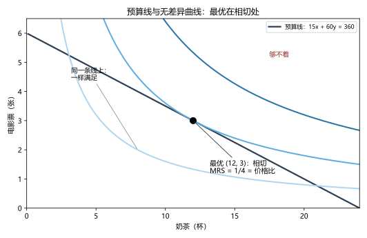
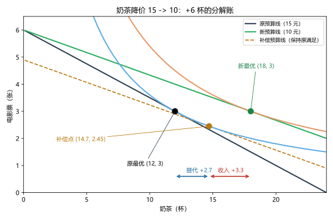
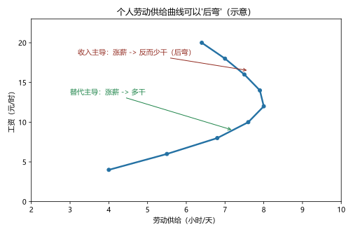

# 第 17 讲：消费者选择

> **前置**：第 15 讲（替代/收入效应首次登场）、第 04 讲（需求曲线）、第 06 讲（剩余）。
> **预计时间**：约 3 小时（含作业）。
>
> **一句话定位**：全课程理论大厦的封顶之作——前十六讲反复用"需求曲线向下"，这一讲把**它的微观地基**砌完：预算线（能要什么）+ 无差异曲线（想要什么）→ 相切最优（MRS = 价格比）→ **替代效应与收入效应的完整拆解**→ 回收第 15 讲的钩子（劳动供给为什么可能后弯），并给第 18 讲的前沿留门。这一讲也是全课程数学感最重的一讲——但每个公式都会配一张图、一笔账。
>
> **本讲回答什么**：
> 1. "效用最大化"到底在优化什么？我又量不出效用！
> 2. 预算线为什么斜率是价格比？
> 3. 无差异曲线为什么长那样？MRS 是什么？
> 4. 最优为什么在相切点、MRS = 价格比？
> 5. 替代效应和收入效应为什么非要拆开？工资涨了为什么有人反而少干活？
>
> **这一讲有真实验证**：预算线与组合表（脚本 `scripts/lec17-01_verify_consumer_choice.py` 实验 1）；Cobb-Douglas 最优的相切验证与预算线扫描（实验 2：峰在 x=12、U=6）；降价 +6 杯的数值分解（实验 3：替代 +2.7、收入 +3.3）；劳动供给两效应打平（实验 4：恒 8 小时）。配图 3 张。

## 本讲怎么走（脉络图）

```
引子：360 元闲钱怎么花 + "效用量不出来"的质疑
  │
  ├─ 1. 预算约束：能要什么（斜率 = 价格比）
  ├─ 2. 偏好与无差异曲线：想要什么（MRS 递减）
  ├─ 3. 最优选择：相切处（MRS = 价格比；图 1）+ 拉格朗日视角
  ├─ 4. 两种效应：降价 +6 杯的分解账（图 2）+ 需求曲线的全部理由
  ├─ 5. 应用·劳动供给：15 讲钩子的正式作答（图 3）
  ├─ 6. 边界与过渡：理性假设的裂缝通向第 18 讲
  └─ 常见误区 → 本讲小结 → 掌握度自测 → 作业
```

> 下一站：§引子。从一个每月都发生的"小纠结"开始。

---

## 引子：360 元闲钱怎么花 + "效用量不出来"的质疑

小林每月有 **360 元闲钱**，爱好就两样：**奶茶（15 元/杯）和电影票（60 元/张）**。这两个数字几乎每周都在他心里打架。

两个质疑先摆上桌（它们正是本讲要正面回答的）：

- **质疑一**："经济学说'效用最大化'——可'效用/幸福'这东西看不见摸不着，我怎么'算'它？"——回答将在 §2 给出：**不需要量出幸福的数值，只需要能给你的欲望排个先后**（这个让步比想象中小，也比想象中大）。
- **质疑二**："就算能算，'最优'怎么找？"——回答：把"想要"画成一族等高线（无差异曲线）、把"能要"画成一条线（预算线），**最优就在两者的相切处**（§3）。小林会选**12 杯奶茶 + 3 张电影票**——为什么是它，两节见分晓。

---

## 1. 预算约束：能要什么

### 1.1 预算线

小林的钱花在两样东西上，账很简单：

$$15x + 60y = 360 \quad (x = 奶茶杯数，\; y = 电影票张数)$$

- **全买奶茶**：360/15 = **24 杯**（y = 0 时的截距）；
- **全买电影**：360/60 = **6 张**（x = 0 时的截距）；
- 中间的组合（脚本实验 1）：奶茶 6 杯 + 电影 4.5 张；12 杯 + 3 张；18 杯 + 1.5 张……

> **预算线（budget constraint）：花光全部收入的所有组合连成的线。** 线**之内**（没花完，还有潜力——理性的小林不会停在这里）；线**之外**（买不起）。

### 1.2 斜率 = 价格比（考试必背）

从"24 杯"滑到"6 张"，斜率 $= \dfrac{\Delta y}{\Delta x} = \dfrac{0-6}{24-0} = -\dfrac{1}{4} = -\dfrac{P_x}{P_y}$：

> **预算线斜率 = $-\dfrac{P_x}{P_y}$（价格比）。** 本例：$-\dfrac{15}{60} = -\dfrac{1}{4}$——市场告诉小林："**多要 1 杯奶茶，就得放掉 1/4 张电影票**"。这与"他喜不喜欢"完全无关——斜率是**市场的汇率**。

### 1.3 两种移动（下一节和 §4 都要用）

- **收入变化**：360 → 480 → 整条线**平行外移**（斜率不变，因为价格没变）；
- **单个价格变化**：奶茶 15 → 10 → 奶茶截距从 24 变 36、电影截距不动 → 线以"电影截距"为轴**旋转**（斜率变缓）——§4 的大戏就发生在这次旋转里。

---

## 2. 偏好与无差异曲线：想要什么

### 2.1 效用：只要排先后，不用量数值

> **效用（utility）：消费组合"满足程度"的抽象刻度。**

正面回答质疑一：现代消费者理论只要求**序数效用（ordinal utility）**——只要能说"**组合 A 比 B 更想要**"就够了，**不需要**说出"A 的效用是 8.3、B 是 7.1"。让你给 100 个组合**排排队**，不算过分吧？理论只吃这一口饭。

### 2.2 无差异曲线（一族"等高线"）

> **无差异曲线（indifference curve）：所有"同样想要"的组合连成的线**——线上每一点，小林都无所谓换不换。像地图上的**等高线**：同一条线 = 同样高度（同样满足），不同线 = 不同高度。



> **图 1 怎么读**：三条蓝色无差异曲线是"三档满足"（本例用 $U = \sqrt{xy}$ 画的等高线：$xy = 16$、$36$、$64$）。四条**性质**看图就能读出——
> ① **更高的线更好**（右上方的线 = 更多商品，多总比少好）；
> ② **向下倾斜**（要停在同一条线上，多拿奶茶就得让出电影——天下没有两头都加的"同样想要"）；
> ③ **不相交**（两条线若交于一点 P，则"线上 A ~ P、P ~ B"推出"A ~ B"，但 A、B 明明一高一低——**逻辑自毁**，所以不许相交；这是最经典的送分证明题）；
> ④ **凸向原点**（越往右下越平——详见 2.3）。

### 2.3 MRS：愿意换的"心理汇率"

> **边际替代率（marginal rate of substitution，MRS）：为了多要 1 单位 x，小林愿意放弃多少 y（且满足不变）。** 几何上：**MRS = 无差异曲线斜率的绝对值**。

**MRS 递减**：奶茶从 2 杯加到 3 杯时他可能愿让 1 张电影票；从 11 杯加到 12 杯时，只愿让 1/4 张——**拥有的越多，越不稀罕**。这种"心理汇率"的递减，在图上就是**凸向原点**（曲线越往左下越陡、越往右上越平）。（性质④的官方名字：凸性；它的经济内容就是 MRS 递减。）

> **微积分视角（两行）**：沿无差异曲线走一小步，效用不变：$dU = MU_x\,dx + MU_y\,dy = 0$，于是 $MRS = -\dfrac{dy}{dx} = \dfrac{MU_x}{MU_y}$——**"愿意换的比例"就是两个边际效用之比**。本讲主场景 $U=\sqrt{xy}$ 的 MRS 有漂亮形式：$MRS = \dfrac{y}{x}$（§3 直接用）。

> 下一站：把"能要"和"想要"叠在一起，解最优。

---

## 3. 最优选择：相切处

### 3.1 相切条件：MRS = 价格比

把预算线（能要）与无差异曲线族（想要）画在一起（图 1）：能从原点往外推，能"够得着"的最高一条无差异曲线，恰好与预算线**相切**——切点就是最优：

> **最优条件：$MRS = \dfrac{P_x}{P_y}$（心理汇率 = 市场汇率）。**

为什么必须相切？两种"不相等"的处境各推一步就明白：

- **$MRS > P_x/P_y$**（小林愿为 1 杯奶茶放掉 1/2 张电影票，市场只收 1/4 张——"奶茶在心理上太值了"）→ **多买奶茶**（市场价比他的心理价便宜），直到心理汇率被"喝多了不稀罕"磨到与市场一致；
- **$MRS < P_x/P_y$**（心理价低于市场价，"电影"相对划算）→ 退回来买电影；
- 两边都停手的地方：**MRS = 价格比**。

### 3.2 等价翻译："最后一块钱原则"

$$MRS = \frac{P_x}{P_y} \quad\Longleftrightarrow\quad \frac{MU_x}{P_x} = \frac{MU_y}{P_y}$$

读作：**每一块钱花在奶茶上的边际效用，等于每一块钱花在电影上的边际效用。** 若左边大——最后一块钱买奶茶更值——挪钱去奶茶；直到两边持平。这就是"把最后一块钱花得无处可挪"的**等边际原则**——它与第 11 讲的边际产量、第 12 讲的 MR = MC、第 15 讲的 VMPL = W 是同一句咒语的第 N 次现身：**"让每一个边际的收益都向成本看齐"**。全课程边际思维在此完成四代同堂。

> **微积分视角（拉格朗日乘子，三行）**：要求 $\max U(x,y)$ 受约束 $P_x x + P_y y = M$，构造 $L = U(x,y) + \lambda\,(M - P_x x - P_y y)$；对 x、y、λ 分别求导为零 → $\dfrac{\partial U}{\partial x} = \lambda P_x$、$\dfrac{\partial U}{\partial y} = \lambda P_y$、预算式；前两式相除即 $\dfrac{MU_x}{MU_y} = \dfrac{P_x}{P_y}$。乘子 $\lambda$ 本身有含义：**"预算每多一块钱，能多换多少效用"**（影子价格的味道）。这套方法在 AA 工具库立了新条目——见"拉格朗日乘子视角"。

### 3.3 数字坐实（实验 2）

主场景：$U = \sqrt{xy}$（$MRS = y/x$）、$P_x = 15$、$P_y = 60$、$M = 360$：

- 相切方程：$y/x = 15/60 = 1/4$；代入预算：$15x + 60(x/4) = 15x + 15x = 360 \Rightarrow$ **x 水落石出 = 12**、**y = 3**；
- 预算线扫描（脚本）：$U^2 = x \cdot \dfrac{360-15x}{60} = 6x - 0.25x^2$ 在 $x = 12$ 取峰（36 → U = 6）；x = 11 或 13 都只到 35.75——**峰就是切点**；
- 手感校验：$MRS = y/x = 3/12 = 0.25 = 15/60$ ✓。

### 3.4 收入变、价格变 → 需求曲线的来路

- **收入变化**：预算线平移 → 切点移动 → 对"正常品"（本例两样都是）购买量上升；
- **价格变化**：奶茶 15 → 10（线旋转）→ 新切点 **x = 18**（新 MRS 条件 $y/x = 1/6$ 代入预算：$10x + 60(x/6) = 20x = 360$）——**"价格降、买得多"，需求曲线向右下——但"为什么"，要拆到骨头里（§4）。**

---

## 4. 两种效应：降价 +6 杯的分解账

### 4.1 一个价格变化，两条腿

奶茶降价（15 → 10），小林多买了 6 杯（12 → 18）。这 6 杯其实是两条原因**加起来**：

> **替代效应（substitution effect）：仅因"相对价格"变了——奶茶相对电影变便宜，用奶茶替代电影的那部分。**
> **收入效应（income effect）：仅因"实际购买力"变了——同样 360 元能买到更多（变相"变富"），按新财富水平调整消费的那部分。**

拆法（图 2 的"补偿预算线"）：虚构一条线——**斜率用新价格（1/6）、但恰好与原无差异曲线相切**（"假装补偿你到原满足水平"）——这条线上切点（14.7, 2.45）就是"只有替代、没有变富"的假想选择：

- **替代效应** = 14.7 − 12 = **+2.7** 杯（纯相对价格效应）；
- **收入效应** = 18 − 14.7 = **+3.3** 杯（纯购买力效应）；
- 合计 +6 ✓（脚本实验 3 实测，数字带小数是正常的）。



> **图 2 怎么读**：黑色线是原预算（切点 (12,3)）；绿色是新预算（切点 (18,3)）；**橙色虚线是虚构的"补偿预算线"**——它与原无差异曲线（蓝）相切于补偿点 (14.7, 2.45)。底部两支箭头：**蓝箭头 = 替代效应（沿原满足走到新相对价格）+2.7**；**红箭头 = 收入效应（从补偿点滑到新最优、升到更高满足）+3.3**。两段之和 = 从 12 到 18 的全部故事。

### 4.2 方向总表与"需求曲线向下"的最终解释

| 商品类型 | 替代效应（降价时） | 收入效应（降价时） | 总效应 |
|---|---|---|---|
| **正常品** | 多买（+） | 多买（+） | **多买**（需求向下） |
| **劣等品** | 多买（+） | 少买（−） | 通常仍多买（替代占上风） |
| **吉芬品** | 多买（+） | 大幅少买（−−，压倒替代） | **少买**（需求向上——反例） |

> **需求曲线为什么向下（终极答案）**：替代效应**总是**与价格反向（相对便宜的就多买——这一点几乎无条件成立）；收入效应在正常品同向加码、在劣等品反向抵消。**除非收入效应的反向力度大到压过替代效应（"吉芬品"——历史上有名的土豆轶事），需求曲线就向下。** 前十六讲一直"假设"的向下定律，到此有了拆到骨头的由头。

---

## 5. 应用·劳动供给：15 讲钩子的正式作答

第 15 讲留下过一句"个人劳动供给可能后弯——知道有这回事即可"。现在工具齐了，**正式作答**：

把模型的两样"商品"换一换：**消费 c**（用钱买）和**闲暇 l**（用时间"买"）。日可支配 16 小时，预算：

$$c = w \cdot (16 - l)$$

**工资 w 就是闲暇的价格**（歇一小时 = 放弃 w 元）。于是"工资上涨"= **"闲暇涨价"**——第 15 讲讲过的两股力量，如今有了正式姓名：

- **替代效应**：闲暇变贵 → 少闲暇 = **多工作**；
- **收入效应**：变富了 → 想歇 → **少工作**；
- **谁占上风，取决偏好**：工资还低时替代常赢（供给向上）；工资很高时收入可能反超——供给**后弯**（图 3）。**劳动供给曲线的形状，就是这两条腿角力的成绩单。**



> **图 3 怎么读**：纵轴工资、横轴劳动供给。工资从低位上涨：替代主导，供给向右上爬；过了某点后收入主导，曲线**向左上方弯回**——同一根工资轴上，"涨薪"对工作时间的含义可以截然相反。

**一个漂亮的极端特例**（实验 4）：若偏好是 Cobb-Douglas 型（$U=\sqrt{c \cdot l}$），可算出**两效应恰好精确抵消**——**工资从 10 涨到 30，最优工作时长都钉在 8 小时**（消费 80/160/240）。"涨薪也不多干、也不多歇"——这不是段子，是两效应打平的标准纪念品。

---

## 6. 边界与过渡：理性假设的裂缝通向第 18 讲

本讲的整套机器建立在一组假设上，逐条看它们在哪儿裂：

| 假设 | 裂缝 | 通向 18 讲的哪块前沿 |
|---|---|---|
| 偏好稳定、可排序 | 偏好会被广告/情绪/参照点塑造 | **行为经济学** |
| 信息完全（价格、质量全知道） | 信息不对称、"柠檬市场" | **信息经济学** |
| 计算力无限（拉格朗日随便解） | 人用启发式与近似 | **行为经济学** |
| 自利（自己效用最大） | 利他、公平偏好普遍存在 | 行为/公共选择的交界 |

理论的正确姿势不是"假装裂缝不存在"，也不是"因裂缝弃船"——而是：**拿完全理性当基准（benchmark），把"反常"当作新理论的入口**。第 18 讲就开这三个入口。

---

## 常见误区（本节零新知识，只破误）

1. **"效用必须量出数值，量不出这理论就垮"**（§2.1）。错。只要**序数**（排先后）就够——无差异曲线正是"排序"的语法。
2. **"两条无差异曲线可以相交/相切"**（§2.2）。错。"相交"直接推出逻辑矛盾（A ~ B 而 A、B 一高一低）；"相切"同样违反"不同线不同满足"。
3. **"最优在预算线中点或随便哪一点"**（§3.1）。不锈钢。最优在**相切点**：MRS = 价格比；中点只是"平均"，不是"最优"。
4. **"降价多买，就是因为'便宜了、更喜欢'"**（§4.1）。不精确。"便宜了"要拆成**替代**（相对价格）+ **收入**（购买力）两条腿——考试扣分点就在这拆分上。
5. **"需求曲线向上也有可能，随便"**（§4.2）。吉芬品确实存在但**条件苛刻**（收入效应反向且压倒替代），不是"随便"就能反常的。
6. **"替代效应和收入效应是两种心理感受"**（§4.1）。不是感受，是**同一个价格变化的两个可计算分解成分**（有补偿预算线这个构造来定量）。

## 本讲小结

一页纸的骨架：

- **预算约束**：$P_x x + P_y y = M$；斜率 = **价格比**（市场汇率）；收入变平移、价格变旋转。
- **偏好**：效用只需**序数**；无差异曲线四性质（更高更好/向下/不相交/凸向原点）；**MRS**（心理汇率）= 斜率绝对值 = $MU_x/MU_y$，**递减**。
- **最优**：**MRS = Px/Py**（相切）⟺ **MUx/Px = MUy/Py**（最后一块钱原则——全课程边际思维的封顶统一）；拉格朗日视角（λ = 多一块预算的边际价值）。
- **两效应**：替代（相对价格）+ 收入（购买力）；补偿预算线定量隔离；方向表（正常品/劣等品/吉芬）；**"需求曲线向下"的终极解释**。
- **劳动供给**：工资 = 闲暇价格；替代 vs 收入 → **可能后弯**（15 讲钩子正式结账）；Cobb-Douglas 特例：恒 8 小时。
- **边界**：四条假设的裂缝 → 18 讲三个入口（信息/政治/行为）。

## 掌握度自测

- [ ] 我能写出预算线方程、算出两端截距、解释斜率 = −Px/Py 的含义。
- [ ] 我能说出无差异曲线的四条性质，并当场证明"不能相交"。
- [ ] 我能定义 MRS 并说明它与"凸向原点"的关系（MRS 递减）。
- [ ] 我能写出 MRS = MUx/MUy 的两行推导。
- [ ] 我能解释相切条件的两个"不相等方向"（MRS > 价格比 → 多买 x；反之退回）。
- [ ] 我能翻译"MUx/Px = MUy/Py"为"最后一块钱原则"，并说出它和 MR=MC/VMPL=W 是同一家族。
- [ ] 我能复算主场景最优 (12, 3)（含预算线扫描峰在 12）。
- [ ] 我能用补偿预算线图解并复述 +6 = +2.7 + 3.3 的分解账。
- [ ] 我能用两效应解释劳动供给后弯，并说出 Cobb-Douglas"恒 8 小时"的意味（打平）。
- [ ] 我能复跑 `scripts/lec17-01`，解释输出里每一个数字（24/6、12/3、35.75、14.70、+2.70/+3.30、8 小时……）。

## 作业

> 答案只能用**已教概念**（本讲范围：预算线、无差异曲线、MRS、相切最优、两效应分解、劳动供给；可复用需求/剩余与前期工具）。先独立做，再对答案。

### 基础

**Q1. 计算·预算线**：预算 200 元；书 20 元/本（x）、咖啡 10 元/杯（y）。

(1) 两端截距各是多少？
(2) 预算线斜率是多少？它告诉消费者什么？
(3) 若预算涨到 300：线怎么动？若咖啡涨到 12：线怎么动？（各一句话）

**参考答案**：
(1) 全买书 10 本、全买咖啡 20 杯。
(2) 斜率 = −Px/Py = −20/10 = **−2**：多要 1 本书，须放弃 2 杯咖啡（市场汇率）。
(3) 预算 300：整条线**平行外移**（截距 15 本/30 杯）；咖啡涨到 12：以"书截距"为轴**旋转**（咖啡截距缩到约 16.7 杯、线变陡）。

**Q2. 简答·无差异曲线**：

(1) 证明两条无差异曲线不能相交；
(2) "凸向原点"的经济内容是什么？
(3) "更高的无差异曲线更好"对应什么假设？

**参考答案**：
(1) 设两线交于 P；取线上各一异于点 A、B。由定义 A ~ P、P ~ B，故 A ~ B；但 A、B 在不同线上（满足程度不同）——矛盾，故不能相交。
(2) **MRS 递减**：拥有的越多越不稀罕，愿意为 1 单位 x 放掉的 y 越来越少。
(3) 单调性/"多比少好"（消费者贪多）。

**Q3. 计算·Cobb-Douglas 最优**：$U = \sqrt{xy}$；$P_x = 4$、$P_y = 8$、$M = 160$。

(1) 写出 MRS；
(2) 用相切条件 + 预算方程解最优；
(3) 验证 MRS = 价格比。

**参考答案**：
(1) MRS = y/x。
(2) 相切：y/x = 4/8 = 1/2 → y = x/2；代入：4x + 8(x/2) = 8x = 160 → **x = 20**、**y = 10**。
(3) MRS = 10/20 = 0.5 = 4/8 ✓。

**Q4. 简答·两效应方向**：奶茶降价后：

(1) 替代效应为什么必然是"多买奶茶"的方向？
(2) 收入效应为什么方向不定？（用正常品/劣等品回答）
(3) 什么条件下总效应会"反常"（越便宜越少买）？

**参考答案**：
(1) 奶茶相对变便宜 = 用奶茶替代电影更划算（相对价格效应与价格反向，无条件成立）。
(2) 降价=实际购买力上升：正常品→多买（+）；劣等品→少买（−）。
(3) 劣等品且收入效应的负向**大到压倒替代效应**（吉芬品）——现实条件苛刻。

### 提高

**Q5. 简答·后弯供给**：用替代效应与收入效应解释"工资涨了有人反而少干活"（要求点出"闲暇的价格"这个身份）。

**参考答案**：
工资 = **闲暇的价格**（歇 1 小时 = 放弃 w 元）。涨薪（闲暇涨价）：替代效应→少闲暇（多工作）；收入效应→变富想多歇（少工作）。工资低时替代常占上风（供给向上）；工资高到一定程度，收入效应反超——劳动供给**后弯**（图 3）。

**Q6. 翻译题·等边际**："MUx/Px = MUy/Py"请用最白的话解释，并说明它与 MRS = Px/Py 为什么等价。

**参考答案**：
白话："**最后一块钱**无论花在 x 上还是 y 上，带来的边际效用一样——已经无处可挪了。"等价性：$MU_x/MU_y = P_x/P_y$ 两边交叉相乘即得；前者是"最后一块钱"视角、后者是"心理汇率 vs 市场汇率"视角，同一条件的两种读法（都由相切+效用微分推出）。

**Q7. 综合·小林全案收官**（奶茶 15、电影 60、预算 360、$U=\sqrt{xy}$）：

(1) 求原最优与效用；
(2) 奶茶降到 10：新最优？多买了几杯？
(3) 用补偿点 (14.7, 2.45) 完成效应分解（替代/收入/合计）；
(4) 用一句话说出这次降价的"需求曲线含义"。

**参考答案**：
(1) y/x = 1/4 → y = x/4；代入预算：15x + 60×(x/4) = 15x + 15x = 30x = 360 → **x = 12、y = 3**；U = √36 = **6**。
(2) y/x = 1/6 → y = x/6；代入预算：10x + 60×(x/6) = 10x + 10x = 20x = 360 → **x = 18、y = 3**；多买 **6 杯**。
(3) 替代 = 14.7 − 12 = **+2.7**；收入 = 18 − 14.7 = **+3.3**；合计 **+6** ✓。
(4) 价格 15→10、需求量 12→18：**需求曲线向右下**——且这条下降里，"相对便宜"与"变相变富"各贡献了一段。

### 综合（回扣本讲主任务）

**Q8. 简答·开放：理性假设最破的是哪条？**：四条假设（偏好稳定/信息完全/计算无限/自利）里，挑一条你认为与现实裂缝最大的，说明：(1) 现实反驳它的一个例子；(2) 为什么经济学仍从"完全理性"基准出发（而不是直接放弃或直接改用"人会犯错"的模型）。

**参考答案**（框架开放，要点如下）：
(1) 任选一条并给例（如：计算无限——人会因"选择过载"随便挑、会锚定在无关数字上；信息完全——二手车/保健品市场买卖双方信息差悬殊；自利——捐款、让座、报复不划算的冒犯）。
(2) 基准的价值：① 可检验——先有"应该怎样"，才能测出"偏了多少"（反常本身成为数据）；② 可推广——大多数、多数时候的近似成立；③ 可控——在基准上加"摩擦项"（信息不对称、有限理性）比从零建混乱模型更便宜；"反常"是新理论的入口而非否定（18 讲展开）。

---

*下一讲预告：第 18 讲《微观经济学前沿》——最后一块拼图。三个入口同时开了门：信息不对称为什么会把好货挤出市场（柠檬市场）；"三个和尚没水吃"与投票悖论背后的政治经济学；以及那些"不像教科书人"的行为发现（锚定、损失厌恶、过度自信）。尾声还留一个问题：这套书里哪些工具，是你此刻最想亲手用的？*