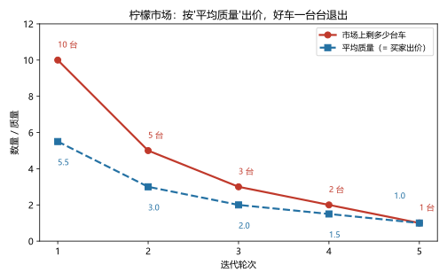
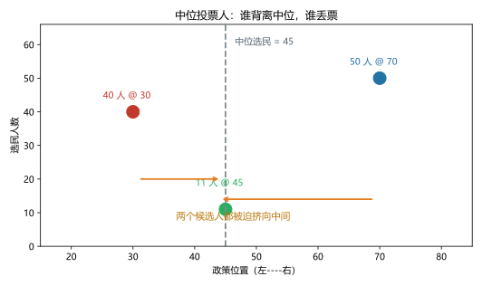
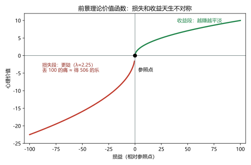

# 第 18 讲：微观经济学前沿

> **前置**：第 17 讲（理性假设裂缝表）、第 14 讲（囚徒困境与重复博弈）、第 10 讲（公共资源与分歧地图）。
> **预计时间**：约 2.5 小时（含作业）。
>
> **一句话定位**：主干十八讲收束于三大前沿——**信息经济学**（信息不对称如何让市场失灵）、**政治经济学**（投票能把"多数意志"投没）、**行为经济学**（人系统性偏离教科书人）。三个前沿有一个共同性格：**在标准框架的假设处开刀、给它打补丁**——是修正，不是推翻。
>
> **本讲回答什么**：
> 1. 信息不对称怎么就让市场失灵了？道德风险和逆向选择差在哪？信号与筛选是什么操作？
> 2. 一人一票不是最公平吗？投票怎么可能有悖论？
> 3. 中位投票人定理说政策向中间靠，极端选民不白喊了？
> 4. 行为经济学是推翻理性假设，还是修正它？
> 5. 这些理论的公共政策含义是什么？
>
> **这一讲有真实验证**：柠檬市场迭代崩溃（脚本 `scripts/lec18-01_verify_frontiers.py` 实验 1：10→5→3→2→1）；康多塞循环（实验 2）；中位投票人收敛（实验 3：51-50 → 40-61 → 51-50）；行为数值（实验 4：丢 100 ≈ 得 506）。配图 3 张。

## 本讲怎么走（脉络图）

```
引子：三个怪现象（二手车 / 三候选选举 / 999-399）
  │
  ├─ 1. 信息经济学：柠檬市场与它的解药（图 1）
  ├─ 2. 政治经济学：康多塞循环与中位投票人（图 2）
  ├─ 3. 行为经济学：锚定与损失厌恶（图 3）+ 政策接口
  ├─ 4. 边界与纪律：修正而非推翻
  └─ 常见误区 → 本讲小结 → 掌握度自测 → 作业
```

> 下一站：§引子。三个怪现象，三个前沿各认领一个。

---

## 引子：三个怪现象

**怪现象一（二手车）。** 某二手车市场：同款车、同年份，卖家开价低得离谱，还是**没人敢买**，买卖双方一起僵住。为什么？

**怪现象二（选举）。** 班会选活动方案，三个候选方案 X、Y、Z。投票一轮：X 胜 Y；再投一轮：Y 胜 Z；再一轮：Z 胜 X——**三场对决，"赢家"绕成了一个圈**。"多数同学的意志"，到底是谁？

**怪现象三（标价）。** "原价 999、现价 399"——你明明知道 999 是编的，心还是动了。为什么一个**无关的数字**能左右你的判断？

三个谜的底色相同：它们都长在教科书假设**松掉**的地方——① 信息不再人尽皆知（§1）；② "多数偏好"未必像想象的那样整齐（§2）；③ 人不是稳定计算器（§3）。

---

## 1. 信息经济学：柠檬市场与它的解药

### 1.1 信息不对称与"柠檬市场"

> **信息不对称（asymmetric information）：交易的一方比另一方掌握更多、更关键的信息。**

二手车是最经典的案情现场：**卖家知道车况，买家不知道。** 买家不傻——知道自己可能被坑，于是**只肯按"平均质量"出价**。这一出价引出一条死亡螺旋（"柠檬市场"the market for lemons，阿克洛夫的著名模型）：

- 买家按平均质量出价 → **好车的车主嫌亏、退出市场**；
- 好车一走 → 剩下的平均质量下滑 → 买家再降价 → 次好车也退出……
- 螺旋的终点：**市场里只剩最差的车（"柠檬"即残次品）**；极端情形下彻底瘫痪。



> **图 1 怎么读**（脚本实验 1：10 台车、质量 1–10，买家支付意愿 = 市场平均质量）：红色线是每一轮幸存的车数：**10 → 5 → 3 → 2 → 1**；蓝色线是平均质量（= 买家出价）：**5.5 → 3.0 → 2.0 → 1.5 → 1.0**。两条线一起下滑、互相"拖着走"——**质量降带着出价降，出价降又筛掉更多好车**。最后稳定在 1 台、质量 1——整个市场就剩那一台柠檬。

### 1.2 两兄弟：逆向选择 vs 道德风险（别搞混）

| | **逆向选择（adverse selection）** | **道德风险（moral hazard）** |
|---|---|---|
| 时间点 | 交易**前** | 交易**后** |
| 一句话 | "最想成交的人，正是最该警惕的人" | "保障一到手，行为就变" |
| 例子 | 体质弱的人最想抢购好医保；车况差的卖家最想急售 | 买了全险后停车变随意；员工入职后开始摸鱼 |

速记：**一个挑人（谁进场），一个变形（进场后谁变）**。

### 1.3 解药族：信号与筛选

两味主动出击的解药：

> **信号（signaling）：有信息的一方主动亮牌**——**质保承诺**（"三年质保"）、品牌、押金、学历。要点：**信号的成本必须"好坏有别"才有效**——好车主提供质保的成本低，差车主的高（他要真赔钱）；成本拉不开差距的承诺不值钱。
> **筛选（screening）：没信息的一方设计机制，让对方自我暴露**——保险的免赔额分层（愿意选高免赔额的是自信的人）、试用期、录像面试。

再加"制度解药族"（一起记）：**第三方认证**（质检报告）、**声誉系统**（评价体系——本质是第 14 讲"重复博弈"的工程化）、**法律与标准**（强制信息披露）。**凡是"信息修得平整"的地方，柠檬市场就被治住了**——这正是平台经济、征信体系、评级行业的全部生意。

> 下一站：从市场走进投票站。

---

## 2. 政治经济学：康多塞循环与中位投票人

### 2.1 康多塞悖论：多数偏好会"绕圈"

"一人一票、多数为胜"听起来天经地义，但它有一个惊人的漏洞。看实验结果（脚本实验 2）——三位选民，方案 X、Y、Z：

| 两两对决 | 投票 | 结果 |
|---|---|---|
| X vs Y | 甲 X、乙 Y、丙 X | **X 胜**（2:1） |
| Y vs Z | 甲 Y、乙 Y、丙 Z | **Y 胜**（2:1） |
| Z vs X | 甲 X、乙 Z、丙 Z | **Z 胜**（2:1） |

X 胜 Y，Y 胜 Z，而 Z 又胜 X——**"胜利"绕成了一个圈**：

> **康多塞悖论（Condorcet paradox）：多数偏好的"胜过"关系可能不传递**——先让哪两个对决，就可能选出不同的"赢家"（**议程操纵**的空间就在这）。

这个结论层层加码（阿罗不可能性定理：把"合理的集体决策规则"的几条自然要求列清，**不存在同时满足全部要求的投票规则**——一句登记，不展开）。所以"人民的意志"不是天然存在物：**它可能不存在，或取决于你怎么问**。

### 2.2 中位投票人定理：赢家站在中位数上

另一个方向的结论乐观得多。设选民们对"政策位置"各有**单峰偏好**（每人有最喜欢的一个点，离它越远越不喜欢）——此时：

> **中位投票人定理（median voter theorem）：两两对决中，胜者总是"中位选民"最喜欢的位置。**

**中位选民** = 把所有人最喜欢的位置排队，正中间那一个。实测（脚本实验 3，101 人：40 人@30、11 人@45、50 人@70，中位 = 45）：

| 回合 | 站位 | 得票 |
|---|---|---|
| R1 起点 | A@30、B@70 | A **51** : B 50（A 胜） |
| R2 B 向中间动 | A@30、B@50 | A 40 : B **61**（B 胜） |
| R3 A 也挤向中间 | A@45、B@50 | A **51** : B 50（拉锯） |



> **图 2 怎么读**：三类选民的点位（红 40 人@30、绿 11 人@45、蓝 50 人@70），灰虚线是中位 45。两个橙色箭头：无论候选人从哪出发，**背离中位的一端就是在"送票"**——B 从 70 挪到 50 就反夺胜势，A 只能跟着挤过来。**每一轮移动的方向都被同一句话解释："离中位更近的人得票更多。"**

两个推论——正好回答链条第 5 个疑问：

- **极端立场难赢**：中位选民决定胜负，喊得最"左/右"的候选人在纯粹的单峰设定下确实难（"极端选民的声音"主要通过非单峰偏好、投票率差异、议题多维度等渠道才挤得进来）；
- **趋同的代价**：双方都挤在中位附近——"选谁都差不多"是定理的直白推论（现实中的差异化、人格与议题组合，就是两党对抗趋同的招数）。

### 2.3 政治场里的"经济人"（一句各记）

- **政治家**：把理性人假设搬进投票站——竞选策略（图 2 的"向中间挤"就是它的证据）与承诺的取悦倾向；
- **官僚**：预算最大化倾向（"部门总要扩张"的经典观察）；
- **记住规范边界**：**市场失灵 ≠ 政府必定能修好**（公共选择视角）——"市场 vs 政府"的比较，要比的是"两种不完美"（第 10 讲分歧地图的收尾）。

---

## 3. 行为经济学：系统性偏差与政策接口

### 3.1 定位（链条防错先行）：修正，不是推翻

> **行为经济学不是"证明理性模型全错"，而是"在人的真实规律上给模型打补丁"**——它最硬的发现是：**偏差不是噪声（随机的错），而是系统性的、可预测的偏离**。噪声可以平均掉，系统性偏差会积累成现象。

### 3.2 三个经典偏差

**① 锚定（anchoring）：无关数字的"重力"。** 卡尼曼与特沃斯基的轮盘实验（脚本实验 4 复述的公开数据）：先让人看转盘停在 **10** 或 **65**，再问"非洲国家占联合国席位的比例"——中位估计分别是 **25%** 与 **45%**。**一个与问题毫不相干的数字，把答案拽走了 20 个百分点。**引子的"原价 999、现价 399"是它的商业应用：999 就是那只转盘。

**② 损失厌恶（loss aversion）与参照点。** 人对得失的敏感度天生不对称：

> **同样的金额，"失去"带来的痛远大于"得到"带来的乐**——实验中，一笔损失的心理权重约为同额收益的 **2 倍出头**（文献常用的 λ ≈ 2.25）。



> **图 3 怎么读**：横轴是相对**参照点**（原点）的损益，纵轴是"心理价值"。收益段弯得平缓（越赚越麻木），损失段更陡——由 λ ≈ 2.25 标定：**丢 100 元的心理冲击（-22.5）需要赚到约 506 元（+22.5）才能抵消**（脚本实验 4 实算：2.25×√100 = 22.5 → 反解出 506）。"怕亏"不是软弱，是曲线画成了这样。

**③ 顺手登记三连**（各一句话）：

- **过度自信**：大样本里问"你开车水平在平均以上吗"，过半的人举手；
- **现时偏好/拖延**：今天 100 元 vs 明天 110 元——多数拿今天；改成"31 天后 100 vs 32 天后 110"——多数愿意等。**同一对时间间隔，人在"远近"之间选择反转**（偏好不一致，与 15 讲的"理性耐心"形成对照）；
- **禀赋效应**：拿着杯子的人卖价要得比没拿的人买价高——**"卖出 = 损失"的参照点视角**（损失厌恶的近亲）。

### 3.3 政策接口（链条收官）

偏差的"可预测性"直接变成工具箱：**默认选项**（把"自动加入、可退出"设为退休金默认——利用的就是惰性）、**助推（nudge）**（保留选择自由、只把环境重新排布：把"更健康"的选项放在视线高度）、**消费者保护**（针对套路定价、暗黑模式的披露与监管）。一句话总结这一节：**"标准理论告诉你价格怎么动，行为经济学告诉你人怎么被'摆布'——政策设计的两层图纸。"**

---

## 4. 边界与纪律

1. **三前沿的共同性格**：都在**标准框架的假设处开刀、用新机制打补丁**——信息（假设松：信息完全）、政治（制度只是偏好的加总）、行为（人=优化器）。**是增量修正，不是另起炉灶。**
2. **信息经济学的出口是机制设计**：诊断（柠檬、逆向选择）之后的活是设计制度（信号/筛选/认证/声誉/法律）——这是一整个现代领域（"机制设计"）的起点，本课程只开了门。
3. **政治经济学的规范含义要克制**：它能指出"集体决策未必合理"（循环、议程操纵、官僚扩张），但不能凭此宣称"哪种制度最好"——那是规范判断，得加价值观（回收第 10 讲"分歧地图"）。
4. **行为效应的"场域折扣"**：实验室偏差在**真实市场**里会被三样东西打折——**激励**（真金白银）、**重复**（吃一堑长一智）、**套利**（别人会赚你的偏差）。所以：偏差是真的，"市场派与行为派之争"要看具体场景，别把实验室结论无脑外推成大新闻。

---

## 常见误区（本节零新知识，只破误）

1. **"信息不对称 = 有一方是骗子"**（§1.1）。错。它是**结构**：信息在两边分布不均——骗子只是它的用途之一，好人也会被结构困死（好车主的车就是卖不掉）。
2. **"逆向选择和道德风险是一回事"**（§1.2）。错。交易**前**挑人（逆向选择）vs 交易**后**变形（道德风险）。
3. **"投票总能反映多数意志"**（§2.1）。错。康多塞循环：多数偏好可能不传递——"先投哪两个"能改变胜负（议程操纵）。
4. **"信号一定要花钱越多越可信"**（§1.3）。不准确。关键是**成本在好坏之间的差距**——不能拉开差距的信号不值钱。
5. **"中位投票人定理说候选人承诺一定兑现"**（§2.2）。两码事。定理说的是"**赢在哪**"（中位附近），不是"**选了怎么做**"（执行力、信息、承诺可信度另说）。
6. **"行为经济学证明理性模型没用了 / 人做的一切都非理性"**（§3.1）。错。偏差是**系统性可预测的补充项**；且在激励强、重复多、可套利的市场里会被"练掉"一部分（§4.4）。

## 本讲小结

一页纸的骨架：

- **信息经济学**：不对称 → **柠檬市场**螺旋（实测 10→5→3→2→1，质量 5.5→1）；**逆向选择**（交易前挑人）vs **道德风险**（交易后变形）；解药：**信号**（成本须好坏有别）+ **筛选** + 制度族（认证/声誉/法律）。
- **政治经济学**：**康多塞循环**（X>Y、Y>Z、Z>X——多数不传递 + 议程操纵）；**中位投票人定理**（单峰偏好下胜者=中位最爱；实测 51-50→40-61→51-50 的趋同）；政治场里的经济人（竞选/官僚）；市场失灵≠政府必灵。
- **行为经济学**：修正非推翻；**锚定**（10/65 → 25%/45%）；**损失厌恶**（λ≈2.25，丢 100 ≈ 得 506；前景理论价值函数的 kink）；三连（过度自信/现时偏好/禀赋效应）；政策接口（默认、助推、保护）。
- **边界**：假设处开刀打补丁；机制设计的出口；政治判断的克制；行为效应的场域折扣。

## 掌握度自测

- [ ] 我能画出/复述柠檬市场的螺旋机制（"按平均出价 → 好货退出 → 均价再降"），并报出实验数字。
- [ ] 我能在交易前/后两个位置上区分逆向选择与道德风险，并各举两例。
- [ ] 我能解释"信号有效与否取决于成本差"（用质保承诺推一遍）。
- [ ] 我能复述康多塞循环（三选民两两对决 2:1、2:1、2:1）并说出"议程操纵"的含义。
- [ ] 我能定义中位选民并复算实验分布的中位（101 人 → 45）。
- [ ] 我能用"离中位更近者得票多"解释 R1→R2→R3 的站位移动。
- [ ] 我能说出中位投票人定理的两个推论（极端难赢/趋于趋同）与它的适用条件（单峰偏好）。
- [ ] 我能复述锚定实验的两组数字并解释"原价 999"的套路。
- [ ] 我能画出前景理论价值函数的形状（收益凹、损失陡、参照点 kink），并复算"丢 100 ≈ 得 506"。
- [ ] 我能复跑 `scripts/lec18-01`，解释输出里每一个数字（10/5/3/2/1、2:1×3、51/40/61、22.5/506……）。

## 作业

> 答案只能用**已教概念**（本讲范围：柠檬/逆向选择/道德风险/信号/筛选、康多塞/中位投票人、锚定/损失厌恶/现实现象三连；可复用重复博弈、公共选择）。先独立做，再对答案。

### 基础

**Q1. 推理·柠檬螺旋**：某市场质量 q = 1..10 各一台；买家支付意愿 = 市场平均质量；卖方保留价 = q。

(1) 第一轮能成交几台？剩下哪些？
(2) 继续迭代：写出每一轮的车数与平均质量，稳定在哪？
(3) 用一句话总结这个机制，并说清"谁被挤出了市场"。

**参考答案**：
(1) 平均 5.5 → 买家出 5.5 → 卖 q ≤ 5.5 的 **5 台**（q = 1..5）。
(2) 轮次：10 台（均价 5.5）→ 5 台（3.0）→ 3 台（2.0）→ 2 台（1.5）→ **1 台（1.0）稳定**。
(3) 买家按"平均质量"出价、质量高于出价的车退出、均价再降——螺旋；被挤出的是**高质量车**，市场蜕化成只剩最差的"柠檬"（极端情形：市场干脆瘫痪）。

**Q2. 归位·逆向选择 vs 道德风险**：判断下列属于哪一种：

(a) 体检正常的人不愿买高价医保，慢病者抢着买；
(b) 给电脑上了全险后，抱着它挤地铁；
(c) 二手车卖家掌握全部维修记录；
(d) 合租室友签完合同后开始不刷碗。

**参考答案**：
(a) **逆向选择**（交易前挑人）；(b) **道德风险**（保障后行为变）；(c) 信息不对称本身（柠檬市场的前提——既非"前挑人"也非"后变形"，是结构）；(d) **道德风险**（约定后的行为变形）。

**Q3. 政治·康多塞循环**：三位选民偏好：甲 X>Y>Z；乙 Y>Z>X；丙 Z>X>Y。

(1) 完成三场两两对决的计票；
(2) 画出胜负循环；
(3) "先投哪一场"会不会改变最终赢家？用一句话说明。

**参考答案**：
(1) X vs Y：甲 X、乙 Y、丙 X → **X 胜 2:1**；Y vs Z：甲 Y、乙 Y、丙 Z → **Y 胜 2:1**；X vs Z：甲 X、乙 Z、丙 Z → **Z 胜 2:1**。
(2) 循环：X → Y → Z → X。
(3) 会。若先让 X vs Z（Z 胜），再让 Z vs Y（Z 输？——Z vs Y 是 Y 胜）——不同议程下"最终胜者"不同（议程操纵）：**谁安排比赛顺序，谁能塑造"多数意志"**。

### 提高

**Q4. 计算·中位投票人**：80 名选民理想点分布：35 人 @20、15 人 @40、30 人 @80。

(1) 中位选民的位置是多少？
(2) 若候选人 A 站 20、B 站 80：各得几票？谁赢？（离得近者得票）
(3) B 想翻盘该往哪挪？挪过去后比分如何？

**参考答案**：
(1) 排序后第 40 位（80 人取第 41 个？——取"正中间"：第 40 或 41 位均落在 @40 区间）：**40**。（35 个 20 之后，15 个 40 覆盖第 36–50 位——中位 = 40。）
(2) A：@20 的 35 人（|0|<60）+ @40 的 15 人（|20|<40）= **50 票**；B：@80 的 30 人 = 30 票——**A 赢**。
(3) 向中间挪，例如站到 **40 附近**：@40 的 15 人与 @80 的 30 人都离 B 更近 → B 拿到 **45 票**，A 只剩 35——**B 翻盘**（"谁背离中位谁丢票"的反向应用）。

**Q5. 简答·信号**：为什么"质保承诺"是有效的信号，而"口头保证车况好"不是？请点出"成本差"这个关键词。

**参考答案**：
信号要有效，**必须让"好类型"的发送成本远低于"坏类型"**。质保：好车主很少真赔（成本低）、问题车大量赔付（成本高）——坏车主不敢随便跟牌；口头保证：说好话的成本对所有人都一样低（零成本）——信息含量为零。**成本拉不开差距的承诺，等于没说。**

**Q6. 计算·损失厌恶**：λ ≈ 2.25。

(1) 丢 100 元的心理损失是多少（单位：心理价值）？
(2) 想用一笔收益把它抵消，收益大约要多少？
(3) 用一句话解释图 3 曲线"损失段更陡"的日常含义（举一例）。

**参考答案**：
(1) 2.25×√100 = **22.5**。
(2) 解 √x = 22.5 → x ≈ **506 元**。
(3) 同额得失不对称：跌 10% 的痛 ≈ 涨 20%+ 的爽——**拿回本金的执念、不肯割肉、营销里的"最后一天"恐惧**（任一例可）。

### 综合（回扣本讲主任务）

**Q7. 串烧·三前沿各一刀**：用本讲的机制各用一句话解释下列现象：

(a) 某平台取消"差评可见"后，卖家平均质量明显下滑；
(b) 某会议三个方案轮番表决，最终结果取决于主席安排了投票顺序；
(c) 某产品广告写着"每延迟一天，损失 99 元名额费"。

**参考答案**：
(a) 声誉系统（重复博弈的工程化）被拿掉后，**信息不对称回潮 → 柠檬螺旋**——买家平均出价下拉、好货退出。
(b) **康多塞循环 + 议程操纵**：三方案两两对决可能成环，"先投哪一场"决定了最后赢家。
(c) 制造"损失参照点"——**损失厌恶**：把"不做"框成"每天都在丢钱"，利用 λ≈2.25 的不对称推高转化。

**Q8. 开放·设计一套"去柠檬"机制**：为一家二手闲置平台设计至少三条降柠檬机制，各说清"它对付哪一环"（信息/信号/筛选/声誉/法律），并指出每条的一个局限。

**参考答案**（框架开放，要点示例）：
① **强制验机 + 第三方认证**（对付"信息"环节：把车况从私有信息变成公开信息）——局限：认证成本与覆盖、认证方被买通；
② **平台质保/先验后退**（信号：平台用自己的声誉做抵押）——局限：平台赔付成本转嫁（佣金）；道德风险（买家滥用退货）；
③ **双向评价与信用分**（声誉系统：把重复博弈"装进"平台）——局限：刷评、报复性差评、评价通胀；
④ **押金/见面验货流程**（筛选：让"心虚者"自我暴露）——局限：对时间成本高的人不友好；
⑤ **信息披露标准与规则**（法律/标准）——局限：执行与更新滞后。
打分要点：每条要"机制名称 + 对付哪一环 + 一条局限"齐全。

---

*下一讲预告：第 19 讲《与后续的接口》——全课程的最后一站，也是**零新知识**的一讲：一张全景地图（微观十八讲如何拼成一台机器）、新闻里的 GDP/通胀/失业对应的微观影子（宏观卷的预告片）、以及想继续深入的路线（博弈论/行为/信息/金融各往哪走）。带上你这一路攒下的工具箱，来做一次"全图清点"。*